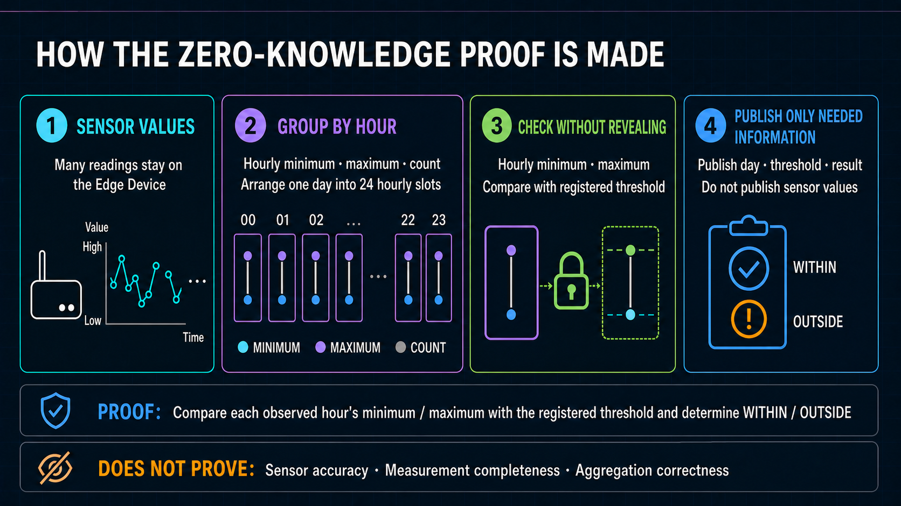
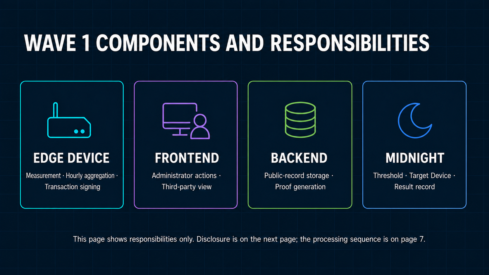
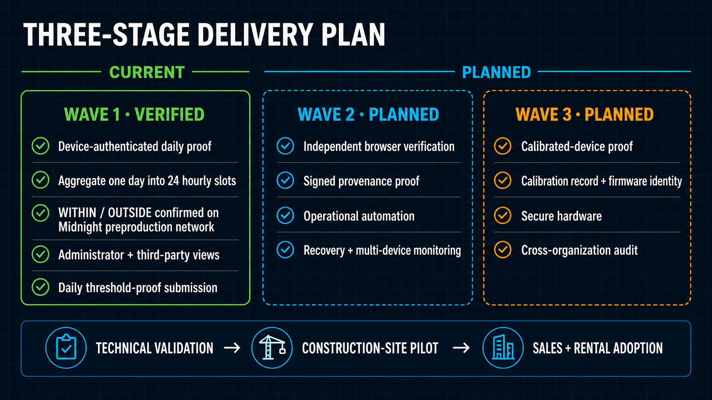

# BACCHIRI!━━Verifiable Measurement Layer

> Prove threshold compliance without disclosing sensor values.

[日本語版](docs/ja/README.md)

[Documentation by category](docs/README.md)


## Judge review

The current review tree compiles all 6 operational proof circuits and passes 345 automated tests, every configured type check and build, and the Cloudflare pre-deployment check. Midnight preproduction-network evidence includes the 2026-08-28 self-funded WITHIN/OUTSIDE records and the 2026-08-30 Sponsor-funded schema-5 record. Source validation and dated network records are kept as separate evidence.

| Review artifact | Link |
| --- | --- |
| Submission copy | [Wave 1 submission](docs/submission/submission_copy.md) |
| Editable slide deck | [English PPTX](docs/submission/deck/bacchiri-verifiable-measurement-layer-wave1-en.pptx) — 9 slides synchronized with the 2:18 pitch |
| Review slide deck | [English PDF](docs/submission/deck/bacchiri-verifiable-measurement-layer-wave1-en.pdf) — 9 pages synchronized with the 2:18 pitch |
| Claim-to-evidence map | [Evidence matrix](docs/submission/evidence_matrix.md) |
| Wave progress | [Wave 1 progress](docs/submission/wave1_progress.md) |
| Judge questions | [Judge Q&A](docs/submission/judge_qa.md) |
| English demo pitch | Produced as `bacchiri-demo-pitch-en.mp4` (2:18); public submission URL pending — [script and capture record](docs/submission/demo_script.md) |
| Submission thumbnail / capture pack | [English reviewed stills](docs/submission/captures/) |

## Product and initial use case

The customer value is intentionally simple: **show a third party that submitted sensor values are within the registered threshold without disclosing the sensor values**.

BACCHIRI!━━Verifiable Measurement Layer adds that cryptographic verification layer to measurement workflows that already use dashboards, CSV files, reports, or cloud systems. It does not replace the measurement equipment or its operational software.

The first commercial use case under discussion is construction-site measurement verification. Noise, vibration, temperature, and environmental reports can move between equipment providers, rental companies, contractors, project owners, and auditors. Wave 1 proves the implemented temperature-policy path; support for other measurement types requires corresponding policy, input, and validation work and is not claimed as complete.

The team is discussing a field proof of concept with an industry partner using equipment and sales or rental channels that already exist. This is commercialization progress, not completed technical validation.

The central idea is to prove whether submitted hourly minimum and maximum values are within a threshold registered before operation, without publishing those values to third parties. In the primary Wave 1 review path, a user-authorized browser client acts as the simulated measurement source, retains raw values and the private opening, and uploads bounded hourly summaries for the authorized operator workflow. The trusted managed backend stores those restricted summaries and handles proof processing; Midnight holds the public threshold, proof subject, and confirmed result that a third party checks. The field runtime is supporting integration evidence for Wave 2 rather than the primary review path.



For review, start with the [exact proof claim and non-claims](docs/architecture/wave1_spec.md#3-exact-proof-claim-and-non-claims), continue with the [system architecture](docs/architecture/system_architecture.md), and finish with the [deployment and review runbook](docs/operations/demo_runbook.md).

The documentation is organized by purpose. Submission copy, English / Japanese decks, evidence, Wave 1 progress, pre-submission checks, Q&A, and the final-GUI recording script are collected under [`docs/submission/`](docs/submission/).

| Category | Contents |
| --- | --- |
| [`docs/architecture/`](docs/architecture/) | Product specification, four-domain architecture, and the daily proof with 24 hourly slots |
| [`docs/security/`](docs/security/) | Private-information boundary, keys and authentication, and multi-Device management |
| [`docs/operations/`](docs/operations/) | Development environment, deployment and review procedure, and Edge Device software installation / rollback |
| [`docs/implementation/`](docs/implementation/) | Specification-to-code map, six operational ZK circuits, future feature backlog, DUST fee sponsorship and Wallet-sync transaction hold, measured cost, and storage-migration design |

English slide figures are under [`docs/assets/review/`](docs/assets/review/) and English document-specific figures are under [`docs/assets/guides/`](docs/assets/guides/). Japanese assets are kept separately below [`docs/ja/assets/`](docs/ja/assets/).

This monorepo implements the Wave 1 core-proof PoC. Its primary review path uses a user-authorized browser client as a simulated measurement source, creates a synthetic daily record, and proves its relationship to a condition registered before the measurement period. Midnight records the public condition, proof subject, result, and transaction without publishing the underlying values. Supporting field-runtime code is included, but autonomous long-running field operation is a Wave 2 objective rather than the primary Wave 1 claim.

The operational `sensor-registry` contract proves a separate public result for each of 24 consecutive
one-hour slots: WITHIN, OUTSIDE, or NO DATA. A Project fixes its UTC offset and local operational-day
start hour before Device registration; the resulting immutable Assignment binds that boundary on
Midnight. The private minimum and maximum values remain hidden. A daily Boolean is retained only as a
summary: it is true when every observed hour is within the public threshold registered on Midnight
before operation. The contract does not prove physical sensor integrity, continuous sampling,
completeness, or correct Device-side aggregation.

| What a third party sees | Meaning |
| --- | --- |
| Operational date | `YYYY-MM-DD`, derived from the Project's registered fixed UTC offset and start hour. |
| Hourly results | One of WITHIN, OUTSIDE, or NO DATA for each of the 24 operational-hour slots. |
| Applied threshold | Lower/upper bounds, unit, scale, version, and validity interval. |
| Proof subject | `deviceCommitment`, the pseudonymous Device bound to the proof and policy assignment. |

Pasting a transaction hash makes the browser obtain these fields from the successful Midnight
transaction, its block, and the Contract state transition at that block. This verification path does
not require D1, a Wallet, or private proof input.

## Core terms

| Term | Meaning in this repository |
| --- | --- |
| Wave 1 | The current core-proof PoC scope defined by `docs/architecture/wave1_spec.md`. |
| Cloudflare | The trusted backend running the API, D1 database, proof queue, GUI, and Proof Server Container. |
| Midnight | The network that verifies Compact contract transactions and records their public state. |
| Edge Device | The device runtime boundary containing the Edge Agent, Device Identity, and Wallet Agent. |
| Raw sample | One timestamped temperature/humidity reading. In the Wave 1 review flow it remains in browser-private source state; the supporting field path retains it locally. |
| Hourly summary / anomaly transition | An aggregate uploaded once per hour, and an immediate event when the sensor changes between normal and anomalous states. Neither is the raw sample stream. |
| Daily private input | A fixed private object with 24 observed or no-data hourly slots. Each observed slot has a minimum, maximum, and reported reading count. |
| Hourly threshold result | The public status of one operational-hour slot: WITHIN, OUTSIDE, or NO DATA. It does not expose the hourly minimum or maximum. |
| Commitment | A one-way binding to the complete private daily-extrema input using a nonce. |
| Threshold policy | Immutable public Midnight state containing mode, bounds, scale, sensor/unit codes, and version. The device cannot provide alternate bounds at proof time. |
| Policy assignment | Immutable policy binding and validity interval registered for the device before operation. |
| Zero-knowledge proof | A proof that checks every submitted observed-hour minimum and maximum without publishing those values or the proof nonce. |
| Compact / `sensor-registry` | Compact is Midnight's contract language. `sensor-registry` is this repository's operational contract. |
| Cloudflare D1 | The managed SQL database for public device registrations, Sessions, summaries, Proof Jobs, and transaction status. It does not store raw samples. |
| Proof Job | The D1 workflow record that controls when a device may send private proof input and tracks the resulting transactions. |
| Proof Server | The Cloudflare Container that generates the contract proof. It holds no wallet key. |
| Device Identity / Device transaction identity | Separate keys: P-256 authenticates Cloudflare API calls; the transaction identity binds the Device-authorized transaction without paying fees. |
| Sponsor Wallet | A dedicated Backend Midnight wallet that synchronizes DUST, adds only the fee to an already Device-bound transaction, and submits it. |
| Attestation | The public claim and evidence lifecycle. The separate `daily-attestation` contracts are development-only cost experiments, not the operational path. |

## Recommended reading order

| Step | Document | Purpose |
| --- | --- | --- |
| 1 | This README | Understand the product purpose, claim, repository structure, and current status. |
| 2 | [Wave 1 specification](docs/architecture/wave1_spec.md), [three-wave roadmap](docs/architecture/three_wave_roadmap.md), and [Fleet Device Registry](docs/security/device_registry.md) | Separate the current PoC, future outcomes, and the on-chain authority boundary. |
| 3 | [System architecture](docs/architecture/system_architecture.md) | See where each runtime component and data store runs. |
| 4 | [Privacy boundary](docs/security/private_spec.md) | Distinguish private input, administrator data, and public evidence. |
| 5 | [Implementation map](docs/implementation/implement_spec.md), [ZK circuit specification](docs/implementation/zk_circuit_spec.md), [transaction-hash verification](docs/implementation/transaction_hash_verification.md), and [Midnight fee sponsorship](docs/implementation/fee_sponsorship.md) | Map the design to code, understand how the private 24-hour proof becomes public hourly results, rebuild the D1-free viewer, and review the DUST fee-payer boundary. |
| 6 | [Device authentication](docs/security/device_authentication.md) and [device firmware](docs/operations/device_firmware.md) | Understand enrollment, Sessions, installation, and rollback. |
| 7 | [Demo runbook](docs/operations/demo_runbook.md) | Deploy and exercise the system in order. |
| 8 | [Cost benchmark](docs/implementation/cost_benchmark.md) | Review the standard 1,440-reading/day Cost measurement and 10,000-Device estimate. |
| 9 | [Future feature backlog](docs/implementation/future_features.md) | Distinguish contract-first changes from later Backend, Frontend, and operational work. |
| 10 | [Storage migration](docs/implementation/storage_migration.md) | Review the optional future D1-to-Turso adapter and cutover design. |

## System boundary summary



This figure includes the supporting field-runtime boundary. The primary Wave 1 review path uses the
Frontend as a simulated measurement source, then the trusted Backend and Midnight. Autonomous field
operation and production separation of operator, verifier, and system-operator applications are Wave
2 outcomes.

| Zone | Primary responsibility | Explicit boundary |
| --- | --- | --- |
| Edge Device | Sensor collection, local raw retention, private 24-hour aggregation, Device authentication, proof authorization, and transaction signing | Raw readings, hourly minimum / maximum values, proof input, and Device keys stay at the edge |
| Frontend | User-authorized simulated measurement workflow and public third-party view | Keeps the simulated capture in browser-private state and exposes only redacted public evidence to the third-party view |
| Backend | Authentication, API validation, D1 workflow state, bounded admission, proof generation, and fee sponsorship | Trusted for proving requests in transit; the Sponsor can add DUST but cannot alter or authorize the bound Device call |
| Midnight | Public threshold, target Device, commitment, and confirmed result | Holds the public record a third party checks; does not store raw sensor readings |

The detailed trust and data-flow model is in [System Architecture](docs/architecture/system_architecture.md).

## Midnight integration

The operational Compact contract is `sensor-registry`. Its current daily entry point is `submitDailyAttestation`, not the retired selected-leaf `verifySensorValue` path. The contract loads the immutable public policy and Device-bound assignment registered before operation, checks the fixed private 24-slot input, and records the 24 verified hourly results plus a daily summary on Midnight. A user-controlled account or field transaction agent authorizes and binds the contract call without fees; the dedicated Sponsor Wallet adds only DUST and submits it. The Sponsor cannot produce the Device Contract Authority proof or alter the bound call.

The browser includes a guided, user-authorized simulated measurement workflow, operator evidence, and the third-party public view. After a transaction hash is pasted, the public view locates the confirmed record and compares the UTC date, 24 hourly results, applied policy/validity, Device Commitment, transaction, block, and Contract Ledger state directly with the public Midnight Indexer. It does not rerun the Compact proof verifier locally; Midnight performed that verification when accepting the transaction.

## Monorepo boundaries

The first directory component identifies where code runs or who owns it. A local tool is never presented as a deployed service, and a deployed runtime is not duplicated under a development-only directory.

```text
frontend/
  verification-portal/               browser bundle and Worker-served static assets
backend/
  cloudflare/
    proof-gateway-worker/             Worker API, Queue consumers, storage adapters
    sponsor-wallet-container/         dedicated fee-only Midnight Wallet runtime
    d1-schema/migrations/             persistent Backend schema history
    deployment/wrangler.jsonc         Worker, D1, R2, Queues, Containers, and assets
edge-device/
  sensor-collector/                   temperature collection, hourly aggregation, local health
  device-identity/                    P-256 identity and short-lived API Sessions
  midnight-transaction-agent/         Device authorization, proof input, submit, and status
  release/                            archive builder, installer, rollback, release verification
  diagnostics/pi-forensics/           optional diagnostics shipped with Device firmware
midnight/
  contracts/sensor-registry/          operational Compact contract, witnesses, simulator tests
  experiments/daily-attestation-cost/ development-only fixed-profile cost experiment
shared/
  measurement-protocol/               commitments, aggregates, provisioning messages
tools/
  midnight-operator/                  local development Wallet and Midnight administration
  cloudflare-admin/                   local provisioning and secret-management commands
  benchmarks/                         local compile and operating-cost measurements
  submission-media/                   local deck, PDF, still, and demo-capture generators
  repository-checks/                  host-boundary and portability checks
tests/
  system/dashboard-workflow/          cross-boundary browser SCT
docs/                                  canonical English guidance; Japanese is under docs/ja/
```

Unit tests remain beside their owner. Only cross-boundary compatibility tests live under `tests/system`. `tools/` executes on a development workstation and is excluded from the Device firmware and Container images. `edge-device/release/package_archive.sh` deliberately creates an installer-rooted Device archive containing only Edge runtimes, required shared protocol code, verified compiled contract artifacts, and diagnostics.

## Operations

Operational procedures are intentionally kept outside this overview.

| Procedure | Document |
| --- | --- |
| Development prerequisites, compilation, verification, and release creation | [Development Environment](docs/operations/development_environment.md) |
| Edge Device package, installation, upgrade, rollback, wallet, and health checks | [Device Firmware](docs/operations/device_firmware.md) |
| Ordered deployment, enrollment, Proof Job, transaction, and review workflow | [Deployment and Review Runbook](docs/operations/demo_runbook.md) |
| DUST sponsorship, asynchronous Wallet synchronization, transaction retention, and retry semantics | [Midnight Fee Sponsorship](docs/implementation/fee_sponsorship.md) |
| Measured compile/proof results and cost planning | [Cost Benchmark](docs/implementation/cost_benchmark.md) |

## Quick judge verification

The source-level gate requires no Device secrets or Midnight preproduction-network wallet:

```bash
npm ci
npm run contract:compile
TMPDIR=/tmp npm run verify
```

The expected review result is 6 compiled operational proof circuits, 345 passing automated tests, all configured type checks and builds, and a successful Cloudflare pre-deployment check. This validates the current source tree; it does not redeploy or reproduce the separately dated Midnight transactions. Follow the [Deployment and Review Runbook](docs/operations/demo_runbook.md) for the supervised GUI, Device enrollment, proof request, signing, and transaction flow.

## Current integration status

- As supporting field-integration evidence, the Sponsor-funded path is verified end to end on the Midnight preproduction network: field API authentication, public threshold and Device-bound assignment, a standard 1,440-reading day reduced to one fixed 24-slot proof, managed proof generation, fee-free authorization, service-funded submission, block confirmation, idempotent same-byte recovery, and the redacted third-party result. See the [transaction hold during Wallet synchronization](docs/implementation/fee_sponsorship.md#current-integration-boundary) and [cost evidence](docs/implementation/cost_benchmark.md#standard-1440-reading-preprod-e2e-and-cost-measurement). The 24- and 96-reading runs confirm only that the proof input shape remains fixed.
- Operator action remains explicit: `device:submit` requests and polls its Proof Job, but the Wallet Agent is not a continuously running submission daemon.
- Implemented as development-only experiments: fixed 24/96/1,440-sample daily circuits, signed hourly evidence, and append-only outlier-reason hashes.
- The third-party view presents public D1 workflow information and Midnight identifiers; it does not independently execute the zero-knowledge-proof verifier in the browser.

## Three-wave delivery path

The canonical [product and business roadmap](docs/architecture/three_wave_roadmap.md) progresses by outcome:



- Wave 1 — Core Proof PoC: validate the privacy value with a simulated measurement source and one review-oriented interface.
- Wave 2 — Operational Partner Pilot: connect real field measurement systems, automate the daily lifecycle, separate user roles and interfaces, and add production authorization, audit, diagnostics, monitoring, recovery, and a system-operations dashboard.
- Wave 3 — Trust Minimization and PMF: add hardware-protected identity and provenance, operate commercially across organizations and sites, and validate recurring revenue, renewal, expansion, and sustainable unit economics.

Wave 2 and Wave 3 are plans, not current capabilities. Product and submission documents use capability terms; specific products, infrastructure services, algorithms, and reference hardware appear only in reproducible implementation and operating guidance.

## Security boundary

The development wallet exists only in the ignored `tools/midnight-operator/.env.development`; its encrypted/offline backup is the recovery copy. Independent Device transaction identity and Compact private state exist only below `~/.midnight/midnight-cloudflare-demo/device-wallet/`. The dedicated Sponsor Wallet uses a separate deployment secret and encrypted synchronization checkpoint; its recovery source is never stored in D1, R2 plaintext, Worker source, or Device firmware. Installed operational configuration is `config/device.env`; staged `edge-device/release/.env.device` is removed after installation and never contains a mnemonic or seed. The Edge Device receives compiled runtime artifacts, never Compact sources or proving-key generation tooling. Browser APIs expose none of these values.

See [system architecture](docs/architecture/system_architecture.md), [private-state specification](docs/security/private_spec.md), and the [deployment runbook](docs/operations/demo_runbook.md).

## References

This repository is licensed under the [Apache License 2.0](LICENSE).

- [Midnight developer documentation](https://docs.midnight.network/)
- [Cloudflare Workers documentation](https://developers.cloudflare.com/workers/)
- [Cloudflare Containers documentation](https://developers.cloudflare.com/containers/)
