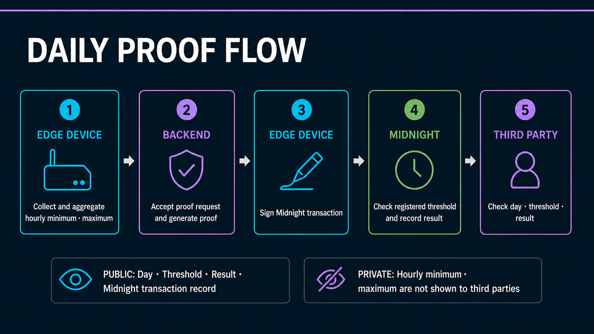

# Hourly Extrema Daily Attestation

[Japanese](../ja/architecture/hourly_extrema_attestation_proposal.md)

Status: implemented in the current source; historical Preprod records use the prior schema and do not contain hourly results.
Last updated: 2026-09-01 JST

This document defines the fixed-shape daily threshold attestation implemented by
`midnight/contracts/sensor-registry`. Despite the stable legacy filename, it is no longer a proposal.


## 1. Claim and boundary

For one UTC calendar day, fixed to 00:00–24:00, the registered device privately supplies 24 hourly
slots. Every observed slot contains a minimum, maximum, and reported sample count. The transaction
publishes one `hourResults` entry for each UTC hour:

- `withinThreshold`: that hour's submitted extrema are inside the registered public threshold;
- `outsideThreshold`: at least one submitted extremum for that hour is outside the threshold;
- `noData`: the canonical private slot contains no measurement.

The transaction also retains the public Boolean `thresholdSatisfied` as a daily summary:

- `thresholdSatisfied = true`: every submitted hourly minimum and maximum for the observed hours was
  within the registered public threshold policy;
- `thresholdSatisfied = false`: at least one submitted hourly minimum or maximum for an observed hour
  was outside the registered public threshold policy.

Hours without data are canonical absent slots and excluded from threshold calculation. A fully absent
day has no observed violation; the ledger Boolean is therefore `true`, while the GUI displays NO DATA
for all 24 hours. An OUTSIDE result is a valid zero-knowledge claim, not a failed
proof. A malformed commitment, non-canonical slot, false result, or unauthorized call fails and
records no attestation.

The proof does not establish physical truth, calibration, continuous operation, completeness,
sampling frequency, or correct device-side aggregation. It does not claim that no excursion occurred
between samples. The device, installation, firmware, and operational audit remain responsible for
those properties.

## 2. Threshold policy

Thresholds are public Midnight ledger state. Hiding them does not add useful privacy to this use case,
and making them ledger state lets a verifier confirm exactly which policy the circuit used.

The development operator registers a policy and its device assignment before operation. The device
does not submit `minimum` or `maximum` to the Proof Job API and cannot select ad-hoc bounds at proof
time. The circuit loads the assigned policy from contract state.

An immutable `ThresholdPolicy` contains:

```text
mode: closed-range | upper-bound | lower-bound
minimumCentiOffset
maximumCentiOffset
valueScale
sensorTypeCode
unitCode
version
```

The modes allow future sensor types without changing the circuit:

- `closed-range`: minimum and maximum are both enforced;
- `upper-bound`: only the maximum is enforced;
- `lower-bound`: only the minimum is enforced.

The operator-only `Operator Authority` is distinct from every Device Contract Authority and the
deployment wallet. Its secret stays on the development host. Policy IDs and assignment IDs are
human-readable off chain and represented on chain by domain-separated SHA-256 keys. D1 mirrors the
confirmed policy and assignment for API validation and GUI lookup; D1 is not the cryptographic source
of truth.

Policies and assignments cannot be overwritten. A change creates a new policy or assignment. An
assignment binds a policy and one registered Device Commitment to a validity interval
(`validUntil = 0` means open-ended). Wave 1 uses one assignment per device. Rental/project reassignment and overlap governance are deferred, but the
contract schema already supports dated assignments without circuit redeployment.

## 3. Fixed daily input

The private input always has 24 ordered slots:

```text
HourlyExtrema {
  present
  minimumCentiOffset
  maximumCentiOffset
  sampleCount
}

DailyExtremaInput {
  commitmentDomain
  deviceCommitment
  measurementGroupId
  policyId
  assignmentId
  measurementDay
  periodStart
  periodEnd
  hours[24]
  schemaVersion
  circuitVersion
}
```

An observed slot has `present = true`, `sampleCount > 0`, and `minimum <= maximum`. A slot with no
sensor values is automatically `STOPPED` and has the canonical representation `present = false`,
`sampleCount = 0`, `minimum = 0`, `maximum = 0`. STOPPED is operational status, not fraud and not a
threshold failure. This is necessary because construction work is not necessarily active for 24
hours and schedules vary by day.

A Project registers a fixed UTC offset and a local start hour before Device operation. Those values
are copied into the immutable Device-bound Assignment. The circuit receives a UTC epoch day plus Unix
seconds and requires `periodStart = measurementDay * 86,400 + utcDayStartMinute * 60` and
`periodEnd = periodStart + 86,400`. The 24-slot shape does not change. Wave 1 uses a fixed offset and
does not apply daylight-saving transitions within an Assignment. See the normative
[operational-day boundary specification](operational_day_boundary.md).

The private ZK shape is independent of raw sampling frequency:

| Raw interval | Reported samples/day | Circuit slots |
| --- | ---: | ---: |
| 60 minutes | 24 | 24 |
| 15 minutes | 96 | 24 |
| 1 minute | 1,440 | 24 |
| 1 second | up to 86,400 | 24 |

Changing the local sampling rate therefore does not require recompilation, new proving keys, or
contract redeployment. The reported sample count is bound to the private slots, but remains a
device-reported fact rather than proof that the physical samples existed.

## 4. Commitment and public state

The device assigns one stable public `measurementGroupId` to the daily sensor-value group and
computes one `persistentCommit<DailyExtremaInput>(daily, nonce)`. The private opening
contains the 24 extrema slots and nonce. The transaction publicly supplies the commitment,
measurement group ID, assignment key, period, 24-bit presence vector, total sample count, claimed
`thresholdSatisfied` result, schema version, and circuit version.

The contract derives an immutable key as
`persistentHash(domain, deviceCommitment, measurementGroupId)`. On success,
`attestations[attestationId]` publishes:

```text
attestationCommitment
measurementGroupId
deviceCommitment
policyId
assignmentId
measurementDay
periodStart
periodEnd
hourPresence[24]
hourResults[24]
observedHourCount
sampleCount
schemaVersion
circuitVersion
thresholdSatisfied
verified = true
```

Hourly minima/maxima and the commitment nonce remain private. Thresholds, mode, unit/type codes,
policy version, assignment, operational date/boundary, UTC period, presence, counts, commitment, and the 24 hourly results are
public.

## 5. Circuit rules

`submitDailyAttestation` is one authorized transaction. It:

1. verifies an active Fleet Registry entry and its Device Contract Authority;
2. derives the attestation ID from the registered Device Commitment and public measurement group ID,
   then rejects an ID already present in the ledger;
3. loads the immutable assignment and policy and rejects an assignment belonging to another Device;
4. checks the exact registered operational-day boundary, 24-hour period, and assignment validity;
5. opens and recomputes the private daily commitment;
6. binds measurement group, device, policy, assignment, period, schema, circuit version, and presence
   to public state;
7. checks canonical STOPPED slots and valid ordered extrema for every observed slot;
8. computes each hour's result from the private slot and registered ledger policy and proves it equals
   the corresponding public `hourResults` entry;
9. computes `allWithin` from every observed slot and proves it equals the daily
   `thresholdSatisfied` summary; and
10. recomputes the total and observed-hour counts before recording the public attestation.

There is no separate dataset-registration transaction. Policy registration is an operator lifecycle
operation; each day consumes one device attestation transaction.

## 6. Operational flow



The ownership lanes are significant: raw values and private extrema originate on the Edge Device, presentation belongs to the Frontend, admission and the Proof Server belong to the Backend, and the confirmed attestation belongs to Midnight. Queue messages contain references only. Private extrema bypass the Frontend, stream to the Proof Server after admission, and are not persisted in the Queue. The Edge Device—not the Backend—signs the daily transaction.

```text
Before operation
Operator -> register public policy on Midnight
         -> register Device in the Fleet Registry
         -> register Device-bound policy assignment on Midnight
         -> mirror confirmed identifiers in D1

Each day
Edge Agent -> keep raw readings locally
           -> upload one-hour operational summaries to D1
           -> emit immediate anomaly state transitions
Wallet Agent -> aggregate private 24-slot extrema
             -> request a Proof Job without threshold bounds
D1 backlog -> daily 02:00 JST cutoff -> Cloudflare Queue -> drain and stop
Wallet Agent -> stream private proving request through Worker to Proof Server Container
Proof Server -> produce proof using the contract ledger policy
Edge Device -> sign and submit one Midnight attestation transaction
Worker -> record the confirmed transaction in D1
GUI -> show administrator summaries and public zero-knowledge claim separately
```

The Queue message contains a job reference only. Private extrema are not stored in Queue, D1, R2, or
browser APIs. D1 uniqueness constraints and state transitions make repeated at-least-once delivery
idempotent.

## 7. D1 mirror and Proof Job

Migrations `0010_hourly_extrema_policies.sql` and `0011_multi_device_registry.sql` add:

- `threshold_policies`: public policy mirror and contract reference;
- `policy_assignments`: Device Commitment/policy validity mirror;
- `devices`: fail-closed Midnight Registry status/authority/version/contract mirror;
- `daily_proof_jobs`: one durable, idempotent daily job, claimed threshold result, and transaction
  result.

The Worker validates that the authenticated device, D1 policy/assignment mirror, device commitment,
operational date/period, claimed hourly results, daily summary, and job metadata agree before queueing. It accepts policy and assignment
identifiers but no threshold bounds. The claimed result is not trusted as evidence until the
corresponding Midnight transaction is confirmed; the circuit recomputes it from private extrema and
ledger policy. The public verifier joins the confirmed job to the registered policy and displays the
public bounds and validity, 24 WITHIN/OUTSIDE/NO DATA results, Device Commitment, exact claim,
contract address, and transaction reference.

## 8. Versions and migration

- Compact toolchain: `0.31.1`
- Compact language pragma: `0.23`
- contract schema version: `4`
- daily schema version: `7`
- circuit version: `5`
- D1 migrations: through `0026_operational_day_boundary.sql`

The prior selected-Merkle-leaf, singleton, and WITHIN-only Fleet Registry contracts are not
state-compatible with this ledger.
Adoption requires a new Fleet Registry deployment, Operator-only Device/Policy/Device-bound
Assignment registration before operation, updating the public contract address, and applying all D1
migrations through `0026`. Historical schema-5/6 transactions remain valid historical evidence but
cannot be retrofitted with 24 hourly results. The old 24/96/1,440 `daily-attestation` profiles remain development-only
circuit-scaling experiments and are not the operational path or pricing basis.

## 9. Verified implementation cases

Automated tests cover:

- one policy, one assignment, and successful mixed hourly WITHIN, OUTSIDE, and NO DATA results;
- the same fixed circuit input derived from 24, 96, and 1,440 samples;
- partial and fully STOPPED days without treating missing data as fraud;
- below-minimum and above-maximum data recorded as truthful OUTSIDE results;
- false hourly results, false daily summaries, and reversed extrema rejected;
- commitment, presence, device, policy, and assignment binding;
- distinct Device and Policy authorities; and
- redacted public API responses that disclose policy but not hourly extrema or nonce.

Historical Preprod transactions confirm the prior daily-summary design, including a 1,440-reading day
reduced locally to 24 private hourly extrema slots. Their transaction time, proof time, proving-key
size, request size, transaction size, DUST fee, and planning estimates remain in
[the cost benchmark](../implementation/cost_benchmark.md). They do not demonstrate schema `7` /
circuit `5` configurable-boundary results; that requires a new contract deployment and new transactions.
