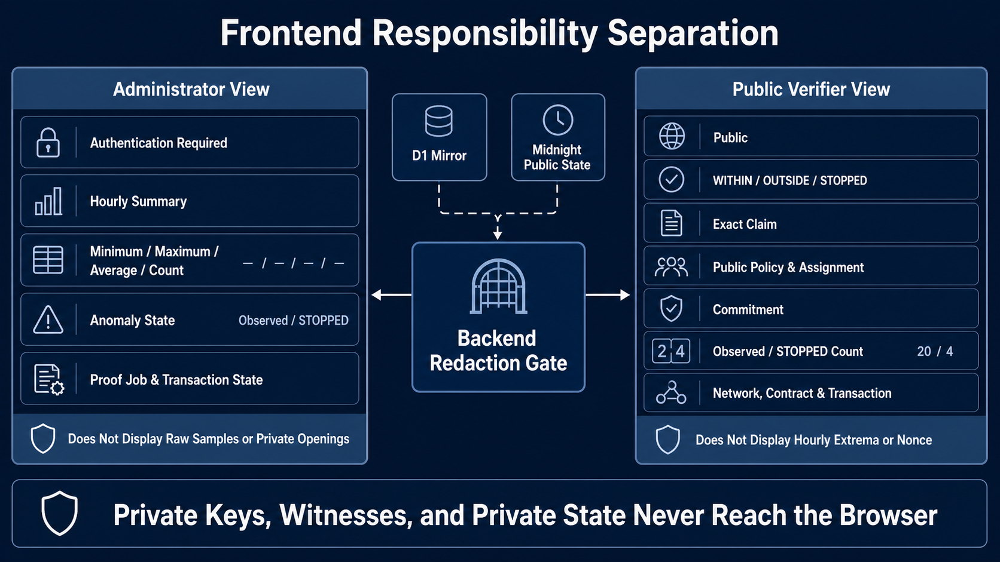

# Wave 1 System Architecture

[日本語版](../ja/architecture/system_architecture.md)

The normative architecture is [`wave1_spec.md`](wave1_spec.md). The primary Wave 1 review path is a
user-authorized browser client acting as a simulated measurement source, followed by the trusted
managed backend and Midnight. The repository also implements the following field-runtime boundary as
supporting integration evidence for Wave 2:


The diagram separates ownership from transport. The Edge Device retains raw data and Device keys,
authorizes the Compact call, and binds a fee-free daily transaction. The Frontend handles public or
redacted presentation only. The Backend is trusted for authentication, admission, proof processing,
and fee sponsorship but does not own Device keys. Midnight is the public source of truth, and D1 is
an operational mirror.



The combined Wave 1 review application contains two logical views that intentionally expose different
evidence. The operator workflow can access its browser-private simulated capture and authorized
workflow state, while the third-party view receives only redacted confirmed evidence. Production
deployment separates these roles and applications in Wave 2. Neither public view receives private
keys, witnesses, private state, or raw samples.

```text
Edge Device
├ sensor collection, local raw retention, and 24-hour aggregation
├ Device Identity, Device Contract Authority, and transaction identity
├ authenticated private proving stream to the Backend
└ fee-free transaction binding; no NIGHT or DUST state

Frontend
├ administrator view of authorized operational summaries and state
├ public verifier view of redacted confirmed evidence
└ no raw readings, private extrema, nonces, witnesses, or private keys

Backend
├ Worker: validation, authorization, API, and proof gateway
├ D1: identity/session/business state, policy mirror, daily jobs/TX
├ Queue + DLQ: bounded Proof admission and Sponsor-processing references
├ Container: Midnight Proof Server 8.1.0
├ Sponsor Wallet Container: DUST synchronization, fee-only balancing, and submission
└ R2: private TX artifacts, optional public reports, and encrypted Sponsor checkpoints; never raw readings

Midnight
└ authoritative Fleet Device Registry, public policy/assignment, and daily attestation state
```

D1 supplies the fast redacted list/detail view, but the public browser does not mark its four checks
complete from the D1 status alone. It independently looks up the successful transaction and decodes
the Fleet Registry at that exact Midnight block to compare the Attestation, Policy, Assignment, and
published result. A visible progress state covers this bounded, read-only public lookup.

Cloudflare Containers require a Durable Object binding as platform plumbing. No application Durable Object is used for Device Sessions, sample counters, readings, or jobs. The initial Queue admission capacity is one active Proof Job because the initial deployment has one Container instance. Capacity can be raised only together with measured Container capacity and configured scaling.

The standard device-to-cloud traffic is one hourly aggregate per sensor stream plus immediate anomaly state transitions. High-frequency raw sampling therefore increases local work without causing one cloud storage write per raw sample.

The cost-optimized profile accepts work continuously and starts one cutoff batch at 02:00 JST. D1 remains the durable backlog, Queue delivery is at-least-once, and stable Proof Job IDs plus conditional states make duplicate admission harmless. Project metadata is Web2 state in D1; the on-chain dependency order is Policy, Device/Assignment, proof generation, and sponsored submission. The admitted device streams its private 24-slot extrema directly; Queue messages contain Job IDs only. The device sends policy/assignment identifiers but no threshold bounds; the circuit loads the public assigned policy from Midnight. Work accepted after a cutoff waits for the next daily start, and the Proof Server and Server Wallet stop after eligible work drains.

Development deployment uses a 30-minute `contract_deploy` Operator Proof Lease; post-deployment Device administration uses a separate `contract_admin` purpose. Both are minted by authenticated Wrangler access, never a Device key. Plaintext leases are process-only and revoked on completion; their D1 hashes share the same Proof Server capacity ceiling. The full lifecycle is in [`device_registry.md`](../security/device_registry.md).

After proof generation, the field transaction agent or user-controlled browser account binds the
value-neutral transaction without fees. The
authenticated sponsorship endpoint accepts that finalized serialized transaction once for its Proof
Job, stores its integrity-addressed private bytes in R2, and queues the Job ID. Exact retries return
the existing state without another Queue message; conflicting bytes are rejected. A dedicated
Sponsor Wallet later validates the job and bound call, adds only DUST, and submits it. Its seed is
separate from Device, Operator, and deployment keys. Encrypted synchronization checkpoints and
temporary private TX artifacts may use R2; neither D1 nor R2 stores the seed in
plaintext. Sponsor availability is an operational prerequisite, while each Device needs no NIGHT
funding, DUST registration, or DUST history synchronization.

The Proof Server and Sponsor Wallet remain separate Containers even when both are sized as
`standard-2`. Sponsor PID 1 is a lightweight Health Supervisor; it serves cached freshness-aware
health while the lower-priority Wallet SDK child synchronizes. This keeps operational health
responsive without combining proving keys, Sponsor seed material, or scaling failures. A measured
warm restore on the single-vCPU Sponsor allocation temporarily made the cached Wallet status
`degraded`, but the Supervisor endpoint remained responsive and Queue processing stayed gated until
the Wallet returned to `ready`.
