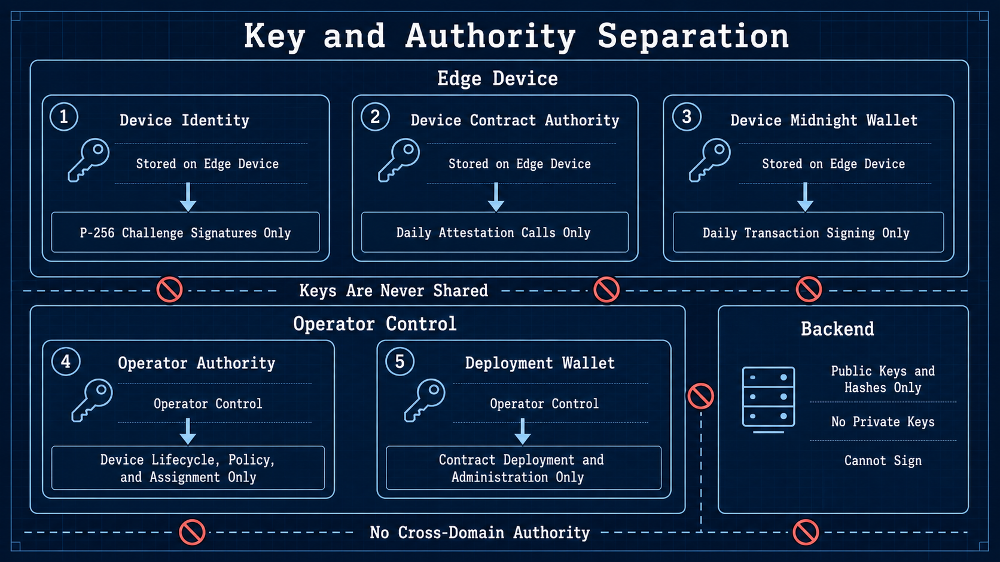

# BACCHIRI!━━Verifiable Measurement Layer — Wave 1 Specification

[日本語版](../ja/architecture/wave1_spec.md)

Status: implementation baseline
Last updated: 2026-08-30 JST

This is the normative Wave 1 product and implementation specification. If an older design note
conflicts with this document, this document takes precedence.

## 1. Product objective

Wave 1 authenticates an Edge Device, stores cost-bounded operational summaries, and records a
Midnight zero-knowledge claim for one day without publishing the hourly sensor extrema.

The standard plan must:

- authenticate each device with a unique ECDSA P-256 identity;
- use a revocable 24-hour opaque Session instead of the long-term key on normal API calls;
- keep Device Identity and Device Contract Authority secrets on the Edge Device;
- retain raw readings locally rather than writing every sample to Cloudflare;
- upload one hourly aggregate and immediate anomaly state transitions;
- admit proof work through the 02:00–06:00 JST processing window;
- use one fixed 24-slot circuit for 24, 96, 1,440, or denser daily samples;
- use only the public threshold policy registered on Midnight before operation;
- treat an hour without readings as STOPPED rather than fraudulent;
- have the Device prove, authorize, and bind one Midnight transaction per daily attestation;
- have a dedicated Sponsor Wallet add only the DUST fee and submit that bound transaction; and
- provide separate sensor-administrator and third-party-verifier views.

Continuous real-time values are outside the standard plan. A future premium plan may add a latest
value stream or separate premium proof capacity without changing the Wave 1 attestation claim.

## 2. Terms

| Term | Meaning |
| --- | --- |
| Raw sample | One timestamped sensor reading retained on the device. |
| Hourly operational window | Count, minimum, maximum, and average uploaded for administrator operations. It is not a ZK public input. |
| Daily extrema input | The private fixed-shape object containing 24 observed/STOPPED hourly slots. |
| STOPPED | An hour with no readings, represented canonically as absent with zero count and values. It is not a threshold failure. |
| Threshold policy | Immutable public Midnight state defining mode, bounds, numeric scale, sensor type/unit, and version. |
| Threshold result | Public `thresholdSatisfied` Boolean proven from private hourly extrema and the assigned ledger policy. `true` means all observed hours are within; `false` means at least one observed hour is outside. |
| Policy assignment | Immutable binding of a policy, one registered Device Commitment, and a validity interval. |
| Attestation commitment | Public commitment to the private daily extrema input and nonce. |
| Device Identity | P-256 key used only for Cloudflare authentication and Session renewal. |
| Device Session | Revocable 24-hour opaque API token issued after a challenge signature. |
| Device Contract Authority | Separate private Compact authorization for daily attestation calls. |
| Device transaction identity | Separate Edge Device key material used to derive the transaction coin/encryption public keys and bind the proved transaction without paying DUST. |
| Sponsor Wallet | Dedicated backend Midnight wallet that holds registered NIGHT, synchronizes DUST, adds only a DUST fee offer to a Device-bound transaction, and submits it. |
| Operator Authority | Operator-only Compact authorization for Device lifecycle, policies, and assignments. |
| Deployment wallet | Development-host wallet used to deploy/administer contracts. |
| ZK Job | Idempotent D1 workflow record for admission, proof progress, and the attestation TX. Existing API paths use the name `proof-jobs`. |

### 2.1 Identifier formats

System-generated history-record IDs use `<type-prefix>_<UUIDv7>`. The lowercase prefix is a
three-to-five-letter abbreviation of the record type: `zjb` means ZK Job, `mbt` means Measurement
Batch, and `aev` means Anomaly Event. The `z` in `zjb` belongs to ZK; it is not a common namespace.

The producer creates and durably stores an ID once. Retries, process restarts, and Queue redelivery
reuse that same ID. UUIDv7 makes records of the same type approximately sortable by creation time.
Compared with random UUIDs or content hashes, this improves B-tree index locality and supports
efficient ID-cursor pagination, while stable reuse makes retransmission idempotent. Exact
chronological views still sort by the relevant field such as `createdAt`, `periodStart`, or
`occurredAt`.

Operational Edge Device provisioning uses a stable `deviceId` generated once with its Device Identity
and reuses it across enrollment retries, re-enrollment, and authentication-key rotation. The review
Browser Device is the deliberate exception: its ID is deterministically derived from the verified
public Wallet key and Project as specified in section 12. Human-managed inventory values are
separate: `deviceCode` is the equipment code and `deviceName` is the display name.

Transition status as of 2026-08-30: the deployed format still uses an operator-provided Device slug,
timestamp-based Batch/Event IDs, and a content-derived Proof Job ID. The convention above is the
required migration target, not a claim that those deployed identifiers already conform. Migration
must preserve an explicit mapping for existing records and must not silently reinterpret a former
`deviceId` as the new `deviceCode`.

## 3. Exact proof claim and non-claims


A confirmed daily attestation proves the public result recorded with it:

- WITHIN (`thresholdSatisfied = true`): every submitted hourly minimum and maximum for observed hours
  was within the registered public threshold policy;
- OUTSIDE (`thresholdSatisfied = false`): at least one submitted hourly minimum or maximum for an
  observed hour was outside the registered public threshold policy.

Hours without data are STOPPED and excluded from the threshold calculation. If all 24 hours are
STOPPED, the GUI reports STOPPED from `observedHourCount = 0`; it does not present the vacuously true
ledger Boolean as a normal operating day. OUTSIDE is a successful proof result. Invalid private data
or a claimed result that does not match the private data fails and records nothing.

The proof does not establish:

- the truth, calibration, installation quality, or tamper resistance of the physical sensor;
- that the device was supposed to operate during a STOPPED hour;
- continuous sampling or the absence of excursions between samples;
- that every physical observation was retained;
- that reported sample counts equal physical measurements;
- correct firmware aggregation, clocks, filtering, or debounce behavior; or
- completeness/authenticity of off-chain raw storage.

The GUI and sales material must not strengthen a WITHIN result to “all physical sensor values were
valid,” and must not reveal the value that caused an OUTSIDE result.

## 4. Trust, privacy, and runtime boundary


The Cloudflare Worker and Proof Server Container are trusted Wave 1 backend components. TLS protects
transport. Application E2E encryption, FHE, mTLS, TPM remote attestation, and secure-boot attestation
are future work.

```text
Development host
├ Compile and deploy Compact contracts
├ Register/rotate/disable Devices and register public policies/assignments
├ Deploy/administer Cloudflare resources and public Device Identity keys
├ Hold Operator Authority and deployment wallet secrets separately
└ Run integration and cost benchmarks

Edge Device
├ Edge Agent: sample, aggregate locally, upload hourly windows/anomaly transitions
├ Wallet Agent: prepare private daily extrema, request/poll Proof Job
├ Keep Device Identity, Device Contract Authority, and transaction identity locally
├ Use the authenticated Cloudflare Proof Server for the contract proof
└ Bind the proved transaction without NIGHT, DUST generation, or DUST synchronization

Browser review Device
├ Keep its Device Identity and private daily opening in browser-private storage
├ Use the authenticated Cloudflare Proof Server for the contract-circuit proof
└ Use Lace to approve and bind the transaction with `payFees: false`

Cloudflare
├ Worker: authentication, authorization, APIs, admission, GUI
├ D1: registries, Session hashes, summaries, events, policies mirror, jobs/TX status
├ Queue/DLQ: proof admission references and retries
├ Proof Server Container: proof generation
├ Sponsor Wallet Container: DUST synchronization, fee-only balancing, and TX submission
└ R2: optional public artifacts/reports; never permanent raw readings

Midnight
└ Authoritative public policy, assignment, and verified daily attestation state
```

The Edge Device does not compile Compact, deploy contracts, run Wrangler, or host the Proof Server.
Public dashboard and third-party-verification routes receive no Device Session, wallet material, raw
values, private extrema, nonce, witness, or private state. The Browser review Device keeps its own
Device Identity, Session, and private opening only in browser-private storage while running the
Device workflow; none of them is returned by a public verification API.

The Edge Wallet Agent attaches the Device Session Token and `X-Proof-Job-Id` to the authenticated
contract proof. It then binds the proved, value-neutral transaction without DUST. Lace follows the
same separation through `balanceUnsealedTransaction(..., { payFees: false })`. The resulting
serialized finalized transaction is already bound to the Device-authorized contract call before it
crosses the sponsorship boundary.

The Sponsor Wallet accepts only one eligible transaction for the authenticated Proof Job. It applies
rate, status, contract, circuit, size, and replay policy, calls `balanceFinalizedTransaction` with
`tokenKindsToBalance: ['dust']`, signs only its balancing addition, finalizes the merge, and submits it.
It cannot alter the bound Device call or produce the Device Contract Authority proof.

The serialized transaction policy is deny-by-default: exactly one Intent containing exactly one
`ContractCall` to the configured `sensor-registry.submitDailyAttestation` entry point is allowed.
Rewards, deployments, maintenance actions, shielded or unshielded value transfers, additional calls,
and Device-supplied DUST actions are rejected before balancing. The same policy is applied again after
the official Wallet SDK adds the Sponsor's DUST fee. Device commitment, assignment, period, public
result, and the commitment to private hourly extrema remain constrained by the contract proof rather
than being accepted as untrusted Sponsor request metadata.

Before invoking the Sponsor Wallet Container, the Worker atomically reserves one JST-day sponsorship
slot in D1 for the authenticated `deviceId` and `proofJobId`. The default limit is five distinct Proof
Jobs per Device per JST day. An Operator-provisioned review Device receives 20 so a reviewer can repeat
the complete workflow. The `proofJobId` is unique in the reservation table, so retries of the same Job
return the existing reservation and consume no additional slot. A new Job above the limit receives
HTTP 429 until the next JST midnight. `GET /api/v1/sponsor-quota` returns only that authenticated
Device's limit, usage, remaining count, reset time, and reserved Job IDs for GUI button control.

The sponsorship HTTP request is an admission boundary, not a synchronous Wallet invocation. The
authenticated Worker binds the first accepted serialized transaction hash to the Proof Job, stores
the private bytes in R2, enqueues only `proofJobId`, and returns `202 Accepted`. An identical retry is
stopped at the Worker and returns the current Job without another quota reservation, R2 write, Queue
message, or Wallet operation. A different transaction for the same measurement group returns `409`.
The Sponsor Queue consumer invokes the Container only after Wallet readiness; Container wallet
mutations remain serialized.

| Flow | Contract-circuit proof | Device binding/approval | DUST fee | TX submission |
| --- | --- | --- | --- | --- |
| Edge Device | Authenticated Cloudflare Proof Server Container | Edge Wallet Agent, no fee | Sponsor Wallet | Sponsor Wallet to Midnight |
| Browser review Device with Lace | Authenticated Cloudflare Proof Server Container | Lace with `payFees: false` | Sponsor Wallet | Sponsor Wallet to Midnight |

The Proof Server Container only generates proofs and holds no Midnight wallet key. The separate
Sponsor Wallet Container holds only sponsorship key material; it receives no Device Identity,
Device Contract Authority, private extrema, nonce, or Compact private state. The Edge Device needs no
local Proof Server and no NIGHT funding, DUST registration, DUST balance, DUST history scan, or DUST
proof. Starting operation therefore has no per-Device DUST-generation delay. It still requires an
active Device registration and assignment, public operation configuration, Proof Job admission,
current contract-state lookup, proof generation, and Sponsor capacity.

> **Container secret boundary:** the Docker build context and image contain application code,
> dependencies, and compiled Compact prover/verifier artifacts only. They must not contain the
> Sponsor seed, Operator Authority secret, `.env`, `.dev.vars`, wallet checkpoints, or wallet state.
> In production, the Worker reads `SPONSOR_WALLET_SEED` and `OPERATOR_AUTHORITY_SECRET` from
> Cloudflare Secret bindings and injects them into the private Sponsor Wallet Container environment
> when the Container starts; the Container does not read the Cloudflare secret store directly. Local
> development may use ignored `.dev.vars` values as the environment source, but those files must
> never be committed or included in a Container image.

During cold Sponsor synchronization, the one-minute development health Cron causes the Worker to save
an encrypted R2 wallet checkpoint at most once every five minutes; after readiness the interval is 30
minutes. An authenticated sponsorship retry may invoke the same stale-check without increasing that
write frequency. Before a signal-driven stop, the Container serializes its latest available state,
encrypts it with key material derived inside the Sponsor process, and uploads it through the private
`state.internal` Container-to-Worker route. The Worker validates the fixed binary format, declared
size, boot ID, and shutdown reason before writing R2. The seed is never included in the object or its
metadata. A replacement Container restores the checkpoint before Wallet initialization, rather than
replaying all persisted progress. If no signal handler can run, the most recent periodic checkpoint
remains the recovery point.

The Device atomically saves the exact fee-free serialized transaction with owner-only mode `0600`
before its first Sponsor request. After quota reservation, the Worker binds the Proof Job to that
transaction hash and byte length before checking Sponsor readiness. A synchronizing Sponsor therefore
does not reject the accepted transaction: the Job remains `awaiting_sponsor` and the Device polls its
status without generating another proof. A `proof_ready` Job with an existing local pending artifact
uses the same recovery path after a Device process restart. Any different transaction for the bound
Job is rejected.

On Preprod, Sponsor initialization follows the current official public-network Wallet SDK pattern.
Shielded and unshielded progress must be strictly complete. Before registering any unregistered NIGHT
coin, unshielded and DUST progress must also be strictly complete; only then may the runtime estimate
the registration fee, wait for generated DUST, and submit registration. A checkpoint-restored wallet
whose NIGHT is already registered may continue when it has a spendable DUST coin, without repeating
registration. No queued transaction is balanced or submitted until spendable DUST exists. Health output includes
connection, completion, and replay-position state for all three wallets.

The Sponsor Container runs a lightweight Health Supervisor as PID 1 and the official Wallet SDK in a
separate lower-priority child process. `/health` returns the last successful Wallet snapshot and its
freshness without waiting for the CPU-intensive replay event loop. A stale, degraded, or exited child
is diagnostic-only and cannot sponsor a transaction. This is process and scheduler isolation, not a
hard physical-core reservation. The Proof Server remains a separate Container because proving and fee
sponsorship have different secrets, failure modes, and scaling lifecycles.

Wave 1 does not use an application Durable Object for Sessions, readings, counters, or jobs. The
Container platform may use its required internal Durable Object binding; this is not an application
Session store.

## 5. Key separation



| Key | Location | Authority |
| --- | --- | --- |
| Device Identity | Edge Device | P-256 Cloudflare challenge signatures only |
| Device Contract Authority | Edge Device | `submitDailyAttestation` only |
| Device transaction identity | Edge Device | Value-neutral transaction public keys and binding only; no fee authority |
| Sponsor Wallet | Sponsor Wallet Container | DUST-only balancing and submission under Proof Job policy |
| Operator Authority | Development host | Device lifecycle and policy/assignment administration |
| Deployment wallet | Development host | Contract deployment and development administration |

No private key is shared between development and device hosts. The development host has no Device
Identity private key. The Sponsor Wallet is distinct from the Device transaction identity, Operator
Authority, and deployment wallet. Rotating one key domain must not silently rotate another.

Deployment does not use a Device Session. Authenticated Wrangler access creates a random 30-minute
`contract_deploy` Operator Proof Lease, stores only its SHA-256 hash in D1, shares the one-Container
capacity ceiling, and revokes it immediately after deployment.

## 6. Device enrollment and authentication

Wave 1 has no public self-registration or activation-code endpoint. Enrollment is an authenticated
operator/factory action.

1. `installer.sh` preserves a complete installed Device Identity or generates a new P-256 pair if none
   exists; partial identity state fails closed.
2. The PKCS#8 private key and local Session file are owner-only below the installed device home.
3. A public-only enrollment bundle contains device/project/key IDs, algorithm, public JWK, scopes, and
   creation time.
4. The Operator registers the public Compact Device Authority in the Midnight Fleet Registry and
   creates a Device-bound Policy Assignment.
5. Confirmed public Midnight state is mirrored to D1; only then may the P-256 public key be inserted.
6. Replacing an active key requires explicit rotation confirmation and revokes its Sessions.
7. A Challenge/Session round trip completes activation, then the Device pulls and atomically installs
   its current public operation configuration from the Worker.

The full ordering and failure behavior are normative in [`device_registry.md`](../security/device_registry.md).
D1 inventory or P-256 registration alone grants no Session or ingestion access.

A future TPM produces the key internally and exports only its public key through the same enrollment
boundary.

`POST /auth/challenge` creates a random 32-byte nonce with a five-minute TTL. D1 stores its SHA-256
hash, device/key binding, expiry, and one-time consumption state. The device signs a versioned
canonical message containing endpoint, device/key/challenge IDs, nonce, timestamp, and sorted scopes
with ECDSA P-256/SHA-256. The Worker permits ±5 minutes of clock skew.

`POST /auth/session` returns a 24-hour opaque Bearer token. D1 stores only its SHA-256 hash and checks
expiry, revocation, key status, device/project, and scope on each request. Normal API calls do not
write a per-request sequence or `lastUsedAt`, keeping cost bounded. Device/IP/session rate limits are
applied where appropriate. Production is HTTPS-only; loopback HTTP is allowed for development.

Scopes are:

```text
measurement:write  anomaly:write  proof:request  proof:read
proof:generate     transaction:submit  configuration:read  device:status
```

## 7. Sensor data and anomaly lifecycle

Raw sampling may occur every few seconds. Standard-plan raw readings remain local. Once per hour, the
Edge Agent creates and persists an `mbt_<UUIDv7>` Batch ID, then sends an idempotent aggregate:

```text
batchId, deviceId, projectId, sensorType, unit,
periodStart, periodEnd, count, minimum, maximum, average,
commitment, thresholdPolicyVersion
```

The Worker verifies the authenticated device/project, sensor metadata, policy version, finite and
ordered values, period, count, commitment format, and unique `batchId`. D1 stores the hourly aggregate,
not each raw sample.

For review, a browser Device generates 1,440 one-minute samples for a selected completed JST day from
the previous 30 days. The generated raw values and private opening remain in that browser's
IndexedDB; only up to 24 hourly windows are uploaded. Today and future dates are excluded, so every
generated dataset is a complete daily claim. Threshold-compliant and outlier modes both support a
successful ZKP path: they produce public WITHIN and OUTSIDE results respectively, without revealing
the hourly extrema.

Anomalies are sent immediately as debounced state transitions:

```text
NORMAL -> ANOMALY_OPEN
ANOMALY_OPEN -> RECOVERED
```

The Edge Agent creates and persists an `aev_<UUIDv7>` Event ID when the transition occurs, and reuses
it for retries. It also applies hysteresis, cooldown, and a local rate cap. D1 stores append-only
event metadata and current state. This Web2 alert policy is operationally useful but is not
substituted for the Midnight policy used by the daily proof.

## 8. Public threshold policy lifecycle

Before operation, the Operator Authority registers:

```text
ThresholdPolicy {
  mode: closed-range | upper-bound | lower-bound
  minimumCentiOffset
  maximumCentiOffset
  valueScale
  sensorTypeCode
  unitCode
  version
}

PolicyAssignment {
  policyId
  deviceCommitment
  validFrom
  validUntil       // zero means open-ended
  version
}
```

Policies and assignments are immutable. Changes use new IDs. Thresholds are public because the
verifier must be able to identify the exact range the circuit enforced. The device's Proof Job
request contains policy and assignment identifiers but no bounds. The circuit loads the policy from
the authenticated contract ledger state and binds it to the private commitment opening.

Each Project exposes only Policies explicitly associated with it in the application registry. Every
new GUI-created Policy has one owning Project and is associated only with that Project; existing
associations are retained for already registered Device assignments. An authenticated Project owner
may create up to ten associated registered plus pending Policies. Creation binds Project, Policy ID,
name, mode, and 0.01 °C centi-degree bounds to a fresh Lace signature. The Worker queues the
Operator-only Midnight registration and publishes the Policy to that Project only after Indexer
confirmation. A new Project starts with no Policy; changing a threshold creates a new immutable
Policy rather than editing an existing one.

D1 mirrors confirmed policy/assignment metadata for pre-admission checks and the GUI. Midnight remains
the proof source of truth; changing only D1 cannot make a mismatched proof pass.

Each assignment belongs to exactly one registered Device Commitment. A single Fleet Registry contract
supports multiple Devices. Dated reassignment supports a future rental or construction-period model
without a new circuit; automated overlap governance remains outside Wave 1.

## 9. Daily extrema circuit


The Wallet Agent groups readings into JST hours 0–23. Missing hours are automatically canonical
STOPPED slots. No operating schedule is registered.

The private `DailyExtremaInput` contains measurement-group/device/policy/assignment binding, an exact 24-hour period,
24 `{present, minimum, maximum, sampleCount}` slots, schema version, and circuit version. One nonce
opens its public persistent commitment.

`submitDailyAttestation` verifies an active Fleet Registry entry, its Device Contract Authority, the
Device Commitment embedded in the registered policy assignment, and the period; commitment opening;
public/private device, policy, assignment, period, presence, and version binding; canonical STOPPED
values; positive count and ordered extrema for observed slots; and recomputed total/observed counts.
It computes `allWithin` from all observed private slots and the assigned ledger policy, then proves
that it equals the public `thresholdSatisfied` result. The contract derives the ledger key from
`deviceCommitment + measurementGroupId`; truthful WITHIN and OUTSIDE results both record one verified
public state, while a repeated group ID, false result, or malformed slot fails.

Because the circuit always sees 24 slots, changing daily raw count from 24 to 96, 1,440, or denser does
not change the circuit or proving key. The reported count is bound but remains device-reported.

## 10. Proof admission and processing

The default Proof Server admission window is 02:00–06:00 JST. Ingestion and anomaly alerts continue
outside the window.

1. The device closes the JST day and prepares the private 24-slot attestation.
2. It creates and persists `proofJobId` as `zjb_<UUIDv7>`, then posts only public metadata. A retry
   reuses that ID.
3. The Worker checks the D1 policy/assignment mirror and stores one `daily_proof_jobs` row as `pending`.
4. During the window, Cron conditionally claims due rows and sends job references to Queue.
5. The Queue consumer grants a short `ready_for_input` lease and warms the Container.
6. The Wallet Agent polls its job and streams private `/check` and `/prove` bodies when admitted.
7. The Device or Lace binds the proved transaction without paying fees and uploads that finalized
   serialized transaction once. The Worker stores it in private R2, records `awaiting_sponsor` in D1,
   enqueues only the Job reference, and returns `202 Accepted`.
8. The Worker reserves the authenticated Device's idempotent daily sponsorship slot in D1. An
   identical retry returns the existing state; a reused group ID with different metadata or TX bytes
   returns `409 Conflict` before another proof or fee is consumed.
9. After Sponsor Wallet synchronization, the Sponsor consumer reloads and hashes the private R2
   artifact, validates the Proof Job policy, adds only DUST, and immediately submits the transaction.
10. D1 stores TX ID/hash, block height, sponsorship attempt, retry time, error code, and confirmation
    status for Device polling.

If the device is offline, the lease expires and the job returns to the backlog. At 06:00 no new work is
admitted; in-flight work may finish. Queue delivery is at-least-once, so stable IDs, unique constraints,
and conditional state changes make retries idempotent. Queue messages never contain private input.

Initial capacity is one Container. Cloudflare Queues is not treated as a priority queue. A future
premium SLA should use separate premium/standard queues and reserved capacity with starvation
protection. Scaling decisions use measured proof duration, memory, queue age, failure rate, and active
Container cost.

Proof states are:

```text
pending -> dispatched -> ready_for_input -> proving -> proof_ready
        -> awaiting_sponsor -> sponsoring -> sponsored -> submitted -> confirmed
Sponsor unavailable/transient failure -> awaiting_sponsor
expired or conflicting Device TX -> reproof_required -> pending
terminal failure -> dead_lettered
```

For supervised integration only, authenticated Wrangler access may admit one named pending job outside
the window using `--confirm-integration-test`. It is not a public or Device API.

## 11. Storage allocation

| Store | Wave 1 use |
| --- | --- |
| Midnight ledger | Authoritative public policies, assignments, and verified daily attestations |
| D1 | Tenant/project/device registry, Device public keys, challenge/session hashes, hourly summaries, anomaly state, policy mirrors, daily Proof Jobs, idempotent JST-day sponsorship reservations, TX state |
| Queue/DLQ | Proof-admission and Sponsor-processing Job references; never private inputs or TX bytes |
| R2 | Private integrity-addressed Device/Sponsored TX artifacts, optional public proof artifacts/reports, and encrypted Sponsor Wallet synchronization checkpoints |
| Device filesystem | Raw readings, aggregation/outbox, private extrema opening, Device keys, Compact private state, and an owner-only integrity-checked fee-free transaction retained until idempotent sponsorship completes; no DUST state |
| Sponsor Wallet storage | Sponsor seed through a deployment secret; encrypted wallet synchronization checkpoint outside the ephemeral Container disk |
| KV | No required Wave 1 runtime role; optional low-change cache only |

`daily_proof_jobs` is unique by device/day and `device + measurementGroupId`. A repeated identical
request returns the existing Job without another proof or sponsorship; a reused group ID with
different metadata or TX hash is rejected. Midnight independently rejects the derived Attestation ID.
Legacy tables remain migration-only and receive no new operational proof writes.

## 12. GUI

The framework-free GUI is locally hostable for review/recording and may be served by the Worker.

Administrator stepper:

1. Device registered/authenticated
2. Hourly data received
3. Current normal/anomaly state available
4. Daily Proof Job requested/admitted
5. Proof generated and device transaction signed
6. Midnight attestation confirmed

The administrator view may show hourly operational min/max/average/count, anomaly markers,
observed/STOPPED hours, and Proof/TX state. It does not expose raw samples or the private daily opening.
It groups the time series by JST date, selects the newest date by default, and places the applicable
daily Proof action beside that date.

The public verifier lists only confirmed records whose transaction ID, hash, and block height are
available. It shows the proven WITHIN/OUTSIDE/STOPPED result, exact claim, public policy
mode/bounds/unit/version, assignment, commitment, observed/STOPPED count, network, contract address,
attestation TX, and the actual ZKP generation timestamp. It never shows hourly extrema or nonce and
must not imply physical completeness.
It starts with a newest-first daily Proof list and opens the selected date directly.

The verifier deliberately includes a visually redacted **Raw Sensor Values** panel labeled **HIDDEN
FROM THIRD PARTIES / VALUES STAY PRIVATE**. The panel contains no reading value: raw
readings remain in Device-private storage, while the public API returns only the reported sample count
and the commitment to private hourly extrema. The **How This ZK Proof Was Checked** view visualizes only the
five externally checkable stages: private-extrema commitment, circuit-result verification, public
Policy result, Midnight confirmation, and completion of all third-party checks. It never visualizes or
returns witness data, raw readings, hourly extrema, nonce, proof bytes, or Proof Server internals.

For a confirmed record, the browser does not treat the D1 status as proof. It first renders the
redacted public record, then queries the public Midnight Indexer for the same successful transaction
ID/hash/block. At that exact block it decodes the Fleet Registry ledger and independently compares the
Attestation Commitment, verified flag, 24-hour presence/counts, result, Policy, and Device-bound
Assignment. All four checks remain incomplete if any value differs or the public lookup fails. The
potentially slower direct lookup runs with a visible indeterminate progress indicator and a bounded
timeout; it never requires a wallet or private input.

Contract address, transaction hash, and numeric block height link to the network-specific Midnight
Explorer when the corresponding public value is available. A Browser Device records the finalized
transaction hash returned by the Midnight ledger transaction object so future confirmed records can
provide the same link as Edge Device records.

The Worker serves the complete Device, sensor-administrator, and third-party workflows from one
origin. Browser Device configuration, enrollment, Device-scoped history, Proof admission, and public
verification therefore never call a loopback bridge. **Refresh** reads the current Worker/D1 state.
After a full page reload, reconnecting the same Wallet restores Wallet-owned Projects, the selected
Project/Policy, deterministic Device registration, current anomaly state, hourly history, and Proof/TX
Jobs from Worker/D1. Device private identity and generated raw values/openings are restored only from
that browser's IndexedDB. No expired or one-time Wallet signature is replayed.

Browser registration deterministically derives the read-only Device ID as
`device-SHA256("VSP-BROWSER-DEVICE-ID-V1" || projectId || walletKeySha256)`, where
`walletKeySha256` identifies the public Lace verification key. This is address-like: the same Wallet
and project always produce the same Device ID, while another Wallet or project produces another ID.
No Wallet private key or browser storage value participates in the derivation. The Worker recomputes
the ID from the verified Wallet key and rejects a caller-supplied mismatch.

After the Wallet connection, the Worker verifies a separate five-minute one-time Lace challenge and
issues a 24-hour opaque Project Session. The GUI lists only Projects associated with that public
Wallet identifier, selects them from a dropdown, and provides **+ New Project**. The Worker and a D1
trigger both enforce at most ten Projects per Wallet. The existing review Project is associated on
the Wallet's first Project Session. Each newly created Project starts with no Policy. A Project owner
can then register up to ten immutable, Project-scoped Policies without redeploying the Compact
contract. Project Session tokens are stored only as SHA-256 hashes.

Registration then starts with a five-minute, one-time Worker challenge. Lace signs the canonical
Device ID, P-256 key ID, Device Authority, selected registered Policy, challenge, nonce, and timestamp.
The Worker verifies that signature and enforces one review Device per Lace verification key and
Project. Its
internal Operator path then registers the Device and Device-bound Policy Assignment on Midnight with
the existing Operator Authority and Sponsor Wallet. Only after both records are visible through the
Indexer does the Worker activate the P-256 key and D1 mirror. The Operator secret and Sponsor seed are
never returned to the browser.

The sensor-administrator endpoint requires the Device's 24-hour Session and returns only that
Session's Device, hourly aggregates, anomaly transitions, and Proof/TX state. The project-wide legacy
administrator endpoint remains unavailable from deployed hosts. The third-party proof endpoint is
public and redacted.

## 13. Cost and scalability

Standard-plan cloud writes are approximately one hourly aggregate per sensor stream, anomaly state
transitions, one daily Proof Job lifecycle, and one daily attestation TX. Increasing local sampling
frequency does not create one D1 write or a larger circuit per raw sample. D1 Sessions avoid an
always-connected Durable Object and do not write on every request.

Costs should grow approximately linearly with active devices and configured proof frequency, not
exponentially with MAU. The dominant variable is proof/Container work. The overnight backlog and
explicit capacity bound prevent arbitrary device request bursts from cold-starting unlimited proving
work.

The cost study records only the standard operational profile: 1,440 raw samples/day (one per minute)
reduced locally to 24 private hourly minimum/maximum slots, followed by one Proof Server request and
one Midnight attestation TX. The 24- and 96-sample cases are fixed-circuit equivalence checks only;
they do not create separate cost or pricing rows. The standard-profile measurement records:

- local aggregation time and private-state size;
- Compact compile time and maximum RSS;
- prover/verifier key size and request size;
- Proof Server cold/warm proof time, CPU, and memory;
- one attestation TX size, confirmation time, and DUST fee;
- Worker, D1, Queue, R2, and Container usage; and
- modeled monthly totals for fleet sizes including 10,000 active devices.

Every measurement records timestamp, host/device model, operating system, software/toolchain versions,
network, sample profile, command, wall time, CPU, memory, artifact sizes, and failure/retry notes.

## 14. Versions, deployment, and acceptance

Current compatibility pair:

```text
Compact toolchain 0.31.1
Compact language  0.23
daily schema      5
circuit           3
contract schema   3
D1 migrations     through 0020_browser_provisioning_progress.sql
```

The prior selected-Merkle-leaf, singleton, and WITHIN-only Fleet Registry ledgers are incompatible.
Adoption requires a new Fleet
Registry deployment, Operator-only Device/Policy/Device-bound Assignment transactions before
operation, D1 migrations through `0020`/mirror sync with administration TX evidence, and public contract-address
update. The old fixed 24/96/1,440 `daily-attestation` profiles are development-only benchmarks.

Wave 1 is accepted when:

- installer-generated Device Identity enrollment and 24-hour Session authentication succeed;
- hourly aggregate upload and immediate anomaly transitions are visible to an administrator;
- one circuit accepts summaries derived from 24, 96, and 1,440 raw samples;
- STOPPED hours succeed, truthful WITHIN and OUTSIDE results are recorded, and malformed STOPPED or
  observed slots fail;
- claiming WITHIN for outside data or OUTSIDE for within data fails;
- the device cannot supply alternate threshold bounds;
- policy, assignment, device, period, presence, count, and commitment tampering fail;
- Device-authorized, Sponsor-funded WITHIN and OUTSIDE Preprod attestation TXs are confirmed and shown in the public verifier;
- the public verifier reveals policy and status but no hourly extrema or nonce; and
- measured cost/version records are added to the benchmark documentation.

Future items include TPM/Secure Element storage, remote attestation, multi-wallet Sponsor sharding,
premium real-time values, premium proof queues, multi-tenant assignment governance, and remote
administrator Access.
