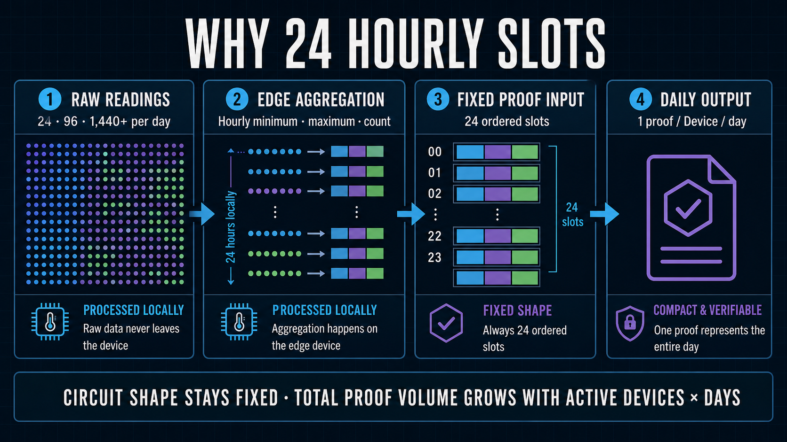

# Cost Benchmark Record

[日本語版](../ja/implementation/cost_benchmark.md)

This document records the cost basis for the standard operational use case: one temperature reading
per minute, 1,440 private readings per completed day, Device-local reduction into 24 hourly
minimum/maximum slots, and one Daily Attestation ZK proof. The 24- and 96-reading runs are retained
only as functional evidence that the operational circuit and transaction do not scale with the raw
sample count; they are not separate cost profiles.



## Scope and status

| Path | Purpose | Status | Cost treatment |
| --- | --- | --- | --- |
| Standard operational 1,440-reading day | Reduce one-minute readings into 24 private hourly extrema slots and submit one policy-bound Daily Attestation | Sponsor-funded Preprod WITHIN confirmed on 2026-08-30 JST | Current operational cost evidence |
| 24/96-reading equivalence checks | Confirm that fewer local readings still produce the same fixed 24-slot circuit input | Preprod WITHIN confirmed | No separate price or cost profile |
| Development-only Daily profiles | Research the rejected design that unrolls every raw reading in-circuit | Historical compile measurements retained | Not an operational cost |

The standard path keeps all 1,440 Raw values on the Device. For each hour it derives one private
minimum and maximum, producing the same fixed 24-slot input every day. It then sends one
`submitDailyAttestation` transaction. The Device cannot submit threshold bounds; the circuit uses the
public Policy registered on Midnight. The schema-5 Fleet Registry Contract, Device, Policy, and
Device-bound Assignment are deployed on Preprod, and the installed Edge Device completed this full
1,440-reading path through P-256 authentication, D1 admission, the Cloudflare Proof Server,
Device-Wallet authorization, Sponsor Wallet fee payment, and Midnight confirmation.

The current implementation binds the Device/Lace transaction without fees and uses the dedicated
Sponsor Wallet for DUST and submission. The 2026-08-30 JST run below records the Device serialized
bytes/SHA-256, Sponsor final bytes/hash, sponsorship latency, Sponsor DUST fee, confirmation, and
exact component versions. The earlier self-funded run remains historical comparison evidence.

The Daily profile is a separate experimental circuit that unrolls work for every reading. It is not shipped to the Edge Device and must not be used as the customer-path cost without an explicit architecture change.

## Measurement environment

Measured on 2026-08-28 JST at Git commit `b68a3b7ec662a7f00a6e7beebf3b66f8a68a8fc5`.

| Item | Value |
| --- | --- |
| Host | WSL2 Linux 6.6.87.2, x86-64 |
| CPU exposed to WSL | AMD Ryzen 9 9950X, 16 logical CPUs |
| Memory exposed to WSL | 66,865,758,208 bytes (approximately 62.3 GiB) |
| Node.js / npm | 22.15.0 / 10.9.2 |
| Compact CLI / toolchain | 0.5.2 / 0.31.1 |
| Midnight JS protocol / wallet SDK | 4.1.1 / 1.2.0 |

Device-side setup and wallet measurements use the following actual installed environment. Software-sensitive measurements must be repeated after changing any listed component.

| Item | Value |
| --- | --- |
| Device OS / architecture | Debian GNU/Linux 13 (trixie), aarch64 |
| Device hardware / CPU | Edge Device reference hardware / Cortex-A72, 4 logical CPUs |
| Device Node.js / npm | 24.13.1 / 11.10.0 |
| Wallet SDK / wallet-sdk-dust-wallet | 1.2.0 / 4.2.0 |
| Midnight.js protocol / contracts | 4.1.1 / 4.1.1 |
| Compact runtime / ledger | 0.16.0 / 8.1.0 |
| RxJS / tsx | 7.8.2 / 4.23.12 |
| Cloudflare Wrangler / Proof Server image | 4.127.0 / `midnightntwrk/proof-server:8.1.0` |

Setup measurements record wall time, user and system CPU time where available, average CPU utilization, maximum RSS, final persisted-state size, and the relevant software versions. Wallet sync is reported separately as cold/catch-up, warm restart, and incremental sync. A cold result must not be used as the normal per-dataset operating cost.

### Sponsor Wallet migration build baseline

Measured on 2026-08-29 JST from the uncommitted Sponsor Wallet migration working tree on Git commit
`b68a3b7ec662a7f00a6e7beebf3b66f8a68a8fc5`, using Node.js `22.15.0`, npm `10.9.2`,
TypeScript `6.0.3`, Wrangler `4.127.0`, Docker Engine `29.2.0`, Wallet SDK `1.2.0`,
Midnight.js `4.1.1`, DApp Connector API `4.0.1`, and Proof Server `8.1.0`.

| Command / operation | Result | Wall | User | System | CPU | Maximum RSS |
| --- | --- | ---: | ---: | ---: | ---: | ---: |
| `npm run typecheck` | All workspaces passed, including Sponsor, Device, GUI, and Worker bindings | 7.95 s | 17.57 s | 1.60 s | 241% | 397,828 KiB |
| `npm test` | 6 Compact circuits compiled; 127 tests passed | 16.58 s | 23.73 s | 8.30 s | 193% | 349,328 KiB |
| `npm run build` (first cold Sponsor image build) | All workspaces and Wrangler dry-run passed | 51.14 s | 17.15 s | 11.60 s | 56% | 865,480 KiB |
| `npm run build` (warm Docker cache, final allowlist context) | All workspaces and Wrangler dry-run passed | 9.38 s | 14.01 s | 2.32 s | 174% | 838,264 KiB |
| `npm run verify` (daily Sponsor quota revision) | Portability, 6-circuit compile, 138 tests, all type checks/builds, and Wrangler dry-run passed | 38.03 s | 58.44 s | 12.40 s | 186% | 842,004 KiB |
| Local D1 migration | `0014_sponsored_submission.sql` applied successfully | Not separately timed | — | — | — | — |
| Local D1 Sponsor quota migration | `0015_sponsor_daily_quota.sql`; four D1 commands applied successfully | Not separately timed | — | — | — | — |
| Remote D1 Sponsor quota migration | `0015_sponsor_daily_quota.sql`; four D1 commands applied successfully | 2.01 s | 0.80 s | 0.16 s | 47% | 258,264 KiB |
| Sponsor quota and GUI deployment | Worker `87416985-8b3e-4a2d-a810-67cd837359e8`; two GUI assets; Sponsor image `sha256:c2432f3d4f15...` | 50.73 s | 2.69 s | 0.83 s | 6% | 438,972 KiB |
| Streaming checkpoint follow-up deployment | Worker `5af7c47f-5f3f-4877-b31b-39eb25f582bd`; same cached Sponsor image | 12.71 s | 1.78 s | 0.54 s | 18% | 380,056 KiB |
| Official public-network sync-gate deployment | Worker `ac4f188b-8e25-4e08-b0dc-cf04c4b30eaa`; Sponsor image `sha256:648f5722c8b4...` | 59.22 s | 2.10 s | 0.71 s | 4% | 380,692 KiB |
| Sponsor deny-by-default HTTPS/WSS policy deployment | Worker `faf3e26c-88b1-4113-b998-60241dfded96`; same cached Sponsor image | 15.88 s | 2.41 s | 0.78 s | 20% | 380,004 KiB |
| Sponsor transaction-format hardening deployment | Worker `e0f93d94-528b-494c-865b-7b51c3e67ec4`; Sponsor image `sha256:79bc35bd301b...` | 71.09 s | 2.57 s | 0.82 s | 4% | 395,084 KiB |
| Device firmware `0.1.0-sponsor.12` archive | 85 operational files and 28 Compact runtime artifacts verified | 48.65 s | 8.00 s | 4.59 s | 25% | 676,648 KiB |
| Device firmware `0.1.0-sponsor.12` install | 40 system commands, 4 privilege commands, Node/npm, release/artifacts, 41 Device tests, and collector health passed | 41.429 s | 43.071 s | 11.422 s | — | — |
| Device firmware `0.1.0-sponsor.13` archive | 87 operational files and 28 Compact runtime artifacts verified | 28.22 s | 7.49 s | 4.38 s | 42% | 681,352 KiB |
| Device firmware `0.1.0-sponsor.13` install | 40 system commands, 4 privilege commands, Node/npm, release/artifacts, 43 Device tests, and collector health passed | 42.026 s | 44.222 s | 11.167 s | — | — |
| Device firmware `0.1.0-sponsor.14` archive | Added restart-safe reuse of a pending Device transaction; 87 operational files and 28 Compact runtime artifacts verified | 31.93 s | 7.68 s | 4.41 s | 37% | 652,088 KiB |
| Device firmware `0.1.0-sponsor.14` LAN transfer | Verified archive copied to the Edge Device over development SSH | 2.45 s | 0.07 s | 0.03 s | 4% | 10,552 KiB |
| Device firmware `0.1.0-sponsor.14` install | 40 system commands, 4 privilege commands, Node.js `24.13.1`/npm `11.10.0`, release/artifacts, 44 Device tests, and collector health passed; identity, wallet, configuration, and pending TX preserved | 45.450 s | 44.962 s | 11.400 s | — | — |
| Pre-Sponsor transaction-binding deployment | Worker `46d7d13a-29c6-4df7-96f0-2fbd008335cc`; six circuits compiled; two existing GUI assets and Worker updated; Container images unchanged | 27.98 s | 20.36 s | 7.23 s | 98% | 380,236 KiB |
| Edge Device pending-TX recovery check | Reused the 5,989-byte transaction from mode-`0600` storage; dataset preparation 73 ms, submission path 542 ms, no new Proof Server request; D1 became `device_bound` in 0.1823 ms SQL time | 21.389 s | — | — | — | — |
| Final `npm run verify` after pending-TX recovery | Portability, six-circuit compile, 147 tests, all workspace type checks/builds, and Wrangler dry-run passed | 37.33 s | 59.60 s | 13.90 s | 196% | 887,636 KiB |
| Final `npm run verify` after Sponsor-funded schema-5 confirmation | Portability, six-circuit compile, 182 tests, all workspace type checks/builds, GUI build, and Wrangler/Container dry-run passed | 46.30 s | 70.64 s | 20.33 s | 196% | 864,252 KiB |
| Project/Policy and GUI restoration regression `npm test` | Compact `0.31.1` compiled six circuits; all 287 tests passed across Shared, Contract, Dashboard, CLI, Device, Gateway, and Sponsor workspaces | 25.95 s | 42.21 s | 11.44 s | 207% | 689,388 KiB |
| Project-scoped Policy deployment | Migration `0022` SQL 3.92 ms; three changed GUI assets; Worker upload 12.95 s; trigger deployment 6.86 s; Worker `d88891bc-17b3-40c1-9771-5fc92fbd9cc0`; Sponsor image `sha256:45265f8d4fc...` | — | — | — | — | — |
| Deployed English third-party capture | Chrome `149.0.7827.200`, FFmpeg `6.1.1`, direct Midnight verification passed; 62 frames at 5 fps; MP4 1,139,853 bytes, SHA-256 `59d8c40285279dce1b1159d4637427c1ba074d003830ff212c1b098e861c9a4a` | — | — | — | — | — |

The first Docker run exposed an approximately 900.82 MB build context. The final `.dockerignore` and
explicit Dockerfile copies admit only the Sponsor source, package metadata, TypeScript base config,
and Sensor Registry managed proof artifacts. The final dry-run reported a cached context transfer of
4.69 kB; an image inspection independently confirmed that the required
`submitDailyAttestation.prover` file is present at 9,990,421 bytes. Cold and warm image-build values
are setup measurements, not per-attestation costs.

The quota-revision verification used Node.js `22.15.0`, npm `10.9.2`, Wrangler `4.127.0`, Compact
toolchain `0.31.1`, and the same uncommitted working-tree baseline on Git HEAD `b68a3b7ec662`.

The `0.1.0-sponsor.14` archive is 24,018,412 bytes with SHA-256
`5803dc2ee924f52fa9295de0e290ea1375a34a2c330baf162f77d888bfe07c62`. Installation retained the
existing owner-only pending transaction at mode `0600` so the already generated proof can be retried
without reconstruction.

The recovery check intentionally ended at HTTP 503 because the restricted HTTPS interception path
cancels the Wallet SDK's official GraphQL WebSocket subscriptions; all three wallet progress values
remained `disconnected, syncing (0/0)`. The transaction is now durably bound and can resume without a
new proof after the Sponsor's native TLS/WebSocket egress policy is explicitly approved and deployed.

These checks prove build and boundary correctness only. No Sponsor-funded Preprod transaction has
yet replaced the historical self-funded fee row; Sponsor synchronization, DUST registration, first
fee-only balance, submission, and confirmation must be measured after funding the new Sponsor address.

The pinned Wallet SDK `1.2.0` / DUST Wallet `4.2.0` combination is affected by the documented Preprod
DUST replay non-convergence tracked in [Midnight servicedesk issue 165](https://github.com/midnightntwrk/servicedesk/issues/165).
The operational gate therefore follows the current official public-network example: shielded and
unshielded progress must be strictly complete, while actual DUST readiness still requires a spendable
DUST coin. This avoids an infinite initialization wait without allowing a fee transaction before DUST
is usable.

### Current Fleet Registry fixed 24-slot build baseline

Measured on 2026-08-28 at approximately 22:36-22:38 JST using Node.js `22.15.0`, npm `10.9.2`,
Compact CLI `0.5.2`, toolchain `0.31.1`, language `0.23`, runtime `0.16.0`, and Wrangler
`4.127.0` on the development host above. The working tree contained the uncommitted schema-3 Fleet
Registry revision on top of Git commit `b68a3b7ec662a7f00a6e7beebf3b66f8a68a8fc5`. This revision
proves both truthful WITHIN and OUTSIDE results with the same `submitDailyAttestation` circuit.

| Command | Result | Wall | User | System | CPU | Maximum RSS |
| --- | --- | ---: | ---: | ---: | ---: | ---: |
| `npm run contract:compile` | 6 proving circuits compiled | 14.18 s | 17.39 s | 5.65 s | 162% | 349,156 KiB |
| `npm test` | compile and 105 tests | 20.37 s | 26.53 s | 8.14 s | 170% | 402,644 KiB |
| `npm run verify` | portability, compile, 109 tests, all type checks, all builds, Wrangler dry-run | 33.46 s | 53.76 s | 11.17 s | 194% | 855,400 KiB |

| Circuit | Prover key | Verifier key | ZKIR | BZKIR |
| --- | ---: | ---: | ---: | ---: |
| `registerDevice` | 2,820,986 B | 2,119 B | 7,999 B | 486 B |
| `rotateDeviceAuthority` | 2,820,972 B | 2,119 B | 8,678 B | 516 B |
| `disableDevice` | 2,820,543 B | 2,119 B | 6,287 B | 380 B |
| `registerThresholdPolicy` | 2,821,341 B | 2,119 B | 7,044 B | 441 B |
| `registerPolicyAssignment` | 2,821,426 B | 2,119 B | 9,673 B | 571 B |
| `submitDailyAttestation` | 9,990,428 B | 2,119 B | 75,272 B | 5,654 B |

Compared with the immediately preceding WITHIN-only Fleet Registry artifact, the revised Daily
Attestation prover key changed from 9,990,614 B to 9,990,428 B (-186 B, approximately -0.0019%).
ZKIR increased by 1,606 B and BZKIR by 155 B, while the contract remains six circuits. The result
Boolean therefore adds no circuit, transaction, or per-sample proving path. Compile and verification
wall times are development-host setup costs and include normal run-to-run noise.

These are local build/artifact measurements. Proof Server latency, Container planning usage, DUST
fees, and Preprod confirmation times are reported separately in the current operational E2E section.

### Browser Device Workflow build and verification

Measured on 2026-08-28 at approximately 19:35-19:37 JST with Vite `8.2.2`, Midnight DApp
Connector API `4.0.1`, Midnight.js `4.1.1`, Wrangler `4.125.0`, and Google Chrome
`149.0.7827.200`. The working tree included the browser Wallet Device workflow and its compatibility
polyfills.

| Command | Result | Wall | User | System | CPU | Maximum RSS |
| --- | --- | ---: | ---: | ---: | ---: | ---: |
| `npm run build -w @midnight-demo/dashboard` | Production browser bundle and six-circuit ZK asset export | 1.01 s | 1.20 s | 0.78 s | 196% | 883,348 KiB |
| `npm run verify` | Portability, six-circuit compile, 81 tests, all type checks/builds, Wrangler dry-run | 32.28 s | 51.25 s | 10.66 s | 191% | 858,720 KiB |

The generated `device-flow.js` is 16,567.41 kB (6,262.97 kB gzip). It is loaded only on the Device
Workflow route; the existing administrator and verifier views do not download it. A Headless Chrome
execution reached the provisioning boundary without a module/polyfill error. It correctly refused the
retired schema-1 Preprod deployment with `Compatible Preprod Fleet Registry deployment was not found`.
This is a successful browser-runtime check and an expected deployment-compatibility stop, not a live
Preprod transaction result.

### Daily browser history and completed-date guard

Measured on 2026-08-28 at approximately 21:52-21:55 JST with Vite `8.2.2`, Wrangler `4.127.0`,
and Google Chrome `149.0.7827.200`. This revision adds private browser day storage, fixed 1,440-sample
Auto Generate, hourly history, newest-first public Proof selection, and a completed-JST-date guard.
The review generator accepts only the previous 30 completed days; the real Device ingestion API is
unchanged.

| Command / step | Result | Wall | User | System | CPU | Maximum RSS |
| --- | --- | ---: | ---: | ---: | ---: | ---: |
| Dashboard tests | 13 tests passed, including both date boundaries | 0.56 s | 0.91 s | 0.24 s | 204% | 167,532 KiB |
| Dashboard production build | `device-flow.js` 16,577.77 kB (gzip 6,266.03 kB) | 1.08 s | 1.21 s | 0.89 s | 195% | 844,364 KiB |
| Final `npm run verify` | Portability, six-circuit compile, 105 tests, all type checks/builds, Wrangler dry-run | 30.31 s | 53.91 s | 10.90 s | 213% | 835,952 KiB |
| Cloudflare deployment | Worker `10d3defd-7422-47d5-94d7-1128924f9617`; two GUI assets; no migration or Container image change | 17.88 s | 2.55 s | 0.50 s | 17% | 447,320 KiB |

These are development and deployment setup measurements, not per-attestation Proof Server or Midnight
transaction costs.

### Local reviewer-state synchronization and video capture

Measured on 2026-08-28 at approximately 23:24-23:27 JST with Wrangler `4.127.0`, Google Chrome
`149.0.7827.200`, and FFmpeg `6.1.1-3ubuntu5`. `dashboard:sync` first applies local D1 migrations,
then copies only review-safe public state. The measured copy contained one Project, two Devices and
public keys, 35 hourly windows, two anomaly events, one Policy, two Assignments, and three confirmed
Daily Proof Jobs. It excluded readings, Device Sessions and Challenges, token hashes, Operator
leases, signed transaction object keys, and R2 Proof artifacts.

| Command | Result | Wall | User | System | CPU | Maximum RSS |
| --- | --- | ---: | ---: | ---: | ---: | ---: |
| `npm run dashboard:sync` | Local migrations and public Preprod review-state copy | 21.73 s | 18.11 s | 3.26 s | 98% | 288,420 KiB |
| `npm run dashboard:capture-demo` | Japanese administrator-to-third-party walkthrough, 119 frames at 5 fps | 49.51 s | 6.26 s | 2.93 s | 18% | 773,104 KiB |
| `npm run cloudflare:deploy` | Final completed-step asset; Worker `1bb595e7-4f59-4c2e-93fb-7e3af96ab3bc`; no migration or Container change | 11.12 s | 2.20 s | 0.41 s | 23% | 382,292 KiB |

The final MP4 is 23.8 seconds and 1,781,825 bytes. Its SHA-256 is
`7b101aef70e46609c45e9ebb0221006a4cbd2d6017f7b3639a0adeba497b8555`. The recording uses the
confirmed 1,440-reading OUTSIDE result, shows all six completed review steps, and verifies the public
Claim without displaying private hourly extrema, nonce, wallet material, or raw readings. MP4,
screenshots, frames, and checksum metadata remain under the gitignored `.demo-output/` directory.
The deployed health and public Proof endpoints returned HTTP 200 after the final upload; the OUTSIDE
Claim remained verified and confirmed at Midnight block `2302213` against the current Contract.

### Device operation-configuration rollout

Measured on 2026-08-28 JST with Wrangler `4.125.0` on the development host and Node.js `24.13.1`
on the Edge Device. Migration `0012_device_operation_configuration.sql` adds a monotonic public
configuration revision and the `configuration:read` Device scope. The authenticated Device now pulls
the current Preprod contract, public Threshold Policy, and Device-bound Assignment from the Worker;
the firmware archive no longer embeds a deployment address.

| Step | Result | Wall | User | System | Maximum RSS |
| --- | --- | ---: | ---: | ---: | ---: |
| `npm run cloudflare:deploy` | Migration `0012` applied remotely; Worker version `f80110fb-cb65-470c-a713-379469c7e66a` deployed | 10.81 s | 2.32 s | 0.43 s | 378,636 KiB |
| CSP/CORS Worker redeployment | Browser WASM CSP and loopback-only development CORS; Worker version `6fa01d4b-df47-49dd-8ca6-20a88a6e8419`; no migration or Container image change | 21.23 s | 2.39 s | 0.58 s | 438,428 KiB |
| Browser state-restoration deployment | Restored persisted Device Identity and authenticated registration/Policy state; Worker version `02a51e90-628c-42f9-9e1f-c33e62c2cd79`; no migration or Container image change | 18.57 s | 2.38 s | 0.45 s | 437,996 KiB |
| Browser restoration follow-up deployment | Serialized initial GUI hydration to prevent duplicate Device Sessions; Worker version `df8c6ea8-23a8-4c6e-8aee-1e5e628d135a`; no migration or Container image change | 9.64 s | 2.15 s | 0.40 s | 379,292 KiB |
| `.11` firmware packaging | 88 operational files and 28 verified Compact runtime artifacts | 30.23 s | 7.43 s | 4.02 s | 669,904 KiB |
| `.11` Edge Device installation | 37 Device tests passed; existing identity and wallet preserved | 50.993 s | 60.331 s | 12.459 s | Not available¹ |
| `.12` firmware packaging | Corrected generated root `device:configure` entry; 88 files and 28 artifacts | 20.71 s | 7.14 s | 4.01 s | 644,904 KiB |
| `.12` Edge Device installation | 37 Device tests passed; existing identity and wallet preserved | 48.866 s | 59.111 s | 12.473 s | Not available¹ |
| `npm run device:configure` on `.12` | P-256 Session authentication and public configuration revision `1` installed | 18.950 s | 18.558 s | 1.837 s | Not available¹ |
| `.13` firmware packaging | Added power-loss state recovery; 88 files and 28 artifacts | 27.62 s | 7.13 s | 4.24 s | 668,876 KiB |
| `.13` Edge Device installation | 38 Device tests passed; existing identity, wallet, and configuration preserved | 47.210 s | 59.595 s | 12.470 s | Not available¹ |
| Schema-3 contract deployment | New six-circuit Fleet Registry deployed to Preprod; Operator proof lease revoked | 2 min 43.86 s | 31.70 s | 8.05 s | 503,092 KiB |
| Schema-3 Cloudflare deployment | Migration `0013`; Worker `613097d9-1c4d-4910-a13b-4f9aeb00be91`; existing Proof Server image retained | 18.55 s | 2.55 s | 0.62 s | 525,996 KiB |
| `.14` firmware packaging | Schema-3 artifacts and operation configuration; 88 files and 28 artifacts | 31.81 s | 7.21 s | 4.02 s | 672,896 KiB |
| `.14` Edge Device installation | 38 Device tests passed; existing identity, wallet, and configuration preserved | 48.110 s | 59.329 s | 12.449 s | Not available¹ |
| `npm run device:configure` on `.14` | Authenticated configuration revision `2`, schema `3`, policy, and assignment installed | 18.788 s | 18.390 s | 1.809 s | Not available¹ |
| `.15` firmware packaging | Registered Device ID, completed-date, and truthful OUTSIDE benchmark support; 88 files and 28 artifacts | 32.13 s | 7.56 s | 4.03 s | 691,928 KiB |
| `.15` Edge Device installation | 39 Device tests passed; existing identity, wallet, and configuration preserved | 56.951 s | 66.004 s | 15.212 s | Not available¹ |
| Final `npm run verify` | Portability, six-circuit compile, 88 tests, all type checks/builds, Wrangler dry-run | 35.87 s | 54.77 s | 11.36 s | 834,300 KiB |
| `npm run dashboard:sync` | Copied public/redacted remote state to local D1; excluded credentials and private artifacts | 20.76 s | 15.52 s | 2.80 s | 282,648 KiB |

Remote D1 migration execution reported **5.85 ms SQL duration**. The `.11` installation itself was
valid, but its generated root package omitted the new command, so the first configuration-entrypoint
check failed before contacting the Worker. Release `.12` corrected the package builder and verifier,
then successfully installed the deployed Contract schema `2`, Policy `temperature-v1`, and the
Device-bound Wave 1 Assignment. The `.11` archive is 24,014,474 bytes with SHA-256
`28aa333029b1df77f15975af57c87fb588d3b29c942d99d39eb8af9ae8fe5483`; `.12` is 24,014,387 bytes
with SHA-256 `b1bd2acae03daed2b9d9eb52f8407f5869a68b27bc30face1eedb6fdea0c5b4b`.
Release `.13` was prompted by an actual 354-byte NUL-filled Collector state file left after an
unclean power cycle. It preserved that file under a timestamped `.corrupt-` name, created a new
owner-only state file, and resumed the synthetic Collector with a healthy loopback response and no
pending outbox item. The `.13` archive is 24,014,539 bytes with SHA-256
`e5d6c0111623b4ce451ea02cd06dc156e886a1110ba2e9399630bcc57602e15a`.

Remote migration `0013` reported **6.37 ms SQL duration**. Release `.15` is 24,018,047 bytes with
SHA-256 `0ffff19814d1cc36731e7cabd37d998d2913b5fc96a6ee4e419cd98f4a8a7e78`. The installer retained the
existing P-256 identity, Device Contract Authority, Wallet, and authenticated operation
configuration. The Edge collector was healthy after activation.

Recovery and Device Identity migration were measured on 2026-08-29 JST with Node.js `22.15.0`,
npm `10.9.2`, and Wrangler `4.127.0` on the development host, and Node.js `24.13.1` on the Edge Device.

| Step | Result | Wall | User | System | Maximum RSS |
| --- | --- | ---: | ---: | ---: | ---: |
| Remote D1 migrations `0006`-`0013` | Current authentication, Queue, policy, multi-Device, configuration, and daily-result schema applied | 6.12 s | 0.92 s | 0.19 s | 262,120 KiB |
| Edge Device/Policy/Assignment mirror sync | Confirmed schema-3 Midnight evidence restored to D1 | 7.70 s | 3.83 s | 0.61 s | 316,600 KiB |
| Browser Device D1 provisioning | Existing confirmed browser Device prepared for mirror synchronization | 3.61 s | 2.30 s | 0.38 s | 257,332 KiB |
| Browser Device/Policy/Assignment mirror sync | Confirmed schema-3 Midnight evidence restored to D1 | 5.72 s | 3.54 s | 0.60 s | 258,740 KiB |
| Edge Device P-256 public-key activation | Existing key ID registered with all eight Wave 1 scopes | 6.20 s | 2.39 s | 0.43 s | 269,616 KiB |
| `.16` firmware packaging | Corrected relocated operational-document paths; 88 files and 28 artifacts | 33.65 s | 7.48 s | 4.33 s | 674,352 KiB |
| `.16` Edge Device installation | 39 Device tests passed; existing identity and wallet preserved | 49.010 s | 59.370 s | 12.650 s | Not available¹ |
| `.17` firmware packaging | Added idempotent enrollment-scope migration; 88 files and 28 artifacts | 29.88 s | 7.35 s | 4.05 s | 669,596 KiB |
| `.17` Edge Device installation | 40 Device tests passed; P-256 key ID and wallet preserved; public enrollment updated | 51.223 s | 60.525 s | 12.776 s | Not available¹ |
| `.18` firmware packaging | Reissued Device Sessions when the configured service origin changes; 88 files and 28 artifacts | 31.08 s | 7.52 s | 4.17 s | 681,936 KiB |
| `.18` Edge Device installation | 40 Device tests passed; P-256 key ID and wallet preserved | 51.851 s | 60.645 s | 12.862 s | Not available¹ |
| `.18` configuration attempt | Correctly exposed a stale proving-service URL retained by the installed configuration | 18.704 s | Not recorded | Not recorded | Not available¹ |
| `.19` firmware packaging | Made the Worker base URL authoritative for both ingestion and proving APIs; 88 files and 28 artifacts | 29.34 s | 7.15 s | 4.03 s | 671,320 KiB |
| `.19` Edge Device installation | 40 Device tests passed; P-256 key ID and wallet preserved | 50.696 s | 60.949 s | 12.387 s | Not available¹ |
| `.19` authenticated configuration | Configuration revision `2`, schema `3`, Policy, Assignment, and both service URLs synchronized | 18.894 s | 18.699 s | 1.772 s | Not available¹ |
| `.19` 1,440-reading Edge Device E2E | P-256 authentication, scheduled Job admission, Proof Server ZKP, Device-Wallet TX, and Midnight confirmation | 2 min 0.598 s | 41.601 s | 2.569 s | Not available¹ |
| Current Dashboard build | Six Compact circuits, current ZK assets, Lace Indexer CSP, and browser private-state compatibility guard | 15.34 s | 18.95 s | 6.46 s | 838,344 KiB |
| Third-party GUI bundle rebuild | Non-blocking public-data refresh, redacted readings, public ZK steps, and Explorer links | 1.04 s | 1.16 s | 0.90 s | 839,196 KiB |
| Current Cloudflare deployment | No D1 migration or Container image change; updated Worker and GUI assets | 12.49 s | 2.09 s | 0.42 s | 381,664 KiB |
| Friendly third-party copy deployment | Wrangler `4.127.0`; no D1 migration or Container image change; updated three GUI/Worker assets | 17.90 s | 2.49 s | 0.73 s | 447,676 KiB |
| Final friendly-value-label deployment | Wrangler `4.127.0`; no D1 migration or Container image change; updated `app.js` only | 11.77 s | 2.05 s | 0.48 s | 376,008 KiB |
| Midnight Explorer detail-link deployment | Wrangler `4.127.0`; corrected transaction, contract, and block routes; updated `app.js` only | 13.63 s | 2.19 s | 0.49 s | 379,968 KiB |
| Current GUI operation-video capture | Chrome `149.0.7827.200` and FFmpeg `6.1.1`; 119 frames at 5 fps, 1,845,465-byte MP4 | 8.15 s | 4.93 s | 1.69 s | 772,812 KiB |
| Idempotent reviewer-state synchronization | Replaced the local public cache with the current remote snapshot | 14.10 s | 9.26 s | 1.72 s | 289,836 KiB |
| Lace loopback Proof Server cold startup | Proof Server `8.1.0` under Docker Engine `29.2.0`, container start to listening | 8.12 s | Not recorded | Not recorded | Not recorded |
| Previous repository verification (126-test snapshot) | Portability, six-circuit compile, 126 tests, all type checks/builds, and Wrangler dry-run | 34.11 s | 55.72 s | 11.58 s | 846,424 KiB |

Release `.16` is 24,018,161 bytes with SHA-256
`89f52b5a326cc57d47ce8388756e5b821a2e01a364b807eaaf0869e7ad321877`. Release `.17` is
24,020,157 bytes with SHA-256
`8350f70431e044cbcf659425c31e4a5e3423d86bcd9be783c86c8ae4489e6e33`. The `.17` installer
re-derived the public P-256 key from the protected private key, verified the unchanged key ID, and
added the current `configuration:read` scope without rotating the Device identity.

Release `.18` is 24,020,315 bytes with SHA-256
`a0b5e9980c46b3bdd177d85233c1591953c0b3191dbad3351170291a3b854c6b`. Release `.19` is
24,020,351 bytes with SHA-256
`7a93a8a0c00cc4ef79d6a68c7215fabff3f0b13c4a4b0062d7e194b7917db8bf`. The failed `.18`
configuration attempt was a measured validation failure, not a Proof or transaction attempt. Release
`.19` corrected the service-URL migration and then completed configuration without rotating the P-256
Device identity or Device Wallet.

The `.19` operational validation reduced 1,440 one-minute synthetic readings into 24 private hourly
slots and confirmed a truthful WITHIN result. Dataset preparation took 69 ms; Proof Server readiness
6,214 ms; private-state preparation 4,478 ms; Contract connection 4,056 ms; and the Attestation
transaction 60,226 ms. The authenticated `/check` request was 7,180 bytes and 355 ms, while `/prove`
was 9,999,783 bytes and 27,170 ms. The 9,175-byte transaction consumed
`0.821170000000001 DUST` and was confirmed at block `2303416` with transaction ID
`00e48038a736710bf6216fecbef3cd16568d91668893e5320bd7915c0725e116bc`. The public verifier
returned all four checks as true while keeping hourly extrema and the commitment nonce private. This
is a second measurement of the same fixed 1,440-reading cost profile, not a new sampling tier.

The Browser review Device was also validated on 2026-08-29 JST with 1,440 generated readings reduced
to the same 24 private slots. Its two injected outliers produced a truthful OUTSIDE attestation. The
contract proof used the authenticated Cloudflare Proof Server Container; Lace used the loopback
Proof Server only for wallet-internal DUST/Zswap proving, then signed and submitted transaction
`008387b4826c52df517fd24b45e50183023ffcd5af4725b2ad525943368eec5791`. Public Proof Job
`proof-3f23d3d79bfd66d3fb02cbd2a4a995f1270e9b026d01d30e` reached `confirmed`, and the third-party
view returned all four checks as true without exposing hourly extrema or the nonce. This is browser
workflow equivalence evidence, not an additional pricing row. The one-time loopback startup above is
a Lace setup cost and is not part of the Edge Device operational path or per-attestation Cloudflare
cost.

The `0.1.0-sponsor.11` operational archive added the complete installer preflight and long-running
Sponsor readiness polling. Packaging 85 operational files and 28 verified Compact runtime artifacts
completed in **29.03 seconds wall time** with **667,648 KiB maximum RSS** (`7.25 s` user, `4.13 s`
system, `39%` CPU). The archive is 24,016,657 bytes with SHA-256
`7c077d87e05862261533df9ea8fc148917c304ad36dd5b2a0f022664728d18ac`. Installation on the Edge
Device completed in **42.848 seconds wall time** (`44.110 s` user, `11.437 s` system). Before changing
Device state, it passed 40 system-command checks, four command-specific privilege checks, and the
Node.js 24.13.1/npm 11.10.0 check without invoking apt. It then passed 6 Device Auth, 13 Edge, and 21
Device Wallet tests, preserved the existing P-256 key ID, Contract Authority, wallet, and operation
configuration, and returned a healthy Collector. GNU `/usr/bin/time` remains unavailable on the
Device, so installation maximum RSS was not measured. This is a setup measurement, not a
per-attestation operating cost.

¹ GNU `/usr/bin/time` was unavailable on the Edge Device; Bash `time` provided wall/user/system values but no
maximum RSS. These setup measurements are not per-attestation operating costs.

Run a repeatable compile measurement with:

```bash
npm run benchmark:compile -- --samples 24
npm run benchmark:compile -- --samples 96
npm run benchmark:compile -- --samples 1440 --skip-zk
```

Machine-readable development results are written with mode `0600` below `.state/development/benchmarks/`; the standard 1,440-reading operational result and historical equivalence results are below `.state/device-benchmarks/`. Only the 1,440-reading result is consumed by the Cost calculator. Both directories are intentionally gitignored because other benchmark and wallet state may be private. This tracked document is the reviewable summary.

The retired selected-leaf repository verification on the same host completed successfully at 2026-08-28 15:11 JST in **21.19 seconds wall time** with **395,696 KiB maximum RSS** (`34.67 s` user, `5.59 s` system, `189%` CPU). It included 63 selected tests, all workspace type checks, and the Wrangler deployment dry-run. Compact reported `4,857` rows (`k=13`) for `registerDataset` and `9,231` rows (`k=14`) for `verifySensorValue`. It is preserved as a development-history measurement, not a current per-customer proof cost.

The earlier `0.1.0-wave1.20260828.9` operational firmware archive completed portability checks, artifact export, production-lock validation, release verification, archive extraction verification, and checksum generation in **29.99 seconds wall time** with **677,984 KiB maximum RSS** (`7.07 s` user, `3.83 s` system, `36%` CPU). It contains 67 manifest-covered operational files and 12 verified Compact runtime artifacts. The archive is 8,075,679 bytes and has SHA-256 `64713095c54ed07d001d7d76126036862c7b8e1ea975cdcd25ab9ce878fe2244`.

Installation of that archive on the Edge Device completed in **71.571 seconds wall time** (`85.248 s` user, `17.293 s` system, `143.27%` CPU). The installer validated and preserved the existing Device Identity, Wallet credentials, and Contract Authority with owner-only permissions, ran 31 Device tests, and installed 67 operational files plus 12 artifacts. A later process audit found that a detached `.6` wallet catch-up process had remained active during this installation. This is a valid observed installation time but not an uncontaminated baseline; repeat it with no wallet process running after active cooling is installed.

The fanless Edge Device reference unit reached **80.8-84.7 C at idle** and **84.2-85.2 C during wallet catch-up**. `vcgencmd get_throttled` returned `0xe0008`, recording current/past soft temperature limiting and historical throttling/frequency capping. One `.9` wallet process used approximately 101% CPU and 542 MiB RSS. A detached `.6` process was also found using approximately 101% CPU and 449 MiB RSS; it was terminated while the `.9` process continued. The active run is therefore a diagnostic thermally limited measurement, not a clean cold-sync baseline. The root filesystem is a 440 GB `/dev/sda2` volume with 52 GB used and 371 GB available at the measurement point. Repeat cold/catch-up and warm-sync measurements after installing active cooling, targeting below 70-75 C under sustained load.

The follow-up `0.1.0-wave1.20260828.10` archive adds the Device Wallet single-process lock and per-proof Session authorization refresh. It completed the same packaging checks in **27.46 seconds wall time** with **674,832 KiB maximum RSS** (`7.16 s` user, `4.47 s` system, `42%` CPU). It contains 71 manifest-covered operational files and 12 verified Compact runtime artifacts. The archive is 8,077,074 bytes with SHA-256 `f639f3860febdabb93dcd5ba0f99186bb9981c53f779cecbe8352a76d7daddf5`.

Installation of `.10` on the Edge Device completed in **54.101 seconds wall time** (`66.341 s` user, `13.107 s` system). The installer passed 34 Device Auth, Edge, and Wallet tests, installed 71 operational files and 12 verified artifacts, and switched `current` to `<device-home>/.midnight/midnight-cloudflare-demo/releases/0.1.0-wave1.20260828.10-c14edb5feae1`. SHA-256 checks before and after installation confirmed that the existing Device Identity and Wallet credentials were preserved exactly. The localhost health check passed on Node.js 24.13.1. After all three operational benchmarks the Edge Device measured **69.1 C**; the current throttle flag was clear, while `0xe0000` retained the historical thermal-limit record.

## Development-only Daily compile results

| Samples | ZK keys | Wall | User | System | CPU | Maximum RSS | Daily prover key | All prover keys | Daily ZKIR |
| ---: | --- | ---: | ---: | ---: | ---: | ---: | ---: | ---: | ---: |
| 24 | Generated | 56.91 s | 78.03 s | 23.22 s | 177% | 2,731,200 KiB | 76,620,395 B | 87,476,746 B | 5,093 B |
| 96 | Generated | 310.20 s | 333.19 s | 120.45 s | 146% | 10,900,028 KiB | 304,616,597 B | 315,472,948 B | 16,646 B |
| 1,440 | Skipped | 1.25 s | 0.91 s | 0.26 s | 93% | 274,920 KiB | Not generated | Not generated | Not generated |

The 96-sample full compile took 5.45 times the 24-sample wall time, used 3.99 times the maximum RSS, and produced a daily prover key 3.98 times as large.

The 1,440-sample full ZK compile was intentionally not started. A simple linear extrapolation from the 96-sample result alone is approximately 77.6 minutes, 155.9 GiB maximum RSS, and a 4.26 GiB daily prover key. This is an estimate, not a measurement, and the 24-to-96 timing already indicates worse-than-linear wall-time growth. It exceeds this host's 62.3 GiB memory allocation.

The Proof Gateway accepts at most 95 MiB per proof request. The 96-sample experimental Daily prover key alone is approximately 290.5 MiB, so the 96- and 1,440-sample experimental profiles cannot traverse the Gateway. The 287,387-byte `registerDataset` and 2,822,508-byte `verifySensorValue` keys are retained selected-leaf measurements; the new `submitDailyAttestation` key must be measured after its compile artifacts are packaged.

## Proof measurements

The first 24-sample Daily proof attempt against the previous Cloudflare deployment timed out during readiness after approximately five minutes. No `/check` or `/prove` request was sent, no fee was calculated, and no Midnight transaction was submitted. The failure is retained in `.state/development/benchmarks/daily-attestation-24.json`; it is not treated as a proof-generation measurement.

The replacement Cloudflare deployment uses:

| Resource | Configuration |
| --- | --- |
| Worker | `midnight-proof-gateway` |
| D1 | `midnight-sensor-data-v2`, APAC, seventeen migrations including Device keys, one-time challenges, opaque Sessions, Fleet Registry mirrors, hourly summaries, anomalies, public policy/assignment mirrors, Daily Proof Jobs/results, sponsored-submission state, operation-configuration revisions, and short-lived Operator Proof Leases |
| Proof Container | `midnightntwrk/proof-server:8.1.0` |
| Instance | `standard-2`: 1 vCPU, 6 GiB memory, 12 GB disk, maximum one instance |
| Lifecycle | Scale to zero after two minutes without request activity |
| Egress | HTTPS interception allowlists only `srs.midnight.network`; all other Container destinations remain blocked |
| Observability | Structured `proof_gateway_upstream` logs record endpoint, request/response bytes, status, and Container round-trip time; proof bodies and authorization are never logged |

### Standard 1,440-reading Preprod E2E and cost measurement

#### Current operational-day measurement

On 2026-09-02 JST, installed Device release
`0.1.0-operational-day-e2e-20260902.1` generated 1,440 synthetic one-minute readings on the actual
Edge Device. The Device reduced them to 24 private hourly extrema slots for operational date
`2026-09-01`, using the registered JST boundary (UTC+09:00, local day start 00:00), and submitted one
WITHIN attestation against the public 10-35 °C Policy. The Proof Server generated the ZK proof, the
Sponsor Wallet added the DUST fee, and Midnight Preprod confirmed the transaction. Only the input
readings were synthetic; Device authentication, aggregation, proving, sponsorship, submission, and
public-chain verification used the deployed operational path.

| Readings/day | Complete submission | Proof ready | Private state | Contract connection | Attestation TX | `/prove` | Sponsor processing | Device TX | Sponsored TX | Fee |
| ---: | ---: | ---: | ---: | ---: | ---: | ---: | ---: | ---: | ---: | ---: |
| 1,440 | 252.818 s | 4.579 s | 1.551 s | 4.953 s | 195.419 s | 46.730 s | 80.026 s | 6,162 B | 9,348 B | 0.636020000000001 DUST |

| Evidence | Value |
| --- | --- |
| Proof Job | `proof-d40390164cae2ba601b7d2cc9d9f733fb6faae05fa88ebb0` |
| Contract | `0abb6d408a5b8fedbdab9e0fff59f1a5570d3c94af0059bf44b36b3669ee9ddd` |
| Transaction hash | [`92569ab4d9c49661dcca78253b785c2a154672285231244cae14c4a0caf604a3`](https://preprod.midnightexplorer.com/transactions/92569ab4d9c49661dcca78253b785c2a154672285231244cae14c4a0caf604a3) |
| Block height | 2,369,094 |
| Attestation commitment | `6c0691cf5cdae3753d086e08558525149b13a804d1bfa1f254f0c2a8bf6f14cf` |
| Public result | 24 observed / 0 STOPPED; all 24 hourly results WITHIN |
| TX-hash-only verification | `dailyAttestationRecorded=true`, `committedHourlyExtrema=true`, `attestationVerified=true`, `midnightConfirmed=true`; no D1-backed API request |
| Relevant software | Compact toolchain `0.31.1`; Proof Server `8.1.0`; Wallet SDK `1.2.0`; Midnight.js `4.1.1`; Wrangler `4.127.0`; Device Node.js `24.13.1` / npm `11.10.0`; Chrome `149.0.7827.200` |

The Device archive build completed in **30.29 seconds wall time** (`7.61 s` user, `4.62 s` system,
667,796 KiB maximum RSS). Installation and Device-only regression checks completed in approximately
52 seconds; maximum RSS was unavailable because the Device does not provide `/usr/bin/time`. The
deployed English verification capture used the transaction hash directly, completed without a D1
API request, and produced 99 frames at 5 fps.

#### Missing-hour and stopped-day Preprod conformance measurements

Also on 2026-09-02 JST, Device release `0.1.0-missing-pattern-e2e-20260902.1` generated three
operational-day patterns from the same standard 1,440 one-minute source profile. A missing operational
hour removes all 60 readings for that slot before the Device creates its private hourly extrema. These
runs exercised the deployed Device authentication, Proof Queue, Proof Server, Sponsor Wallet, Midnight
submission, and public transaction-hash verifier. The Proof Jobs were admitted immediately as explicit
integration tests because the run was outside the scheduled 02:00-06:00 JST processing window.

| Operational date | Pattern | Source / submitted readings | Observed / no-data hours | Public result | `/prove` | Complete submission | Fee |
| --- | --- | ---: | ---: | --- | ---: | ---: | ---: |
| 2026-08-22 | Missing slots 2, 3, 11, 19 | 1,440 / 1,200 | 20 / 4 | WITHIN | 47.913 s | 203.798 s | 0.696820000000001 DUST |
| 2026-08-23 | All 24 slots missing | 1,440 / 0 | 0 / 24 | STOPPED | 53.665 s | 216.456 s | 1.062820000000001 DUST |
| 2026-08-24 | Missing slots 0, 5, 6; slot 1 outside | 1,440 / 1,260 | 21 / 3 | OUTSIDE | 39.537 s | 205.498 s | 0.714910000000001 DUST |

| Date | Proof Job | Transaction and block | TX-hash-only public verification |
| --- | --- | --- | --- |
| 2026-08-22 | `proof-b8b9b5e58d2ef94ecfceb093e5981f646b8c126d320ea30a` | [`c7271ab651e22bc6a2397347a9e13de82a9975fee4f5bc66f7205c4fd608565e`](https://preprod.midnightexplorer.com/transactions/c7271ab651e22bc6a2397347a9e13de82a9975fee4f5bc66f7205c4fd608565e), block 2,369,823 | Four checks true; no-data slots 2, 3, 11, 19 |
| 2026-08-23 | `proof-5d5545a28cfbd77815c9f731dcf5c0309c75168dca03ca62` | [`93f38db0925d52c0760ea707e5fc14d246b2efd06010fd1be541190745b9983f`](https://preprod.midnightexplorer.com/transactions/93f38db0925d52c0760ea707e5fc14d246b2efd06010fd1be541190745b9983f), block 2,369,863 | Four checks true; all 24 slots are no data |
| 2026-08-24 | `proof-f9a23def05fbdee5bd40a03a1a977c4abd6a06961e2dcbbf` | [`749723b6762c9b43001679f5384a3190842b36a21df53ac327452b05c7745efe`](https://preprod.midnightexplorer.com/transactions/749723b6762c9b43001679f5384a3190842b36a21df53ac327452b05c7745efe), block 2,369,903 | Four checks true; no-data slots 0, 5, 6 and outside slot 1 |

“Four checks true” means `dailyAttestationRecorded`, `committedHourlyExtrema`,
`attestationVerified`, and `midnightConfirmed` all passed against the public Midnight Indexer. The
all-stopped day intentionally has `thresholdSatisfied=true`: no observed hour violated the Policy,
while the distinct public result remains STOPPED. No missing slot is treated as an anomaly by itself.
The relevant software versions are the same as the current operational-day measurement above.

#### Previous Sponsor-funded schema-5 measurement

On 2026-08-30 JST, firmware `0.1.0-wave1.20260830.1` generated one completed WITHIN day from
1,440 one-minute private readings on the installed Edge Device. The readings were reduced locally
to the fixed 24 private hourly extrema slots and proved with circuit version `3` against the public
10–35 °C policy already assigned to the Device. The fee-free Device transaction was accepted once,
the dedicated Sponsor Wallet added DUST, and the result was confirmed in Preprod contract
`10cb9e430180afca0c6840a16dc4a20e9cefa53f27d4aa5bc236b521eac0b2f2`.

| Readings/day | Result | Local preparation | First submit/poll attempt | Sponsor processing | Same-byte status recovery | Device TX | Sponsored TX | Fee |
| ---: | --- | ---: | ---: | ---: | ---: | ---: | ---: | ---: |
| 1,440 | WITHIN | 0.070 s | 135.195 s¹ | 30.303 s | 2.337 s | 6,100 B | 9,286 B | 0.632920000000001 DUST |

¹ The first command reached a confirmed Sponsor submission but its Device-side status read ended on
a transient `fetch failed`. The owner-only 6,100-byte transaction was retained. Firmware
`0.1.0-wave1.20260830.1` retried status reads and resumed the same Proof Job and identical bytes;
the recovery made zero Proof Server requests. D1 remained at one Sponsor attempt and one quota
reservation, so the recovery latency is not a second proof or transaction cost.

| Evidence | Value |
| --- | --- |
| Proof Job | `proof-54b6265653e83a2d81129d576ebd7fe49c33a3cd35c355fd` |
| Measurement group | `02a103eae759fceac076878f2515436bb6b9b6a2de43155529bc8ebc90b26f21` |
| Device transaction SHA-256 | `6efcd6b1b470a15fb01b4deb13edc6f12dadd481bb0b02a3f316eda7be5b440d` |
| Sponsored transaction ID | `00038e81328f0da4c6e48c61b7d9f0923e3aa4f5970b7dc0e0aa70648071f91914` |
| Sponsored transaction SHA-256 | `5cf9ba0fffb253bffdd5f2c708004ec65b232ea22b7b6c9704b796a2068a873f` |
| Block height | 2,317,466 |
| Public verification | `resultVerified=true`, `midnightConfirmed=true`; hourly extrema and nonce remain private |
| Relevant software | Compact toolchain `0.31.1`; Proof Server `8.1.0`; Wallet SDK `1.2.0`; Midnight.js `4.1.1`; Wrangler `4.127.0`; Device Node.js `24.13.1` / npm `11.10.0` |

The firmware archive build took approximately 30.0 seconds, producing 88 operational files and 28
verified runtime artifacts. The archive is 33,465,585 bytes with SHA-256
`ffd22096667a3c1307772b0c4fc0e6507138cc066b5d54e4c1d650e061ea7703`. LAN transfer took 5.11
seconds and installation took approximately 55.0 seconds, including 48 passing Device-only tests,
identity/wallet/configuration preservation, service restart, and collector health validation.

The following self-funded schema-3 measurement is retained as historical comparison evidence.

On 2026-08-28 JST, firmware `0.1.0-wave1.20260828.15` generated a completed day containing one
private reading per minute on the installed Edge Device. The Device reduced those 1,440 readings
locally into 24 private hourly minimum/maximum slots, used the registered Device ID, obtained
authenticated operation configuration revision `2`, created a scheduled D1 Proof Job, used a
supervised integration admission, sent only the private 24-slot opening through the Worker to Proof
Server `8.1.0`, and signed one real `submitDailyAttestation` transaction with the Device Wallet. No
threshold bound was supplied by the Device. The transaction is confirmed in the schema-3 Preprod Contract
`8338d5588fe5662fce86ce3c221f0bd5260a14cdbf372c1dddd58be41e5b3c68`.

| Readings/day | Result | Local preparation | Proof ready | `/check` + `/prove` | Attestation TX | Fee | Proof request bytes | TX bytes | Complete command |
| ---: | --- | ---: | ---: | ---: | ---: | ---: | ---: | ---: | ---: |
| 1,440 | OUTSIDE | 0.076 s | 0.530 s | 19.187 s | 50.044 s | 0.689820 DUST | 10,006,963 B | 9,208 B | 1 min 48.715 s |

The 1,440-reading OUTSIDE run is a successful proof, not a rejected transaction. The contract reports
`verified=true` and stores `thresholdSatisfied=false` for that run. The public verifier
returns `resultVerified=true`, discloses the registered 10-35 °C policy and OUTSIDE result, and does
not disclose the private hourly extrema or nonce.

| Transaction ID | Block height | Result SHA-256 |
| --- | ---: | --- |
| `00e12efda5f33b4804f3659a811d2f5e86c9ce838255a63028d41df85cb0762da9` | 2,302,213 | `36d0c01654e3134be1707869792faca806803e7e69054771f1a6a25233b0807d` |

Separate 24- and 96-reading WITHIN runs also confirmed on Preprod. They are retained only as
equivalence evidence: after Device-local reduction they used the same fixed 24-slot circuit and one
transaction. Their timing and fees are deliberately not used as additional cost rows.

### 10,000-device planning estimate

`npm run benchmark:operating-cost` consumes only the 1,440-reading result above. With 10,000 daily
active Devices, 30 days, USD/JPY `159.17`, 24 hourly summary uploads per day, D1-backed Sessions, one
Queue message per proof, and current public Cloudflare rates, it produces one planning value. DUST
remains separate because it is a non-transferable generated resource rather than a token that can be
purchased directly.

| Standard use case | Cloudflare/month | JPY/month | JPY/Device-month | DUST/Device-month | DUST/fleet-month |
| --- | ---: | ---: | ---: | ---: | ---: |
| 1,440 Raw readings → 24 private hourly extrema slots → 1 ZKP/TX | $445.12 | ¥70,850 | ¥7.09 | 20.6946 | 206,946 |

The current Cloudflare infrastructure planning input is therefore approximately **$445/month or
¥7.09 per active Device-month**, not a customer price. It includes the $5 Workers Paid base,
Container compute, the Container-required Durable Object, Worker, Queue, and first-month D1 estimates.
It uses measured wall time as an upper bound for Container CPU and includes the serialized
chain-confirmation gap. Logs, R2, Container egress, support, hardware, monitoring, taxes, margin, and
later-month retention are not yet priced. D1 Session state uses no separate Durable Object.

The cost grows approximately linearly with active Device-days, not exponentially with Device count or
raw sampling rate. The current deployment is nevertheless a pilot: `max_instances=1`, one admitted
job, and eight dispatches every five minutes cap a four-hour window far below 10,000 jobs. Measured
proof-only throughput from the standard measurement requires about 14 `standard-2` instances for
10,000 jobs in four hours; the current serialized proof-plus-confirmation cycle requires about 44
instances, or 55 with 25% headroom.
Production scaling therefore requires sharded Container identities, a larger dispatcher, and
decoupling proof capacity from Midnight confirmation. Merely increasing `max_instances` is not enough.

The preceding 24-hour-Session Worker/GUI deployment completed in **13.42 seconds wall time** with **263,908 KiB maximum client RSS** (`1.85 s` user, `0.37 s` system, `16%` CPU), version `4c2e4d95-eccb-4252-ae52-cd49e12d4919`. It changed the opaque Device Session lifetime from one hour to 24 hours, retained the existing Container image, and applied no new D1 migration. The longer lifetime reduces challenge/session D1 writes for continuously operating devices while retaining token hashing, scope checks, revocation, and key-rotation invalidation. From the Edge Device, an earlier valid P-256 Device Session reached `/ready` with HTTP 200 in **11,879 ms** after scale-to-zero. The corresponding Worker log measured **6,541 ms** inside the Container route while the fresh Proof Server downloaded and verified its public SRS/key material. A second request while the Container was running measured **117 ms** in the Worker log. These readiness figures do not include proof generation and are setup diagnostics rather than separate per-sample cost profiles. The newer operation-configuration deployment and its migration are recorded above.

The 2026-08-30 hosted browser-provisioning release applied
`0019_worker_browser_provisioning.sql` in **2.20 seconds wall time** with **258,900 KiB maximum
client RSS** (`0.78 s` user, `0.13 s` system, `41%` CPU); D1 executed its six migration commands in
`1.55 ms`. The successful Worker, GUI, and Sponsor Wallet Container deployment completed in
**1 minute 13.04 seconds wall time** with **689,164 KiB maximum client RSS** (`26.62 s` user,
`12.67 s` system, `53%` CPU), Worker startup time `4 ms`, and version
`5016c1a1-3648-49c2-b1f0-eb8be248b2ce`. A full post-deployment `npm run verify` completed in
**1 minute 13.40 seconds wall time** with **794,324 KiB maximum client RSS** (`72.70 s` user,
`21.24 s` system, `127%` CPU). These measurements used Compact `0.31.1`, Wrangler `4.127.0`,
Proof Server `8.1.0`, Wallet SDK `1.2.0`, and Midnight.js `4.1.1`. They are setup and validation
measurements, not per-Device operating-cost inputs.

The follow-up Sponsor Wallet runtime-export correction deployed in **1 minute 00.41 seconds wall
time** with **398,396 KiB maximum client RSS** (`2.65 s` user, `1.04 s` system, `6%` CPU), Worker
startup time `5 ms`, and version `e2e36520-947b-4073-979f-517c76ebaacf`. The first production
initialization after that deployment reached `ready` in 44.57 seconds. The next scheduled probe
completed in 717 ms with the same boot identifier, a healthy supervisor, a live Wallet process, and
shielded, unshielded, and DUST synchronization complete. The final repository-wide `npm run verify`
after this correction completed in **1 minute 20.45 seconds wall time** with **831,860 KiB maximum
client RSS** (`83.27 s` user, `22.78 s` system, `131%` CPU) and no test, type-check, build, or
Wrangler/Container dry-run failures.

The Proof Server does not begin listening until it has obtained missing public parameters. The Container SDK's HTTPS egress proxy therefore permits only `srs.midnight.network`, and the image trusts the Cloudflare-provided interception CA. Live logs confirmed that the cold start fetched only SRS, Zswap, and DUST parameter paths from that host. The Container receives no Midnight wallet or Device Identity material.

Cloudflare documents that Containers begin billing when started by a request and stop billing when the instance sleeps. Current `standard-2` capacity and rates are published in the [Cloudflare Containers pricing documentation](https://developers.cloudflare.com/containers/pricing/). Initial deployment can take several minutes before Container routes become available, as described in the [Containers deployment guide](https://developers.cloudflare.com/containers/deploy/).

At rates published on the measurement date, usage beyond the Workers Paid included allocation has these upper-bound components for one fully utilized `standard-2` minute:

```text
CPU:    1 vCPU × 60 s × $0.000020/vCPU-s       = $0.0012000
Memory: 6 GiB × 60 s × $0.0000025/GiB-s        = $0.0009000
Disk:   12 GB × 60 s × $0.00000007/GB-s        = $0.0000504
Maximum compute total per active minute         = $0.0021504
```

CPU is charged from actual active CPU usage; memory and disk are charged from provisioned capacity. This formula excludes the $5/month Workers Paid base plan, included usage, Worker and Durable Object requests, D1, logs, network egress, and Midnight DUST fees. Final customer pricing must use the measured active durations and current invoice rates rather than multiplying by the maximum CPU line unconditionally.

## Operational Edge Device benchmark procedure

After the Edge Device P-256 identity is registered in D1 and the Edge Device Worker/Proof URLs are configured, run the
standard one-minute-sampling use case on the installed Device release with a unique ID. The Remote run
first creates and waits for a scheduled Proof Job admission:

```bash
npm run device:benchmark -- --samples 1440 --period-date YYYY-MM-DD --run-id cost-1440-a --confirm-synthetic
```

Each result is written below `~/.midnight/midnight-cloudflare-demo/device-wallet/benchmarks/` and contains:

- local 24-slot extrema preparation time;
- Proof Server readiness time;
- encrypted private-state preparation and contract connection time;
- complete single attestation transaction duration;
- Edge Device-observed `/check` and `/prove` request bytes and durations for the attestation;
- exact finalized transaction size and DUST fee in both specks and formatted DUST;
- public attestation commitment, observed/no-data counts, hourly statuses, and transaction ID/hash/block height;
- no raw readings, private hourly extrema, nonce, wallet recovery data, or tokens. Public thresholds are recorded from ledger state.

Correlate each result with the Worker's `proof_gateway_upstream` logs to validate request bytes and obtain response bytes and Container durations. Confirm the one attestation transaction and its policy assignment in Midnight state before marking a row complete.

Use `--outlier-value 40` on a controlled run to measure a truthful OUTSIDE result with the same
operational circuit. `--period-date` must identify a unique completed operational day accepted by the Worker.

## Pricing model

For one daily attestation, calculate:

```text
daily variable cost
  = Midnight submitDailyAttestation fee
  + Proof Container active CPU/memory/disk cost
  + Worker + Container-required Durable Object requests/duration
  + D1 ingestion/read/storage usage
  + allocated monthly base costs
```

The standard Device collects 1,440 private Raw readings and reduces them to 24 hourly minimum/maximum
slots before proving. The operational circuit therefore always proves 24 slots and submits one Daily
Attestation, regardless of the number of Raw readings observed locally. The historical 24/96 runs
validate that property but do not define additional Cost profiles. Invoice analytics, retention,
production sharding, and non-infrastructure business costs must still be added before selecting a
customer price.
