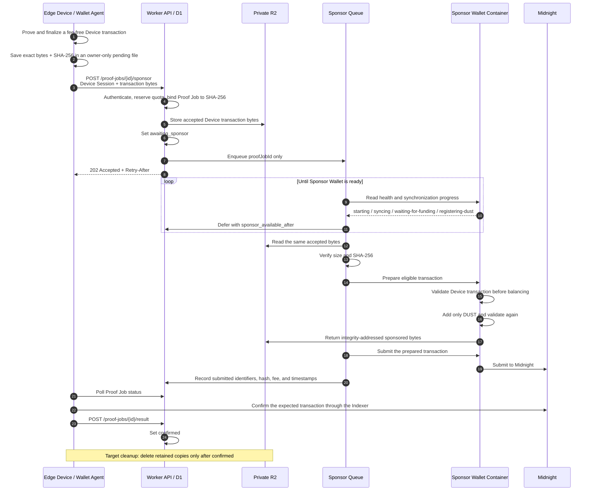

# Midnight Fee Sponsorship and Wallet-Sync Hold

[Japanese](../ja/implementation/fee_sponsorship.md)

This document describes the developer-facing sponsorship path for the operational
`submitDailyAttestation` transaction. The phrase **gas sponsorship** is used informally; on Midnight,
the network fee in this path is paid in **DUST**.

> Integration status — 2026-08-30 JST: the current worktree contains the Backend asynchronous
> acceptance, private R2 hold, Sponsor Queue, wallet-readiness gate, DUST-only policy, the Edge Device
> owner-only pending-transaction store, and Device `202`/poll/same-byte resume handling. A sponsored
> 1,440-reading Daily Attestation is confirmed on Preprod and the same-byte recovery path completed
> without a second proof, Sponsor attempt, or quota reservation. Automatic deletion of every retained
> copy after confirmation remains incomplete.

## Purpose

The customer value remains independent of the fee mechanism: prove that the submitted hourly sensor
minimums and maximums satisfy the registered threshold without revealing those values. Sponsorship
removes a separate operational burden from the Edge Device:

- the Edge Device authorizes exactly one proved `submitDailyAttestation` call;
- the Edge Device holds no NIGHT, DUST registration, or synchronized DUST state;
- the Backend Sponsor Wallet adds only the DUST required to submit that already authorized call; and
- the Sponsor cannot replace the Device authority or change the threshold claim.

The Wallet that may need time to synchronize is the **Backend Sponsor Wallet**, not the Device Wallet.

## Keys and credentials in this use case

| Credential | Location | Use in this flow | Cannot do |
| --- | --- | --- | --- |
| P-256 Device Identity | Edge Device | Authenticates the challenge exchange that issues a Device Session. | Authorize a Midnight contract call or spend Sponsor funds. |
| Opaque Device Session | Edge Device | Authorizes the `transaction:submit` API scope. | Replace the Device transaction identity or Sponsor seed. |
| Device transaction identity / Contract Authority | Edge Device | Authorizes and binds the proved `submitDailyAttestation` call without paying its fee. | Spend Sponsor DUST or administer the Fleet Registry. |
| Sponsor Wallet seed | Cloudflare secret | Synchronizes Sponsor state and spends DUST for an eligible bound transaction. | Produce the Device Contract Authority proof or change the bound contract call. |
| Operator Authority | Operator-controlled storage | Registers Devices, threshold policies, and assignments before this use case. | Participate in routine sponsored submission. |

The Sponsor seed is never sent to the Edge Device, D1, Queue, browser, or logs. Device private keys are
never sent to the Sponsor Container.

## End-to-end sequence



The key invariant is that the same serialized Device transaction is used after synchronization. The
system does not regenerate the proof, re-finalize a different transaction, or silently ask the Device
to authorize a replacement.

## Why the transaction is held

The Sponsor Container cannot safely submit immediately after every cold start. It must restore its
encrypted checkpoint, synchronize shielded, unshielded, and DUST state, and have at least one
spendable DUST coin. Until those conditions and the wallet supervisor health checks pass, the accepted
transaction remains pending.

There are two retention stages:

1. **Before durable Backend acceptance**, the Wallet Agent stores the exact serialized transaction at
   `~/.midnight/midnight-cloudflare-demo/device-wallet/pending-transactions/{proofJobId}.json`.
   The directory is mode `0700`, the file is mode `0600`, the write is atomic, and loading rechecks the
   SHA-256 digest.
2. **After `202 Accepted`**, the Worker has stored the exact bytes in private R2 and bound their digest
   to the Proof Job in D1. The Queue carries only `proofJobId`, so the transaction can remain held while
   the Sponsor Wallet synchronizes without keeping the acceptance HTTP request alive. The current CLI
   polls after acceptance, but a stopped process can later resume from the same local bytes and D1
   state.

The Edge copy is a recovery copy until the Proof Job is confirmed. If the result of the acceptance
request is ambiguous, the Device resends the same bytes. It must never create new bytes for the same
Proof Job.

## Sponsorship state machine

```mermaid
stateDiagram-v2
    [*] --> proof_ready: Proof and fee-free transaction ready
    proof_ready --> awaiting_sponsor: bytes stored; hash bound; 202 returned
    awaiting_sponsor --> awaiting_sponsor: Sponsor Wallet not ready; defer
    awaiting_sponsor --> sponsoring: Wallet ready; consumer claims job
    sponsoring --> sponsor_retryable: recoverable prepare/process failure
    sponsor_retryable --> sponsor_retryable: Wallet not ready; defer
    sponsor_retryable --> sponsoring: retry is due and Wallet is ready
    sponsoring --> sponsored: DUST-balanced bytes stored
    sponsored --> submitted: Sponsor submits to Midnight
    submitted --> confirmed: Device verifies Indexer result and reports it
    confirmed --> [*]
```



D1 is the workflow source of truth. `sponsor_available_after` controls deferred work, and the one-minute
scheduled dispatcher recovers an `awaiting_sponsor`, `sponsor_retryable`, or `sponsored` Job even if
the initial Queue send failed.

## Sponsor policy

The Sponsor validates the transaction both before and after DUST balancing. An eligible transaction
must satisfy all of these conditions:

- exactly one contract intent and exactly one contract action;
- exactly one `submitDailyAttestation` call to the configured `sensor-registry` address;
- no Device-supplied DUST action before balancing;
- no rewards transaction, Zswap transfer, unshielded value transfer, deployment, or maintenance
  action; and
- the original Device contract transaction identifier remains present after balancing.

This is why sponsorship is not delegation. The Sponsor pays the fee for a Device-authorized action; it
does not gain the authority to create that action.

## Public and internal API contract

### Device-facing routes

| Route | Authentication | Role |
| --- | --- | --- |
| `POST /api/v1/proof-jobs/{proofJobId}/sponsor` | Bearer Device Session with `transaction:submit` | Accept up to 4 MiB of `application/octet-stream`, reserve quota, bind one hash, store the bytes, and return `202`. |
| `GET /api/v1/proof-jobs/{proofJobId}` | Device Session with proof-read scope | Poll `awaiting_sponsor` through `submitted`/`confirmed` and obtain transaction evidence. |
| `POST /api/v1/proof-jobs/{proofJobId}/result` | Device Session with `transaction:submit` | Record a Device-verified Midnight confirmation. |
| `GET /api/v1/sponsor-quota` | Device Session | Read the current JST-day limit, usage, and reset time. |

### Container-internal routes

`/restore`, `/health`, `/prepare`, `/submit`, `/release`, and `/checkpoint` are Worker-to-Container
routes. They are not browser or Device APIs. `/release` is limited to reverting a private,
integrity-checked, unsent Sponsor reservation during an incompatible contract-schema migration.

The intended Device behavior after a successful `202` is to poll the Proof Job. Reposting is permitted
only with the identical serialized bytes and is treated as an idempotent recovery operation.

## Idempotency, retry, and quota

- A stable `measurementGroupId`, deterministic Proof Job ID, and Device transaction SHA-256 bind one
  measurement group to one transaction.
- Reusing the same Proof Job with different bytes returns `409`.
- Reusing it with identical bytes returns the existing state before quota, R2, Queue, or Wallet work.
- Queue messages are at-least-once references; D1 conditional transitions make duplicates harmless.
- A recoverable Sponsor failure sets or retains a deferred state and a future
  `sponsor_available_after` timestamp.
- The default Sponsor allowance is five accepted Proof Jobs per Device per JST day. Provisioning may
  set `--sponsor-daily-limit` from 1 to 100.
- Quota reservation is idempotent for the same Proof Job and remains reserved while synchronization is
  pending. The next day begins at 00:00 JST.

## Data placement and visibility

| Resource | Stored data | Visibility / lifetime |
| --- | --- | --- |
| Edge Device | Exact pending transaction bytes, SHA-256, `proofJobId`, `createdAt` | Owner-only local file; retain until confirmation and cleanup. |
| D1 | State, hashes, byte counts, quota reservation, transaction identifiers, fee, error code, and timestamps | Backend workflow metadata; no raw readings or private hourly extrema. |
| Private R2 | Accepted Device transaction, DUST-balanced transaction, encrypted Sponsor synchronization checkpoint | Backend-only temporary artifacts. Transaction cleanup is required after confirmation. |
| Sponsor Queue / DLQ | `kind` and `proofJobId` only | Backend-only scheduling reference; no transaction bytes or sensor values. |
| Sponsor Container | Synchronized wallet state in memory | Backend-only; checkpointed to R2 with AES-256-GCM. |
| Midnight | Registered threshold, Device/assignment binding, commitment, result, and confirmed transaction evidence | Public ledger; no raw sensor values or private hourly extrema. |

## Setup

The operational order is:

```bash
npm run sponsor:wallet
# Fund only the printed Sponsor address with tNIGHT.
npm run cloudflare:deploy
npm run cloudflare:config:sponsor
```

`cloudflare:config:sponsor` passes the seed to Wrangler over standard input and does not print it. The
encrypted synchronization checkpoint is stored at `sponsor-wallet/preprod/checkpoint.enc` in the
private `SPONSOR_STATE` R2 binding. See the [deployment and review runbook](../operations/demo_runbook.md)
for Device provisioning and full operational order.

## Current integration boundary

| Area | Current worktree status |
| --- | --- |
| Fee-free Device transaction finalization | Implemented. |
| Owner-only Edge pending file and integrity check | Implemented. |
| `202` acceptance, D1 hash binding, private R2 hold, Sponsor Queue, and scheduled redispatch | Implemented in Backend source. |
| Sponsor synchronization readiness gate and DUST-only validation | Implemented in Backend/Sponsor source. |
| Device interpretation of `awaiting_sponsor`, `sponsor_retryable`, and `sponsoring` | Implemented in the current Device client source; `202` acceptance is followed by Proof Job polling. |
| Resume by polling without regenerating proof/transaction | Implemented in source and covered by Device unit tests using the retained identical bytes. |
| Cleanup after `confirmed` | Partial; the sponsored R2 artifact is deleted, but the Edge pending file and accepted Device-transaction R2 artifact do not yet have complete automatic cleanup. |
| Sponsor-funded Preprod E2E evidence | Confirmed on 2026-08-30 JST: transaction `00038e813...71f91914`, block 2,317,466, fee 0.632920000000001 DUST; same-byte recovery retained one Sponsor attempt and one quota reservation. |

Primary source locations:

- `apps/device/wallet-agent/src/pending-transaction.ts`
- `apps/device/wallet-agent/src/midnight.ts`
- `apps/device/wallet-agent/src/proof-job.ts`
- `apps/proof-gateway/src/sponsor.ts`
- `apps/proof-gateway/src/sponsor-policy.ts`
- `apps/proof-gateway/src/sponsor-quota.ts`
- `apps/proof-gateway/migrations/0014_sponsored_submission.sql`
- `apps/proof-gateway/migrations/0015_sponsor_daily_quota.sql`
- `apps/proof-gateway/migrations/0016_async_sponsor_and_measurement_groups.sql`
- `apps/proof-gateway/migrations/0017_release_stale_sponsor_reservations.sql`
- `apps/sponsor-wallet/src/transaction.ts`
- `apps/sponsor-wallet/src/wallet.ts`
