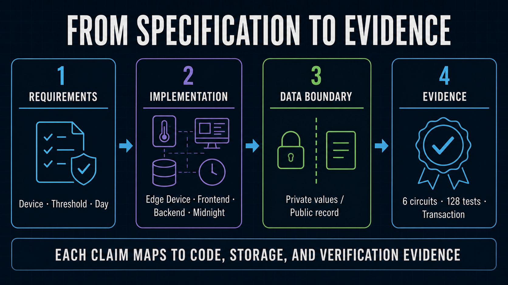

# Wave 1 Implementation Map

[Japanese](../ja/implementation/implement_spec.md)

The normative product specification is [`wave1_spec.md`](../architecture/wave1_spec.md). The exact circuit design is
[`hourly_extrema_attestation_proposal.md`](../architecture/hourly_extrema_attestation_proposal.md). This document maps
those requirements to repository code and public state.

The fee-payer boundary, DUST-only policy, asynchronous Sponsor Wallet synchronization, and exact-byte
transaction hold are specified separately in [`fee_sponsorship.md`](fee_sponsorship.md).
The private/public inputs, checks, and ledger effects of all six proof-generating circuits are defined
in [`zk_circuit_spec.md`](zk_circuit_spec.md).
Planned contract changes and later operational work are tracked in the
[future feature backlog](future_features.md) and are not current implementation claims.



## Operational proof

| Stage | Implementation | Visibility |
| --- | --- | --- |
| Device registration | The operator calls `registerDevice` before activation. | Device Commitment, derived Authority, status, and version are public ledger state. |
| Policy registration | The development operator calls `registerThresholdPolicy` with the Operator Authority. | Mode, bounds, scale, sensor/unit codes, and version are public ledger state. |
| Assignment | The operator calls `registerPolicyAssignment` before operation. | Policy key, Device Commitment, assignment key, validity interval, and version are public. |
| Prepare | The Wallet Agent assigns a stable `measurementGroupId`, rolls local records into 24 ordered hourly slots, and commits the complete `DailyExtremaInput` with one nonce. | Hourly extrema and nonce remain private. Group ID, commitment, period, presence, and counts are public. |
| Attest | `submitDailyAttestation` loads the assigned ledger policy, computes `allWithin` from all private observed slots, and proves equality with public `thresholdSatisfied`. | Verified WITHIN/OUTSIDE result, policy/assignment, STOPPED hours, and transaction evidence are public. |

There is one operational transaction per daily attestation. The device never supplies threshold bounds
to the Proof Job API or the attestation circuit call. Policy registration is a separate, infrequent
operator lifecycle operation.

## Public `sensor-registry` state

| Field | Meaning | Limit |
| --- | --- | --- |
| `operatorAuthority` | Hash derived from the private Operator Authority. | Separate from the deployment wallet; it authorizes Device lifecycle and policy/assignment administration. |
| `devices` | Map from public Device Commitment to `{authority, active, version}`. | Supports multiple Devices; public pseudonymous binding, not hardware attestation. |
| `policies` | Immutable map from 32-byte policy key to mode, encoded bounds, scale, type/unit codes, and version. | Policy values are deliberately public. |
| `policyAssignments` | Immutable map from assignment key to policy key, Device Commitment, validity interval, and version. | Cross-Device reuse is rejected in circuit; overlap governance is deferred. |
| `attestations` | Map from `persistentHash(domain, deviceCommitment, measurementGroupId)` to `DailyAttestationPublicState`. | Duplicate groups are rejected; the value contains the commitment but no hourly minimum, maximum, or nonce. |
| `hourPresence[24]` | Public observed/STOPPED bitmap. | `true` proves a private slot was supplied and checked; it does not prove a physical reading existed. |
| `observedHourCount` | Number of `true` presence slots recomputed in circuit. | Not scheduled operating time. |
| `sampleCount` | Sum of private hourly reported counts recomputed in circuit. | Device-reported, not proof of physical completeness. |
| `schemaVersion` / `circuitVersion` | Public compatibility identifiers bound to the private input. | Version `5` / `3` is the current operational pair. |
| `thresholdSatisfied` | Circuit-computed public outcome stored per attestation. | `true` proves all observed slots are within; `false` proves at least one observed slot is outside. It never exposes the extrema. |
| `verified` | The submitted result was proven and recorded; malformed or false claims revert. | Verification success is distinct from the threshold outcome. |
| `deviceCount`, `disabledDeviceCount`, `policyCount`, `assignmentCount`, `attestationCount` | Successful lifecycle operations and attestations. | Global contract counters, not device availability metrics. |

The exact successful claim is selected by the public outcome: WITHIN proves every observed slot is in
range; OUTSIDE proves at least one observed slot is out of range. Hours without data are STOPPED and
excluded. A fully STOPPED day is displayed as STOPPED from its zero observed count.

## Implemented paths

| Responsibility | Implementation |
| --- | --- |
| Device installation | `installer.sh` installs operational workspaces and creates a complete owner-only P-256 Device Identity only when absent. |
| Device enrollment | Operator CLI registers the Device and Device-bound Assignment on Midnight; `sync-midnight-device.mjs` mirrors it; only then does `register-device-key.mjs` activate P-256 in D1. |
| Device Session | `backend/cloudflare/proof-gateway-worker/src/device-auth.ts` implements five-minute one-time challenges and 24-hour opaque Sessions; D1 stores token hashes only. |
| Collection | `edge-device/sensor-collector/` retains raw samples locally, uploads hourly aggregate windows, and emits debounced anomaly transitions. The review GUI creates 1,440 one-minute private samples for a browser Device day and uploads no more than 24 hourly windows. |
| Daily preparation | `prepareDailyExtremaAttestation` in `shared/measurement-protocol` creates 24 JST slots, canonical STOPPED slots, public metadata, and the private commitment opening. |
| Fleet administration | `tools/midnight-operator/src/operator-authority.ts` keeps an owner-only Operator Authority and exposes Operator-only register/rotate/disable commands. |
| Compact circuit | `midnight/contracts/sensor-registry/src/sensor-registry.compact` defines the multi-Device Registry, Device-bound immutable assignments, and one-call daily attestation. |
| D1 schema | Migrations `0010`–`0022` add policy/job data, the fail-closed Fleet Registry mirror, Device operation-configuration revisions, the claimed threshold result, asynchronous sponsored-submission state, stable measurement-group idempotency, idempotent JST-day Sponsor reservations, contract history, Wallet-owned Projects, Project-scoped Policy operations, browser enrollment state, actual ZKP generation time, and durable provisioning progress. |
| Proof admission | `POST /api/v1/proof-jobs` validates authenticated device, registered assignment metadata, and the claimed Boolean result, but accepts no threshold bounds. Cron admits jobs during 02:00–06:00 JST. |
| Proof generation | The Wallet Agent streams private proving requests through authenticated Worker routes to the Container; bodies are not persisted. |
| Device transaction binding | The field transaction identity, or a compatible Browser Wallet with `payFees: false`, binds the proved `submitDailyAttestation` call without NIGHT or DUST. |
| Sponsored submission | `POST /api/v1/proof-jobs/:proofJobId/sponsor` atomically reserves quota, binds one TX hash, stores its private bytes in R2, records `awaiting_sponsor`, enqueues only the Job ID, and returns `202`. Identical retries are stopped before quota, R2, Queue, or Wallet work and return the existing state; conflicting reuse returns `409`. After Wallet synchronization, the Sponsor consumer revalidates the artifact, adds only DUST, submits, and persists status for Device polling. The Device client polls and can resume from its retained identical bytes. |
| Administrator GUI | The Device-Session-protected dashboard groups that Device's hourly operational aggregates by JST date, marks threshold outliers, shows the explicit current normal/anomaly state, and provides the matching daily Proof action and Proof/TX state. |
| Third-party GUI | The public endpoint/view lists redacted daily Proof Jobs newest-first and opens a date directly, then shows proven WITHIN/OUTSIDE/STOPPED result, bounds, exact claim, commitment, assignment, actual ZKP generation time, network, contract, and attestation TX without extrema. |

Legacy `proof_jobs`, reading-based Attestation tables/endpoints, and shared Merkle helper tests remain for
migration or development compatibility. The operational Worker and Wallet path writes
`daily_proof_jobs` and does not call the selected-leaf circuits.

Cloudflare Queues carry Proof admission and Sponsor-processing Job references. D1 is the workflow
source of truth and private R2 holds integrity-addressed TX bytes. Wallet mutations remain serialized;
the upload response acknowledges durable acceptance and the Device polls the Job for TX evidence.

The Edge Device writes the exact fee-free transaction to an owner-only pending file before calling the
Sponsor API. That file is the same-byte recovery source while the Sponsor Wallet synchronizes; a
different transaction for the same Proof Job is rejected. The current Device client accepts `202`,
polls the asynchronous states, and can resume without repeating proof generation. It does not yet
delete its pending file after `confirmed`. See the
[fee sponsorship integration boundary](fee_sponsorship.md#current-integration-boundary) before making
an end-to-end claim.

## Active API surface

```text
POST /auth/challenge
POST /auth/session

GET  /api/v1/provisioning/configuration           public registered Policy metadata
POST /api/v1/projects/challenge                   five-minute Wallet Project challenge
POST /api/v1/projects/session                     24-hour Wallet-owned Project Session
GET  /api/v1/projects                             Wallet-owned Project list
POST /api/v1/projects                             create Project; maximum 10 per Wallet
POST /api/v1/policies/challenge                   one-time Project Policy challenge
GET  /api/v1/policies                             Project-scoped registered/pending Policies
POST /api/v1/policies                             Wallet-signed immutable Policy registration
GET  /api/v1/policy-operations/:operationId       asynchronous Policy progress
POST /api/v1/provisioning/challenge               five-minute one-time challenge
POST /api/v1/provisioning/devices                 Wallet-signed Worker enrollment
GET  /api/v1/provisioning/operations/:operationId token-protected asynchronous progress
GET  /api/v1/device/configuration                 authenticated Device only
GET  /api/v1/device/dashboard                     authenticated Device only; same Device only
GET  /api/v1/device/history                       authenticated Device only
POST /api/v1/measurement-windows
POST /api/v1/anomaly-events
POST /api/v1/proof-jobs
GET  /api/v1/proof-jobs/:proofJobId
POST /api/v1/proof-jobs/:proofJobId/admit          authenticated review admission
POST /api/v1/proof-jobs/:proofJobId/sponsor
POST /api/v1/proof-jobs/:proofJobId/result
GET  /api/v1/sponsor-quota                        authenticated Device only

GET  /api/v1/projects/:projectId/dashboard       legacy loopback administrator only
GET  /api/v1/projects/:projectId/measurement-windows
GET  /api/v1/projects/:projectId/anomaly-events  legacy loopback administrator only
GET  /api/v1/public/proofs                        public redacted newest-first list
GET  /api/v1/public/proofs/:proofJobId            public redacted evidence

GET  /ready                                      admitted Device Session only
POST /check
POST /prove                                      admitted Device Session only
```

`POST /api/v1/proof-jobs` accepts commitment, device commitment, period, policy/assignment identifiers,
presence, counts, claimed `thresholdSatisfied`, and circuit version. It rejects unknown/mismatched
policy assignments and never accepts `minimum` or `maximum` as proof policy inputs. The Worker stores
the claimed result for idempotency and display but treats it as unverified until the Midnight TX is
confirmed.

## Storage

- Midnight ledger: authoritative public threshold policies, assignments, and verified daily claims.
- D1: projects/devices, Device Identity keys, challenge/session hashes, hourly windows, anomaly state,
  public policy/assignment mirrors, daily Proof Job state, JST-day Sponsor reservations, and
  attestation transaction metadata.
- Device filesystem: raw samples, hourly aggregation/outbox state, private extrema opening, Device
  Identity private key, plaintext Session, transaction identity, encrypted Compact private state,
  and the owner-only exact-byte pending transaction; no NIGHT, DUST registration, or synchronized
  DUST state.
- Review browser IndexedDB: generated raw samples and the private daily opening for a completed JST
  day within the previous 30 days; Auto Generate excludes today and future dates.
- Queue/DLQ: `proofJobId` references only; no private readings, extrema, nonce, or proving body.
- R2: accepted Device transaction bytes, DUST-balanced transaction bytes, optional public proof
  artifacts/reports, and encrypted Sponsor synchronization checkpoints; not raw time-series
  retention and never a plaintext Sponsor seed.
- Sponsor Wallet storage: separate deployment secret for the seed plus the encrypted checkpoint;
  never D1, Device firmware, or browser storage.
- KV: not required by the Wave 1 runtime.

The fixed 24/96/1,440 `daily-attestation` profiles remain explicit development-only cost experiments.
The operational circuit instead accepts extrema aggregated from all three frequencies with one shape.

## Deployment boundary

The new contract ledger is incompatible with the prior selected-leaf and WITHIN-only Fleet Registry
deployments. Operational adoption requires applying D1 migrations through `0022`, deploying the new contract, registering every Device
plus its public policy/Device-bound assignment, syncing the D1 mirror, updating the Worker public
contract address, and letting each Device pull its new configuration. This change
does not reuse or rotate the P-256 Device Identity, Device transaction identity, Sponsor Wallet, or
deployment wallet.

The deployed sensor-administrator UI uses `GET /api/v1/device/dashboard` with a 24-hour Device
Session, so it can read only its own Device records. The project-wide endpoints remain loopback-only
legacy development APIs. The third-party proof view remains public and redacted.

The exact GUI control-to-processing mapping is documented in
[`gui_action_reference.md`](gui_action_reference.md). The complete lifecycle, trust boundary, E2E gate, and cost treatment are defined in
[`device_registry.md`](../security/device_registry.md). On 2026-08-28 JST, self-funded Edge Device
WITHIN and OUTSIDE transactions against the newly deployed Fleet Registry were confirmed and
returned by the public verifier. That remains historical evidence. Sponsor-funded submission must
pass a fresh Preprod E2E gate before the guided reviewer recording is produced.
