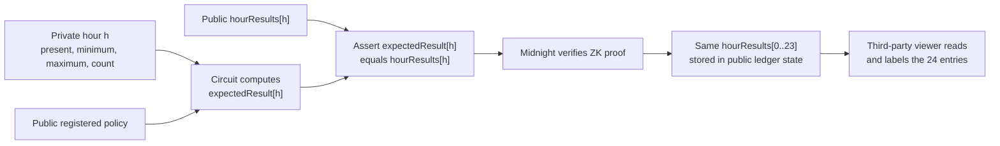

# Transaction-Hash Verification Specification

[Japanese](../ja/implementation/transaction_hash_verification.md)

Status: normative third-party interoperability target with current implementation notes, 2026-09-01 JST
Network profile: Midnight Preprod
Contract profile: `sensor-registry`, attestation schema `7`, circuit version `5`

## 1. Purpose

This document defines how an independent third party can build a viewer that accepts one Midnight
transaction hash and verifies the public result of a BACCHIRI daily attestation without using D1, a
BACCHIRI API, a Wallet, the Proof Server, or private sensor values.

The viewer answers these questions:

1. Is this a successful, confirmed Midnight transaction?
2. Did the transaction add exactly one daily attestation to an approved `sensor-registry` contract?
3. Which operational date, registered day boundary, Device Commitment, policy, assignment, and hourly results were recorded?
4. Are the public fields internally consistent with the contract schema?

Midnight verifies the contract-call proof when accepting the transaction. The viewer verifies the
successful chain record, the approved contract identity, and the meaning of the resulting public
ledger transition.

## 2. The key mental model

`hourResults` is a 24-element public circuit input and a field stored in public Attestation state. For
each index `h`, the circuit computes `expectedResult[h]` from the private hourly slot and the registered
public policy, then proves that it equals `hourResults[h]`. After a successful transaction, the Contract
stores the same vector in public ledger state.

The viewer reads that stored vector, maps index `h` relative to the Assignment's registered local start
hour, and maps each enum value to a display label. `hourPresence[24]` is a Boolean vector indicating
whether each operational hour was observed.
`hourResults[24]` is not Boolean; it is a three-value enum: `noData`, `withinThreshold`, or
`outsideThreshold`.



For every operational-hour slot `h` from `0` through `23`:

```text
if present[h] == false:
    expectedResult[h] = NO_DATA
else if the private minimum[h] and maximum[h] satisfy the registered public policy:
    expectedResult[h] = WITHIN
else:
    expectedResult[h] = OUTSIDE

assert expectedResult[h] == public hourResults[h]
```

The proof therefore establishes the relation between hidden extrema and the public vector. The viewer
does not know the hidden minimum or maximum and cannot calculate the result independently from those
values. It relies on Midnight's successful proof verification for that relation.

Use `WITHIN`, `OUTSIDE`, and `NO_DATA`; do not call every successful proof result `valid`. A successful
proof can truthfully publish `OUTSIDE` or `NO_DATA`.

## 3. Is understanding the block fields sufficient?

No. Field meanings are necessary, but a conforming verifier also needs the following trust anchors.

| Requirement | Why it is needed |
| --- | --- |
| Network ID and trusted chain/indexer endpoint | A hash can exist on another network, and an untrusted data source can invent a block response. |
| Successful final transaction status | Inclusion alone is insufficient; the verifier must reject failed or partial-success execution. |
| Approved contract identity | An arbitrary contract can imitate the same field names without enforcing the same ZK constraints. |
| Exact ledger decoder and schema/circuit semantics | Raw state bytes have no stable meaning without the compiled contract schema. |
| Transaction-to-state-transition binding | Reading only the latest contract state does not prove that the pasted transaction created the record. |

The practical profile in this repository uses a known approved contract address. A more portable
profile may instead compare every on-chain circuit Verifier Key with fingerprints published from the
reviewed build. Until that Verifier Key profile is specified and implemented, an independent viewer
**MUST pin or explicitly allowlist the approved contract deployment**.

The user supplies only a transaction hash because the viewer packages the other trust anchors. The
transaction hash is a locator, not the complete trust root.

## 4. Chain-anchored and standalone verification

| Mode | Required inputs | Current scope |
| --- | --- | --- |
| Chain-anchored viewer | TX hash, network, approved deployment, ledger decoder, public Indexer/Node | Implemented profile. Relies on Midnight having verified the proof before accepting the TX. |
| Standalone proof verifier | Serialized proof, exact public inputs/transcript, exact Verifier Key, contract state/context, and Midnight protocol verification rules | Not implemented by the browser viewer. TX hash and decoded block fields alone are insufficient. |

This specification defines the chain-anchored viewer.

## 5. Required public lookups

### 5.1 Transaction lookup

Given a normalized 64-character hexadecimal transaction hash, obtain:

| Field | Meaning |
| --- | --- |
| `hash` | The transaction hash supplied by the user. |
| `identifiers[]` | Transaction identifiers; one is used to wait for the finalized transaction result. |
| `block.height` | The confirmed block containing the transaction. |
| `contractActions[].address` | Contracts affected by the transaction. A sponsored TX can contain unrelated actions. |

The current implementation uses this GraphQL shape:

```graphql
query PublicProofTransaction($offset: TransactionOffset!) {
  transactions(offset: $offset) {
    hash
    block { height }
    ... on RegularTransaction {
      identifiers
      contractActions { address }
    }
  }
}
```

The verifier **MUST** confirm all of the following:

- the returned hash equals the normalized input hash;
- the finalized transaction status is `SucceedEntirely`;
- the finalized transaction hash and block height match the lookup result;
- at least one usable transaction identifier and one approved Contract action exist.

### 5.2 Contract state lookup

For the approved Contract action, obtain and decode the contract state at:

- the confirmed block height; and
- the preceding block height.

The current profile finds keys added to `attestations` between those two states and accepts exactly one
schema-7 attestation. If zero or multiple attestations were added, the result is indeterminate and the
viewer **MUST NOT** display it as verified.

The 24-hour values are the `hourPresence[0..23]` and `hourResults[0..23]` fields of the
`DailyAttestationPublicState` identified by this procedure. The transaction hash is the lookup key for
that public state transition.

This preceding-block method is deliberately fail-closed, but it can reject an otherwise valid
transaction when multiple attestation transactions for the same contract are included in one block.
A future transaction-action state-delta API can remove that ambiguity. An implementation **MUST NOT**
silently select one of multiple additions.

## 6. Public ledger data and meaning

### 6.1 Daily attestation

| Field | Meaning and validation |
| --- | --- |
| `attestationCommitment` | Binding commitment to the private 24-slot input and nonce. It cannot be reopened from public data. |
| `measurementGroupId` | Public identifier for the submitted daily measurement group. |
| `deviceCommitment` | Pseudonymous proof subject. It must equal the Device in the applied Assignment. |
| `policyId` | Key of the immutable public threshold used by the proof. |
| `assignmentId` | Key of the immutable Device-to-policy assignment. |
| `measurementDay` | UTC day number containing `periodStart`. `periodStart` must equal `measurementDay × 86,400 + utcDayStartMinute × 60`. |
| `periodStart` / `periodEnd` | Unix seconds. The interval must start at the Assignment boundary and be exactly 86,400 seconds. |
| `hourPresence[24]` | `Boolean[24]`. Whether each operational-hour slot contains an observed private slot. Index `0` starts at `localDayStartHour`. |
| `hourResults[24]` | `HourThresholdResult[24]`. Code `0` is `noData`, `1` is `withinThreshold`, and `2` is `outsideThreshold`. |
| `observedHourCount` | Number of `true` entries in `hourPresence`. |
| `sampleCount` | Total private per-hour counts, proven equal inside the circuit. Per-hour counts are not public. |
| `schemaVersion` | Must equal `7` for this profile. |
| `circuitVersion` | Must equal `5` for this profile. |
| `thresholdSatisfied` | Daily summary. True when no observed hour is `OUTSIDE`; missing hours are ignored. |
| `verified` | Set to `true` by the successful approved circuit. It is not sufficient without contract-identity and TX-success checks. |

### 6.2 Threshold policy

| Field | Meaning |
| --- | --- |
| `mode` | Closed range, upper bound only, or lower bound only. |
| `minimumCentiOffset` / `maximumCentiOffset` | Encoded bounds used by the circuit. |
| `valueScale` | Current temperature profile uses `100`. |
| `sensorTypeCode` | Current supported public code `1` means temperature. |
| `unitCode` | Current supported public code `1` means degrees Celsius. |
| `version` | Immutable policy version; must be positive. |

For the current temperature profile:

```text
displayed Celsius = (encoded value - 10,000) / valueScale
```

The viewer **SHOULD** label an unknown sensor or unit code rather than interpreting it as temperature.

### 6.3 Policy assignment

| Field | Meaning and validation |
| --- | --- |
| `policyId` | Must equal the attestation's Policy key. |
| `deviceCommitment` | Must equal the attestation's proof subject. |
| `timeZoneOffsetMinutesBias` | Fixed UTC offset encoded as `offset + 840`; decoded range is -840 through +840 minutes. |
| `localDayStartHour` | Local operational-day start from 0 through 23; minutes and seconds are zero. |
| `utcDayStartMinute` | Derived UTC minute-of-day. It must equal `modulo(localDayStartHour × 60 - offset, 1440)`. |
| `validFrom` | Inclusive Unix-second start. |
| `validUntil` | Maximum permitted `periodEnd`; `0` means no expiry. |
| `version` | Immutable assignment version; must be positive. |

The complete attestation interval must be contained in the Assignment interval.

## 7. Normative verification algorithm

A conforming chain-anchored verifier **MUST** perform these steps in order:

1. Normalize an optional `0x` prefix away and require exactly 64 hexadecimal characters.
2. Query the configured Midnight network for the transaction.
3. Require successful final status and exact TX-hash/block-height agreement.
4. Extract Contract action addresses and reject every address that is not an approved deployment.
5. Decode the approved contract's current and previous-block ledger state with the exact schema decoder.
6. Require exactly one new daily attestation attributable by the fail-closed block-delta rule.
7. Require `schemaVersion == 7`, `circuitVersion == 5`, and `verified == true`.
8. Load the referenced Policy and Assignment from the same decoded state.
9. Require Assignment Policy, Device, version, validity, and operational-day boundary to match the Attestation.
10. Require `periodStart == measurementDay × 86,400 + utcDayStartMinute × 60` and `periodEnd == periodStart + 86,400`.
11. Require both hourly vectors to have 24 entries.
12. For each hour, require `NO_DATA` exactly when `hourPresence[h] == false`.
13. Require `observedHourCount` to equal the number of present hours.
14. Require `thresholdSatisfied` to be false exactly when at least one hourly result is `OUTSIDE`.
15. Display the result only after every check succeeds. Otherwise display failed or indeterminate, never verified.

The viewer cannot recheck the private extrema. Step 7 is meaningful because steps 3 and 4 establish
that Midnight successfully executed the reviewed circuit whose proof constraints are defined below.

## 8. What the ZK circuit guarantees

For each private hour `h`, the approved `submitDailyAttestation` circuit proves:

```text
present[h] == public hourPresence[h]

if present[h]:
    private count[h] > 0
    private minimum[h] <= private maximum[h]
else:
    private count[h] == 0
    private minimum[h] == 0
    private maximum[h] == 0

closedRangeWithin[h] =
    private minimum[h] >= public policy.minimum
    AND private maximum[h] <= public policy.maximum

expected[h] =
    NO_DATA   if not present[h]
    WITHIN    if present[h] and the selected policy-mode comparison succeeds
    OUTSIDE   otherwise

expected[h] == public hourResults[h]
```

The same proof also binds the private daily object to its public commitment, Device, measurement
group, Policy, Assignment, registered UTC interval, versions, total count, and Device Authority. A false hourly
vector cannot produce a proof accepted by the approved Contract Verifier Key.

## 9. Minimum viewer output

| Display item | Source |
| --- | --- |
| Network, TX hash, TX ID, block height, Contract | Confirmed transaction lookup. |
| Operational date and boundary | Date derived from the validated UTC period plus Assignment offset/start fields. |
| 24 hourly results | `hourResults[0..23]`, labeled from the registered local start hour. |
| Applied threshold | Referenced immutable Policy. |
| Policy validity | Referenced immutable Assignment. |
| Proof subject | `deviceCommitment` shared by Attestation and Assignment. |
| Privacy statement | Hourly extrema, per-hour counts, nonce, Device secret, and raw readings are not public. |

The viewer **MUST NOT** describe `OUTSIDE` as a proof failure. It is a successfully proved public
result. `NO_DATA` proves the canonical empty slot, not that a physical sensor was operating correctly.

## 10. Rejection and non-claim rules

Reject or show indeterminate when the transaction is missing, failed, partially successful, on the
wrong network, targets an unapproved contract, cannot be decoded, has a wrong version, adds zero or
multiple candidate attestations, references missing Policy/Assignment state, or fails any consistency
rule above.

Even a fully verified record does not prove:

- that the private values originated from a physical sensor;
- that sampling was continuous or complete;
- that Device-side hourly aggregation was correct;
- the hidden minimum, maximum, raw readings, or reason for an out-of-range value;
- that a public Indexer is independently trustworthy. Higher-assurance deployments should compare an
  independently operated Indexer/Node or verify the relevant block data through their chosen chain
  trust mechanism.

## 11. Historical Preprod evidence

This real schema-6 transaction records the preceding UTC-midnight profile. It remains historical
evidence, but is intentionally incompatible with the schema-7 decoder and is not a conformance vector
for the configurable-boundary implementation:

| Field | Expected value |
| --- | --- |
| Network | Midnight Preprod |
| TX hash | `92f841d33a458edb1af94a20ca962b7092367caf96f2382b95a9227328aa841e` |
| TX ID | `0043d0ea95ade7ee9505866720a72053154415f8328ea0e6552d6072f09565f0a1` |
| Block height | `2358767` |
| Approved Contract | `c62dbb18252fd8bc4a6aea7c4ab549d20cc7cb03e2996ca68e43d0f914221a0f` |
| Measurement date | `2026-08-25` UTC |
| Hour 00:00–01:00 | `OUTSIDE` |
| Hours 01:00–24:00 | `WITHIN` |
| Policy | Closed range, `10–35 °C`, scale `100`, version `1` |
| Device Commitment | `41ec4294cdb082936f86c6529e911f21289491867ff32a5eed86923140acde9b` |

The values are test data prepared on the Edge Device. The ZK proof, sponsorship, Preprod
transaction, block confirmation, and public verification are real.

## 12. Reference implementation

| Responsibility | Source |
| --- | --- |
| Transaction lookup and finalized-TX checks | `frontend/verification-portal/src/public-verifier.ts` |
| Ledger transition decoding and consistency checks | `frontend/verification-portal/src/public-verifier.ts` |
| Contract constraints and public ledger fields | `midnight/contracts/sensor-registry/src/sensor-registry.compact` |
| TX-hash route and viewer rendering | `frontend/verification-portal/public/app.js` |
| Browser capture with D1-API rejection | `tools/submission-media/capture-dashboard-demo.mjs` |

The current hosted viewer derives candidate Contract actions from the transaction and accepts the one
that decodes as the schema-7 contract transition. Independent production verifiers must additionally
enforce the approved-deployment rule in section 3. Deployment allowlisting or Verifier Key
fingerprinting remains a required hardening item before treating arbitrary pasted hashes as belonging
to BACCHIRI solely from their ledger shape.
