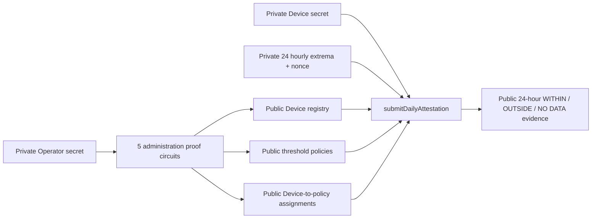
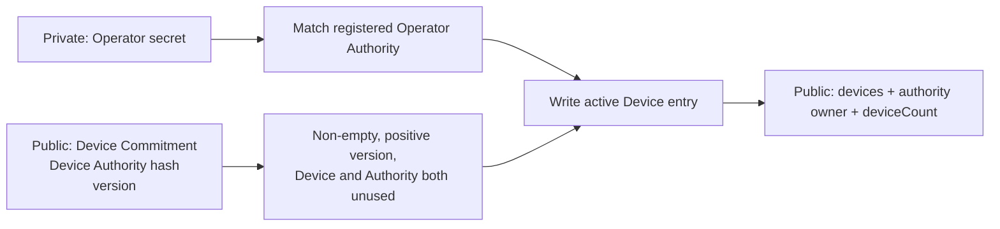
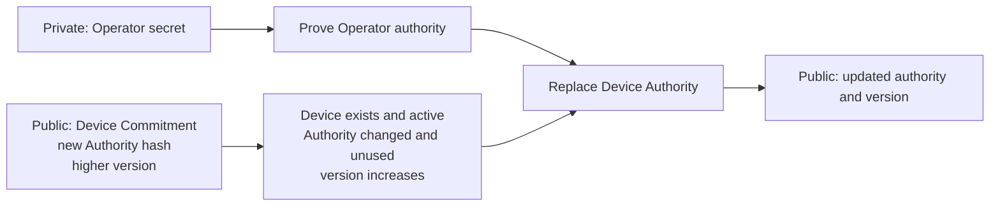
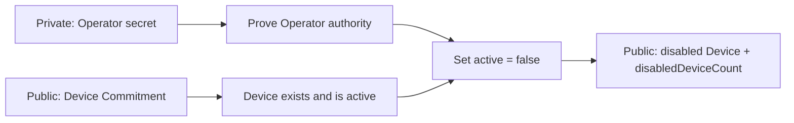
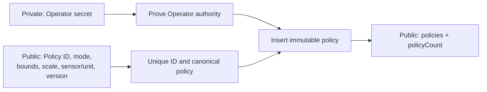
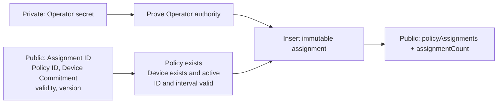
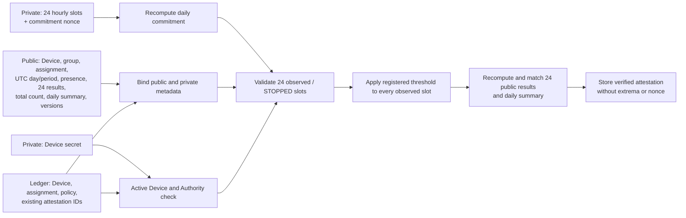
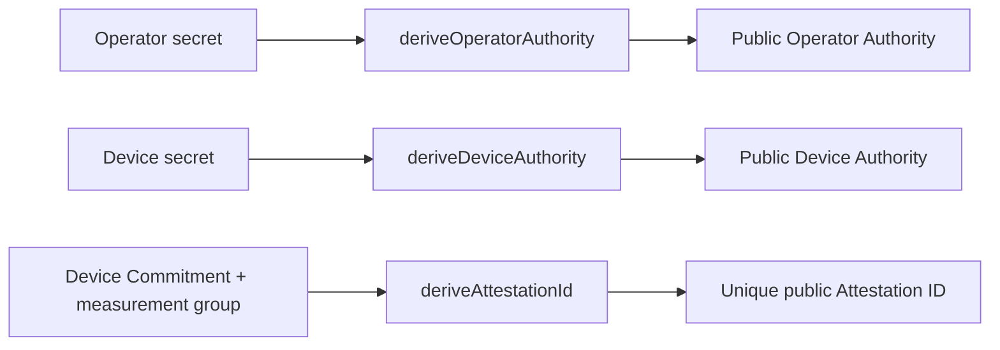

# Operational ZK Circuit Specification

[Japanese](../ja/implementation/zk_circuit_spec.md)

Status: implementation-aligned specification, 2026-09-01 JST
Contract: `midnight/contracts/sensor-registry/src/sensor-registry.compact`

## 1. Purpose and scope

BACCHIRI!━━Verifiable Measurement Layer has one customer-facing proof objective: **prove whether the
submitted hourly sensor extrema satisfy a registered threshold without disclosing the extrema**.

The operational `sensor-registry` contract contains six exported proof-generating circuits:

1. `registerDevice`
2. `rotateDeviceAuthority`
3. `disableDevice`
4. `registerThresholdPolicy`
5. `registerPolicyAssignment`
6. `submitDailyAttestation`

The first five control who and what may participate. The sixth produces the daily private-threshold
claim. The compiler output confirms `proof: true` and one prover/verifier key pair for each of these
six circuits.

For the separate procedure that starts with a transaction hash and explains how a third-party viewer
interprets the verified 24-hour public result, see the
[transaction-hash verification specification](transaction_hash_verification.md).

Three exported pure helpers—`deriveDeviceAuthority`, `deriveOperatorAuthority`, and
`deriveAttestationId`—perform deterministic hashing but do not generate proofs or ledger
transactions. The generated `daily-attestation-24/96/1440` profiles are development-only cost
experiments and are separated in [section 13](#13-development-only-circuit-profiles).

## 2. How the six circuits fit together



The administration circuits hide the Operator Authority secret while writing deliberate public
configuration. The daily circuit hides the Device Authority secret, hourly minimums, hourly maximums,
per-hour counts, and nonce while publishing the exact policy binding, 24 hourly results, and a daily summary.

## 3. Shared data boundary

| Category | Values | Visibility |
| --- | --- | --- |
| Operator witness | `privateOperatorSecret()` | Private; used by five administration circuits. |
| Device witness | `privateDeviceSecret()` | Private; used by `submitDailyAttestation`. |
| Daily witness | `privateDailyExtrema(commitment)`, `privateDailyNonce(commitment)` | Private; 24 extrema slots and one commitment nonce. |
| Public call data | Device/Policy/Assignment IDs, UTC measurement day/period, presence bitmap, 24 hourly results, total count, daily summary, versions | Public transaction input. |
| Public ledger data | Device status/authority hash, policies, assignments, attestations, counters | Public Midnight state. |
| Never supplied to the circuit | Raw sensor time series, calibration records, firmware evidence | Outside the current proof claim. |

The contract compares unsigned encoded values. For the current temperature preparation path:

```text
encodedTemperature = round(temperatureCelsius × 100) + 10,000
```

`valueScale`, `sensorTypeCode`, and `unitCode` are public policy metadata. The circuit does not convert
physical units or prove that a real sensor produced the encoded value.

## 4. Circuit catalog

| Circuit | Private proof | Main public effect |
| --- | --- | --- |
| `registerDevice` | Knowledge of Operator secret | Register one active Device Commitment and Authority hash. |
| `rotateDeviceAuthority` | Knowledge of Operator secret | Replace an active Device's Authority hash with a higher version. |
| `disableDevice` | Knowledge of Operator secret | Permanently mark one registered Device inactive in the current contract. |
| `registerThresholdPolicy` | Knowledge of Operator secret | Store one immutable public threshold policy. |
| `registerPolicyAssignment` | Knowledge of Operator secret | Bind one immutable policy and validity interval to one active Device. |
| `submitDailyAttestation` | Knowledge of Device secret and the committed private daily input/nonce | Store 24 verified hourly results and a daily summary without storing extrema. |

## 5. `registerDevice`

### What it achieves

It proves that the caller knows the Operator Authority secret and registers a new public Device entry.
The Operator does **not** learn or prove the Device's private Contract Authority secret; it receives
only the derived public Device Authority.



| Part | Specification |
| --- | --- |
| Private input | `privateOperatorSecret()` |
| Public input | `deviceCommitment`, `deviceAuthority`, `version` |
| Required state | Constructor-set `operatorAuthority` |
| Rejection rules | Empty IDs, version `0`, repeated Device Commitment, or reused Device Authority |
| Ledger update | Insert `{authority, active: true, version}`, reserve Authority ownership, increment `deviceCount` |

## 6. `rotateDeviceAuthority`

### What it achieves

It lets only the Operator replace the Contract Authority of an active Device. Rotation invalidates the
old Device secret for future daily proofs.



| Part | Specification |
| --- | --- |
| Private input | `privateOperatorSecret()` |
| Public input | `deviceCommitment`, `newDeviceAuthority`, `newVersion` |
| Rejection rules | Unknown/disabled Device, empty or unchanged Authority, Authority reuse, non-increasing version |
| Ledger update | Replace the Device entry and reserve the new Authority ownership |

The old ownership reservation is not deleted. Old and new Authority hashes therefore cannot be
reassigned to another Device.

## 7. `disableDevice`

### What it achieves

It lets only the Operator stop a registered Device from creating further daily attestations.



| Part | Specification |
| --- | --- |
| Private input | `privateOperatorSecret()` |
| Public input | `deviceCommitment` |
| Rejection rules | Unknown Device or already-disabled Device |
| Ledger update | Preserve Authority/version, set `active: false`, increment `disabledDeviceCount` |

There is no re-enable circuit in the current contract. Disabling is therefore irreversible within
this deployed ledger version.

## 8. `registerThresholdPolicy`

### What it achieves

It lets only the Operator register the exact public threshold that later daily proofs must use. The
threshold is public by design so a third party can identify what range was enforced.



| Mode | Canonical rule |
| --- | --- |
| `closedRange` | `minimum <= maximum` |
| `upperBound` | `minimum == 0` |
| `lowerBound` | `maximum == 4,294,967,295` |

The circuit also requires a non-empty Policy ID, positive `valueScale`, positive version, and an unused
Policy ID. There is no update operation; a changed threshold uses a new immutable Policy ID.

## 9. `registerPolicyAssignment`

### What it achieves

It binds one registered policy and validity interval to exactly one active Device before measurement
attestation.



| Part | Specification |
| --- | --- |
| Private input | `privateOperatorSecret()` |
| Public input | Assignment ID, Policy ID, Device Commitment, `validFrom`, `validUntil`, version |
| Rejection rules | Empty/reused Assignment ID, unknown Policy/Device, disabled Device, invalid interval, version `0` |
| Ledger update | Store immutable Policy/Device/validity/version binding and increment `assignmentCount` |

`validUntil == 0` means no configured expiry. The circuit does not prevent overlapping assignments;
that governance rule is outside the current contract.

## 10. `submitDailyAttestation`

### What it achieves

This is the customer-value circuit. It proves that the committed private hourly extrema produce the
public result for each UTC hour under the policy registered for that Device, without revealing the
extrema. `thresholdSatisfied` remains as a daily summary.



### 10.1 Private witness

The witness selected by `attestationCommitment` contains:

- commitment domain `vsp:daily-extrema:v1`;
- Device Commitment and measurement-group ID;
- Policy and Assignment IDs;
- period start/end;
- exactly 24 `{present, minimumCentiOffset, maximumCentiOffset, sampleCount}` slots;
- schema/circuit versions; and
- one 32-byte commitment nonce.

### 10.2 Public input

The transaction publishes the attestation commitment, Device Commitment, measurement-group ID,
Assignment ID, UTC measurement day and period, 24-bit presence information, 24 hourly results, total
sample count, daily Boolean summary, and versions.
The hourly minimums, hourly maximums, per-hour counts, and nonce are not public arguments or ledger
fields.

### 10.3 Checks performed in one proof

1. The Device is registered, active, and authorized by the private Device secret.
2. `attestationId = H("vsp:daily-attestation-id:v1", deviceCommitment, measurementGroupId)` is unused.
3. The Assignment exists, belongs to the same Device, and covers the complete period.
4. The period is exactly the UTC day identified by `measurementDay`: 00:00:00 through the next 00:00:00.
5. `Commit(privateDailyInput, nonce)` equals the public attestation commitment.
6. Domain, Device, group, Policy, Assignment, period, presence, and versions match across private input,
   public input, and ledger state.
7. Schema version is `6` and circuit version is `4`.
8. Every observed slot has `sampleCount > 0` and `minimum <= maximum`.
9. Every STOPPED slot is the canonical `{present: false, minimum: 0, maximum: 0, sampleCount: 0}`.
10. The sum of all private per-hour counts equals the public total sample count.
11. Every recomputed hourly result equals the corresponding public `hourResults` value.
12. The AND of all observed hourly results equals the public `thresholdSatisfied` summary.

The circuit derives the period boundary from `measurementDay`, so non-UTC or partial-day periods fail.

### 10.4 Threshold rule

For every observed hour `h`:

```text
closedRange: minimum[h] >= policy.minimum AND maximum[h] <= policy.maximum
upperBound:  maximum[h] <= policy.maximum
lowerBound:  minimum[h] >= policy.minimum

hourResults[h] = WITHIN or OUTSIDE for an observed hour
hourResults[h] = NO DATA for an absent hour
thresholdSatisfied = AND(result of every observed hour) // daily summary
```

STOPPED slots are excluded from the threshold comparison. A fully STOPPED day therefore computes
`thresholdSatisfied = true`, but the application displays it as STOPPED because the circuit also
publishes a recomputed `observedHourCount = 0`.

All hourly public outcomes are valid proof results:

- WITHIN: that hour's private minimum/maximum satisfies the assigned threshold;
- OUTSIDE: that hour's private minimum or maximum is outside it;
- NO DATA: that hour is a canonical absent slot.

OUTSIDE reveals the hour, but not which bound was exceeded or the private value.

### 10.5 Ledger update

On success, the circuit stores one `DailyAttestationPublicState` keyed by the derived Attestation ID.
It includes commitment, group, Device, Policy, Assignment, UTC measurement day/period, presence,
24 hourly results, observed/total counts, versions, the daily Boolean summary, and `verified: true`.
It stores no hourly extrema or nonce.

## 11. Pure and internal helper circuits



| Helper | Role | Proof key |
| --- | --- | --- |
| `deriveOperatorAuthority` | Domain-separated hash of the Operator secret. | None; pure circuit. |
| `deriveDeviceAuthority` | Domain-separated hash of the Device secret. | None; pure circuit. |
| `deriveAttestationId` | Domain-separated per-Device/per-group ledger key. | None; pure circuit. |
| `assertOperatorAuthorized` | Internal equality check used by five administration circuits. | Included inside the calling proof. |
| `assertDeviceAuthorized` | Internal registration/active/secret check used by daily submission. | Included inside the calling proof. |

## 12. Claim boundary

The daily proof establishes only the following:

- one active registered Device authorized the transaction;
- one registered Device-bound policy assignment was used;
- the committed 24-slot private input is internally well-formed;
- the public total/presence/result match that private input; and
- the public result follows from the assigned public threshold.

It does **not** prove sensor calibration, physical sample existence, continuous sampling, absence of
missing readings, trustworthy clocks, correct Device-side min/max aggregation, firmware integrity, or
that unobserved fluctuations never occurred. Those require separate provenance and hardware controls.

## 13. Development-only circuit profiles

`midnight/experiments/daily-attestation-cost/src/generated/` contains fixed 24, 96, and 1,440-reading profiles. They
were created to compare compile/proof size and cost while preserving a fixed daily structure. They
include their own `registerDevice`, `registerPolicy`, `submitDailyAttestation`, and
`appendOutlierReason` circuits.

These profiles are **not** the operational `sensor-registry` path, are not included in the Device
firmware, and must not be used to describe current production verification. The operational circuit
always receives 24 hourly extrema slots regardless of whether they were aggregated from 24, 96,
1,440, or more raw readings.

## 14. Source, artifacts, and validation

Current compatibility:

```text
Compact compiler/toolchain  0.31.1
Compact language            0.23
Daily schema                6
Daily circuit               4
Operational proof circuits  6
```

Source and generated evidence:

- source: `midnight/contracts/sensor-registry/src/sensor-registry.compact`;
- witnesses: `midnight/contracts/sensor-registry/src/witnesses.ts`;
- compiler inventory: `midnight/contracts/sensor-registry/src/managed/sensor-registry/compiler/contract-info.json`;
- six ZKIR/BZKIR pairs: `midnight/contracts/sensor-registry/src/managed/sensor-registry/zkir/`;
- six prover/verifier key pairs: `midnight/contracts/sensor-registry/src/managed/sensor-registry/keys/`; and
- simulator tests: `midnight/contracts/sensor-registry/src/test/sensor-registry.test.ts`.

Do not hand-edit generated artifacts. Rebuild and validate with:

```bash
npm run contract:compile
npm test -w @midnight-demo/sensor-registry-contract
npm run typecheck -w @midnight-demo/sensor-registry-contract
```

Tests cover WITHIN, truthful OUTSIDE, partial/fully STOPPED days, false result rejection, commitment and
presence tampering, duplicate measurement groups, wrong Device/Operator secrets, cross-Device
Assignment reuse, disabling, Authority rotation, and Authority reuse rejection.

Current source/simulator validation and any previously deployed Preprod contract are separate evidence.
A local compile or simulator pass does not establish that circuit version `4` is deployed or confirmed
on Preprod.

Operator Authority rotation and Device-owner-authorized threshold replacement are planned contract
changes, not part of the six circuits documented above. Their scope and completion gates are tracked in the
[future feature backlog](future_features.md).
