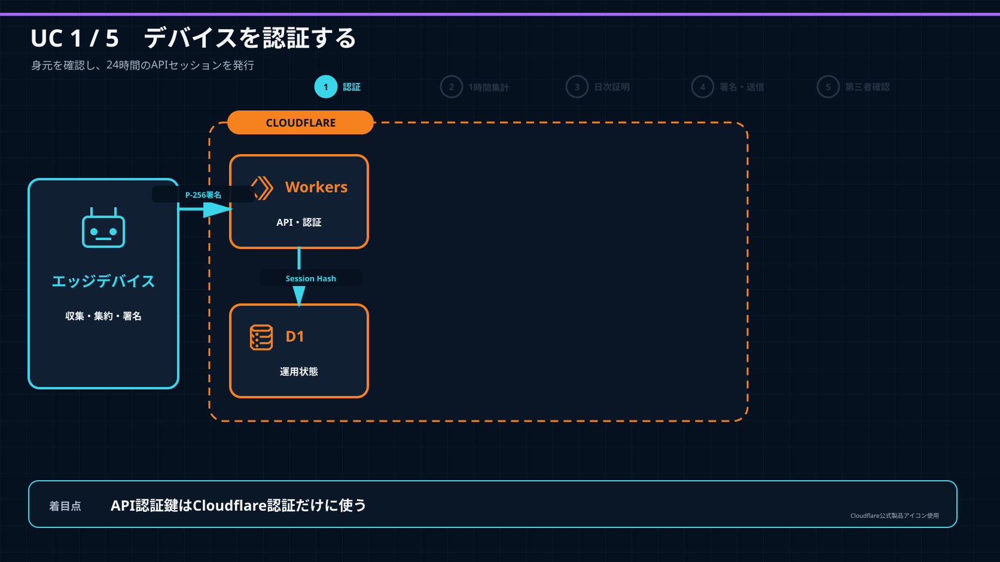
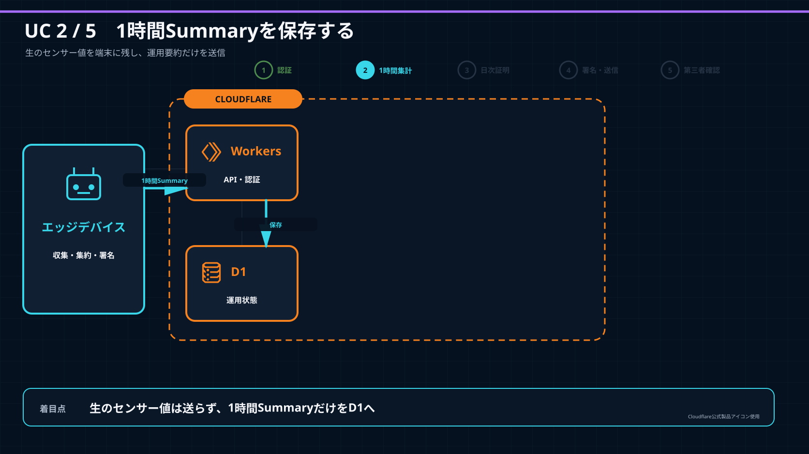
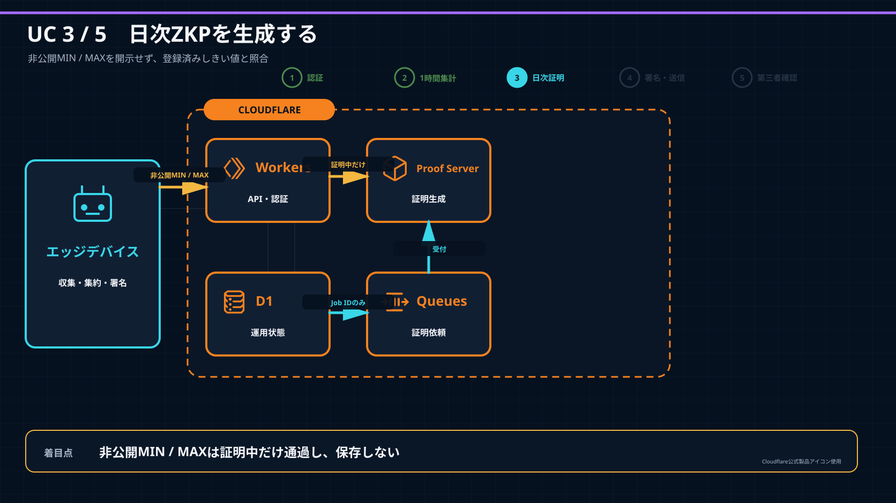
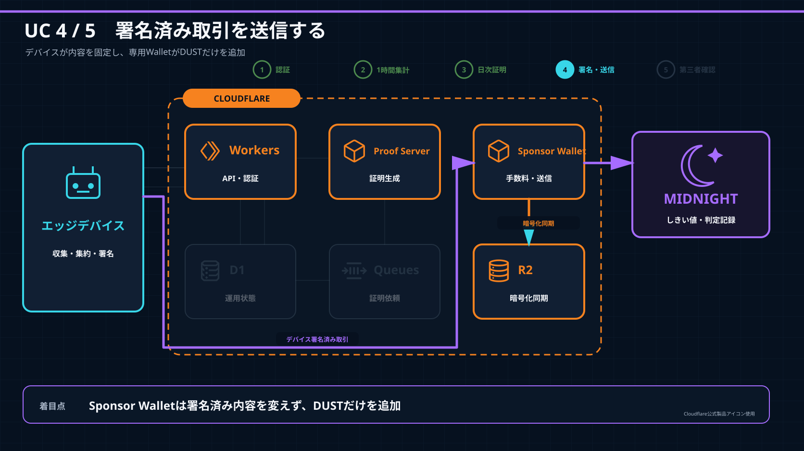
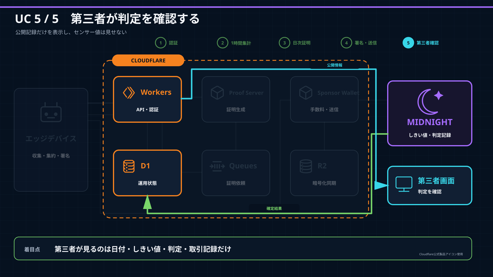

# Cloudflareリソース構成をユースケース順に見る

[システム構成の詳細](system_architecture.md)

この資料は審査・プレゼン用です。1枚に全経路を詰め込まず、同じ配置のままリソースを段階的に追加します。
各ページでは、そのユースケースで見るべきリソースと線だけを明るくし、完了済みの要素は薄く表示します。

編集用の[補足PPTX](../submission/deck/cloudflare-use-cases-ja.pptx)と、閲覧用の[補足PDF](../submission/deck/cloudflare-use-cases-ja.pdf)も同じ5ページ構成です。

## UC 1：デバイスを認証する

着目点：API認証鍵はCloudflare認証だけに使い、Midnight取引の署名には使いません。

## UC 2：1時間Summaryを保存する

着目点：Cloudflareへ送るのは運用要約です。生のセンサー値はエッジデバイスに残します。

## UC 3：日次ZKPを生成する

着目点：非公開MIN／MAXは証明生成中だけ通過し、D1、Queues、R2へ保存しません。

## UC 4：署名済み取引を送信する

着目点：デバイスが取引内容を固定し、Sponsor Walletは署名済み内容を変えずにDUSTだけを追加します。

## UC 5：第三者が判定を確認する

着目点：第三者がTX hashを貼り付けると、UTC計測日、24個の時間帯別のしきい値以内／範囲外／計測なし、適用しきい値／有効期間、Device Commitment、Block、Midnight取引記録を確認できます。センサー値は見えません。

## 説明資料との分担

この5枚には、Instanceサイズ、再試行条件、Cron、Rate Limit、Observability、Durable Objectsの内部Bindingを載せません。
リソースごとの責任、保存対象、設定値は[システム構成のCloudflareリソース表](system_architecture.md#cloudflareリソース構成)で説明します。
