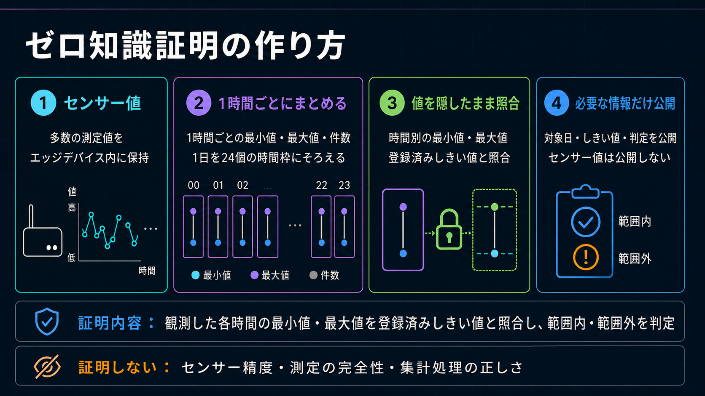
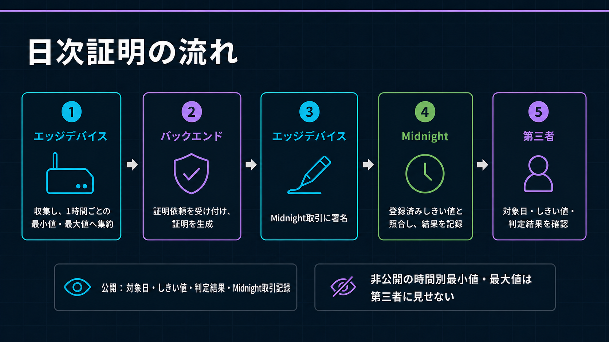

# 時間別最大・最小値による日次Attestation仕様

[English](../../architecture/hourly_extrema_attestation_proposal.md)

状態：現行ソースへ実装済み。過去のPreprod記録は旧Schemaのため時間帯別結果を含みません。
最終更新：2026-09-01 JST

本書は`midnight/contracts/sensor-registry`に実装した固定形状の日次Threshold Attestationを定義します。互換性のためファイル名には`proposal`が残っていますが、内容は提案ではなく確定仕様です。



## 1. 証明Claimと責任境界

Projectへ事前登録した境界から始まる24時間について、登録済みDeviceが24個の時間Slotを非公開で提出します。観測されたSlotにはMinimum、Maximum、申告Sample Countが入り、Transactionは運用日の各時間に対応する`hourResults`を公開します。

- `withinThreshold`：その時間の提出済みExtremaが登録済み公開しきい値以内
- `outsideThreshold`：その時間の提出済みExtremaの少なくとも一方がしきい値の範囲外
- `noData`：Private Slotが正規化された欠測値

公開Boolean `thresholdSatisfied`は日次の総合結果として残します。

- `thresholdSatisfied = true`：観測された全時間帯について、提出された最小値／最大値が登録済みしきい値の範囲内
- `thresholdSatisfied = false`：観測された少なくとも1時間について、提出された最小値または最大値が登録済みしきい値の範囲外

Readingがない時間はCanonicalなAbsent SlotとしてThreshold計算から除外します。全時間Absentの場合、観測違反は存在しないためLedger Booleanは`true`ですが、GUIは24時間すべてを「計測なし」と表示します。範囲外は有効なZK ClaimでありProof失敗ではありません。Commitment不整合、非Canonical Slot、虚偽Result、未認可Callは失敗し、Attestationを記録しません。

物理的な測定の真実性、校正、連続稼働、完全性、Sampling頻度、Device側集計の正しさは証明しません。Sampling間に逸脱がなかったことも証明しません。これらはDevice、設置、Firmware、運用監査の責任範囲です。

## 2. Threshold Policy

ThresholdはMidnight Ledger上の公開Stateです。本用途では隠す必要がなく、Ledger Stateにすることで、回路がどのPolicyを利用したかを第三者が確認できます。

開発Operatorは運用開始前にPolicyとDeviceへのAssignmentを登録します。DeviceはProof Job APIへ`minimum`／`maximum`を送信せず、Proof時に都合のよいBoundを選べません。回路はContract StateからAssignment済みPolicyを読みます。

上書きできない`ThresholdPolicy`は次を持ちます。

```text
mode: closed-range | upper-bound | lower-bound
minimumCentiOffset
maximumCentiOffset
valueScale
sensorTypeCode
unitCode
version
```

Modeにより、回路を変更せず別のSensor Policyへ対応できます。

- `closed-range`：下限と上限の両方
- `upper-bound`：上限だけ
- `lower-bound`：下限だけ

Operator専用の`Operator Authority`は全Device Contract AuthorityおよびDeployment Walletと分離し、秘密値は開発ホストだけに置きます。Off-chainでは可読なPolicy ID／Assignment IDを使い、On-chainではDomain分離したSHA-256 Keyとして表現します。D1はAPI検査とGUI参照用に確定済みDevice／Policy／AssignmentをMirrorしますが、暗号学的な正本はMidnightです。

PolicyとAssignmentは上書きできません。変更時は新しいIDを登録します。AssignmentはPolicyと1つの登録済みDevice Commitmentを有効期間へ結び付け、`validUntil = 0`は無期限を意味します。Wave 1ではDeviceごとに1 Assignmentを利用します。レンタル／工期別の再Assignmentと期間重複の運用規則は将来対象ですが、Contract Schemaは回路再Deployなしで期間付きAssignmentを追加できます。

## 3. 固定日次Input

Private Inputは常に順序固定の24 Slotです。

```text
HourlyExtrema {
  present
  minimumCentiOffset
  maximumCentiOffset
  sampleCount
}

DailyExtremaInput {
  commitmentDomain
  deviceCommitment
  measurementGroupId
  policyId
  assignmentId
  measurementDay
  periodStart
  periodEnd
  hours[24]
  schemaVersion
  circuitVersion
}
```

観測Slotは`present = true`、`sampleCount > 0`、`minimum <= maximum`です。値がないSlotは自動的に`STOPPED`とし、正規表現を`present = false`、`sampleCount = 0`、`minimum = 0`、`maximum = 0`に固定します。STOPPEDは運用Statusであり、不正でもThreshold違反でもありません。工事は24時間稼働とは限らず日々の予定も変わるため、稼働時間の事前登録は要求しません。

ProjectはDevice運用前に固定UTC Offsetとローカル開始時を登録し、その値を変更不能なDevice-bound Assignmentへコピーします。回路はUTC Epoch DayとUnix秒を受け取り、`periodStart = measurementDay * 86,400 + utcDayStartMinute * 60`、`periodEnd = periodStart + 86,400`を要求します。24 Slotの形状は変わりません。Wave 1では固定Offsetを使い、Assignment内で夏時間を自動適用しません。規範仕様は[運用日の境界](operational_day_boundary.md)を参照してください。

Raw Sampling頻度が変わってもPrivate ZK Inputは同じです。

| Raw間隔 | 申告Sample数/日 | 回路Slot数 |
| --- | ---: | ---: |
| 60分 | 24 | 24 |
| 15分 | 96 | 24 |
| 1分 | 1,440 | 24 |
| 1秒 | 最大86,400 | 24 |

したがってSampling頻度を変えても、再Compile、Proving Key再生成、Contract再Deployは不要です。Sample CountはPrivate SlotへBindingしますが、物理Sampleが実在したことの証明ではなくDevice申告値です。

## 4. Commitmentと公開State

Deviceは日次Sensor値群へ安定したPublic `measurementGroupId`を1つ割り当て、`persistentCommit<DailyExtremaInput>(daily, nonce)`を計算します。24時間分のExtremaとNonceはPrivate Openingです。TransactionではCommitment、Measurement Group ID、Assignment Key、期間、24 bit Presence、合計Sample Count、Claimした`thresholdSatisfied`、Schema Version、Circuit Versionを公開します。

Contractは`persistentHash(domain, deviceCommitment, measurementGroupId)`から変更不能な`attestationId`を導出します。成功後の`attestations[attestationId]`は次を公開します。

```text
attestationCommitment
measurementGroupId
deviceCommitment
policyId
assignmentId
measurementDay
periodStart
periodEnd
hourPresence[24]
hourResults[24]
observedHourCount
sampleCount
schemaVersion
circuitVersion
thresholdSatisfied
verified = true
```

時間別Minimum／MaximumとCommitment Nonceは非公開です。Threshold、Mode、Unit／Type Code、Policy Version、有効期間、Assignment、運用日／境界、UTC期間、Presence、Count、Commitment、24個の時間帯別結果は公開です。

## 5. 回路規則

`submitDailyAttestation`は1回の認可済みTransactionで次を実行します。

1. Device Contract Authorityを検証
2. 登録済みDevice CommitmentとMeasurement Group IDからAttestation IDを導出し、登録済みIDを拒否
3. 上書き不可のAssignmentとPolicyをLedgerから取得
4. 正確な登録済み運用日境界、24時間の期間、Assignment有効期間を検証
5. Private Daily CommitmentをOpenして再計算
6. Measurement Group、Device、Policy、Assignment、期間、Schema、Circuit Version、PresenceをPublic StateへBinding
7. STOPPED Slotの正規表現と、全Observed Slotの有効かつ順序の正しいExtremaを検証
8. 各Private Slotと登録済みLedger Policyから時間帯別結果を計算し、対応するPublic `hourResults`と一致することを証明
9. 全Observed Slotから`allWithin`を計算し、日次総合値`thresholdSatisfied`と一致することを証明
10. 合計Sample CountとObserved Hour Countを再計算し、Public Attestationを記録

Dataset登録用の別Transactionはありません。Policy登録はOperator Lifecycle操作であり、日次処理はDevice Attestation Transaction 1回です。

## 6. 運用Flow



図の所有レーンに注目してください。Raw値とPrivate ExtremaはEdge Device、表示はFrontend、AdmissionとProof ServerはBackend、確定済みAttestationはMidnightの責任です。Queueへ入るのはJob参照だけで、Private ExtremaはFrontendを経由せず、Admission後にProof ServerへStreamし、保存しません。署名主体はBackendではなくEdge Deviceです。

```text
運用開始前
Operator -> Midnightへ公開しきい値を登録
         -> MidnightへDevice/Policy Assignment登録
         -> 確定済みIdentifierをD1へMirror

毎日
Edge Agent -> Raw ReadingをLocal保持
           -> 1時間運用SummaryをD1へ送信
           -> 異常状態遷移を即時送信
Wallet Agent -> Privateな24 Slot Extremaを集計
             -> Threshold Boundを含めずProof Jobを要求
D1 Backlog -> 02:00～06:00 JSTにAdmission -> Cloudflare Queue
Wallet Agent -> Worker経由でPrivate Proving RequestをProof Server ContainerへStream
Proof Server -> Contract LedgerのPolicyを利用してProof生成
Edge Device -> 1つの日次Midnight Attestation TXへ署名・送信
Worker -> 確定TXをD1へ記録
GUI -> 管理者Summaryと第三者向けZK Claimを分離表示
```

Queue MessageにはJob参照だけを入れます。Private ExtremaをQueue、D1、R2、Browser APIへ保存しません。D1 Unique制約と状態遷移により、at-least-onceの重複配送を冪等にします。

## 7. D1 MirrorとProof Job

Migration `0010_hourly_extrema_policies.sql`／`0011_multi_device_registry.sql`は次を追加します。

- `threshold_policies`：公開しきい値のD1複製とContract参照
- `policy_assignments`：Device Commitment／Policy有効期間Mirror
- `devices`：Fail-closedなMidnight Registry Status／Authority／Version／Contract Mirror
- `daily_proof_jobs`：日次1件の冪等Job、ClaimしたThreshold結果、Transaction結果

WorkerはQueue投入前にAuthenticated Device、D1 Policy／Assignment Mirror、Device Commitment、運用日／期間、時間帯別結果、日次総合値、Job Metadataの一致を検査します。Policy／Assignment IDは受け取りますがThreshold Boundは受け取りません。Claim Resultは対応Midnight TransactionがConfirmedになるまでEvidenceとして信用せず、回路がPrivate ExtremaとLedger Policyから再計算します。第三者GUIはConfirmed Jobと登録Policyを結合し、公開Bound／有効期間、24個のしきい値以内／範囲外／計測なし、Device Commitment、正確なClaim、Contract Address、Transaction参照を表示します。

## 8. Versionと移行

- Compact Toolchain：`0.31.1`
- Compact Language Pragma：`0.23`
- Contract Schema Version：`4`
- Daily Schema Version：`7`
- Circuit Version：`5`
- D1 Migration：`0026_operational_day_boundary.sql`まで

以前の選択Merkle Leaf Contractおよび旧日次SchemaとはLedger互換性がありません。採用には新Contract Deploy、運用前Policy／Assignment登録、公開Contract Address更新、D1 Migration `0026`までの適用が必要です。過去のSchema-5／6 TXは履歴Evidenceとして有効ですが、設定可能な運用日境界を後付けできません。旧24／96／1,440件`daily-attestation` Profileは開発用の回路Scaling Experimentとして残し、運用経路や価格根拠には使用しません。

## 9. 実装済み検証Case

自動Testは次を確認します。

- Policy 1件、Assignment 1件、時間帯別のしきい値以内／範囲外／計測なしを含むAttestation TXの成功
- 24、96、1,440 Sampleから同じ固定回路Inputを生成
- 一部または全時間STOPPEDでも欠測を不正扱いしない
- 下限未満／上限超過を正しいOUTSIDE Resultとして記録
- 虚偽の時間帯別結果、虚偽の日次総合値、Minimum／Maximum逆転を拒否
- Commitment、Presence、Device、Policy、AssignmentのBinding
- Device AuthorityとOperator Authorityの分離
- Public APIがPolicyは開示し、時間別Extrema／Nonceは開示しない

過去のPreprod TXでは、1分ごとのRaw値1,440件を24個のPrivate Hourly Extrema Slotへ集約する旧設計を確認済みです。Transaction時間、Proof時間、Proving Key Size、Request Size、Transaction Size、DUST Fee、計画値は[Cost Benchmark](../implementation/cost_benchmark.md)へ履歴Evidenceとして残します。これらはSchema `7`／Circuit `5`の設定可能な運用日境界を証明するものではなく、その確認には新Contract Deployと新しいTXが必要です。
