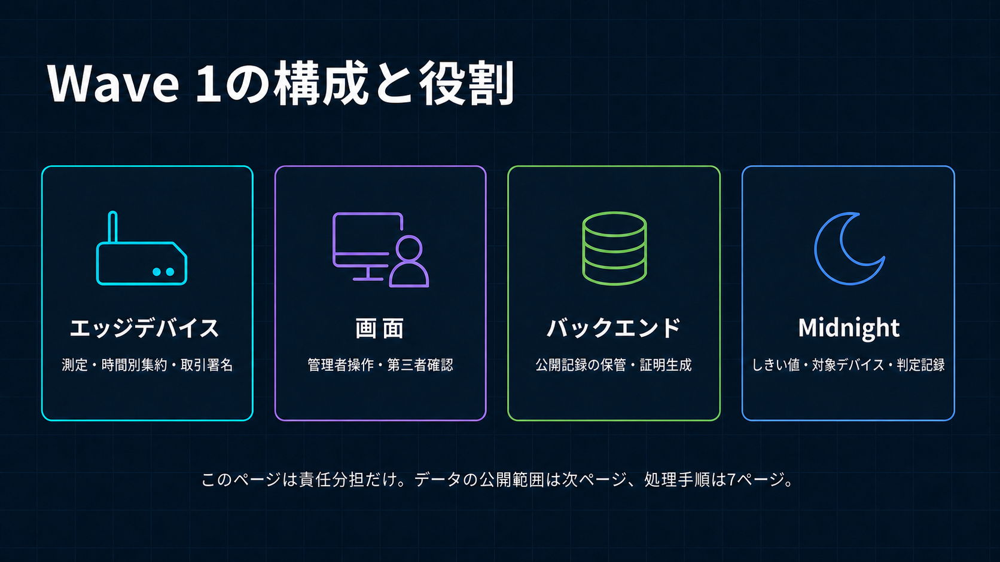
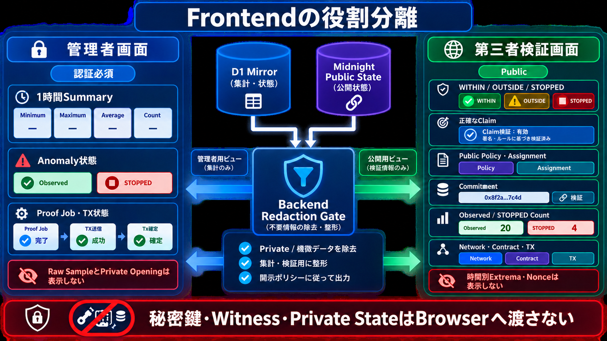

# Wave 1 System Architecture

[English](../../architecture/system_architecture.md)

正本は[`wave1_spec.md`](wave1_spec.md)です。Wave 1の主要審査経路は、疑似計測元として動く
ユーザー認可済みBrowser Client、Trustedな管理Backend、Midnightで構成します。リポジトリにはWave 2の
Integration Evidenceとして、次の現場Runtime境界も実装しています。



## Cloudflareリソース構成

全経路を1枚に詰め込まず、[5つのユースケース別構成図](cloudflare_use_cases.md)へ分けています。
見せる資料では、認証、1時間集計、日次証明、署名・送信、第三者確認の順にリソースを追加し、
各ユースケースで見るべき線だけを強調します。この文書では、実装済みリソースの役割と設定を説明します。

| Cloudflareリソース | このシステムでの役割 |
| --- | --- |
| Workers／Static Assets | API認証・認可・入力検査、証明依頼の受付、管理者画面と第三者画面の配信 |
| D1 | デバイス公開鍵、Session Hash、1時間Summary、しきい値・対象デバイスの表示用複製、日次Proof Job、取引状態、公開結果 |
| Queues／DLQ | Proof Admission／Sponsor処理のJob参照だけを配送し、失敗時に再試行またはDLQへ移送 |
| Cron Trigger | 開発環境では1分ごとにD1の待機中JobとSponsor Healthを確認し、営業時間内の処理をQueueへ投入 |
| Proof Server Container | 非公開の時間別MIN／MAXからMidnight用Proofを生成。`standard-2`、最大1 instance |
| Sponsor Wallet Container | デバイス署名済み取引を検査し、DUST Feeだけを追加してMidnightへ送信。Warm Restore実測済みの`standard-2`、最大1 instance |
| Durable Objects | 2つのContainerを起動・ルーティングするCloudflare内部Binding。Device SessionやReadingの保存には使用しない |
| R2 | 非公開TX Artifact、任意のPublic Report、Sponsor Walletの暗号化同期Checkpointを保存。SeedやRaw値は平文保存しない |
| Rate Limiter／Observability | 認証・API・ProofのRate制限と、秘密値を除外した構造化Log／処理時間／Byte数の記録 |

主要な関係は次のとおりです。

1. エッジデバイスは通常のAPI認証と1時間SummaryをWorkersへ送ります。生のセンサー値は送信しません。
2. D1は処理状態と画面表示用データを保存し、Queuesへ入るのはProof Jobの参照だけです。
3. 許可された日次処理では、非公開の時間別MIN／MAXがWorkersを通ってProof Server Containerへ送られますが、D1、Queues、R2には保存しません。
4. Proofを受け取ったエッジデバイスがMidnight取引へ署名し、Sponsor Wallet ContainerはDUST Feeだけを追加して送信します。
5. Midnightで確定した取引識別子と判定結果をD1へ画面表示用に複製します。第三者が判定の基準として確認する公開記録はMidnightです。Public BrowserはCheck完了前に同じTransactionと正確なBlockのFleet Registry Stateを再取得し、Attestation、Policy、Assignment、判定結果を直接照合します。

図の黄色は非公開情報、青は公開Metadata／制御Flow、破線は信頼境界です。Edge DeviceはRaw DataとDevice
秘密鍵を保持し、Compact Callを認可してFeeなしの日次TransactionをBindします。Frontendは公開済みまたは
Redactedされた情報だけを扱います。Backendは認証・Admission・Proof処理・Fee SponsorshipのTrusted
ComponentですがDevice鍵を持ちません。Midnightは公開しきい値、対象デバイス設定、検証済み証明記録の正本であり、
D1はその運用Mirrorです。



Wave 1の統合審査Applicationには、意図的に異なるEvidenceを扱う2つの論理Viewがあります。運用Workflowは
Browser Privateな疑似Captureと認可済みWorkflow Stateを扱い、第三者ViewはRedactedされた確定Evidenceだけを
受け取ります。本番ではWave 2でRoleとApplicationを分離します。Public Viewには秘密鍵、Witness、Private State、
Raw Sampleを渡しません。

```text
Edge Device
├ Sensor収集、Local Raw保持、24時間集計
├ Device Identity、Device Contract Authority、Transaction Identity
├ Backendへの認証済みPrivate Proof Stream
└ FeeなしのTransaction Bind。NIGHT／DUST Stateなし

Frontend
├ 認可済み運用Summary／状態を表示する管理者画面
├ Redactedされた確定Evidenceを表示する第三者検証画面
└ Raw Reading、Private Extrema、Nonce、Witness、秘密鍵を扱わない

Backend
├ Worker：Validation、認可、API、Proof Gateway
├ D1：Identity／Session／業務State、Policy Mirror、Daily Job／TX
├ Queue＋DLQ：Bounded Proof AdmissionとSponsor処理のReference
├ Container：Midnight Proof Server 8.1.0
├ Sponsor Wallet Container：DUST同期、FeeだけのBalance、送信
└ R2：非公開TX Artifact、任意のPublic Report、暗号化Sponsor Checkpoint。Raw Readingは保存しない

Midnight
└ Fleet Device Registry／Public Policy／Assignment／Daily Attestationの正本
```

Cloudflare ContainersはPlatform内部要件としてDurable Object Bindingを使います。Application Durable ObjectをDevice Session、Sample Counter、Reading、Jobには使用しません。Container 1台の初期構成ではActive Proof Jobを1件に制限します。並列数はContainer Capacityの実測とScaling設定を同時に変更する場合だけ増やします。

標準Device-to-cloud通信はSensor Streamごとの1時間集計1件と即時Anomaly Transitionです。Raw Sampling Frequencyを上げてもRaw SampleごとのCloud Storage Writeは増えません。

Proof Server営業時間は02:00–06:00 JSTです。D1がDurable Backlog、QueueがAt-least-once Deliveryを担い、Stable Proof Job IDとConditional StateでDuplicate Admissionを無害化します。Private 24 Slot ExtremaはQueueへ入れず、AdmitされたDeviceからContainerへ直接Streamします。DeviceはPolicy／Assignment Identifierだけを送りThreshold Boundは送らず、回路がMidnightからPublicなAssignment済みPolicyを読みます。

Development Deployには`contract_deploy`、Deploy後のDevice管理には`contract_admin` Purposeの30分Operator Proof Leaseを使い、Device Keyは使いません。認証済みWrangler操作で発行し、平文LeaseはProcess内だけに置いて終了時にRevokeします。D1 HashはProof ServerのCapacity上限を共有します。Lifecycle正本は[`device_registry.md`](../security/device_registry.md)です。

Proof生成後、現場Transaction AgentまたはUser管理のBrowser Accountが、値移動を含まないTransactionをFeeなしでBindします。認証済み
Sponsorship Endpointは、そのFinalized Serialized TransactionをProof Jobごとに1回だけ受理し、Integrity
Addressedな非公開BytesをR2へ保存してJob IDをQueueへ投入します。同一再送は追加Queue投入なしで既存状態を
返し、異なるBytesは拒否します。専用Sponsor Walletが後からJobとBind済みCallを検証し、DUSTだけを追加して
送信します。Sponsor SeedはDevice、Operator、Deploymentの各鍵と分離します。暗号化した同期Checkpointと
一時的な非公開TX ArtifactはR2へ置けますが、D1／R2へSeedを平文保存しません。Sponsor稼働は運用前提ですが、各DeviceにはNIGHT
入金、DUST登録、DUST履歴同期が不要です。

Proof ServerとSponsor Walletは、両方を`standard-2`にする場合も別Containerのままとします。Sponsorの
PID 1は軽量Health Supervisorで、低PriorityのWallet SDK Childが同期中でも、鮮度付きCached Healthを
即座に返します。これによりProof用資材、Sponsor Seed、Scaling障害を混在させずに運用Healthを応答可能に
保ちます。1 vCPUのSponsorでWarm Restoreした実測ではCached Wallet Statusが一時`degraded`になりましたが、
Supervisor Endpointは応答を維持し、Walletが`ready`へ戻るまでQueue処理を保留できました。
