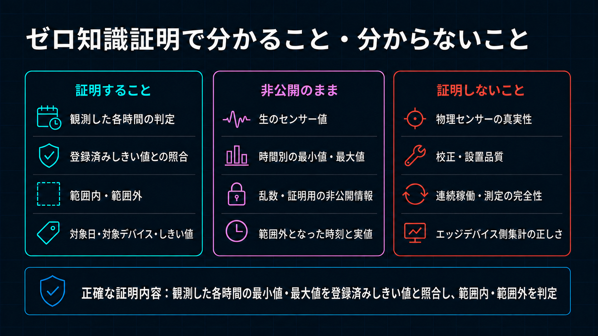
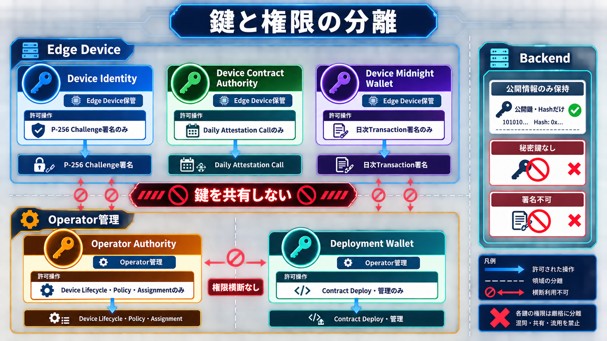

# BACCHIRI!━━Verifiable Measurement Layer — Wave 1仕様

[English](../../architecture/wave1_spec.md)

状態：実装基準
最終更新：2026-09-01 JST

本書をWave 1の製品・実装仕様の正本とします。過去の設計文書と矛盾する場合、本書を優先します。

## 1. 製品目的

Wave 1は、ユーザーが認可したブラウザクライアントを疑似計測元として使い、非公開証明の中核価値を検証します。疑似の日次計測データを作成し、時間別Extremaを第三者へ公開せずにMidnight ZK Claimを記録します。疑似Raw値とPrivate OpeningはBrowser Privateな計測元に残し、認可済み時間別Summaryは運用者Workflow用にTrustedな管理Backendへ保存します。

Wave 1主要審査経路の要件：

- ユーザーが認可したブラウザクライアントを疑似計測元として使う
- 証明対象と公開しきい値条件を計測期間より前に登録する
- 疑似の日次計測データを作り、固定24 Slotの非公開入力へ集約する
- 上限付き時間別Summaryを認可済み運用RecordとしてTrustedな管理Backendへ送る
- 運用開始前にMidnightへ登録した公開しきい値だけを使う
- 値がない時間は不正ではなくSTOPPEDとして扱う
- Trustedな管理Backendで証明を生成する
- 審査員に取引手数料管理を要求せず、Proof TXへの明示的なUser認可を得る
- 公開判定結果とEvidence IDをMidnightへ記録する
- 運用者操作と第三者検証を一つの審査用GUIへまとめる

リポジトリには、現場側の認証、収集、取引、配布、復旧に関する実装も含まれます。これらはWave 2へ進むための
Integration Evidenceと移行基盤ですが、長期間の自律運用と本番Role分離はWave 1完了Claimではありません。

連続Real-time値は標準Plan対象外です。将来Premium Planで最新値Streamまたは専用Proof Capacityを追加しても、Wave 1 Attestation Claimは変更しません。

## 2. 用語

| 用語 | 意味 |
| --- | --- |
| Raw Sample | Deviceに保持するTimestamp付きReading 1件です。 |
| Hourly Operational Window | 管理者運用向けにUploadするCount、Minimum、Maximum、Averageです。ZK Public Inputではありません。 |
| Daily Extrema Input | Observed／STOPPEDの24時間Slotを持つ固定形状Private Objectです。 |
| STOPPED | Readingがない時間です。AbsentかつCount／値がZeroの正規表現にします。Threshold失敗ではありません。 |
| Threshold Policy | Mode、Bound、数値Scale、Sensor Type／Unit、Versionを定義するImmutableなPublic Midnight Stateです。 |
| 時間帯別結果 | UTCの各1時間に対するPublic Resultです。`withinThreshold`／`outsideThreshold`／`noData`のいずれかで、時間帯は分かりますが実値は分かりません。 |
| Threshold Result | Private Hourly ExtremaとAssignment済みLedger Policyから証明するPublic Boolean `thresholdSatisfied`です。`true`は全Observed Hourが範囲内、`false`は少なくとも1時間が範囲外です。 |
| Policy Assignment | Policy、登録済みDevice Commitment、有効期間を結び付けるImmutable Stateです。 |
| Attestation Commitment | Private Daily Extrema InputとNonceへのPublic Commitmentです。 |
| Device Identity | Cloudflare認証とSession更新だけに使うP-256鍵です。 |
| Device Session | Challenge署名後に発行する、失効可能な24時間Opaque API Tokenです。 |
| Device Contract Authority | Daily Attestation Callを認可する別系統のPrivate Compact Authorityです。 |
| Device Transaction Identity | DUSTを支払わず、Proof済みTXのCoin／Encryption Public Key導出とBindに使うEdge Device上の別系統の鍵素材です。 |
| Sponsor Wallet | 登録済みNIGHTを保持し、DUSTを同期し、Device Bind済みTXへDUST Feeだけを追加して送信する専用Backend Walletです。 |
| Operator Authority | Device LifecycleとPolicy／Assignmentを管理するOperator専用Compact Authorityです。 |
| Deployment Wallet | Contract Deploy／管理用の開発ホストWalletです。 |
| ZK Job | Admission、Proof進捗、Attestation TXを管理する冪等なD1 Workflow Recordです。既存API Pathでは`proof-jobs`という名称を使います。 |

### 2.1 ID形式

システムが生成する履歴レコードのIDは、`<種別を表す3〜5文字のPrefix>_<UUIDv7>`とします。`zjb`は
ZK Job、`mbt`はMeasurement Batch、`aev`はAnomaly Eventを表します。`zjb`の`z`はZKの一部であり、
共通の名前空間ではありません。

IDは初回作成時に生成・永続化し、再送、Process再起動、Queue再配信でも同じIDを使用します。UUIDv7に
より同種レコードを概ね作成順に並べられます。Random UUIDや内容Hashと比べてB-tree Indexの局所性が
高く、ID CursorによるPaginationも効率化できます。同じIDの再利用により再送を冪等にします。厳密な
時系列表示は用途に応じて`createdAt`、`periodStart`、`occurredAt`を使用します。

運用Edge Deviceの`deviceId`はDevice Identityと同時に一度生成し、登録要求の再送、再登録、認証鍵の
更新後も同じIDを使用します。審査用Browser Deviceだけは意図的な例外で、12節のとおり、検証済みPublic
Wallet KeyとProjectから決定的に導出します。人が管理する設備コードは`deviceCode`、画面上の表示名は
`deviceName`として分離します。

2026-08-30時点の移行状態：Deploy済み実装は、Operator入力のDevice Slug、Timestamp由来のBatch／Event
ID、内容から導出するProof Job IDをまだ使用しています。上記は移行後の必須形式であり、現行IDが準拠済み
という意味ではありません。既存Recordは明示的な対応表を保って移行し、旧`deviceId`を暗黙に新しい
`deviceCode`として扱いません。

## 3. 正確なProof Claimと非Claim



Confirmed Daily Attestationは、UTCの24時間それぞれに一緒に記録したPublic Resultを証明します。

- しきい値以内：その時間のPrivate Minimum／Maximumが登録済みPolicyの範囲内
- 範囲外：その時間のPrivate MinimumまたはMaximumが登録済みPolicyの範囲外
- 計測なし：その時間がCountとPrivate値をZeroにしたCanonical Absent Slot

`thresholdSatisfied`は日次の総合結果として残します。`true`は全Observed Hourがしきい値以内、
`false`は1時間以上が範囲外です。時間帯Viewerの正本は、この総合結果ではなく24要素の時間帯別結果です。

Readingがない時間はSTOPPEDとしてThreshold計算から除外します。24時間すべてSTOPPEDの場合、GUIは`observedHourCount = 0`からSTOPPEDを表示し、数学的に真となるLedger Booleanを正常稼働日として表示しません。OUTSIDEはProof成功結果です。Private Data不整合またはPrivate Dataと一致しないClaim Resultは失敗し、何も記録しません。

証明しないこと：

- 物理Sensorの真実性、校正、設置品質、耐Tamper性
- STOPPED時間にDeviceが稼働すべきだったか
- 連続Sampling、Sampling間に逸脱がなかったこと
- 全Physical Observationを保持したこと
- 申告Sample Countと物理測定件数の一致
- Firmwareの集計、Clock、Filter、Debounceの正しさ
- Off-chain Raw Storageの完全性／真正性

GUI／営業資料でWITHINを「すべての物理Sensor値が正常だった」と強めてはいけません。範囲外の時間帯は公開しますが、実値とどちらのBoundを超えたかは開示しません。

## 4. Trust、Privacy、Runtime境界


Wave 1ではCloudflare WorkerとProof Server ContainerをTrusted Backendとします。通信はTLSで保護します。Application E2E暗号化、FHE、mTLS、TPM Remote Attestation、Secure Boot Attestationは将来対象です。

```text
開発ホスト
├ Compact ContractをCompile／Deploy
├ Device登録／Rotation／無効化とPublic Policy／Assignment登録
├ Cloudflare ResourceとDevice Identity公開鍵を管理
├ Operator AuthorityとDeployment Wallet秘密値を分離保持
└ 結合試験とCost Benchmark

Edge Device
├ Edge Agent：Sampling、Local集計、Hourly Window／Anomaly送信
├ Wallet Agent：Private Daily Extrema準備、Proof Job要求／Poll
├ Device Identity、Device Contract Authority、Transaction IdentityをLocal保持
├ Contract Proofに認証済みCloudflare Proof Serverを使用
└ NIGHT、DUST生成、DUST同期なしでProof済みTXをBind

審査用Browser Client
├ Wave 1主要審査経路の疑似計測元として動作
├ Proof AuthorityとPrivate Daily OpeningをBrowser Private Storageに保持
├ Contract回路Proofに認証済みCloudflare Proof Serverを使用
└ User管理のMidnight Accountで、Feeを支払わずTXを承認／Bind

Cloudflare
├ Worker：認証、認可、API、Admission、GUI
├ D1：Registry、Session Hash、Summary、Event、Policy Mirror、Job／TX状態
├ Queue／DLQ：Proof Admission参照とRetry
├ Proof Server Container：Proof生成
├ Server Wallet Container：分離した論理Authorityによる管理、Managed Attestation、DUST同期、
│ FeeだけのTX送信を直列処理
└ R2：任意のPublic Artifact／Report。Raw Readingは恒久保存しない

Midnight
└ Public Policy、Assignment、Verified Daily Attestationの正本
```

Edge DeviceではCompact Compile、Contract Deploy、Wrangler、Proof Server Hostを行いません。Public
Dashboard／第三者検証RouteへDevice Session、Wallet Material、Raw値、Private Extrema、Nonce、Witness、
Private Stateを渡しません。審査用Browser DeviceはDevice Workflow実行中、自身のDevice Identity、Session、
Private OpeningだけをBrowser Private Storageへ保持し、Public Verification APIからは一切返しません。

Edge Wallet AgentはDevice Session Tokenと`X-Proof-Job-Id`を付与し、Compact Contract Proofを認証済み
Cloudflare Containerへ送ります。その後、Proof済みで値移動を含まないTXをDUSTなしでBindします。Browser Review Clientも
`balanceUnsealedTransaction(..., { payFees: false })`によって同じ責務分離を行います。Sponsor境界を越える
前に、Serialized Finalized TransactionはDevice認可済みContract CallへすでにBindされています。

Sponsor WalletはAuthenticated Proof Jobに対して適格なTXを1件だけ受理します。Rate、Status、Contract、
Circuit、Size、Replay Policyを検査し、`balanceFinalizedTransaction`を
`tokenKindsToBalance: ['dust']`で実行し、自身が追加したBalance部分だけへ署名し、MergeをFinalizeして
送信します。Bind済みDevice Callを変更したり、Device Contract Authority Proofを生成したりはできません。

Serialized Transaction Policyはdeny-by-defaultです。設定済み
`sensor-registry.submitDailyAttestation` Entry Pointへの`ContractCall`を1件だけ含むIntent 1件だけを
許可します。Reward、Deploy、Maintenance Action、Shielded／Unshielded Value Transfer、追加Call、
Device側が含めたDUST ActionはBalance前に拒否します。公式Wallet SDKがSponsorのDUST Feeを追加した後も
同じPolicyを再検査します。Device Commitment、Assignment、Period、Public Result、Private Hourly
ExtremaへのCommitmentは、信頼されないSponsor Request MetadataではなくContract Proofで拘束します。

Server Wallet ContainerのSponsor Roleを呼ぶ前に、Workerは認証済み`deviceId`と`proofJobId`に対するJST日次の
Sponsorship枠をD1へ原子的に予約します。標準上限はDeviceごとにJST 1日5件です。Operatorが登録する
審査用Deviceは、審査員が一連の操作を繰り返せるよう20件に設定します。予約Tableでは`proofJobId`が
Uniqueなので、同じJobのRetryは既存予約を返し、回数を追加消費しません。上限後の新しいJobは次のJST
0時までHTTP 429を返します。`GET /api/v1/sponsor-quota`は認証済みDevice自身の上限、使用数、残数、
リセット時刻、予約済みJob IDだけを返し、GUIの表示とButton制御に使います。

Deviceは最初のSponsor Request前に、FeeなしSerialized Transactionの同一Bytesをowner-only mode `0600`で
原子的に保存します。Workerは上限予約後、SponsorのReady確認より先にProof JobをTransaction HashとByte
LengthへBindします。Sponsor同期中も受理済みJobは`awaiting_sponsor`に残り、DeviceはStatusをPollして
Integrity確認済みの同一Bytesを再利用し、再Proofしません。Device Process再起動時に`proof_ready`とLocal
Pending Artifactが共存する場合も同じ復旧経路を使います。Bind後の別Transactionは拒否します。

SponsorshipのHTTP Requestは同期Wallet呼出しではなく、受理境界です。認証済みWorkerは最初に受理した
Serialized TransactionのHashをProof JobへBindし、非公開BytesをR2へ保存し、Queueには`proofJobId`だけを
投入して`202 Accepted`を返します。同一Requestの再送はWorkerで止め、追加の上限予約、R2 Write、Queue投入、
Wallet処理を行わず現在のJobを返します。同じ測定群への別Transactionは`409`で拒否します。Sponsor Queue
ConsumerはWallet Ready後だけContainerを呼び、Container内のWallet Mutationは直列実行します。

| 経路 | Contract回路Proof | Device Bind／承認 | DUST Fee | TX Submit |
| --- | --- | --- | --- | --- |
| Edge Device | 認証済みCloudflare Proof Server Container | Edge Wallet Agent、Feeなし | Sponsor Wallet | Sponsor WalletからMidnightへ送信 |
| User管理Walletを使う審査用Browser Client | 認証済みCloudflare Proof Server Container | Wallet、`payFees: false` | Sponsor Wallet | Sponsor WalletからMidnightへ送信 |

Proof Server ContainerはProof生成だけを担当し、Midnight Wallet Keyを保持しません。統合Server Wallet
ContainerはWallet Seedと、分離された管理／Managed Attestor認可Secretを保持しますが、Device Identity、
Device Contract Authority、Private Extrema、Nonce、Device Compact Private Stateを受け取りません。
Sponsor Roleは適格なBind済みCallへのFee付与だけを行います。Edge DeviceはLocal Proof Server、NIGHT入金、
DUST登録、DUST残高、DUST履歴Scan、DUST Proofを必要としません。このため運用開始時にDeviceごとのDUST生成
待ちはありません。ただし、ActiveなDevice登録／Assignment、公開運用設定、Proof Job Admission、最新
Contract State取得、Proof生成、Sponsor Capacityは必要です。

> **ContainerのSecret境界：** Docker Build ContextとImageに含めるのは、Application Code、Dependency、
> Compile済みCompact Prover／Verifier Artifactだけです。Sponsor Seed、Operator Authority秘密値、`.env`、
> `.dev.vars`、Wallet Checkpoint、Wallet Stateを含めてはいけません。本番ではWorkerがCloudflare Secret
> Bindingから`SPONSOR_WALLET_SEED`と`OPERATOR_AUTHORITY_SECRET`を読み、Container起動時にPrivateな
> Server Wallet Containerの環境変数へ注入します。ContainerがCloudflare Secret Storeを直接読み出す
> 構成ではありません。Local開発ではGit Ignore済みの`.dev.vars`等を環境変数の供給元にできますが、
> CommitまたはContainer Imageへ含めてはいけません。

SponsorのCold Sync中は、開発環境の1分Health Cronを契機に最大5分間隔で暗号化Wallet CheckpointをR2へ
保存し、Ready後は30分間隔にします。認証済みSponsorship Retryも同じStale Checkを呼べますが、R2 Write
頻度は増えません。Signalによる停止前には、Containerが利用可能な最新StateをSerializeし、Sponsor Process
内で導出したKeyで暗号化して、非公開の`state.internal` Container-to-Worker経路から送ります。Workerは固定
Binary形式、申告Size、Boot ID、停止理由を検証してからR2へ保存します。SeedはObjectにもMetadataにも含め
ません。置換後のContainerはWallet初期化前にCheckpointから復元し、永続化済みの進捗を最初から再生しません。
Signal Handlerを実行できない停止では、直近の定期Checkpointを復旧点にします。

PreprodのSponsor初期化は、現行の公式Public Network向けWallet SDK Patternに従います。Shieldedと
Unshielded ProgressはStrict Completeを必須とします。未登録NIGHT Coinを登録する前にはUnshieldedと
DUSTもStrict Completeを必須とし、その後だけ登録Fee見積り、DUST生成待ち、登録TX送信へ進みます。
Checkpointから復元済みでNIGHT登録済みのWalletは、Spend可能なDUST Coinを確認できれば登録を繰り返さず
再開できます。Spend可能なDUSTが存在するまでQueue済みTransactionをBalance／Submitしません。Health出力には3 Walletの接続、
完了、Replay位置を含めます。

Server Wallet Containerでは軽量Health SupervisorをPID 1、公式Wallet SDKを低Priorityの別Child Processとして
動かします。`/health`はCPU負荷の高いReplay Event Loopを待たず、最後に取得できたWallet Snapshotと鮮度を
返します。Stale、Degraded、終了済みChildの状態は診断専用で、Transaction Sponsorshipを許可しません。
これはProcess／Scheduler分離であり、物理Coreの固定予約ではありません。Proof生成とFee Sponsorshipは秘密、
Failure Mode、Scaling Lifecycleが異なるため、Proof Serverは別Containerのままとします。

Wave 1ではSession、Reading、Counter、Job用のApplication Durable Objectを使いません。Container Platform内部で必須となるDurable Object BindingはApplication Session Storeではありません。

## 5. 鍵の分離



| 鍵 | 保管場所 | 権限 |
| --- | --- | --- |
| Device Identity | Edge Device | P-256 Cloudflare Challenge署名だけ |
| Device Contract Authority | Edge Device | `submitDailyAttestation`だけ |
| Device Transaction Identity | Edge Device | 値移動を含まないTXのPublic KeyとBindだけ。Fee権限なし |
| Server Wallet Seed | Server Wallet Container | Wallet同期と直列化したTX送信 |
| Sponsor Role | Server Wallet Container | Proof Job Policy下のDUSTだけのBalanceと送信 |
| Operator Authority | 開発ホストとServer Wallet Secret境界 | Device LifecycleとPolicy／Assignment管理だけ |
| Managed Attestor Authority | Server Wallet Secret境界 | 登録済みManaged API Attestationだけ |
| Deployment Wallet | 開発ホスト | Contract Deployと開発管理 |

開発ホストとDeviceで秘密鍵を共有しません。開発ホストはDevice Identity秘密鍵を持ちません。Wallet同期を
統合しても、Device Transaction Identity、Operator Authority、Managed Attestor Authority、Sponsor Policy、
Deployment Walletは統合しません。1つのKey DomainをRotationしても別Domainを暗黙にRotationしてはいけません。

DeployにDevice Sessionは使いません。Authenticated Wrangler操作がRandomな30分`contract_deploy` Operator Proof Leaseを作り、D1にはSHA-256 Hashだけを保存し、Container 1台のCapacity上限を共有し、終了直後にRevokeします。

## 6. Device登録と認証

Wave 1ではPublic Self-registration／Activation Code Endpointを設けません。認証済みOperator／Factory操作で登録します。

1. `installer.sh`は完全なInstalled Device Identityを保持し、存在しない場合だけP-256 Pairを生成する。Partial StateはFail Closeする
2. PKCS#8 Private KeyとLocal Session FileをInstalled Device Home以下へOwner-onlyで置く
3. Public Enrollment BundleへDevice／Project／Key ID、Algorithm、Public JWK、Scope、作成時刻を出す
4. OperatorがPublic Compact Device AuthorityをMidnight Fleet Registryへ登録し、Device-bound Assignmentを作る
5. Confirmed Midnight Public StateをD1へMirrorし、その後だけP-256 Public Keyを登録する
6. Active Key置換には明示Rotation確認を要求し、そのSessionをRevokeする
7. Challenge／Session Round TripでActivationを完了し、Deviceが現行Public運用設定をWorkerから取得して
   Atomicに導入する

完全な順序とFail Close動作は[`device_registry.md`](../security/device_registry.md)を正本とします。D1 Inventory／P-256登録だけではSessionもIngestionも許可しません。

将来TPMでは内部生成した鍵のPublic Keyだけを同じEnrollment境界からExportします。

`POST /auth/challenge`は32 byte Random Nonceを作りTTLを5分とします。D1にはSHA-256 Hash、Device／Key Binding、Expiry、One-time消費Stateを保存します。DeviceはEndpoint、Device／Key／Challenge ID、Nonce、Timestamp、Sorted Scopeを含むVersion付きCanonical MessageへECDSA P-256／SHA-256で署名します。WorkerのClock Skew許容は±5分です。

`POST /auth/session`は24時間Opaque Bearer Tokenを返し、D1にはSHA-256 Hashだけを保存します。RequestごとにExpiry、Revocation、Key Status、Device／Project、Scopeを検査します。通常API CallでSequenceや`lastUsedAt`を書かず、Costを抑えます。必要に応じDevice／IP／Session単位でRate Limitします。ProductionはHTTPS-only、開発LoopbackだけHTTPを許可します。

Scope：

```text
measurement:write  anomaly:write  proof:request  proof:read
proof:generate     transaction:submit  configuration:read  device:status
```

## 7. Sensor DataとAnomaly Lifecycle

Raw Samplingは数秒間隔でも構いません。標準PlanのRaw ReadingはLocal保持します。Edge Agentは1時間ごとに
`mbt_<UUIDv7>`形式のBatch IDを生成・永続化し、冪等なAggregateを送ります。

```text
batchId, deviceId, projectId, sensorType, unit,
periodStart, periodEnd, count, minimum, maximum, average,
commitment, thresholdPolicyVersion
```

WorkerはAuthenticated Device／Project、Sensor Metadata、Policy Version、有限かつ順序が正しい値、Period、Count、Commitment形式、Unique `batchId`を検証します。D1にはHourly Aggregateを保存し、Raw Sampleごとには書きません。

審査用Browser Deviceは完了済みの過去30日間から運用日を選び、1分間隔のRaw値を1,440件生成します。生成Raw値とPrivate OpeningはそのBrowserのIndexedDBだけに保持し、Cloudへは最大24件のHourly Windowだけを送ります。当日と未来日は選択対象外なので、生成データは必ず完了した日次Claimになります。Threshold内Modeと外れ値ModeはどちらもZKP成功経路であり、Hourly Extremaを開示せず24個の時間帯別結果と日次総合結果を生成します。

AnomalyはDebounce済みState Transitionとして即時送信します。

```text
NORMAL -> ANOMALY_OPEN
ANOMALY_OPEN -> RECOVERED
```

Edge AgentはTransition発生時に`aev_<UUIDv7>`形式のEvent IDを生成・永続化し、再送でも同じIDを使用します。
また、Hysteresis、Cooldown、Local Rate Capを適用します。D1にはAppend-only Event MetadataとCurrent Stateを
保存します。このWeb2 Alert Policyは運用上有用ですが、Daily Proofで使うMidnight Policyの代わりにはなりません。

## 8. Public Threshold Policy Lifecycle

運用開始前にOperator Authorityが次を登録します。

```text
ThresholdPolicy {
  mode: closed-range | upper-bound | lower-bound
  minimumCentiOffset
  maximumCentiOffset
  valueScale
  sensorTypeCode
  unitCode
  version
}

PolicyAssignment {
  policyId
  deviceCommitment
  validFrom
  validUntil       // zeroは無期限
  version
}
```

Policy／AssignmentはImmutableで、変更には新IDを使います。回路がどのRangeを適用したか第三者が識別できるようThresholdは公開します。DeviceのProof Job RequestにはPolicy／Assignment Identifierだけを含め、Boundは含めません。回路がAuthenticated Contract Ledger StateからPolicyを読み、Private Commitment OpeningへBindingします。

Application Registry上で各Projectが表示できるのは、明示的に関連付けられたPolicyだけです。GUIから作る
新規Policyは1つのOwner Projectを持ち、作成元Projectだけに関連付けます。登録済みDevice Assignmentに必要な
既存の関連付けは保持します。認証済みProject Ownerは、関連する登録済みと処理中を合計して最大10 Policyを
作れます。作成時はProject、Policy ID、名称、Mode、0.01 °C精度のCenti-degree BoundをFresh Wallet署名へ
Bindingします。WorkerはOperator限定Midnight登録をQueueへ投入し、Indexer確定後だけそのProjectへPolicyを
公開します。新規ProjectはPolicy 0件から開始し、しきい値変更は既存Policy編集ではなく新しいImmutable
Policy登録として行います。

D1はAdmission前検査とGUI用にConfirmed Policy／Assignment MetadataをMirrorします。Proofの正本はMidnightであり、D1だけを変更しても不一致Proofは成功しません。

各Assignmentは1つの登録済みDevice Commitmentだけに属します。1つのFleet Registry Contractで複数Deviceを扱います。期間付き再Assignmentにより将来のRental／工期管理へ回路変更なしで拡張できますが、自動Overlap Governanceは対象外です。

## 9. Daily Extrema回路


Wallet AgentはReadingをUTC Hour 0～23へ分類し、欠測時間を自動的にCanonical STOPPED Slotにします。稼働予定の事前登録は行いません。

Private `DailyExtremaInput`はMeasurement Group／Device／Policy／Assignment Binding、UTCのMeasurement Dayとその00:00:00～24:00:00、24個の`{present, minimum, maximum, sampleCount}`、Schema Version、Circuit Versionを持ちます。1つのNonceでPublic Persistent CommitmentをOpenします。

`submitDailyAttestation`はActive Fleet Registry Entry、そのDevice Contract Authority、Assignmentに埋め込まれた同一Device Commitment、期間、Commitment Opening、Public／PrivateのMeasurement Group／Device／Policy／Assignment／Period／Presence／Version Binding、Canonical STOPPED値、Observed SlotのPositive CountとExtrema順序、再計算したTotal／Observed Countを検証します。各SlotでPrivate ExtremaとAssignment済みLedger Policyから求めた「計測なし／しきい値以内／範囲外」がPublic Hour Resultと一致することを証明します。日次の`allWithin`もPublic `thresholdSatisfied`と一致させます。Ledger Keyは`deviceCommitment + measurementGroupId`から導出し、同じGroup ID、虚偽Result、Malformed Slotを拒否します。

回路は常に24 Slotを見るため、1日24、96、1,440件またはさらに高頻度へ変えても回路／Proving Keyは変わりません。Report CountはBindingされますがDevice申告値です。

## 10. Proof Admissionと処理

費用最適化プロファイルは24時間受付し、02:00 JSTに締切バッチを開始します。Ingestion／Anomaly Alertは独立して継続します。

1. Deviceが登録済み運用日をCloseし、Private 24 Slot Attestationを準備
2. `proofJobId`を`zjb_<UUIDv7>`として生成・永続化し、Public Metadataだけを送信する。再送でも同じIDを使う
3. WorkerがD1 Policy／Assignment Mirrorを検査し、`daily_proof_jobs`へ`pending`で1件保存
4. 日次開始後、Cronが今回の締切以前に受け付けたDue RowだけをConditional Claimし、Job参照をQueueへ送信
5. Queue Consumerが短い`ready_for_input` Leaseを付与しContainerをWarm Up
6. Wallet AgentがJobをPollし、Admit後にPrivate `/check`／`/prove` BodyをStream
7. 現場Transaction AgentまたはBrowser WalletがFeeを支払わずProof済みTXをBindして一度Upload。WorkerはPrivate R2へ保存し、D1を`awaiting_sponsor`にしてJob参照だけをQueueへ入れ、`202 Accepted`を返す
8. Workerが認証済みDeviceの日次Sponsorship枠を冪等にD1へ予約。同一Retryは既存状態を返し、同じGroup IDでMetadata／TXが異なればProof／Feeの再消費前に`409 Conflict`
9. Sponsor Wallet同期後、ConsumerがPrivate R2 ArtifactとHashを再検証し、DUSTだけを追加して直ちにTX送信
10. D1へTX ID／Hash、Block Height、Sponsorship Attempt、次回Retry、Error Code、Confirmationを保存しDeviceからPoll可能にする

DeviceがOfflineならLease Expiry後にBacklogへ戻します。締切後のJobは翌日の開始まで待ち、対象Jobを処理し終えるとContainerは非活動猶予後に停止します。Queueはat-least-onceなのでStable ID、Unique制約、Conditional State ChangeでRetryを冪等化します。Queue MessageにPrivate Inputを入れません。

初期CapacityはContainer 1台です。Cloudflare QueuesをPriority Queueとして扱いません。将来Premium SLAはPremium／Standard Queueを分離し、Starvation防止付きReserved Capacityを設けます。Scale判断は実測Proof時間、Memory、Queue Age、Failure Rate、Active Container Costで行います。

Proof State：

```text
pending -> dispatched -> ready_for_input -> proving -> proof_ready
        -> awaiting_sponsor -> sponsoring -> sponsored -> submitted -> confirmed
Sponsor未Ready／一時失敗 -> awaiting_sponsor
Device TX失効／競合 -> reproof_required -> pending
terminal failure -> dead_lettered
```

## 11. Storage配分

| Store | Wave 1用途 |
| --- | --- |
| Midnight Ledger | Public Policy、Assignment、Verified Daily Attestationの正本 |
| D1 | Tenant／Project／Device Registry、Device Public Key、Challenge／Session Hash、Hourly Summary、Anomaly State、Policy Mirror、Daily Proof Job、冪等なJST日次Sponsorship予約、TX State |
| Queue／DLQ | Proof Admission／Sponsor処理のJob参照だけ。Private Input／TX Bytesなし |
| R2 | PrivateなIntegrity-addressed Device／Sponsored TX、任意のPublic Proof Artifact／Report、暗号化Sponsor Wallet同期Checkpoint |
| Device Filesystem | Raw Reading、Aggregation／Outbox、Private Extrema Opening、Device Key、Compact Private State、冪等Sponsorship完了まで保持するowner-only・Integrity確認済みFeeなしTransaction。DUST Stateなし |
| Sponsor Wallet Storage | Deploy Secret経由のSponsor Seedと、Ephemeral Container Disk外の暗号化Wallet同期Checkpoint |
| KV | Wave 1必須用途なし。任意の低頻度Cacheだけ |

`daily_proof_jobs`はDevice／Dayおよび`Device + measurementGroupId`でUniqueです。同一RequestのRetryはProof／Sponsorを再実行せず既存Jobを返し、同じGroup IDでMetadata／TX Hashが異なれば拒否します。Midnightも派生Attestation IDを独立に拒否します。Legacy TableはMigration専用で、新しいOperational Proof Writeは行いません。

## 12. GUI

Framework-free GUIをReview／撮影用にLocal Hostでき、Workerからも配信できます。

管理者Stepper：

1. Device登録／認証
2. Hourly Data受信
3. 現在の正常／異常状態を取得
4. Daily Proof Job要求／Admission
5. Proof生成とDevice TX署名
6. Midnight Attestation Confirmed

管理者画面はHourly Operational Minimum／Maximum／Average／Count、Anomaly Marker、Observed／STOPPED時間、Proof／TX状態を表示できます。Raw SampleやPrivate Daily Openingは表示しません。
時系列は運用日ごとにまとめ、新しい日を初期表示し、その日の日次Proof操作を同じ画面に表示します。

第三者画面はTransaction ID／Hash／Block Heightが揃ったConfirmed Recordだけを一覧表示します。TX hashの貼り付け、または一覧行の選択から詳細を開き、次の順で表示します。

| 表示項目 | 意味 |
| --- | --- |
| 計測日 | `YYYY-MM-DD`。UTCの00:00～24:00に固定します。 |
| 時間帯別結果 | UTCの1時間ごと24行で、しきい値以内／範囲外／計測なしを表示します。 |
| 適用しきい値 | 下限、上限、単位、スケール、Policy Version、Assignmentの有効期間です。 |
| 証明対象 | `deviceCommitment`。AttestationとAssignmentが同じ仮名Deviceに対することを結び付けます。 |

詳細にはCommitment、Network、Contract、TX hash、Block Heightも表示します。Hourly ExtremaとNonceは非公開のままです。貼り付けたHashについて、BrowserはPublic Midnight Indexerから成功TX／Blockを確認し、TX内の`submitDailyAttestation` Contract Actionを選択して、そのAction固有のStateをDecodeします。Action Stateの`lastAttestationCommitment`により、Contractに過去の記録がある場合も、そのActionが記録したAttestationを1件だけ特定します。この経路はD1を使いません。最新順のD1 Listは任意のNavigation補助であり、Chain Evidenceではありません。

必要なTrust Anchor、Ledger項目の意味、時間ごとのZK制約、安全側に失敗する検証手順、実Preprod適合確認値は、
[TX hashによる第三者検証仕様](../implementation/transaction_hash_verification.md)で定めます。TX hashは検索キーであり、
独立ビューワは対象Networkと、承認済みContract Deploymentまたはレビュー済みVerifier Keyにも結果を結び付ける必要があります。

第三者画面には、意図的に黒塗りした**元のセンサー値**欄を設け、**第三者には非公開／値を見せずに証明**と
明示します。この欄には測定値を一切入れません。元の値はデバイスの非公開保存領域に残し、公開APIが
返すのは使用した件数と、非公開の時間別最小・最大を照合するための暗号学的なデータの指紋だけです。
**ゼロ知識証明（ZKP）の確認ステップ**は、第三者が外部から確認できる5段階、すなわち非公開の時間別集計と
証明の照合、ZK証明の正しさ、判定結果と公開しきい値の照合、Midnightへの記録、第三者による確認完了だけを
可視化します。Witness、元の値、時間別最小・最大、Nonce、Proof Byte、Proof Server内部処理は可視化も返却もしません。

BrowserはTX hashから同じTransaction／Blockの成功をPublic Midnight Indexerへ問い合わせます。TX内の`submitDailyAttestation` Contract Actionを選択し、Action固有のFleet Registry Ledger StateをDecodeします。`lastAttestationCommitment`に一致するAttestationを1件だけ特定し、Attestation Commitment、Verified Flag、運用上の計測日、24時間のPresence／Result VectorとCount、Policy／有効期間、DeviceにBindingされたAssignmentを独立に取得します。矛盾、0件、複数件、Public Lookup失敗時は確認済みにしません。時間がかかる直接照合は、D1、Wallet、Private Inputを使わず、時間上限とIndeterminate Progress Indicator付きで実行します。

公開値が存在する場合、コントラクトアドレス、トランザクションハッシュ、数値のブロック番号をネットワーク別の
Midnight Explorerへのリンクにします。ブラウザ上のデバイスはMidnightの取引データから確定トランザクションハッシュを
取得して記録し、今後の確定済み記録でもEdge Deviceと同じExplorerリンクを提供します。

WorkerはDevice、センサーデバイス管理者、第三者の全Workflowを同一Originで配信します。Browser Deviceの
Configuration、Enrollment、Device-scoped History、Proof Admission、Public VerificationはLoopback Bridgeを
呼びません。**再読込**は現行Worker／D1 Stateを取得します。Page全体を再読込した場合も、同じWalletを
再接続すると、Wallet所有Project、選択Project／Policy、決定的Device登録、現在の正常／異常状態、時間別履歴、
Proof／TX JobをWorker／D1から復帰します。Device Private Identityと生成Raw値／OpeningだけはそのBrowserの
IndexedDBから復帰します。期限切れまたはOne-time Wallet署名は再利用しません。

Browser登録の読取専用Device IDは、Wallet公開検証鍵の識別子を使い
`device-SHA256("VSP-BROWSER-DEVICE-ID-V1" || projectId || walletKeySha256)`として決定的に導出します。
同じWallet／Projectは常に同じDevice ID、別Walletまたは別Projectは別IDになります。Wallet秘密鍵やBrowser
Storage値は導出に使いません。Workerも検証済みWallet KeyからIDを再計算し、不一致の要求を拒否します。

Wallet接続後、Workerは別の5分間One-time Wallet Challengeを検証し、24時間のOpaque Project Sessionを
発行します。GUIはそのPublic Wallet識別子に関連付けられたProjectだけをプルダウンへ表示し、
**＋ 新規追加**を提供します。Wallet 1つあたり最大10 ProjectをWorkerとD1 Triggerの両方で強制します。
初回Project Sessionでは既存の審査用Projectを関連付けます。新規ProjectはPolicy 0件から開始します。
Project OwnerはCompact Contractを再Deployせず、Projectごとに最大10件のImmutable Policyを登録できます。
Project Session TokenはSHA-256 Hashだけを保存します。

その後、Workerが5分間のOne-time Challengeを発行します。Browser WalletはDevice ID、P-256 Key ID、Device
Authority、選択済み登録Policy、Challenge、Nonce、TimestampのCanonical Messageへ署名します。Workerが
署名を検証し、Wallet Verification Key／ProjectごとにReview Device 1台を強制した後、Internal Operator Pathが
既存Operator AuthorityとSponsor WalletでDevice／Device-bound AssignmentをMidnightへ登録します。Indexerで
両方を確認した後だけP-256 KeyとD1 Mirrorを有効化します。Operator Secret／Sponsor SeedはBrowserへ返しません。

センサーデバイス管理者Endpointは24時間Device Sessionを要求し、そのSessionのDevice、1時間集計、Anomaly、
Proof／TX Stateだけを返します。Project全体のLegacy管理者EndpointはDeploy Hostから利用できません。
第三者Proof EndpointはPublicかつRedactedです。

## 13. CostとScalability

標準PlanのCloud Writeは概ねSensor Streamあたり1時間Aggregate 1件、Anomaly状態遷移、Daily Proof Job Lifecycle 1件、Daily Attestation TX 1件です。Local Sampling頻度を上げてもRaw SampleごとのD1 Writeや回路Size増加は発生しません。D1 Sessionは常時接続Durable Objectを避け、RequestごとにWriteしません。

CostはMAUに対して指数関数ではなく、Active Device数とProof頻度に概ね線形に増える構造とします。主要変数はProof／Container処理です。Overnight Backlogと明示Capacity上限により、DeviceからのBurstが無制限のCold Startを起こさないようにします。

Cost実測は標準運用Profileだけを記録します。1分ごとのRaw Sample 1,440件をDevice内で24時間分のPrivateな最小値／最大値Slotへ集約し、Proof Server Request 1回とMidnight Attestation TX 1回を実行します。24件／96件は固定回路で同じ処理になることを確認する同値性Testだけとし、個別のCost／価格行は作りません。標準Profileで次を記録します。

- Local Aggregation時間とPrivate State Size
- Compact Compile時間と最大RSS
- Prover／Verifier Key SizeとRequest Size
- Proof Server Cold／Warm時間、CPU、Memory
- Device Bind済みTXとSponsor Final TXのSize、Sponsorship時間、Confirmation時間、DUST Fee
- Worker、D1、Queue、R2、Container Usage
- Active Device 10,000台を含むFleet月額Model

各実測へTimestamp、Host／Device Model、OS、Software／Toolchain Version、Network、Sample Profile、Command、Wall Time、CPU、Memory、Artifact Size、Failure／Retry Noteを記録します。

## 14. Version、Deploy、Acceptance

現行Compatibility Pair：

```text
Compact toolchain 0.31.1
Compact language  0.23
daily schema      7
circuit           5
contract schema   4
D1 migrations     0026_operational_day_boundary.sqlまで
```

旧Selected-Merkle-leaf／Singleton／WITHIN専用Fleet Registry Ledgerとは互換性がありません。採用には新Fleet Registry Deploy、
運用前のOperator限定Device／Policy／Device-bound Assignment TX、管理TX Evidence付きD1 Migration／Mirror
Sync、D1 Migration `0026`までの適用、Public Contract Address更新が必要です。旧固定24／96／1,440件`daily-attestation` Profileは開発専用Benchmarkです。

Wave 1は、審査用PoCで次を確認できた時点で完了とします。

- ユーザーが認可したブラウザクライアントで、疑似計測元を新規作成または復元できる
- 証明対象としきい値条件を、選択した計測日より前に登録できる
- 疑似の日次計測データを固定形状の非公開入力へ集約し、公開検証画面へ元の値を出さない
- 時間別Summaryは認可済み運用者Workflowだけで閲覧できる
- 計測なし時間は成功し、正しい時間帯別のしきい値以内／範囲外を記録し、Malformed Absent／Observed Slotは失敗
- Private Dataと異なる時間帯別結果をClaimすると失敗
- Proof Requestから別Threshold Boundを指定できない
- Policy、Assignment、Device、Period、Presence、Count、Commitment改ざんが失敗
- User認可済み・Service Fee負担のPreprod Attestation TXがConfirmedとなり第三者画面へ表示
- 第三者画面が運用日／登録済み境界、24個の時間帯別結果、適用Policy、Device Commitmentを公開し、Hourly Extrema／Nonceを公開しない
- Cost／Version実測記録をBenchmark文書へ追加

Wave 2では、自律的な現場運用と本番Role分離を進め、実装済みの認証、監査、解析、監視、Alert、Support、復旧、運用Console基盤をPartner Pilotの負荷で本番水準へ強化します。
Wave 3では、Hardware保護Identity、実行・校正の来歴、複数組織での商用運用、PMF検証へ進みます。正本は
[`three_wave_roadmap.md`](three_wave_roadmap.md)です。
