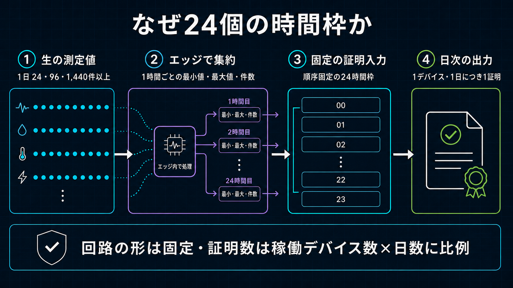

# Cost Benchmark記録

[English](../../implementation/cost_benchmark.md)

この文書は、標準運用UCのCost根拠を記録します。標準UCは温度を1分ごとに計測し、完了日1日あたり
1,440件のPrivate Raw値をDevice内で24時間分の時間別最小値・最大値へ集約し、Daily Attestation ZKPを
1件生成するものです。24／96件RunはRaw Sample数が変わっても運用回路とTransactionが増えないことを
確認した機能Evidenceとしてだけ保持し、別のCost Profileにはしません。



## 対象と状態

| 経路 | 目的 | 状態 | Cost上の扱い |
| --- | --- | --- | --- |
| 標準運用1,440件／日 | 1分ごとのRaw値をPrivateな24時間Extrema Slotへ集約し、PolicyにBindingしたDaily Attestationを1件送信 | 2026-08-30 JSTにSponsor負担Preprod WITHIN確定 | 現行運用Cost Evidence |
| 24／96件の同値性確認 | 少ないLocal Readingでも同じ固定24 Slot回路Inputになることを確認 | Preprod WITHIN確定 | 別料金・別Cost Profileなし |
| 開発専用Daily Profile | Raw Readingをすべて回路展開する不採用設計を調査 | 過去Compile実測を保持 | 運用Costに使用しない |

標準経路では1,440件のRaw値をすべてDevice内に留め、各時間についてPrivateな最小値・最大値を1組作り、
毎日同じ固定24 Slot Inputへ集約します。その後`submitDailyAttestation` Transactionを1件送ります。
DeviceはThreshold Boundを送信できず、回路はMidnightへ登録済みPublic Policyを利用します。Schema-5
Fleet Registry Contract、Device、Policy、Device-bound AssignmentはPreprodへDeploy済みで、導入済み
Edge DeviceからP-256認証、D1 Admission、Cloudflare Proof Server、Device Walletによる処理内容の承認、
Sponsor WalletによるDUST追加、Midnight確定まで、1,440件の標準経路を完了しました。

現行実装はDevice／Lace TXをFeeなしでBindし、専用Sponsor WalletがDUST付与とSubmitを担当します。
2026-08-30 JSTのRunで、Device Serialized Bytes／SHA-256、Sponsor Final Bytes／Hash、Sponsorship時間、
Sponsor DUST Fee、Confirmation、Component Versionを記録しました。従来の自己負担Runは履歴比較として保持します。

Daily ProfileはReadingごとの処理を展開する別の実験回路です。Edge Deviceへ配布せず、明示的なArchitecture変更なしに顧客向け運用Costとして使用してはいけません。

## 計測環境

2026-08-28 JST、Git commit `b68a3b7ec662a7f00a6e7beebf3b66f8a68a8fc5`で計測しました。

| 項目 | 値 |
| --- | --- |
| Host | WSL2 Linux 6.6.87.2、x86-64 |
| WSLへ割り当てられたCPU | AMD Ryzen 9 9950X、16 logical CPUs |
| WSLへ割り当てられたMemory | 66,865,758,208 bytes（約62.3 GiB） |
| Node.js / npm | 22.15.0 / 10.9.2 |
| Compact CLI / toolchain | 0.5.2 / 0.31.1 |
| Midnight JS protocol / wallet SDK | 4.1.1 / 1.2.0 |

Device側のSetup／Wallet実測には、実際に導入されている次の環境を使用します。Software依存の実測は、記載したComponentのいずれかを変更した場合に再実行します。

| 項目 | 値 |
| --- | --- |
| Device OS / architecture | Debian GNU/Linux 13 (trixie)、aarch64 |
| Device Hardware / CPU | Edge Device reference hardware / Cortex-A72、4 logical CPUs |
| Device Node.js / npm | 24.13.1 / 11.10.0 |
| Wallet SDK / wallet-sdk-dust-wallet | 1.2.0 / 4.2.0 |
| Midnight.js protocol / contracts | 4.1.1 / 4.1.1 |
| Compact runtime / ledger | 0.16.0 / 8.1.0 |
| RxJS / tsx | 7.8.2 / 4.23.12 |
| Cloudflare Wrangler / Proof Server image | 4.127.0 / `midnightntwrk/proof-server:8.1.0` |

Setup実測ではwall time、取得可能な場合はuser／system CPU time、平均CPU使用率、最大RSS、最終永続State容量、関連Software Versionを記録します。Wallet同期はCold／Catch-up、Warm Restart、Incremental Syncを分けます。Cold実測を通常のDataset単位運用Costとして扱ってはいけません。

### Sponsor Wallet移行Build Baseline

2026-08-29 JST、Git commit `b68a3b7ec662a7f00a6e7beebf3b66f8a68a8fc5`上の未Commit Sponsor
Wallet移行Working Treeで計測しました。Node.js `22.15.0`、npm `10.9.2`、TypeScript `6.0.3`、
Wrangler `4.127.0`、Docker Engine `29.2.0`、Wallet SDK `1.2.0`、Midnight.js `4.1.1`、
DApp Connector API `4.0.1`、Proof Server `8.1.0`を使用しました。

| Command／操作 | 結果 | Wall | User | System | CPU | 最大RSS |
| --- | --- | ---: | ---: | ---: | ---: | ---: |
| `npm run typecheck` | Sponsor、Device、GUI、Worker Bindingを含む全Workspace成功 | 7.95 s | 17.57 s | 1.60 s | 241% | 397,828 KiB |
| `npm test` | Compact 6回路Compile、127 Test成功 | 16.58 s | 23.73 s | 8.30 s | 193% | 349,328 KiB |
| `npm run build`（Sponsor Image初回Cold Build） | 全WorkspaceとWrangler Dry-run成功 | 51.14 s | 17.15 s | 11.60 s | 56% | 865,480 KiB |
| `npm run build`（Docker Warm Cache、最終Allowlist Context） | 全WorkspaceとWrangler Dry-run成功 | 9.38 s | 14.01 s | 2.32 s | 174% | 838,264 KiB |
| `npm run verify`（日次Sponsor上限Revision） | Portability、6回路Compile、138 Test、全Type Check／Build、Wrangler Dry-run成功 | 38.03 s | 58.44 s | 12.40 s | 186% | 842,004 KiB |
| Local D1 Migration | `0014_sponsored_submission.sql`適用成功 | 個別計測なし | — | — | — | — |
| Local D1 Sponsor上限Migration | `0015_sponsor_daily_quota.sql`、D1 4 Command適用成功 | 個別計測なし | — | — | — | — |
| Remote D1 Sponsor上限Migration | `0015_sponsor_daily_quota.sql`、D1 4 Command適用成功 | 2.01 s | 0.80 s | 0.16 s | 47% | 258,264 KiB |
| Sponsor上限・GUI Deploy | Worker `87416985-8b3e-4a2d-a810-67cd837359e8`、GUI Asset 2件、Sponsor Image `sha256:c2432f3d4f15...` | 50.73 s | 2.69 s | 0.83 s | 6% | 438,972 KiB |
| Streaming Checkpoint修正Deploy | Worker `5af7c47f-5f3f-4877-b31b-39eb25f582bd`、同じCache済みSponsor Image | 12.71 s | 1.78 s | 0.54 s | 18% | 380,056 KiB |
| 公式Public Network同期Gate Deploy | Worker `ac4f188b-8e25-4e08-b0dc-cf04c4b30eaa`、Sponsor Image `sha256:648f5722c8b4...` | 59.22 s | 2.10 s | 0.71 s | 4% | 380,692 KiB |
| Sponsor deny-by-default HTTPS／WSS Policy Deploy | Worker `faf3e26c-88b1-4113-b998-60241dfded96`、同じCache済みSponsor Image | 15.88 s | 2.41 s | 0.78 s | 20% | 380,004 KiB |
| Sponsor Transaction Format Hardening Deploy | Worker `e0f93d94-528b-494c-865b-7b51c3e67ec4`、Sponsor Image `sha256:79bc35bd301b...` | 71.09 s | 2.57 s | 0.82 s | 4% | 395,084 KiB |
| Device Firmware `0.1.0-sponsor.12` Archive | 運用File 85件とCompact Runtime Artifact 28件を検証 | 48.65 s | 8.00 s | 4.59 s | 25% | 676,648 KiB |
| Device Firmware `0.1.0-sponsor.12` Install | System Command 40件、Privilege Command 4件、Node／npm、Release／Artifact、Device Test 41件、Collector Health成功 | 41.429 s | 43.071 s | 11.422 s | — | — |
| Device Firmware `0.1.0-sponsor.13` Archive | 運用File 87件とCompact Runtime Artifact 28件を検証 | 28.22 s | 7.49 s | 4.38 s | 42% | 681,352 KiB |
| Device Firmware `0.1.0-sponsor.13` Install | System Command 40件、Privilege Command 4件、Node／npm、Release／Artifact、Device Test 43件、Collector Health成功 | 42.026 s | 44.222 s | 11.167 s | — | — |
| Device Firmware `0.1.0-sponsor.14` Archive | Process再起動後もPending Device Transactionを再利用する処理を追加し、運用File 87件とCompact Runtime Artifact 28件を検証 | 31.93 s | 7.68 s | 4.41 s | 37% | 652,088 KiB |
| Device Firmware `0.1.0-sponsor.14` LAN転送 | 検証済みArchiveを開発用SSHでEdge Deviceへ転送 | 2.45 s | 0.07 s | 0.03 s | 4% | 10,552 KiB |
| Device Firmware `0.1.0-sponsor.14` Install | System Command 40件、Privilege Command 4件、Node.js `24.13.1`／npm `11.10.0`、Release／Artifact、Device Test 44件、Collector Health成功。Identity／Wallet／設定／Pending TXを保持 | 45.450 s | 44.962 s | 11.400 s | — | — |
| Sponsor前Transaction Bind Deploy | Worker `46d7d13a-29c6-4df7-96f0-2fbd008335cc`、6回路Compile、既存GUI Asset 2件とWorker更新、Container Image変更なし | 27.98 s | 20.36 s | 7.23 s | 98% | 380,236 KiB |
| Edge Device Pending TX復旧確認 | mode `0600`に保存した5,989-byte TXを再利用。Dataset準備73 ms、Submission経路542 ms、新規Proof Server Requestなし。D1はSQL 0.1823 msで`device_bound`へ移行 | 21.389 s | — | — | — | — |
| Pending TX復旧後の最終`npm run verify` | Portability、6回路Compile、147 Test、全Workspace Type Check／Build、Wrangler Dry-run成功 | 37.33 s | 59.60 s | 13.90 s | 196% | 887,636 KiB |
| Sponsor負担Schema-5確定後の最終`npm run verify` | Portability、6回路Compile、182 Test、全Workspace Type Check／Build、GUI Build、Wrangler／Container Dry-run成功 | 46.30 s | 70.64 s | 20.33 s | 196% | 864,252 KiB |
| Project／Policy・GUI復帰Regression `npm test` | Compact `0.31.1`で6回路Compile、Shared／Contract／Dashboard／CLI／Device／Gateway／Sponsorの全287 Test成功 | 25.95 s | 42.21 s | 11.44 s | 207% | 689,388 KiB |
| Project単位Policy Deploy | Migration `0022` SQL 3.92 ms、変更GUI Asset 3件、Worker Upload 12.95 s、Trigger Deploy 6.86 s、Worker `d88891bc-17b3-40c1-9771-5fc92fbd9cc0`、Sponsor Image `sha256:45265f8d4fc...` | — | — | — | — | — |
| Deploy済み英語第三者画面Capture | Chrome `149.0.7827.200`、FFmpeg `6.1.1`、Direct Midnight照合成功、5 fps・62 Frame、MP4 1,139,853 bytes、SHA-256 `59d8c40285279dce1b1159d4637427c1ba074d003830ff212c1b098e861c9a4a` | — | — | — | — | — |

初回Docker実行ではBuild Contextが約900.82 MBでした。最終`.dockerignore`とDockerfileの明示COPYはSponsor
Source、Package Metadata、TypeScript Base Config、Sensor Registry Managed Proof Artifactだけを許可します。
最終Dry-runのCache済みContext転送表示は4.69 kBで、Image内に必須`submitDailyAttestation.prover`
9,990,421 bytesがあることを別途確認しました。Cold／Warm Image BuildはSetup実測であり、Attestation単価ではありません。

上限RevisionのVerifyはNode.js `22.15.0`、npm `10.9.2`、Wrangler `4.127.0`、Compact Toolchain
`0.31.1`、未Commit Working TreeのGit HEAD `b68a3b7ec662`で実施しました。

`0.1.0-sponsor.14` Archiveは24,018,412 bytes、SHA-256
`5803dc2ee924f52fa9295de0e290ea1375a34a2c330baf162f77d888bfe07c62`です。Install後も既存Pending
Transactionをowner-only mode `0600`で保持し、生成済みProofを再構築せずRetryできることを確認しました。

復旧確認は意図的にHTTP 503で終了しました。制限付きHTTPS Interception経路が公式Wallet SDKのGraphQL
WebSocket SubscriptionをCancelし、3種類のWallet Progressがすべて`disconnected, syncing (0/0)`のままに
なるためです。TransactionはD1へ永続的にBind済みで、SponsorのNative TLS／WebSocket Egress Policyを
明示承認後にDeployすれば、新しいProofなしで再開できます。

ここまでで確認したのはBuildとTrust Boundaryです。Sponsor負担Preprod TXはまだ履歴Self-funded Fee行を
置き換えていません。新Sponsor Addressへの入金後、Sponsor同期、DUST登録、初回Fee-only Balance、Submit、
Confirmを実測します。

固定中のWallet SDK `1.2.0`／DUST Wallet `4.2.0`は、
[Midnight servicedesk issue 165](https://github.com/midnightntwrk/servicedesk/issues/165)で追跡される
Preprod DUST Replay非収束の影響を受けます。このため運用Gateは現行公式Public Network例に従い、Shielded／
UnshieldedのStrict Completeを必須とし、DUST ReadyはSpend可能なDUST Coinの存在で別に判定します。
DUSTが利用可能になる前のFee Transactionを許可せず、初期化の永久待機だけを回避します。

### 現行Fleet Registry固定24 Slot実装のLocal Build Baseline

2026-08-28 22:36〜22:38 JST頃、上記開発HostでNode.js `22.15.0`、npm `10.9.2`、Compact CLI
`0.5.2`、Toolchain `0.31.1`、Language `0.23`、Runtime `0.16.0`、Wrangler `4.127.0`を使用して計測しました。
Git commit `b68a3b7ec662a7f00a6e7beebf3b66f8a68a8fc5`上の未Commit Schema-3 Fleet Registry変更を含みます。
このRevisionは同一の`submitDailyAttestation`回路で、正しいWITHINとOUTSIDEの両Resultを証明します。

| Command | 結果 | Wall | User | System | CPU | 最大RSS |
| --- | --- | ---: | ---: | ---: | ---: | ---: |
| `npm run contract:compile` | Proving Circuit 6件をCompile | 14.18 s | 17.39 s | 5.65 s | 162% | 349,156 KiB |
| `npm test` | Compileと105 Test | 20.37 s | 26.53 s | 8.14 s | 170% | 402,644 KiB |
| `npm run verify` | Portability、Compile、109 Test、全Type Check、全Build、Wrangler Dry-run | 33.46 s | 53.76 s | 11.17 s | 194% | 855,400 KiB |

| Circuit | Prover Key | Verifier Key | ZKIR | BZKIR |
| --- | ---: | ---: | ---: | ---: |
| `registerDevice` | 2,820,986 B | 2,119 B | 7,999 B | 486 B |
| `rotateDeviceAuthority` | 2,820,972 B | 2,119 B | 8,678 B | 516 B |
| `disableDevice` | 2,820,543 B | 2,119 B | 6,287 B | 380 B |
| `registerThresholdPolicy` | 2,821,341 B | 2,119 B | 7,044 B | 441 B |
| `registerPolicyAssignment` | 2,821,426 B | 2,119 B | 9,673 B | 571 B |
| `submitDailyAttestation` | 9,990,428 B | 2,119 B | 75,272 B | 5,654 B |

直前のWITHIN専用Fleet Registry Artifactと比べ、改訂後Daily Attestation Prover Keyは
9,990,614 Bから9,990,428 Bへ186 B減少（約-0.0019%）しました。ZKIRは1,606 B、BZKIRは155 B増えましたが、
Contractは6回路のままです。したがってResult Booleanにより回路数、Transaction数、Sample単位のProof経路は
増えません。Compile／Verify時間は開発HostのSetup Costであり、通常の試行間変動を含みます。

これはLocal Build／Artifact実測です。Proof Server Latency、Container計画Usage、DUST Fee、Preprod Confirm時間は現行運用E2E節で別に記録します。

### Browser Device WorkflowのBuild・Verify実測

2026-08-28 19:35〜19:37 JST頃、Vite `8.2.2`、Midnight DApp Connector API `4.0.1`、
Midnight.js `4.1.1`、Wrangler `4.125.0`、Google Chrome `149.0.7827.200`で計測しました。
Browser WalletによるDevice WorkflowとBrowser互換Polyfillを含む未Commit Working Treeです。

| Command | 結果 | Wall | User | System | CPU | 最大RSS |
| --- | --- | ---: | ---: | ---: | ---: | ---: |
| `npm run build -w @midnight-demo/dashboard` | Browser本番Bundleと6回路ZK Assetを生成 | 1.01 s | 1.20 s | 0.78 s | 196% | 883,348 KiB |
| `npm run verify` | Portability、6回路Compile、81 Test、全Type Check／Build、Wrangler Dry-run | 32.28 s | 51.25 s | 10.66 s | 191% | 858,720 KiB |

生成した`device-flow.js`は16,567.41 kB（gzip 6,262.97 kB）です。Device Workflow Routeでのみ
遅延Loadし、既存の管理者／第三者Verify ViewではDownloadしません。Headless ChromeではModule／
Polyfill ErrorなくProvisioning境界まで実行でき、旧Schema-1 Preprod Deployに対して
`Compatible Preprod Fleet Registry deployment was not found`として安全に停止しました。これは
Browser Runtime検証成功と想定どおりの互換性停止であり、実Preprod TX成功値ではありません。

### 日別Browser履歴と完了日制限の実測

2026-08-28 21:52〜21:55 JST頃、Vite `8.2.2`、Wrangler `4.127.0`、Google Chrome
`149.0.7827.200`で計測しました。この変更はBrowser内のPrivate日次保存、固定1,440件のAuto
Generate、時間別履歴、新しい順のPublic Proof選択、完了済みJST日付の制限を追加します。審査用生成は
完了済みの過去30日間だけを受け付け、実Deviceの受信APIは変更しません。

| Command／Step | 結果 | Wall | User | System | CPU | 最大RSS |
| --- | --- | ---: | ---: | ---: | ---: | ---: |
| Dashboard Test | 日付境界を含む13 Test成功 | 0.56 s | 0.91 s | 0.24 s | 204% | 167,532 KiB |
| Dashboard本番Build | `device-flow.js` 16,577.77 kB（gzip 6,266.03 kB） | 1.08 s | 1.21 s | 0.89 s | 195% | 844,364 KiB |
| 最終`npm run verify` | Portability、6回路Compile、105 Test、全Type Check／Build、Wrangler Dry-run | 30.31 s | 53.91 s | 10.90 s | 213% | 835,952 KiB |
| Cloudflare Deploy | Worker `10d3defd-7422-47d5-94d7-1128924f9617`、GUI Asset 2件、Migration／Container Image変更なし | 17.88 s | 2.55 s | 0.50 s | 17% | 447,320 KiB |

これらは開発／Deploy Setup実測であり、Attestation 1件あたりのProof ServerまたはMidnight
Transaction Costではありません。

### Local審査Data同期・説明動画撮影

2026-08-28 23:24〜23:27 JST頃、Wrangler `4.127.0`、Google Chrome `149.0.7827.200`、
FFmpeg `6.1.1-3ubuntu5`で計測しました。`dashboard:sync`はLocal D1 Migrationを先に適用し、
審査に必要なPublic Stateだけを複製します。実測ではProject 1件、Device／公開鍵2件、1時間Window
35件、Anomaly Event 2件、Policy 1件、Assignment 2件、Confirm済みDaily Proof Job 3件を取得しました。
Reading、Device Session／Challenge、Token Hash、Operator Lease、署名済みTransaction Object Key、
R2 Proof Artifactは除外しました。

| Command | 結果 | Wall | User | System | CPU | 最大RSS |
| --- | --- | ---: | ---: | ---: | ---: | ---: |
| `npm run dashboard:sync` | Local MigrationとPreprod Public審査Stateの複製 | 21.73 s | 18.11 s | 3.26 s | 98% | 288,420 KiB |
| `npm run dashboard:capture-demo` | 管理者から第三者検証へ遷移する日本語Walkthrough、5 fps／119 Frame | 49.51 s | 6.26 s | 2.93 s | 18% | 773,104 KiB |
| `npm run cloudflare:deploy` | 最終完了Step Asset、Worker `1bb595e7-4f59-4c2e-93fb-7e3af96ab3bc`、Migration／Container変更なし | 11.12 s | 2.20 s | 0.41 s | 23% | 382,292 KiB |

最終MP4は23.8秒、1,781,825 bytesです。SHA-256は
`7b101aef70e46609c45e9ebb0221006a4cbd2d6017f7b3639a0adeba497b8555`です。Confirm済み
1,440件OUTSIDE Resultを使い、審査6 Stepの完了とPublic Claim検証を示します。Privateな時間別Extrema、
Nonce、Wallet Material、Raw Readingは表示しません。MP4、Screenshot、Frame、Checksum Metadataは
Gitignore済み`.demo-output/`配下に保持します。
最終Upload後、Deploy済みHealth／Public Proof EndpointはいずれもHTTP 200を返し、OUTSIDE Claimは
現行Contractに対してMidnight Block `2302213`でVerify／Confirm済みのままであることを確認しました。

### Device運用設定取得の導入実測

2026-08-28 JST、開発HostのWrangler `4.125.0`とEdge DeviceのNode.js `24.13.1`で計測しました。
Migration `0012_device_operation_configuration.sql`は単調増加するPublic Configuration Revisionと
Device用`configuration:read` Scopeを追加します。認証済みDeviceは現行Preprod Contract、Public
Threshold Policy、Device-bound AssignmentをWorkerから取得し、Firmware ArchiveへDeployment Addressを
埋め込みません。

| Step | 結果 | Wall | User | System | 最大RSS |
| --- | --- | ---: | ---: | ---: | ---: |
| `npm run cloudflare:deploy` | RemoteへMigration `0012`を適用し、Worker Version `f80110fb-cb65-470c-a713-379469c7e66a`をDeploy | 10.81 s | 2.32 s | 0.43 s | 378,636 KiB |
| CSP／CORS Worker再Deploy | Browser WASM用CSPとLoopback限定の開発CORS。Worker Version `6fa01d4b-df47-49dd-8ca6-20a88a6e8419`、Migration／Container Image変更なし | 21.23 s | 2.39 s | 0.58 s | 438,428 KiB |
| Browser状態復元Deploy | 永続Device Identityと認証済み登録／Policy状態を復元。Worker Version `02a51e90-628c-42f9-9e1f-c33e62c2cd79`、Migration／Container Image変更なし | 18.57 s | 2.38 s | 0.45 s | 437,996 KiB |
| Browser状態復元の追補Deploy | GUI初期復元を直列化し、Device Sessionの二重発行を防止。Worker Version `df8c6ea8-23a8-4c6e-8aee-1e5e628d135a`、Migration／Container Image変更なし | 9.64 s | 2.15 s | 0.40 s | 379,292 KiB |
| `.11` Firmware Packaging | 運用File 88件、検証済みCompact Runtime Artifact 28件 | 30.23 s | 7.43 s | 4.02 s | 669,904 KiB |
| `.11` Edge Device Install | Device Test 37件成功、既存Identity／Walletを保持 | 50.993 s | 60.331 s | 12.459 s | 取得不可¹ |
| `.12` Firmware Packaging | 生成Rootの`device:configure` Entryを修正、File 88件／Artifact 28件 | 20.71 s | 7.14 s | 4.01 s | 644,904 KiB |
| `.12` Edge Device Install | Device Test 37件成功、既存Identity／Walletを保持 | 48.866 s | 59.111 s | 12.473 s | 取得不可¹ |
| `.12`上の`npm run device:configure` | P-256 Session認証とPublic Configuration Revision `1`を導入 | 18.950 s | 18.558 s | 1.837 s | 取得不可¹ |
| `.13` Firmware Packaging | 電源断時State復旧を追加、File 88件／Artifact 28件 | 27.62 s | 7.13 s | 4.24 s | 668,876 KiB |
| `.13` Edge Device Install | Device Test 38件成功、既存Identity／Wallet／設定を保持 | 47.210 s | 59.595 s | 12.470 s | 取得不可¹ |
| Schema-3 Contract Deploy | 新6回路Fleet RegistryをPreprodへDeployし、Operator Proof Leaseを失効 | 2分43.86 s | 31.70 s | 8.05 s | 503,092 KiB |
| Schema-3 Cloudflare Deploy | Migration `0013`、Worker `613097d9-1c4d-4910-a13b-4f9aeb00be91`、既存Proof Server Imageを保持 | 18.55 s | 2.55 s | 0.62 s | 525,996 KiB |
| `.14` Firmware Packaging | Schema-3 Artifact／運用設定、File 88件／Artifact 28件 | 31.81 s | 7.21 s | 4.02 s | 672,896 KiB |
| `.14` Edge Device Install | Device Test 38件成功、既存Identity／Wallet／設定を保持 | 48.110 s | 59.329 s | 12.449 s | 取得不可¹ |
| `.14`上の`npm run device:configure` | 認証済み設定Revision `2`、Schema `3`、Policy、Assignmentを導入 | 18.788 s | 18.390 s | 1.809 s | 取得不可¹ |
| `.15` Firmware Packaging | 登録済みDevice ID、完了日、正しいOUTSIDE Benchmark対応、File 88件／Artifact 28件 | 32.13 s | 7.56 s | 4.03 s | 691,928 KiB |
| `.15` Edge Device Install | Device Test 39件成功、既存Identity／Wallet／設定を保持 | 56.951 s | 66.004 s | 15.212 s | 取得不可¹ |
| 最終`npm run verify` | Portability、6回路Compile、88 Test、全Type Check／Build、Wrangler Dry-run | 35.87 s | 54.77 s | 11.36 s | 834,300 KiB |
| `npm run dashboard:sync` | RemoteのPublic／Redacted StateをLocal D1へ複製し、Credential／Private Artifactを除外 | 20.76 s | 15.52 s | 2.80 s | 282,648 KiB |

Remote D1 MigrationのSQL Durationは**5.85 ms**でした。`.11`のInstall自体は成功しましたが、生成した
Root Packageに新Commandが含まれず、最初のConfiguration Entry Point確認はWorkerへ接続する前に失敗しました。
`.12`でPackage Builder／Verifierを修正し、Deploy済みContract Schema `2`、Policy `temperature-v1`、
Device-bound Wave 1 Assignmentの導入まで成功しました。`.11` Archiveは24,014,474 bytes、SHA-256
`28aa333029b1df77f15975af57c87fb588d3b29c942d99d39eb8af9ae8fe5483`、`.12`は24,014,387 bytes、
SHA-256 `b1bd2acae03daed2b9d9eb52f8407f5869a68b27bc30face1eedb6fdea0c5b4b`です。
`.13`は不意の電源断後に実在した354-byteのNUL充填Collector Stateを契機に追加しました。このFileを
Timestamp付き`.corrupt-`名で保持し、新しいowner-only Stateを作成して、Outbox待ちなしのSynthetic
CollectorとLoopback Healthを復旧しました。`.13` Archiveは24,014,539 bytes、SHA-256
`e5d6c0111623b4ce451ea02cd06dc156e886a1110ba2e9399630bcc57602e15a`です。

Remote Migration `0013`のSQL Durationは**6.37 ms**でした。`.15`は24,018,047 bytes、SHA-256
`0ffff19814d1cc36731e7cabd37d998d2913b5fc96a6ee4e419cd98f4a8a7e78`です。Installerは既存のP-256
Identity、Device Contract Authority、Wallet、認証済み運用設定を保持し、切替後のEdge Collectorも正常です。

復旧とDevice Identity移行は2026-08-29 JSTに計測しました。開発HostはNode.js `22.15.0`、npm
`10.9.2`、Wrangler `4.127.0`、Edge DeviceはNode.js `24.13.1`です。

| Step | 結果 | Wall | User | System | 最大RSS |
| --- | --- | ---: | ---: | ---: | ---: |
| Remote D1 Migration `0006`-`0013` | 現行認証、Queue、Policy、複数Device、運用設定、Daily Result Schemaを適用 | 6.12 s | 0.92 s | 0.19 s | 262,120 KiB |
| Edge Device Device／Policy／Assignment Mirror同期 | 確定済みSchema-3 Midnight証跡をD1へ復元 | 7.70 s | 3.83 s | 0.61 s | 316,600 KiB |
| Browser Device D1 Provisioning | 確定済みBrowser DeviceをMirror同期可能な状態に準備 | 3.61 s | 2.30 s | 0.38 s | 257,332 KiB |
| Browser Device／Policy／Assignment Mirror同期 | 確定済みSchema-3 Midnight証跡をD1へ復元 | 5.72 s | 3.54 s | 0.60 s | 258,740 KiB |
| Edge Device P-256公開鍵有効化 | 同じKey IDをWave 1の全8 Scopeで登録 | 6.20 s | 2.39 s | 0.43 s | 269,616 KiB |
| `.16` Firmware Packaging | 移動後の運用Document Pathを修正、File 88件／Artifact 28件 | 33.65 s | 7.48 s | 4.33 s | 674,352 KiB |
| `.16` Edge Device Install | Device Test 39件成功、既存Identity／Walletを保持 | 49.010 s | 59.370 s | 12.650 s | 取得不可¹ |
| `.17` Firmware Packaging | 冪等なEnrollment Scope移行を追加、File 88件／Artifact 28件 | 29.88 s | 7.35 s | 4.05 s | 669,596 KiB |
| `.17` Edge Device Install | Device Test 40件成功、P-256 Key ID／Walletを保持しPublic Enrollmentを更新 | 51.223 s | 60.525 s | 12.776 s | 取得不可¹ |
| `.18` Firmware Packaging | 設定済みService Origin変更時のDevice Session再発行を追加、File 88件／Artifact 28件 | 31.08 s | 7.52 s | 4.17 s | 681,936 KiB |
| `.18` Edge Device Install | Device Test 40件成功、P-256 Key ID／Walletを保持 | 51.851 s | 60.645 s | 12.862 s | 取得不可¹ |
| `.18` Configuration試行 | Install済み設定に残った古いProof Service URLを正しく検出して失敗 | 18.704 s | 未記録 | 未記録 | 取得不可¹ |
| `.19` Firmware Packaging | Worker Base URLをIngestion／Proof APIの双方へ反映、File 88件／Artifact 28件 | 29.34 s | 7.15 s | 4.03 s | 671,320 KiB |
| `.19` Edge Device Install | Device Test 40件成功、P-256 Key ID／Walletを保持 | 50.696 s | 60.949 s | 12.387 s | 取得不可¹ |
| `.19`認証済みConfiguration | Revision `2`、Schema `3`、Policy、Assignment、両Service URLを同期 | 18.894 s | 18.699 s | 1.772 s | 取得不可¹ |
| `.19` Edge Device 1,440件E2E | P-256認証、Scheduled Job Admission、Proof Server ZKP、Device Wallet TX、Midnight Confirm | 2分0.598 s | 41.601 s | 2.569 s | 取得不可¹ |
| 現行Dashboard Build | Compact 6回路、現行ZK Artifact、Lace Indexer CSP、Browser Private State互換Guard | 15.34 s | 18.95 s | 6.46 s | 838,344 KiB |
| 第三者GUI Bundle再Build | Public Dataの非Blocking更新、値の黒塗り、公開ZK確認Step、Explorer Link | 1.04 s | 1.16 s | 0.90 s | 839,196 KiB |
| 現行Cloudflare Deploy | D1 Migration／Container Image変更なし、Worker／GUI Asset更新 | 12.49 s | 2.09 s | 0.42 s | 381,664 KiB |
| 親しみやすい第三者向け文言のDeploy | Wrangler `4.127.0`、D1 Migration／Container Image変更なし、GUI／Worker Asset 3件更新 | 17.90 s | 2.49 s | 0.73 s | 447,676 KiB |
| 親しみやすい値表示の最終Deploy | Wrangler `4.127.0`、D1 Migration／Container Image変更なし、`app.js`のみ更新 | 11.77 s | 2.05 s | 0.48 s | 376,008 KiB |
| Midnight Explorer詳細Link修正Deploy | Wrangler `4.127.0`、Transaction／Contract／Block Routeを修正、`app.js`のみ更新 | 13.63 s | 2.19 s | 0.49 s | 379,968 KiB |
| 現行GUI操作動画Capture | Chrome `149.0.7827.200`／FFmpeg `6.1.1`、5 fpsで119 Frame、1,845,465-byte MP4 | 8.15 s | 4.93 s | 1.69 s | 772,812 KiB |
| 冪等Reviewer State同期 | Local Public Cacheを現行Remote Snapshotで置換 | 14.10 s | 9.26 s | 1.72 s | 289,836 KiB |
| Lace用Loopback Proof Server Cold Start | Docker Engine `29.2.0`上のProof Server `8.1.0`、Container起動から待受開始 | 8.12 s | 未記録 | 未記録 | 未記録 |
| 以前のRepository全体検証（126 Test Snapshot） | Portability、6回路Compile、126 Test、全Type Check／Build、Wrangler Dry-run | 34.11 s | 55.72 s | 11.58 s | 846,424 KiB |

`.16`は24,018,161 bytes、SHA-256
`89f52b5a326cc57d47ce8388756e5b821a2e01a364b807eaaf0869e7ad321877`です。`.17`は
24,020,157 bytes、SHA-256
`8350f70431e044cbcf659425c31e4a5e3423d86bcd9be783c86c8ae4489e6e33`です。`.17` Installerは
保護された秘密鍵からP-256公開鍵を再導出し、Key IDが不変であることを検証してから、Device Identityを
Rotateせず現行`configuration:read` Scopeを追加しました。

`.18`は24,020,315 bytes、SHA-256
`a0b5e9980c46b3bdd177d85233c1591953c0b3191dbad3351170291a3b854c6b`、`.19`は
24,020,351 bytes、SHA-256
`7a93a8a0c00cc4ef79d6a68c7215fabff3f0b13c4a4b0062d7e194b7917db8bf`です。`.18`の失敗は
設定移行の検証失敗実測であり、Proof生成やTransaction送信は行っていません。`.19`でService URL移行を
修正し、P-256 Device Identity／Device WalletをRotateせずConfigurationを完了しました。

`.19`運用検証は、1分間隔のSynthetic Reading 1,440件をPrivateな24時間Slotへ集約し、正しい
WITHIN ResultをConfirmしました。Dataset準備69 ms、Proof Server Ready 6,214 ms、Private State準備
4,478 ms、Contract接続4,056 ms、Attestation Transaction 60,226 msです。認証済み`/check`は
7,180 bytes／355 ms、`/prove`は9,999,783 bytes／27,170 msでした。9,175-byte TransactionのFeeは
`0.821170000000001 DUST`、Block `2303416`、Transaction IDは
`00e48038a736710bf6216fecbef3cd16568d91668893e5320bd7915c0725e116bc`です。第三者APIは4項目すべて
`true`を返し、時間別Extrema／Commitment Nonceは非公開のままです。これは同じ固定1,440件Cost
Profileの2回目の実測であり、新しいSampling Tierではありません。

2026-08-29 JSTには審査用Browser Deviceも、生成した1,440 Readingを同じ24 Private Slotへ集約して検証
しました。挿入した2つのOutlierにより、正しいOUTSIDE Attestationになりました。Contract Proofは認証済み
Cloudflare Proof Server Container、Lace内部のDUST／Zswap ProofだけはLoopback Proof Serverを使用し、
LaceがTransaction
`008387b4826c52df517fd24b45e50183023ffcd5af4725b2ad525943368eec5791`へ署名してSubmitしました。
Public Proof Job `proof-3f23d3d79bfd66d3fb02cbd2a4a995f1270e9b026d01d30e`は`confirmed`となり、第三者画面の
4確認項目はすべて`true`で、時間別Extrema／Nonceは非公開のままでした。これはBrowser Workflowの
同値性Evidenceであり、価格計算行を追加するものではありません。上記Loopback起動はLaceの一度きりの
Setup Costで、Edge Device運用経路またはAttestationごとのCloudflare Costには含めません。

`0.1.0-sponsor.11`運用Archiveは、Installerの全依存事前検査と長時間Sponsor Ready待機を追加しました。
運用File 85件と検証済みCompact Runtime Artifact 28件のPackagingは、**wall time 29.03秒**、
**最大RSS 667,648 KiB**（user `7.25秒`、system `4.13秒`、CPU `39%`）で完了しました。Archiveは
24,016,657 bytes、SHA-256は
`7c077d87e05862261533df9ea8fc148917c304ad36dd5b2a0f022664728d18ac`です。Edge DeviceへのInstallは
**wall time 42.848秒**（user `44.110秒`、system `11.437秒`）でした。Device State変更前にSystem Command
40件、Command別sudo権限4件、Node.js 24.13.1／npm 11.10.0を検査し、aptは起動しませんでした。その後、
Device Auth 6件、Edge 13件、Device Wallet 21件のTestに成功し、既存P-256 Key ID、Contract Authority、
Wallet、運用設定を保持してCollector Healthを確認しました。DeviceにGNU `/usr/bin/time`がないため、
Install時の最大RSSは未取得です。これはSetup実測であり、Attestation 1件あたりの運用Costではありません。

¹ Edge DeviceにはGNU `/usr/bin/time`がなかったため、Bash `time`でwall／user／systemを取得しましたが最大RSSは
取得できませんでした。これらはSetup実測であり、Attestation 1件あたりの運用Costではありません。

同じ形式で再計測するCommandは次です。

```bash
npm run benchmark:compile -- --samples 24
npm run benchmark:compile -- --samples 96
npm run benchmark:compile -- --samples 1440 --skip-zk
```

機械可読Resultはmode `0600`で`.state/development/benchmarks/`配下へ保存します。このDirectoryにはPrivateになり得る他のBenchmark／Wallet Stateもあるため、意図的にgitignoreしています。追跡対象の要約がこの文書です。

廃止済みSelected-leaf時点のrepository全体verifyは、同じHostで2026-08-28 15:11 JSTに**wall time 21.19秒**、**最大RSS 395,696 KiB**（user `34.67秒`、system `5.59秒`、CPU `189%`）で正常終了しました。選択済み63 Test、全Type Check、Wrangler dry-runを含み、Compactは`registerDataset`を`4,857 rows`（`k=13`）、`verifySensorValue`を`9,231 rows`（`k=14`）と報告しました。開発履歴として保持し、現行顧客1件あたりのProof Costには使いません。

以前の`0.1.0-wave1.20260828.9`運用Firmware Archiveは、Portability Check、Artifact Export、Production Lock検証、Release検証、展開後検証、Checksum生成を**wall time 29.99秒**、**最大RSS 677,984 KiB**（user `7.07秒`、system `3.83秒`、CPU `36%`）で完了しました。Manifest対象の運用File 67件と検証済みCompact Runtime Artifact 12件を含みます。Archiveは8,075,679 bytes、SHA-256は`64713095c54ed07d001d7d76126036862c7b8e1ea975cdcd25ab9ce878fe2244`です。

このArchiveのEdge DeviceへのInstallは**wall time 71.571秒**（user `85.248秒`、system `17.293秒`、CPU `143.27%`）で完了しました。Installerは既存のDevice Identity、Wallet資格情報、Contract Authorityをowner-only権限のまま検証・保持し、Device Test 31件を実行して、運用File 67件とArtifact 12件を導入しました。後のProcess監査で、Install中に旧`.6`のWallet Catch-up ProcessがDetached状態で残っていたことが判明しました。この値は実際の観測値ですが、無干渉のBaselineではありません。Active Cooling導入後、Wallet Processが動作していない状態で再計測します。

ファンなしのEdge Deviceは、Idle時に**80.8〜84.7℃**、Wallet Catch-up中に**84.2〜85.2℃**へ達しました。`vcgencmd get_throttled`は`0xe0008`で、現在／過去のSoft Temperature Limitと、過去のThrottling／Frequency Cappingを記録しています。現行`.9` Wallet Processは約101% CPU、542 MiB RSSを使用しました。また、旧`.6`のDetached Processも約101% CPU、449 MiB RSSを使用していたため、`.9`を継続したまま旧Processだけを停止しました。したがって、現在のRunは熱制限下の診断実測であり、CleanなCold Sync Baselineではありません。計測時点のRoot Filesystemは440 GBの`/dev/sda2`で、52 GB使用、371 GB空きです。Active Cooling導入後、持続負荷時70〜75℃未満を目標としてCold／Catch-upとWarm Syncを再計測します。

後続の`0.1.0-wave1.20260828.10` ArchiveはDevice Walletの単一Process LockとProofごとのSession認可更新を追加しました。同じPackaging検証を**wall time 27.46秒**、**最大RSS 674,832 KiB**（user `7.16秒`、system `4.47秒`、CPU `42%`）で完了しました。Manifest対象の運用File 71件と検証済みCompact Runtime Artifact 12件を含みます。Archiveは8,077,074 bytes、SHA-256は`f639f3860febdabb93dcd5ba0f99186bb9981c53f779cecbe8352a76d7daddf5`です。実行中の`.9` Catch-up／TransactionとWallet Stateを中断しないよう、Device Installは完了後に実施します。

## 開発専用Daily compile実測

| 件数 | ZK key | Wall | User | System | CPU | 最大RSS | Daily prover key | 全prover key | Daily ZKIR |
| ---: | --- | ---: | ---: | ---: | ---: | ---: | ---: | ---: | ---: |
| 24 | 生成 | 56.91 s | 78.03 s | 23.22 s | 177% | 2,731,200 KiB | 76,620,395 B | 87,476,746 B | 5,093 B |
| 96 | 生成 | 310.20 s | 333.19 s | 120.45 s | 146% | 10,900,028 KiB | 304,616,597 B | 315,472,948 B | 16,646 B |
| 1,440 | 省略 | 1.25 s | 0.91 s | 0.26 s | 93% | 274,920 KiB | 未生成 | 未生成 | 未生成 |

96件full compileは24件に対し、wall timeが5.45倍、最大RSSが3.99倍、Daily prover keyが3.98倍でした。

1,440件full ZK compileは意図的に開始していません。96件Resultだけから単純比例しても約77.6分、最大RSS 155.9 GiB、Daily prover key 4.26 GiBです。これは実測ではなく推計であり、24件から96件のwall timeは既に線形より悪化しています。このHostの62.3 GiB Memoryを超えます。

Proof Gatewayが受け付けるProof Requestは最大95 MiBです。96件の実験Daily Prover Keyだけで約290.5 MiBのため、96件／1,440件の実験ProfileはGatewayを通過できません。`registerDataset` 287,387 bytes、`verifySensorValue` 2,822,508 bytesはSelected-leaf履歴値であり、新しい`submitDailyAttestation` KeyはArtifact Packaging後に計測します。

## Proof計測

旧Cloudflare Deploymentに対する最初の24件Daily Proofは、Ready確認で約5分後にTimeoutしました。`/check`と`/prove`は未送信、Fee未計算、Midnight Transaction未送信です。失敗Resultは`.state/development/benchmarks/daily-attestation-24.json`へ保持し、Proof生成実測としては扱いません。

再作成したCloudflare環境は次の構成です。

| Resource | 構成 |
| --- | --- |
| Worker | `midnight-proof-gateway` |
| D1 | `midnight-sensor-data-v2`、APAC、Device Key、One-time Challenge、Opaque Session、Fleet Registry Mirror、1時間Summary、Anomaly、Daily Proof Job／Result、Sponsor送信状態、運用設定Revision、短命Operator Proof Leaseを含む17 migrations |
| Proof Container | `midnightntwrk/proof-server:8.1.0` |
| Instance | `standard-2`: 1 vCPU、6 GiB Memory、12 GB Disk、最大1 instance |
| Lifecycle | Request activityが2分なければscale to zero |
| Egress | HTTPS interceptionで`srs.midnight.network`だけをallowlistし、他のContainer送信先は遮断 |
| Observability | 構造化`proof_gateway_upstream` LogへEndpoint、request／response bytes、status、Container往復msを記録。Proof bodyとAuthorizationは記録しない |

### 標準1,440件Preprod E2E・Cost実測

#### 現行運用日起点の実測

2026-09-02 JST、導入済みDevice Release
`0.1.0-operational-day-e2e-20260902.1`が、実際のEdge Device上で1分ごとの疑似Reading 1,440件を
生成しました。Deviceは登録済みのJST境界（UTC+09:00、Local Day Start 00:00）を使い、運用日
`2026-09-01`のPrivateな24時間別Extrema Slotへ集約し、公開10～35 °C Policyに対するWITHIN
Attestationを1件送信しました。Proof ServerがZK Proofを生成し、Sponsor WalletがDUST手数料を付与し、
Midnight PreprodでTransactionが確定しました。疑似なのは入力Readingだけであり、Device認証、集約、
Proof生成、Sponsor送信、Chain確定、第三者検証はDeploy済みの運用経路を使用しています。

| 件数/日 | Submit全体 | Proof Ready | Private State | Contract接続 | Attestation TX | `/prove` | Sponsor処理 | Device TX | Sponsor TX | Fee |
| ---: | ---: | ---: | ---: | ---: | ---: | ---: | ---: | ---: | ---: | ---: |
| 1,440 | 252.818 s | 4.579 s | 1.551 s | 4.953 s | 195.419 s | 46.730 s | 80.026 s | 6,162 B | 9,348 B | 0.636020000000001 DUST |

| Evidence | 値 |
| --- | --- |
| Proof Job | `proof-d40390164cae2ba601b7d2cc9d9f733fb6faae05fa88ebb0` |
| Contract | `0abb6d408a5b8fedbdab9e0fff59f1a5570d3c94af0059bf44b36b3669ee9ddd` |
| Transaction Hash | [`92569ab4d9c49661dcca78253b785c2a154672285231244cae14c4a0caf604a3`](https://preprod.midnightexplorer.com/transactions/92569ab4d9c49661dcca78253b785c2a154672285231244cae14c4a0caf604a3) |
| Block高 | 2,369,094 |
| Attestation Commitment | `6c0691cf5cdae3753d086e08558525149b13a804d1bfa1f254f0c2a8bf6f14cf` |
| 公開結果 | Observed 24／STOPPED 0、24時間すべてWITHIN |
| TX Hash単独の第三者検証 | `dailyAttestationRecorded=true`、`committedHourlyExtrema=true`、`attestationVerified=true`、`midnightConfirmed=true`。D1 API Requestなし |
| 関連Software | Compact Toolchain `0.31.1`、Proof Server `8.1.0`、Wallet SDK `1.2.0`、Midnight.js `4.1.1`、Wrangler `4.127.0`、Device Node.js `24.13.1`／npm `11.10.0`、Chrome `149.0.7827.200` |

Device Archive Buildは**30.29秒 wall time**（user `7.61 s`、system `4.62 s`、最大RSS
667,796 KiB）でした。InstallとDevice専用Regression Testは約52秒で完了しました。Deviceに
`/usr/bin/time`がないためInstall時の最大RSSは取得していません。Deploy済み英語版GUIの検証Captureは
TX Hashを直接使い、D1 API Requestなしで完了し、5 fps・99 framesを生成しました。

#### 以前のSponsor負担Schema-5実測

2026-08-30 JST、導入済みEdge DeviceのFirmware `0.1.0-wave1.20260830.1`で、1分ごとのPrivate
Reading 1,440件から完了済みのWITHIN日を生成しました。Device内で固定24時間分のPrivate Extrema
Slotへ集約し、運用開始前にDeviceへ割り当てた公開10～35 °C PolicyをCircuit Version `3`で証明しました。
手数料なしDevice TXを1回だけ受理し、専用Sponsor WalletがDUSTを追加し、Preprod Contract
`10cb9e430180afca0c6840a16dc4a20e9cefa53f27d4aa5bc236b521eac0b2f2`で確定しました。

| 件数/日 | Result | Local準備 | 初回Submit／Poll | Sponsor処理 | 同一バイト列Status復旧 | Device TX | Sponsor TX | Fee |
| ---: | --- | ---: | ---: | ---: | ---: | ---: | ---: | ---: |
| 1,440 | WITHIN | 0.070 s | 135.195 s¹ | 30.303 s | 2.337 s | 6,100 B | 9,286 B | 0.632920000000001 DUST |

¹ 初回CommandはSponsor送信まで成功しましたが、Device側のStatus取得が一時的な`fetch failed`で終了しました。
所有者限定の6,100-byte TXを保持し、Firmware `0.1.0-wave1.20260830.1`でStatus取得を再試行して、同じ
Proof Jobと完全に同じバイト列から復旧しました。復旧時のProof Server Requestは0件です。D1もSponsor試行
1回、利用枠予約1件のままであり、復旧時間は2回目のProof／TX Costではありません。

| Evidence | 値 |
| --- | --- |
| Proof Job | `proof-54b6265653e83a2d81129d576ebd7fe49c33a3cd35c355fd` |
| Measurement Group | `02a103eae759fceac076878f2515436bb6b9b6a2de43155529bc8ebc90b26f21` |
| Device TX SHA-256 | `6efcd6b1b470a15fb01b4deb13edc6f12dadd481bb0b02a3f316eda7be5b440d` |
| Sponsor TX ID | `00038e81328f0da4c6e48c61b7d9f0923e3aa4f5970b7dc0e0aa70648071f91914` |
| Sponsor TX SHA-256 | `5cf9ba0fffb253bffdd5f2c708004ec65b232ea22b7b6c9704b796a2068a873f` |
| Block高 | 2,317,466 |
| 第三者検証 | `resultVerified=true`、`midnightConfirmed=true`。時間別ExtremaとNonceは非公開 |
| 関連Software | Compact Toolchain `0.31.1`、Proof Server `8.1.0`、Wallet SDK `1.2.0`、Midnight.js `4.1.1`、Wrangler `4.127.0`、Device Node.js `24.13.1`／npm `11.10.0` |

Firmware Archive Buildは約30.0秒で、運用File 88件とRuntime Artifact 28件を検証しました。Archiveは
33,465,585 bytes、SHA-256は`ffd22096667a3c1307772b0c4fc0e6507138cc066b5d54e4c1d650e061ea7703`です。
LAN転送は5.11秒、Installは約55.0秒で、Device専用Test 48件、Identity／Wallet／設定の保持、Service再起動、
Collector Health確認を含みます。

以下の自己負担Schema-3実測は履歴比較として保持します。

2026-08-28 JST、導入済みEdge Device上のFirmware `0.1.0-wave1.20260828.15`で、1分ごとの
Private Reading 1,440件から完了済みJST日を生成しました。Device内で1,440件をPrivateな24時間分の
時間別最小値・最大値Slotへ集約し、登録済みDevice ID、認証済み運用設定Revision `2`、Scheduled D1
Proof Job、結合試験用の監督付きAdmissionを使いました。Worker経由でProof Server `8.1.0`へ送ったのは
Privateな24 Slot Openingだけで、Device Walletが実際の`submitDailyAttestation` Transaction 1件へ
署名しました。DeviceからThreshold Boundは送っていません。TXはSchema-3 Preprod Contract
`8338d5588fe5662fce86ce3c221f0bd5260a14cdbf372c1dddd58be41e5b3c68`で確定済みです。

| 件数/日 | Result | Local準備 | Proof Ready | `/check` + `/prove` | Attestation TX | Fee | Proof Request | TX容量 | Command全体 |
| ---: | --- | ---: | ---: | ---: | ---: | ---: | ---: | ---: | ---: |
| 1,440 | OUTSIDE | 0.076 s | 0.530 s | 19.187 s | 50.044 s | 0.689820 DUST | 10,006,963 B | 9,208 B | 1分48.715 s |

1,440件のOUTSIDEは拒否されたTransactionではなく成功したProofです。Contractは`verified=true`と
このRunの`thresholdSatisfied=false`を記録しています。第三者向けAPIは`resultVerified=true`、
登録済み10～35 °C Policy、OUTSIDE Resultを開示しますが、Privateな時間別ExtremaとNonceは開示しません。

| Transaction ID | Block高 | Result SHA-256 |
| --- | ---: | --- |
| `00e12efda5f33b4804f3659a811d2f5e86c9ce838255a63028d41df85cb0762da9` | 2,302,213 | `36d0c01654e3134be1707869792faca806803e7e69054771f1a6a25233b0807d` |

24／96件のWITHIN RunもPreprodで別途確定済みです。これらはDevice内集約後に同じ固定24 Slot回路と
1 Transactionを使用することの同値性Evidenceとしてだけ保持し、時間とFeeを別のCost行にはしません。

### 10,000 Deviceの計画Cost

`npm run benchmark:operating-cost`は上記1,440件Resultだけを読み込みます。日次Active Device 10,000台、
30日、USD/JPY `159.17`、1日24件の時間Summary、D1 Session、1 ProofあたりQueue Message 1件、
2026-08-28時点のCloudflare公開単価を使い、計画値を1つだけ出します。DUSTは購入できるTokenではなく
生成される非譲渡Resourceなので、Cloudflare Costと分離します。

| 標準UC | Cloudflare/月 | 円/月 | 円/Device月 | DUST/Device月 | DUST/Fleet月 |
| --- | ---: | ---: | ---: | ---: | ---: |
| 1,440 Raw値 → Privateな24時間Extrema Slot → 1 ZKP／TX | $445.12 | ¥70,850 | ¥7.09 | 20.6946 | 206,946 |

したがって現行Cloudflare Infrastructureの計画入力は約**$445/月、Active Device 1台あたり
約¥7.09/月**です。これは顧客価格ではありません。Workers Paid $5、Container Compute、Containerに
必須のDurable Object、Worker、Queue、初月D1見積を含みます。Container CPUは実測Wall timeを上限として
扱い、直列化されたChain確定待ちも含めています。Log、R2、Container Egress、Support、Hardware、
Monitoring、税、Margin、翌月以降のRetention Costは未算入です。D1 Session管理用の別DOは使用しません。

CostはActive Device-dayにほぼ線形で、Device数やRaw Sampling頻度に対して指数増加しません。ただし現行DeployはPilotです。`max_instances=1`、Admission 1件、5分ごと8件Dispatchのため、4時間で10,000 Jobを処理できません。標準実測のProof時間だけなら`standard-2`約14 Instance、現行のProof＋Chain確定直列Cycleなら約44 Instance、25%余裕込みで55 Instanceが必要です。本番ScaleにはContainer IDのSharding、Dispatcher拡張、Proof CapacityとMidnight確定待ちの分離が必要で、`max_instances`変更だけでは足りません。

直前の24時間Session対応Worker／GUI Deploymentは、**wall time 13.42秒**、**Client最大RSS 263,908 KiB**（user `1.85秒`、system `0.37秒`、CPU `16%`）で完了し、Versionは`4c2e4d95-eccb-4252-ae52-cd49e12d4919`です。Opaque Device Sessionの有効期間を1時間から24時間へ変更し、既存Container Imageを保持して、新しいD1 Migrationはありません。有効期間延長により常時稼働DeviceのChallenge／Session D1 Writeを削減しつつ、Token Hash、Scope確認、失効、Key Rotation時の無効化を維持します。以前のscale-to-zero後実測では、Edge Deviceの有効なP-256 Device Sessionから`/ready`へ接続し、**11,879 ms**でHTTP 200を確認しました。対応するWorker Logでは、freshなProof Serverが公開SRS／key materialを取得・検証するContainer経路を**6,541 ms**と計測しました。Container起動中の2回目はWorker Logで**117 ms**でした。これらはProof生成を含まないSetup診断値であり、Sample数別のCost Profileではありません。後続の運用設定取得DeploymentとMigration実測は上に記録しています。

2026-08-30のHosted Browser Provisioning Releaseでは、`0019_worker_browser_provisioning.sql`を
**wall time 2.20秒**、**Client最大RSS 258,900 KiB**（user `0.78秒`、system `0.13秒`、CPU
`41%`）で適用し、D1の6 Migration Command自体は`1.55 ms`でした。Worker、GUI、Sponsor
Wallet Containerの成功Deploymentは、**wall time 1分13.04秒**、**Client最大RSS 689,164 KiB**
（user `26.62秒`、system `12.67秒`、CPU `53%`）、Worker Startup `4 ms`、Version
`5016c1a1-3648-49c2-b1f0-eb8be248b2ce`でした。Deploy後の全`npm run verify`は、
**wall time 1分13.40秒**、**Client最大RSS 794,324 KiB**（user `72.70秒`、system
`21.24秒`、CPU `127%`）で完了しました。使用VersionはCompact `0.31.1`、Wrangler
`4.127.0`、Proof Server `8.1.0`、Wallet SDK `1.2.0`、Midnight.js `4.1.1`です。
これらはSetup／Validation実測であり、Device単位の運用Cost入力には使用しません。

続くSponsor Wallet Runtime Export修正のDeploymentは、**wall time 1分00.41秒**、**Client
最大RSS 398,396 KiB**（user `2.65秒`、system `1.04秒`、CPU `6%`）、Worker Startup
`5 ms`、Version `e2e36520-947b-4073-979f-517c76ebaacf`で完了しました。修正後最初の本番
初期化は44.57秒で`ready`へ到達しました。次の定期Probeは717 msで完了し、同一Boot ID、
Supervisor正常、Wallet Process生存、Shielded／Unshielded／DUST同期完了を確認しました。
この修正後のRepository全体`npm run verify`は、**wall time 1分20.45秒**、**Client最大RSS
831,860 KiB**（user `83.27秒`、system `22.78秒`、CPU `131%`）で完了し、Test、Type
Check、Build、Wrangler／Container Dry-runの失敗はありませんでした。

廃止済みSelected-leaf `sensor-registry`をDevelopment WalletからDeployした処理全体は、**wall time 9分08.82秒**、**最大RSS 588,880 KiB**（user `516.69秒`、system `4.91秒`、CPU `95%`）でした。Contract `2a191c5871e2532a1b728173628a696fcb9e30575be17ea99d86900b05758ec3`の履歴値で、Preprod DUST History Scan、Proof Server Access、Proof Construction、TX Submit、Operator Proof Lease Revokeを含みます。新ContractのDeploy時間または単独Proof時間として報告してはいけません。

Proof Serverは不足する公開parameterを取得し終わるまで待受を開始しません。そのためContainer SDKのHTTPS egress proxyで`srs.midnight.network`だけを許可し、ImageにはCloudflare提供interception CAを信頼させます。Live Logではcold start時の送信先が同HostのSRS、Zswap、DUST parameter pathだけであることを確認しました。ContainerへMidnight WalletまたはDevice Identity Materialは渡しません。

Cloudflareは、ContainerがRequestにより起動すると課金を開始し、Sleepすると停止すると説明しています。現在の`standard-2`容量と単価は[Cloudflare Containers pricing](https://developers.cloudflare.com/containers/pricing/)を参照してください。初回Deploy後はContainer routeが利用可能になるまで数分かかる場合があり、[Containers deployment guide](https://developers.cloudflare.com/containers/deploy/)に記載されています。

計測日時点の公開単価では、Workers PaidのIncluded allocationを超えた`standard-2`を100%使用する1分の上限構成は次です。

```text
CPU:    1 vCPU × 60 s × $0.000020/vCPU-s       = $0.0012000
Memory: 6 GiB × 60 s × $0.0000025/GiB-s        = $0.0009000
Disk:   12 GB × 60 s × $0.00000007/GB-s        = $0.0000504
Active 1分あたりの最大Compute合計               = $0.0021504
```

CPUは実際のActive CPU使用量、MemoryとDiskはProvisioned容量で課金されます。この式にはWorkers Paidの月額$5、Included usage、Worker／Durable Object request、D1、Log、Network egress、Midnight DUST feeを含みません。最終的な顧客価格は、CPU上限行を無条件に掛けず、実測Active時間と最新Invoice単価を使用します。

## 運用Edge Device Benchmark手順

Edge Device P-256 IdentityをD1へ登録し、Edge DeviceのWorker／Proof URLを設定した後、導入済みDevice Release上で
1分Samplingの標準UCを一意なIDで実行します。Remote実行は最初にScheduled Proof Jobを作成し、
Admissionを待機します。

```bash
npm run device:benchmark -- --samples 1440 --period-date YYYY-MM-DD --run-id cost-1440-a --confirm-synthetic
```

各Resultは`~/.midnight/midnight-cloudflare-demo/device-wallet/benchmarks/`配下へ保存し、次を含みます。

- Local 24 Slot Extrema準備時間
- Proof Server Ready時間
- 暗号化Private State準備とContract接続時間
- Single Attestation Transaction全体の時間
- AttestationについてEdge Deviceから観測した`/check`／`/prove`のRequest Bytesと所要時間
- Finalize後の正確なTransaction容量、およびspecksと整形済みDUSTの両方で表したFee
- Public Attestation Commitment、Observed／計測なしCount、時間帯別Status、Transaction ID／Hash／Block Height
- Raw Reading、Private Hourly Extrema、Nonce、Wallet Recovery Data、Tokenは含めない。Public ThresholdはLedger Stateから記録する

各ResultをWorkerの`proof_gateway_upstream` Logと突き合わせ、Request Bytesを検証し、Response BytesとContainer時間を取得します。表を完了扱いにする前に、Attestation TX 1件とPolicy AssignmentをMidnight Stateで確認します。

同じ運用回路で正しいOUTSIDEを計測する場合だけ、管理されたRunへ`--outlier-value 40`を指定します。`--period-date`にはWorkerが受理する一意の完了済み運用日を指定します。

## 価格式

1日1 Attestationについて次を計算します。

```text
日次変動Cost
  = Midnight submitDailyAttestation fee
  + Proof Container active CPU／Memory／Disk cost
  + Worker + Container必須Durable Objectのrequest／duration
  + D1 ingestion／read／storage usage
  + 月額固定費の配賦
```

標準DeviceはPrivateなRaw値1,440件を収集し、Proof前に24時間分の時間別最小値・最大値Slotへ集約します。
したがって運用Circuitは常に24 Slotを証明し、Midnight Transactionは1日1件です。過去の24／96件Runは
この性質を検証しますが、追加のCost Profileは定義しません。顧客価格を決める前に、Invoice Analytics、
Retention、本番Sharding、Infrastructure外の業務Costを追加します。
