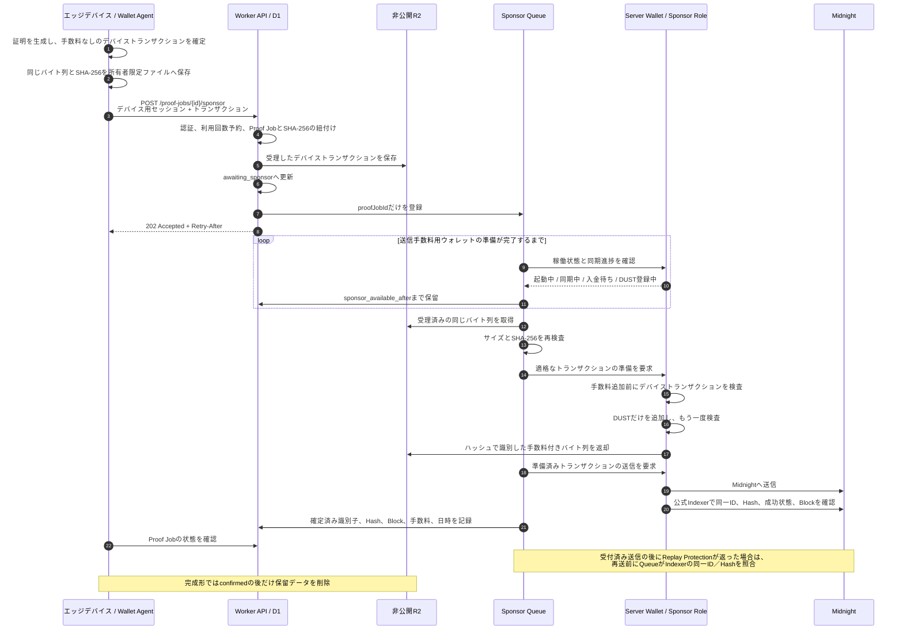
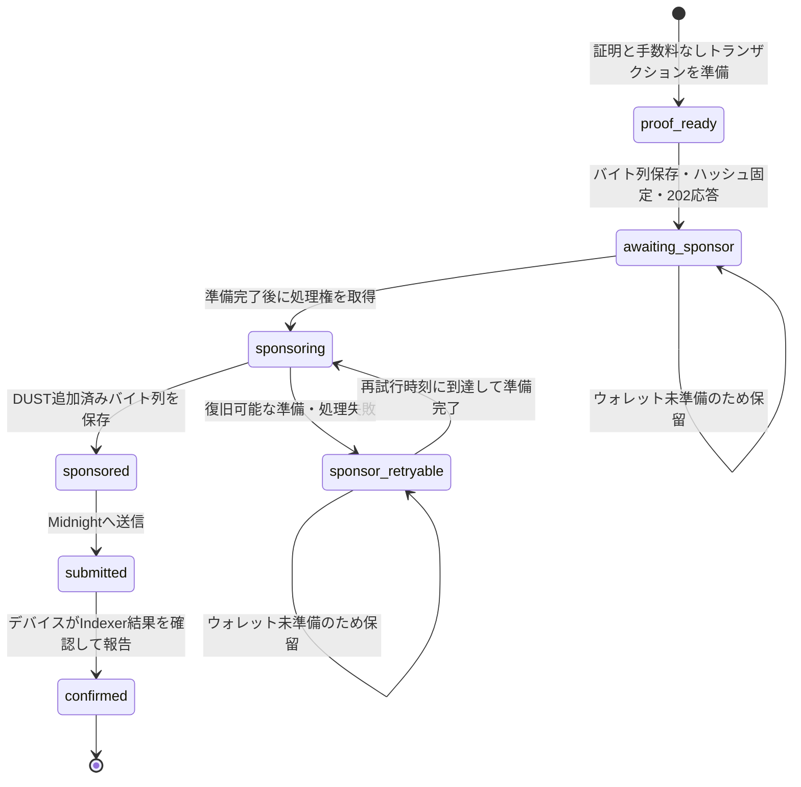

# Midnight送信手数料のスポンサーとウォレット同期中の保留

[English](../../implementation/fee_sponsorship.md)

本書は、運用コントラクトの`submitDailyAttestation`トランザクションについて、開発者向けに送信手数料の
スポンサー経路を説明します。「ガス代のスポンサー」は一般的な呼び方であり、この経路でMidnightの
送信手数料として使うのは**DUST**です。

> 過去のDevice経路確認 — 2026-08-30 JST：当時のRevisionには、バックエンドでの非同期受付、非公開R2での保留、
> Sponsor Queue、ウォレット準備完了の判定、DUSTだけを追加する規則、エッジデバイス上の所有者限定
> 保留ファイル、デバイス側の`202`受付・状態確認・同一バイト列による再開処理があります。1,440件の
> 日次証明をスポンサー負担でPreprodへ送信・確定し、同一バイト列による復旧でもProof生成、Sponsor試行、
> 利用枠予約が増えないことを確認しました。確定後に全保留データを自動削除する処理は未完成です。

2026-09-05時点の現行BaselineはWallet同期をServer Wallet Runtimeへ統合していますが、Sponsor Policyと
Device Authorityは分離したままです。現行Contractを使う認証済みDevice TXとManaged API TXは、
[現行Release追補](../submission/current_release_addendum.md)に記録しています。

## 目的

顧客へ提供する価値は手数料の仕組みとは独立しています。提出した1時間ごとのセンサー最小値・最大値を
開示せず、登録済みしきい値の範囲内かどうかを証明します。手数料のスポンサーは、エッジデバイスから
別の運用負担を取り除きます。

- エッジデバイスは、証明済みの`submitDailyAttestation`を1回だけ承認します。
- エッジデバイスはNIGHT、DUST登録、同期済みDUST状態を持ちません。
- バックエンドの送信手数料用ウォレットは、すでにデバイスが承認したトランザクションへ、送信に必要な
  DUSTだけを追加します。
- 送信手数料用ウォレットは、デバイスの権限を代行したり、しきい値判定の内容を変更したりできません。

同期に時間がかかる可能性があるのは、**バックエンドの送信手数料用ウォレット**です。デバイス用
ウォレットではありません。

## このユースケースで使う鍵と認証情報

| 鍵・認証情報 | 保存場所 | この処理での用途 | できないこと |
| --- | --- | --- | --- |
| P-256デバイス認証鍵 | エッジデバイス | デバイス用セッションを発行するチャレンジ認証に使用 | Midnightコントラクトの承認、スポンサー資金の使用 |
| デバイス用セッション | エッジデバイス | `transaction:submit`権限を持つAPI呼び出しに使用 | デバイスの取引署名鍵やスポンサーの復旧元を代替 |
| デバイスの取引署名鍵／コントラクト権限 | エッジデバイス | 手数料を付けず、証明済み`submitDailyAttestation`の内容を承認・固定 | スポンサーのDUST使用、デバイス台帳の管理 |
| Server Walletの復旧元 | Cloudflareの秘密情報 | Wallet Runtimeを同期し、Sponsor Roleが適格なトランザクションのDUSTを負担 | デバイスのコントラクト権限証明の生成、承認済み処理内容の変更 |
| 運用管理者権限 | 運用管理者の管理領域 | この処理より前にデバイス、しきい値、対象デバイスへの設定を登録 | 通常の手数料スポンサー処理への参加 |

送信手数料用ウォレットの復旧元は、エッジデバイス、D1、Queue、ブラウザ、ログへ送りません。デバイスの
秘密鍵も、送信手数料用ウォレットのコンテナへ送りません。

## 処理の流れ



最も重要な条件は、同期完了後も同じデバイストランザクションのバイト列を使うことです。証明を作り直さず、
別のトランザクションへ確定し直さず、デバイスへ別内容の承認を暗黙に要求しません。

## なぜトランザクションを保留するのか

送信手数料用コンテナは、起動直後に安全な送信を行えるとは限りません。暗号化したチェックポイントを復元し、
Shielded、Unshielded、DUSTの状態を同期し、使用可能なDUSTを1つ以上持ち、ウォレット監視機能の健全性検査を
通過する必要があります。それまでは受理済みトランザクションを保留します。

保留は二段階です。

1. **バックエンドの永続受付が終わるまで**、Wallet Agentは同じバイト列を
   `~/.midnight/midnight-cloudflare-demo/device-wallet/pending-transactions/{proofJobId}.json`へ
   保存します。ディレクトリ権限は`0700`、ファイル権限は`0600`です。一時ファイルから原子的に置き換え、
   読み込み時にSHA-256を再検査します。
2. **`202 Accepted`の後**は、Workerが同じバイト列を非公開R2へ保存し、そのハッシュをD1のProof Jobへ
   紐付けています。Queueに入れるのは`proofJobId`だけです。受付用HTTP接続を維持せず、送信手数料用
   ウォレットの同期完了までバックエンドで保留できます。現行CLIは受付後に状態確認を続けますが、処理が
   停止しても、同じローカルバイト列とD1の状態から後で再開できます。

`202 Accepted`後のIndexer確定確認はバックエンドが所有します。ブラウザやデバイスが切断しても、後で同じ
Job状態を参照できます。エッジ側の保留ファイルは、Proof Jobが確定するまでの復旧用コピーです。受付結果が不明な場合は、同じ
バイト列を再送します。同じProof Jobに対して新しいバイト列を作ってはいけません。

## スポンサー処理の状態遷移



D1を処理状態の正本とします。`sponsor_available_after`が再開時刻を制御し、1分間隔の定期処理が
`awaiting_sponsor`、`sponsor_retryable`、`sponsored`を再登録します。最初のQueue登録に失敗しても回復できます。

## 送信手数料を負担できるトランザクションの規則

送信手数料用ウォレットは、DUSTの追加前と追加後の両方でトランザクションを検査します。次の条件をすべて
満たす場合だけ処理します。

- コントラクト処理のまとまりが1つ、その中の処理が1つだけであること。
- 設定済み`sensor-registry`に対する`submitDailyAttestation`が1回だけであること。
- DUST追加前のデバイストランザクションに、DUST操作が含まれないこと。
- 報酬受取、Zswap送金、非秘匿送金、コントラクト配備、保守処理が含まれないこと。
- DUST追加後も、元のデバイストランザクション識別子が残っていること。

したがって、スポンサーは権限委譲ではありません。デバイスが承認した処理の手数料だけを負担し、その処理を
新しく作る権限は得ません。

## 公開APIと内部API

### デバイス向けAPI

| API | 認証 | 役割 |
| --- | --- | --- |
| `POST /api/v1/proof-jobs/{proofJobId}/sponsor` | `transaction:submit`権限を持つデバイス用セッション | 最大4 MiBの`application/octet-stream`を受理し、利用回数を予約し、1つのハッシュへ固定し、R2へ保存して`202`を返す |
| `GET /api/v1/proof-jobs/{proofJobId}` | 証明状態の参照権限を持つデバイス用セッション | `awaiting_sponsor`から`submitted`／`confirmed`までを確認し、トランザクションの証拠を取得 |
| `POST /api/v1/proof-jobs/{proofJobId}/result` | `transaction:submit`権限を持つデバイス用セッション | デバイスがMidnightで確認した確定結果を記録 |
| `GET /api/v1/sponsor-quota` | デバイス用セッション | 日本時間の日次上限、使用数、次回更新日時を取得 |

### コンテナ内部API

`/restore`、`/health`、`/prepare`、`/submit`、`/release`、`/checkpoint`は、Workerからコンテナへの
内部APIです。ブラウザやエッジデバイスからは呼びません。`/release`は、互換性のないコントラクト
スキーマ移行時に、非公開かつ完全性確認済みの未送信Sponsor予約を元へ戻す用途だけに限定します。

`202`が返った後の想定動作は、Proof Jobの状態確認です。再送する場合は、受付結果が不明な場合の復旧に限り、
同じバイト列を使います。

## 同じ処理の重複防止、再試行、利用回数

- 安定した`measurementGroupId`、決定的なProof Job ID、デバイストランザクションのSHA-256で、1つの
  計測グループを1つのトランザクションへ固定します。
- 同じProof Jobへ異なるバイト列を送ると`409`を返します。
- 同じバイト列の再送は、追加の上限予約、R2保存、Queue投入、Wallet処理より前に既存状態を返します。
- Queueメッセージは重複し得ますが、D1の条件付き状態更新により同じ処理の二重実行を防ぎます。
- 復旧可能な失敗は、保留可能な状態と将来の`sponsor_available_after`を設定します。
- デフォルト上限は、デバイス1台あたり日本時間の1日5件です。初期登録時の
  `--sponsor-daily-limit`で1～100件に設定できます。
- 同じProof Jobの再試行では利用回数を重複消費しません。ウォレット同期中も予約済みとして扱い、
  毎日00:00 JSTに次の日へ切り替わります。

## データの保存先と公開範囲

| 保存先 | 保存するデータ | 公開範囲・保存期間 |
| --- | --- | --- |
| エッジデバイス | 保留中トランザクションのバイト列、SHA-256、`proofJobId`、`createdAt` | 所有者だけが読めるローカルファイル。確定と削除完了まで保持 |
| D1 | 状態、ハッシュ、バイト数、利用回数予約、送信識別子、手数料、エラーコード、各日時 | バックエンドの処理情報。生の測定値と時間別の最小値・最大値は保存しない |
| 非公開R2 | 受理したデバイストランザクション、DUST追加済みトランザクション、暗号化したウォレット同期チェックポイント | バックエンド限定の一時データ。確定後にトランザクションを削除する必要がある |
| Sponsor Queue／障害キュー | `kind`と`proofJobId`だけ | バックエンド限定。トランザクションやセンサー値を入れない |
| 送信手数料用コンテナ | メモリ上の同期済みウォレット状態 | バックエンド限定。AES-256-GCMで暗号化してR2へ退避 |
| Midnight | 登録済みしきい値、対象デバイスへの設定、コミットメント、判定結果、確定トランザクションの証拠 | 公開台帳。生のセンサー値と時間別の最小値・最大値は保存しない |

## セットアップ

運用開始までの順序は次のとおりです。

```bash
npm run sponsor:wallet
# 表示された送信手数料用アドレスだけへtNIGHTを送ります。
npm run cloudflare:deploy
npm run cloudflare:config:sponsor
```

`cloudflare:config:sponsor`は復旧元を標準入力でWranglerへ渡し、画面へ表示しません。暗号化した同期
チェックポイントは、非公開`SPONSOR_STATE` R2の`sponsor-wallet/preprod/checkpoint.enc`へ保存します。
Walletは審査中の常時運転と、D1で制御する日次バッチ時間を鍵変更やコード再配備なしで切り替えられます。
Jobは24時間受け付け、日次処理開始まで保持し、運用ダッシュボードからContainerを誤起動しません。詳細は
[Sponsor Wallet日次処理](../operations/sponsor_wallet_operating_hours.md)と
[配備・確認手順](../operations/demo_runbook.md)を参照してください。

## 現在の連携境界

| 項目 | 現行作業ツリーの状態 |
| --- | --- |
| 手数料なしデバイストランザクションの確定 | 実装済み |
| エッジ側の所有者限定保留ファイルと改ざん検査 | 実装済み |
| `202`受付、D1へのハッシュ固定、非公開R2での保留、Sponsor Queue、定期的な再登録 | バックエンドのソースに実装済み |
| ウォレット準備完了の判定とDUSTだけを追加する検査 | バックエンド／送信手数料用ウォレットのソースに実装済み |
| デバイス側での`awaiting_sponsor`、`sponsor_retryable`、`sponsoring`の解釈 | 現行デバイスクライアントのソースに実装済み。`202`受付後にProof Jobの状態を確認する |
| 証明やトランザクションを作り直さない状態確認による再開 | ソースに実装済み。同じ保留バイト列を使うデバイス単体テストも通過 |
| `confirmed`後の削除 | 一部実装済み。DUST追加済みR2データは削除するが、エッジの保留ファイルと、受理したデバイストランザクションのR2データは自動削除が未完成 |
| スポンサー負担経路の事前公開ネットワーク一連確認 | 2026-08-30 JSTに確定。Transaction `00038e813...71f91914`、Block 2,317,466、Fee 0.632920000000001 DUST。同一バイト列で復旧後もSponsor試行1回、利用枠予約1件を維持 |

主な実装箇所は次のとおりです。

- `edge-device/midnight-transaction-agent/src/pending-transaction.ts`
- `edge-device/midnight-transaction-agent/src/midnight.ts`
- `edge-device/midnight-transaction-agent/src/proof-job.ts`
- `backend/cloudflare/proof-gateway-worker/src/sponsor.ts`
- `backend/cloudflare/proof-gateway-worker/src/sponsor-policy.ts`
- `backend/cloudflare/proof-gateway-worker/src/sponsor-quota.ts`
- `backend/cloudflare/d1-schema/migrations/0014_sponsored_submission.sql`
- `backend/cloudflare/d1-schema/migrations/0015_sponsor_daily_quota.sql`
- `backend/cloudflare/d1-schema/migrations/0016_async_sponsor_and_measurement_groups.sql`
- `backend/cloudflare/d1-schema/migrations/0017_release_stale_sponsor_reservations.sql`
- `backend/cloudflare/sponsor-wallet-container/src/transaction.ts`
- `backend/cloudflare/sponsor-wallet-container/src/wallet.ts`
