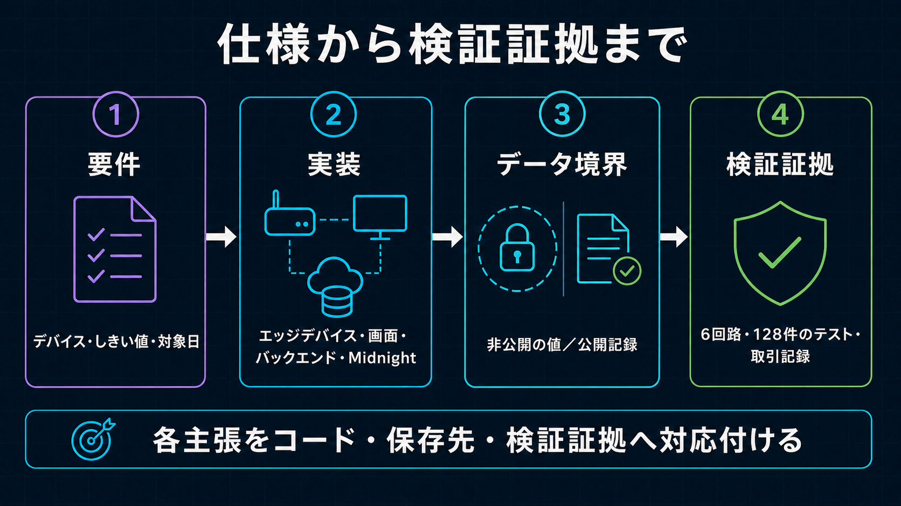

# Wave 1実装Map

[English](../../implementation/implement_spec.md)

製品仕様の正本は[`wave1_spec.md`](../architecture/wave1_spec.md)、回路の詳細仕様は
[`hourly_extrema_attestation_proposal.md`](../architecture/hourly_extrema_attestation_proposal.md)です。本書は要件とRepository実装の対応を示します。

手数料を負担する権限の境界、DUSTだけを追加する規則、送信手数料用ウォレットの非同期同期、同一バイト列の
保留は、[送信手数料のスポンサー](fee_sponsorship.md)へ分離して詳しく説明します。
6つの証明回路について、非公開／公開入力、検査内容、台帳更新は[ZK回路仕様](zk_circuit_spec.md)にまとめます。
コントラクト変更と、その後に追加する運用機能は[将来機能バックログ](future_features.md)で管理し、
現在の実装済み機能とは区別します。



## 運用Proof

| 段階 | 実装 | 公開範囲 |
| --- | --- | --- |
| Device登録 | OperatorがActivation前に`registerDevice`を呼びます。 | Device Commitment、導出Authority、Status、VersionはPublic Ledger Stateです。 |
| Policy登録 | 開発OperatorがOperator Authorityで`registerThresholdPolicy`を呼びます。 | Mode、Bound、Scale、Sensor／Unit Code、VersionはPublic Ledger Stateです。 |
| Assignment | 運用開始前に`registerPolicyAssignment`を呼びます。 | Policy Key、Device Commitment、Assignment Key、固定UTC Offset、ローカル開始時、UTC境界、有効期間、Versionは公開です。 |
| 準備 | Wallet Agentが安定した`measurementGroupId`を割り当て、登録済み運用日を順序固定の24時間Slotへ集計し、`DailyExtremaInput`全体を1つのNonceでCommitします。 | 時間別ExtremaとNonceは非公開、Group ID、Commitment、運用期間、Presence、Countは公開です。 |
| Attest | `submitDailyAttestation`がAssignment済みLedger Policyを読み、Private Slotから24個の時間帯別結果を再計算し、Public `hourResults`と日次の`thresholdSatisfied`に一致することを証明します。 | 検証済みのしきい値以内／範囲外／計測なし、Policy／Assignment、TX Evidenceは公開です。 |

日次Attestationは運用Transaction 1回です。DeviceはProof Job APIにもAttestation Circuit CallにもThreshold Boundを渡しません。Policy登録は低頻度のOperator Lifecycle操作です。

## Public `sensor-registry` State

| Field | 意味 | 制限 |
| --- | --- | --- |
| `operatorAuthority` | Private Operator Authorityから導出したHashです。 | Deployment Walletとは別で、Device LifecycleとPolicy／Assignment管理を認可します。 |
| `devices` | Public Device Commitmentから`{authority, active, version}`を引くMapです。 | 複数Deviceを扱うPublic仮名Bindingであり、Hardware Attestationではありません。 |
| `policies` | 32-byte Policy KeyからMode、Encode済みBound、Scale、Type／Unit Code、Versionを引くImmutable Mapです。 | Policy値は意図的に公開します。 |
| `policyAssignments` | Assignment KeyからPolicy Key、Device Commitment、運用日境界、有効期間、Versionを引くImmutable Mapです。 | 別Deviceでの流用と別境界の使用は回路が拒否し、Overlap Governanceは将来対象です。 |
| `attestations` | `persistentHash(domain, deviceCommitment, measurementGroupId)`から`DailyAttestationPublicState`を引くMapです。 | 同じGroupを拒否し、値にはCommitmentを含みますが時間別Minimum、Maximum、Nonceは含みません。 |
| `measurementDay` | `periodStart`を含むUTC Epoch Dayで、Assignmentの`utcDayStartMinute`とBindingします。 | 登録済み24時間境界を回路で強制します。 |
| `hourPresence[24]` | PublicなObserved／STOPPED Bitmapです。 | `true`はPrivate Slotが提出され検査されたことを示しますが、物理Readingの実在は証明しません。 |
| `hourResults[24]` | 運用日の各時間枠のPublic `withinThreshold`／`outsideThreshold`／`noData`です。 | 範囲外の時間枠は分かりますが、Extremaと超えたBoundは分かりません。 |
| `observedHourCount` | 回路がPresenceから再計算したObserved Slot数です。 | 予定稼働時間ではありません。 |
| `sampleCount` | 回路がPrivate Hourly Countから再計算した合計です。 | Device申告値であり物理的完全性の証明ではありません。 |
| `schemaVersion`／`circuitVersion` | Private InputへBindingした互換性Identifierです。 | 現行運用Pairは`7`／`5`です。 |
| `thresholdSatisfied` | Attestationごとに保存する回路計算済みPublic Outcomeです。 | `true`は全Observed Slotが範囲内、`false`は少なくとも1 Slotが範囲外であることを証明し、Extremaは開示しません。 |
| `verified` | 提出Resultが証明され記録されたことを示します。Malformedまたは虚偽ClaimはRevertします。 | Proof成功とThreshold Outcomeを区別します。 |
| `policyCount`、`assignmentCount`、`attestationCount` | 成功したImmutable登録／Attestationの累計です。 | Contract全体のCounterでありDevice稼働率ではありません。 |

成功時の正確なClaimは運用日の時間枠ごとのPublic Outcomeで決まります。日次BooleanはObserved HourのANDによる総合結果です。全時間AbsentはZero Observed Countから計測なしと表示します。

## 実装Path

| 責務 | 実装 |
| --- | --- |
| Device Install | `installer.sh`が運用Workspaceを導入し、完全なP-256 Device Identityがない場合だけOwner-onlyで生成します。 |
| Device登録 | Operator CLIでMidnightへDevice／Device-bound Assignmentを登録し、D1 Mirror同期後だけ`register-device-key.mjs`でP-256を有効化します。 |
| Device Session | `backend/cloudflare/proof-gateway-worker/src/device-auth.ts`が5分のOne-time Challengeと24時間Opaque Sessionを実装し、D1にはToken Hashだけを保存します。 |
| Collection | `edge-device/sensor-collector/`がRaw SampleをLocal保持し、1時間AggregateとDebounce済みAnomaly Transitionを送信します。審査GUIのBrowser Deviceは完了済みの過去30日間から日付を選び、1分間隔のPrivate Sampleを1,440件生成して最大24件のWindowだけを送信します。 |
| 日次準備 | `shared/measurement-protocol`の`prepareDailyExtremaAttestation`が登録済みProject／Assignment境界から24 Slot、Canonicalな計測なしSlot、Public Metadata、Private Commitment Openingを作ります。 |
| Fleet管理 | `tools/midnight-operator/src/operator-authority.ts`がOwner-only Operator Authorityを保持し、Operator限定の登録／Rotation／無効化Commandを提供します。 |
| Compact回路 | `midnight/contracts/sensor-registry/src/sensor-registry.compact`がMulti-Device Registry、Device-bound Assignment、1 Callの日次Attestationを定義します。 |
| D1 Schema | Migration `0010`～`0026`がPolicy／Job、Fail-closed Fleet Registry Mirror、Device運用設定Revision、日次／時間帯別Threshold Result、非同期Sponsored Submission State、安定Measurement Group冪等性、冪等なJST日次Sponsor予約、Contract履歴、Wallet所有Project、Project単位Policy Operation、Browser Enrollment State、実際のZKP生成日時、永続Provisioning Progress、Project／Assignment運用日境界を追加します。 |
| Proof Admission | `POST /api/v1/proof-jobs`がAuthenticated Device、登録済みAssignment Metadata、ClaimしたBoolean Resultを検証しますが、Threshold Boundは受け取りません。Cronは02:00～06:00 JSTにAdmissionします。 |
| Proof生成 | Wallet AgentがPrivate Proving Requestを認証済みWorker RouteからContainerへStreamし、Bodyは永続化しません。 |
| Device TX Bind | 現場Transaction Identity、または`payFees: false`の対応Browser Walletが、NIGHT／DUSTなしでProof済み`submitDailyAttestation` CallをBindします。 |
| 送信手数料の負担 | `POST /api/v1/proof-jobs/:proofJobId/sponsor`は利用回数を原子的に予約し、1つのトランザクションハッシュへ固定し、非公開バイト列をR2へ保存します。`awaiting_sponsor`を記録し、Queueへ処理IDだけを入れて`202`を返します。同じ内容の再送は、追加の上限予約、R2保存、Queue投入、Wallet処理より前に止めて既存状態を返し、異なる内容は`409`で拒否します。ウォレット同期後、Queue処理が保存データを再検査し、DUSTだけを追加して送信します。デバイスは状態を確認し、保留した同じバイト列から再開できます。 |
| 管理者GUI | Device Session保護DashboardがそのDeviceの1時間Aggregateを運用日別に表示し、Threshold外れ値、明示的な現在の正常／異常状態、該当日の日次Proof操作とProof／TX状態を表示します。 |
| 第三者GUI | TX hashから確定済みProofを開き、Extremaを隠したまま運用日／境界、24個のしきい値以内／範囲外／計測なし、適用しきい値／有効期間、Device Commitment、正確なClaim、Network、Contract、Block、Attestation TXを表示します。 |

旧`proof_jobs`、Reading単位Attestation Table／Endpoint、Shared Merkle Helper TestはMigrationまたは開発互換用に残ります。運用Worker／Wallet Pathは`daily_proof_jobs`へ書き、Selected-leaf Circuitを呼びません。

Cloudflare QueuesはProof Admission／Sponsor処理のJob参照を運びます。D1をWorkflowの正本、Private R2をIntegrity-addressed TX Bytesの正本とします。Wallet Mutationは直列化し、Upload ResponseはDurable受付を返し、DeviceがJobをPollしてTX Evidenceを取得します。

エッジデバイスは、送信手数料なしのトランザクションを送信APIへ渡す前に、その正確なバイト列を所有者限定の
保留ファイルへ書きます。送信手数料用ウォレットの同期中も同じバイト列から再開し、同じProof Jobに対する
異なるトランザクションは拒否します。現行デバイスクライアントは`202`を受け付け、非同期状態を確認し、
証明生成を繰り返さずに再開できます。`confirmed`後の保留ファイル自動削除は未実装です。一連動作の完成を
主張する前に、[送信手数料スポンサーの現在の連携境界](fee_sponsorship.md#現在の連携境界)を確認してください。

## Active API

```text
POST /auth/challenge
POST /auth/session

GET  /api/v1/provisioning/configuration           Publicな登録済みPolicy Metadata
POST /api/v1/projects/challenge                   5分間Wallet Project Challenge
POST /api/v1/projects/session                     24時間Wallet所有Project Session
GET  /api/v1/projects                             Wallet所有Project List
POST /api/v1/projects                             Project作成。Walletごとに最大10件
POST /api/v1/policies/challenge                   One-time Project Policy Challenge
GET  /api/v1/policies                             Project単位の登録済み／処理中Policy
POST /api/v1/policies                             Wallet署名付きImmutable Policy登録
GET  /api/v1/policy-operations/:operationId       非同期Policy進捗
POST /api/v1/provisioning/challenge               5分のOne-time Challenge
POST /api/v1/provisioning/devices                 Wallet署名付きWorker Enrollment
GET  /api/v1/provisioning/operations/:operationId Token保護された非同期進捗
GET  /api/v1/device/configuration                 認証済みDeviceのみ
GET  /api/v1/device/dashboard                     認証済みDevice自身のみ
GET  /api/v1/device/history                       認証済みDeviceのみ
POST /api/v1/measurement-windows
POST /api/v1/anomaly-events
POST /api/v1/proof-jobs
GET  /api/v1/proof-jobs/:proofJobId
POST /api/v1/proof-jobs/:proofJobId/admit          認証済みReview Admission
POST /api/v1/proof-jobs/:proofJobId/sponsor
POST /api/v1/proof-jobs/:proofJobId/result
GET  /api/v1/sponsor-quota                        認証済みDeviceのみ

GET  /api/v1/projects/:projectId/dashboard       Legacy Loopback Administratorのみ
GET  /api/v1/projects/:projectId/measurement-windows
GET  /api/v1/projects/:projectId/anomaly-events  Legacy Loopback Administratorのみ
GET  /api/v1/public/proofs                        Public Redacted最新順List
GET  /api/v1/public/proofs/by-transaction/:hash   D1 Index互換用の任意検索。TX Viewerは使用しない
GET  /api/v1/public/proofs/:proofJobId            Public Redacted Evidence

GET  /ready                                      admitted Device Session only
POST /check
POST /prove                                      admitted Device Session only
```

TX hash ViewerはPublic Midnight Indexerへ直接問い合わせ、成功TXからContract Addressを導出し、該当BlockのState差分をDecodeします。Public D1 Listと互換Lookupは補助機能であり、TX hash検証の依存先ではありません。

`POST /api/v1/proof-jobs`はCommitment、Device Commitment、UTC Measurement Day／期間、Policy／Assignment Identifier、Presence、24個のHour Result、Count、Claimした`thresholdSatisfied`、Circuit Versionを受け取ります。未登録／不一致Assignmentを拒否し、Proof Policy Inputとして`minimum`／`maximum`を受け取りません。WorkerはClaim Resultを冪等性と表示用に保存しますが、Midnight TXがConfirmedになるまで未検証として扱います。

## Storage

- Midnight Ledger：公開しきい値、対象デバイス設定、検証済み日次判定の正本
- D1：Project／Device、Device Identity公開鍵、Challenge／Session Hash、1時間Window、Anomaly State、Public Policy／Assignment Mirror、Daily Proof Job、JST日次Sponsor予約、Attestation TX Metadata
- Device Filesystem：Raw Sample、Hourly Aggregation／Outbox State、Private Extrema Opening、Device Identity秘密鍵、Plaintext Session、Transaction Identity、暗号化Compact Private State、所有者限定の保留トランザクション。NIGHT、DUST登録、同期済みDUST Stateなし
- 審査Browser IndexedDB：そのBrowser Deviceが生成したRaw SampleとPrivate Daily Opening
- Queue／DLQ：`proofJobId`参照だけ。Private Reading、Extrema、Nonce、Proving Bodyは保存しない
- R2：受理したデバイストランザクション、DUST追加済みトランザクション、任意のPublic Proof Artifact／Report、暗号化Sponsor同期Checkpoint。Raw Time-series Retentionや平文Sponsor Seedには使わない
- Sponsor Wallet Storage：Seed用の分離したDeploy Secretと暗号化Checkpoint。D1、Device Firmware、Browser Storageには保存しない
- KV：Wave 1 Runtimeでは不要

固定24／96／1,440件の`daily-attestation` Profileは明示実行する開発専用Cost Experimentとして残ります。運用回路は3つの頻度から集計したExtremaを同じ形状で受け入れます。

## Deploy境界

新Contract Ledgerは旧Selected-leaf Deploy／Singleton Daily実装／WITHIN専用Fleet Registryと互換性がありません。運用反映にはD1 Migration `0022`までの適用、新Contract Deploy、全Device／Public Policy／Device-bound Assignment登録、D1 Mirror同期、Worker Public Contract Address更新、各Deviceによる新設定取得が必要です。この変更ではP-256 Device Identity、Device Transaction Identity、Sponsor Wallet、Deployment Walletを再利用・Rotationしません。

Deploy済みセンサーデバイス管理者UIは24時間Device Sessionで`GET /api/v1/device/dashboard`を使用し、自身のDevice Recordだけを取得します。Project全体のLegacy EndpointはLoopback限定のままです。第三者Proof ViewはPublicかつRedactedです。

各GUI操作と処理場所の対応は[`gui_action_reference.md`](gui_action_reference.md)にまとめています。Lifecycle、Trust Boundary、E2E Gate、Costの扱いは[`device_registry.md`](../security/device_registry.md)を正本とします。2026-08-28 JST、新Fleet Registryに対する自己負担Edge DeviceのWITHIN／OUTSIDE TXがPreprodでConfirmedとなり、Public Verifierから取得できることを確認しました。これは履歴Evidenceとして保持します。Sponsor負担経路は新しいPreprod E2E Gate通過後に誘導付き審査動画を作成します。
