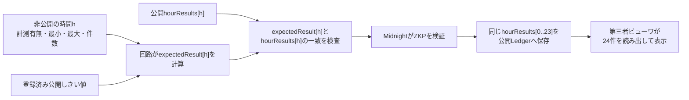

# トランザクションハッシュによる第三者検証仕様

[English](../../implementation/transaction_hash_verification.md)

状態：2026-09-01 JST時点の第三者相互運用に関する規範仕様と現行実装注記
対象Network：Midnight Preprod
対象Contract：`sensor-registry`、Attestation Schema `7`、Circuit Version `5`

## 1. 目的

第三者が1つのMidnight TX hashを入力し、D1、BACCHIRI API、Wallet、Proof Server、非公開の
センサー値を使わずに、日次Attestationの公開結果を検証する方法を定めます。

ビューワは次を確認します。

1. 成功して確定したMidnight TXか。
2. 承認済み`sensor-registry`コントラクトへ日次Attestationを1件追加したTXか。
3. どの運用日、登録済み日次境界、Device Commitment、Policy、Assignment、時間帯別結果が記録されたか。
4. 公開項目がコントラクト仕様と矛盾しないか。

MidnightはTX受理時にContract CallのZKPを検証します。ビューワは、成功したChain記録、
承認済みコントラクト、公開Ledger遷移の意味を検証します。

## 2. 最初に理解すること

`hourResults`は24要素の公開回路入力であり、公開Attestation Stateへ保存する項目です。
回路は各Index `h`について、非公開の時間枠と登録済み公開Policyから`expectedResult[h]`を計算し、
`hourResults[h]`との一致を証明します。TX成功後、Contractは同じVectorを公開Ledgerへ保存します。

ビューワは保存済みVectorを読み、Index `h`をAssignmentの登録済みローカル開始時からの時間枠へ
対応付けます。`hourPresence[24]`は計測有無を表すBoolean Vectorです。しきい値判定を表す
`hourResults[24]`はBooleanではなく、`noData`、`withinThreshold`、`outsideThreshold`の3値Enumです。



運用日の各時間枠`h = 0..23`で次を証明します。

```text
present[h] == falseの場合:
    expectedResult[h] = 計測なし
非公開minimum[h]とmaximum[h]が登録済み公開しきい値を満たす場合:
    expectedResult[h] = 閾値以内
それ以外:
    expectedResult[h] = 範囲外

expectedResult[h] == 公開hourResults[h]を検査
```

ZKPが保証するのは、非公開の時間別最小・最大値と公開結果Vectorの関係です。ビューワは非公開値を
知らないため、その値から判定を再計算できません。この関係はMidnightによるZKP検証結果に依存します。

すべてを`valid`と呼ばず、`閾値以内`、`範囲外`、`計測なし`を区別します。正しいZKPが、真実の
`範囲外`または`計測なし`を公開することもあります。

## 3. Blockの項目と意味だけで十分か

十分ではありません。項目の意味に加え、次のTrust Anchorが必要です。

| 必要事項 | 理由 |
| --- | --- |
| Network IDと信頼するChain／Indexer Endpoint | 同じHashを別Networkとして扱うことや、偽のBlock応答を防ぎます。 |
| TX全体の成功・確定状態 | Blockに含まれるだけでは不足し、失敗または部分成功TXを拒否する必要があります。 |
| 承認済みコントラクトの識別 | 同じ項目名を持つだけの別コントラクトは、同じZK制約を強制しているとは限りません。 |
| 正確なLedger DecoderとSchema／Circuitの意味 | 生のState Byte列は、コンパイル済みSchemaなしでは解釈できません。 |
| TXとState遷移の結び付き | 最新Stateを読むだけでは、貼り付けたTXがRecordを追加したと証明できません。 |

現行の実用Profileは、既知の承認済みContract AddressをTrust Anchorとします。将来は、レビュー済み
Buildから公開した各CircuitのVerifier Key Fingerprintと、On-chain Verifier Keyを照合する方法も
選択できます。そのProfileを仕様化・実装するまでは、独立ビューワは**承認済みContract Addressを
固定またはAllowlist化しなければなりません**。

利用者が入力するのはTX hashだけですが、Network、承認済みDeployment、Decoder、意味定義は
ビューワへ組み込みます。TX hashは検索キーであり、Trust Root全体ではありません。

## 4. Chain準拠検証とZKP単体再検証

| 方式 | 必要な入力 | 現行範囲 |
| --- | --- | --- |
| Chain準拠ビューワ | TX hash、Network、承認済みDeployment、Ledger Decoder、公開Indexer／Node | 現行方式。MidnightがTX受理時にZKPを検証した事実を利用します。 |
| ZKP単体再検証 | Proof Byte、正確な公開入力／Transcript、Verifier Key、Contract State／Context、Midnight Protocol検証規則 | Browserビューワでは未実装です。TX hashとBlockの公開項目だけでは不足します。 |

本書はChain準拠ビューワを定義します。

## 5. 必要な公開データ取得

### 5.1 TXの取得

64文字の16進TX hashを正規化して、次を取得します。

| 項目 | 意味 |
| --- | --- |
| `hash` | 利用者が入力したTX hash。 |
| `identifiers[]` | TX Identifier。一つを使って確定結果を取得します。 |
| `block.height` | TXを含む確定Block。 |
| `contractActions[].address` | TXが作用したContract。Sponsor TXには無関係なActionも含まれ得ます。 |

現行実装のGraphQL形状は次の通りです。

```graphql
query PublicProofTransaction($offset: TransactionOffset!) {
  transactions(offset: $offset) {
    hash
    block { height }
    ... on RegularTransaction {
      identifiers
      contractActions { address }
    }
  }
}
```

次をすべて確認します。

- 返されたHashが入力Hashと一致する。
- 確定Statusが`SucceedEntirely`である。
- 確定TXのHashとBlock Heightが検索結果と一致する。
- 使用可能なTX Identifierと、承認済みContract Actionが1つ以上ある。

### 5.2 Contract Stateの取得

承認済みContract Actionについて、次のStateを取得してDecodeします。

- TX確定Block HeightのContract State
- 1つ前のBlock HeightのContract State

現行Profileは、2つのState間で`attestations`へ追加されたKeyを調べ、Schema 7のAttestationが
正確に1件ある場合だけ受理します。0件または複数件なら結果不定とし、検証済み表示にしません。

24時間分の取得値は、この手順で特定した`DailyAttestationPublicState`の
`hourPresence[0..23]`と`hourResults[0..23]`です。TX hashは、この公開State遷移を特定する検索Keyです。

この前Block比較は安全側に失敗しますが、同じContractに対する複数Attestation TXが1Blockへ入ると、
正しいTXも判定不能になることがあります。将来、Transaction Action単位のState Deltaを取得できれば
この曖昧さを除去できます。複数追加から任意の1件を選んではいけません。

## 6. 公開Ledger項目と意味

### 6.1 日次Attestation

| 項目 | 意味と検査 |
| --- | --- |
| `attestationCommitment` | 非公開24時間枠とNonceへのBinding Commitment。公開値だけではOpenできません。 |
| `measurementGroupId` | 提出した日次計測Groupの公開Identifier。 |
| `deviceCommitment` | 仮名の証明対象。AssignmentのDeviceと一致する必要があります。 |
| `policyId` | ZKPが使った変更不可の公開しきい値Key。 |
| `assignmentId` | DeviceとPolicyを結ぶ変更不可のAssignment Key。 |
| `measurementDay` | `periodStart`を含むUTC Epoch Day。`periodStart = measurementDay × 86,400 + utcDayStartMinute × 60`である必要があります。 |
| `periodStart` / `periodEnd` | Unix秒。Assignment境界から始まる正確な86,400秒である必要があります。 |
| `hourPresence[24]` | `Boolean[24]`。各運用時間枠に非公開の観測枠があるか。Index `0`は`localDayStartHour`から始まります。 |
| `hourResults[24]` | `HourThresholdResult[24]`。Code `0`は`noData`、`1`は`withinThreshold`、`2`は`outsideThreshold`です。 |
| `observedHourCount` | `hourPresence == true`の個数。 |
| `sampleCount` | 非公開の時間別件数合計。回路内で一致を証明します。時間別件数は非公開です。 |
| `schemaVersion` | このProfileでは`7`。 |
| `circuitVersion` | このProfileでは`5`。 |
| `thresholdSatisfied` | 日次Summary。観測時間に`範囲外`がなければtrue。欠測時間は無視します。 |
| `verified` | 承認済み回路の成功時にtrueを保存します。Contract識別とTX成功確認なしでは十分ではありません。 |

### 6.2 Threshold Policy

| 項目 | 意味 |
| --- | --- |
| `mode` | 上下限、上限のみ、下限のみ。 |
| `minimumCentiOffset` / `maximumCentiOffset` | 回路内表現のBound。 |
| `valueScale` | 現行温度Profileは`100`。 |
| `sensorTypeCode` | 現行対応Code `1`は温度。 |
| `unitCode` | 現行対応Code `1`は摂氏。 |
| `version` | 変更不可のPolicy Version。正数である必要があります。 |

現行温度Profileの表示値は次の通りです。

```text
表示する摂氏値 = (回路内表現値 - 10,000) / valueScale
```

未対応のSensor／Unit Codeを温度として解釈せず、未知Codeとして表示します。

### 6.3 Policy Assignment

| 項目 | 意味と検査 |
| --- | --- |
| `policyId` | Attestationが示すPolicy Keyと一致する。 |
| `deviceCommitment` | Attestationの証明対象と一致する。 |
| `timeZoneOffsetMinutesBias` | 固定UTC Offsetを`offset + 840`で表す。Decode後は-840～+840分。 |
| `localDayStartHour` | 0～23のローカル運用日開始時。分・秒は00。 |
| `utcDayStartMinute` | UTCの開始Minute。`modulo(localDayStartHour × 60 - offset, 1440)`と一致する。 |
| `validFrom` | Unix秒の有効開始を含む。 |
| `validUntil` | 許容する`periodEnd`の上限。`0`は期限なし。 |
| `version` | 変更不可のAssignment Version。正数である必要があります。 |

Attestationの全期間がAssignmentの有効期間内に含まれる必要があります。

## 7. 必須検証手順

Chain準拠ビューワは次を順番に実行します。

1. 任意の`0x` Prefixを除き、64文字の16進数だけを受け付ける。
2. 設定済みMidnight NetworkからTXを検索する。
3. TX全体の成功・確定と、TX Hash／Block Heightの完全一致を確認する。
4. Contract Actionを抽出し、承認済みDeployment以外を拒否する。
5. 正確なSchema Decoderで、承認済みContractの当該Blockと前BlockをDecodeする。
6. 安全側のBlock差分規則により、新規日次Attestationが正確に1件あることを確認する。
7. `schemaVersion == 7`、`circuitVersion == 5`、`verified == true`を確認する。
8. 同じStateから参照先PolicyとAssignmentを取得する。
9. AssignmentのPolicy、Device、Version、有効期間、運用日境界がAttestationと一致することを確認する。
10. `periodStart == measurementDay × 86,400 + utcDayStartMinute × 60`、`periodEnd == periodStart + 86,400`を確認する。
11. 2つの時間Vectorがともに24件であることを確認する。
12. 各時間で、`hourPresence[h] == false`の場合だけ`計測なし`であることを確認する。
13. `observedHourCount`が計測あり時間数と一致することを確認する。
14. 1件以上`範囲外`がある場合だけ`thresholdSatisfied == false`であることを確認する。
15. 全検査成功後だけ結果を表示する。それ以外は失敗または判定不能とし、検証済みにしない。

ビューワは非公開Extremaを再検査できません。手順7が意味を持つのは、手順3と4により、レビュー済み
回路をMidnightが正常実行し、そのZKPを受理したことを確立するためです。

## 8. ZK回路が保証する内容

承認済み`submitDailyAttestation`回路は、非公開の各時間`h`について次を証明します。

```text
present[h] == 公開hourPresence[h]

present[h]の場合:
    非公開count[h] > 0
    非公開minimum[h] <= 非公開maximum[h]
present[h]でない場合:
    非公開count[h] == 0
    非公開minimum[h] == 0
    非公開maximum[h] == 0

closedRangeWithin[h] =
    非公開minimum[h] >= 公開policy.minimum
    AND 非公開maximum[h] <= 公開policy.maximum

expected[h] =
    present[h]でなければ 計測なし
    present[h]かつPolicy Modeごとの比較に成功すれば 閾値以内
    それ以外は 範囲外

expected[h] == 公開hourResults[h]
```

同じZKPが、非公開日次Objectと公開Commitment、Device、計測Group、Policy、Assignment、登録済みUTC期間、
Version、合計件数、Device Authorityも結び付けます。誤った時間帯別Vectorは、承認済みContractの
Verifier Keyによる検証を通過できません。

## 9. ビューワの最小表示項目

| 表示項目 | 取得元 |
| --- | --- |
| Network、TX hash、TX ID、Block Height、Contract | 確定TX検索結果。 |
| 運用日と境界 | 検証済みUTC期間とAssignmentのOffset／開始時から導出。 |
| 24個の時間帯別結果 | `hourResults[0..23]`を登録済みローカル開始時から表示。 |
| 適用しきい値 | 参照先の変更不可Policy。 |
| Policy有効期間 | 参照先の変更不可Assignment。 |
| 証明対象 | AttestationとAssignmentが共有する`deviceCommitment`。 |
| 非公開説明 | 時間別Extrema、時間別件数、Nonce、Device Secret、Raw値は公開しない。 |

`範囲外`をZKP失敗と表示してはいけません。これは正しく証明された公開結果です。`計測なし`は
Canonicalな空時間枠を証明しますが、物理センサーが正常稼働したことは証明しません。

## 10. 拒否条件と非証明事項

TXが未発見、失敗、部分成功、別Network、未承認Contract、Decode不能、Version不一致、新規候補が
0件または複数、Policy／Assignment欠落、その他の整合性違反の場合は、拒否または判定不能とします。

すべて成功しても、次は証明しません。

- 非公開値が物理センサー由来であること。
- Samplingが連続・完全であること。
- Device側の時間別集計が正しいこと。
- 非公開の最小値、最大値、Raw値、範囲外となった具体的理由。
- Public Indexer自体の独立した信頼性。より高い保証が必要な場合は、独立運用Indexer／Nodeとの比較、
  または採用するChain Trust方式によるBlock Data検証が必要です。

## 11. 過去のPreprod Evidence

旧UTC 0時固定Profileの実Schema 6 TXです。履歴Evidenceとして残しますが、Schema 7 Decoderとは
意図的に互換性がなく、設定可能な境界実装の適合確認用TXではありません。

| 項目 | 期待値 |
| --- | --- |
| Network | Midnight Preprod |
| TX hash | `92f841d33a458edb1af94a20ca962b7092367caf96f2382b95a9227328aa841e` |
| TX ID | `0043d0ea95ade7ee9505866720a72053154415f8328ea0e6552d6072f09565f0a1` |
| Block Height | `2358767` |
| 承認済みContract | `c62dbb18252fd8bc4a6aea7c4ab549d20cc7cb03e2996ca68e43d0f914221a0f` |
| 計測日 | `2026-08-25` UTC |
| 00:00～01:00 | `範囲外` |
| 01:00～24:00 | `閾値以内` |
| Policy | 上下限`10～35 °C`、Scale `100`、Version `1` |
| Device Commitment | `41ec4294cdb082936f86c6529e911f21289491867ff32a5eed86923140acde9b` |

値はEdge Device上の確認用データです。ZKP、Sponsor処理、Preprod TX、Block確定、公開検証は
実処理です。

## 12. 参照実装

| 責任 | Source |
| --- | --- |
| TX検索と確定TX検査 | `frontend/verification-portal/src/public-verifier.ts` |
| Ledger遷移Decodeと整合性検査 | `frontend/verification-portal/src/public-verifier.ts` |
| Contract制約と公開Ledger項目 | `midnight/contracts/sensor-registry/src/sensor-registry.compact` |
| TX hash Routeと画面描画 | `frontend/verification-portal/public/app.js` |
| D1 API不使用を検査するBrowser Capture | `tools/submission-media/capture-dashboard-demo.mjs` |

現行Hosted ViewerはTXからContract Action候補を導出し、Schema 7としてDecodeできる1件を受理します。
独立した本番ビューワは、これに加えて3章の承認済みDeployment規則を必ず実装してください。Ledger形状
だけを理由に任意のHashをBACCHIRIの証明として扱わないため、Deployment AllowlistまたはVerifier Key
Fingerprint照合は必要なHardening項目です。
