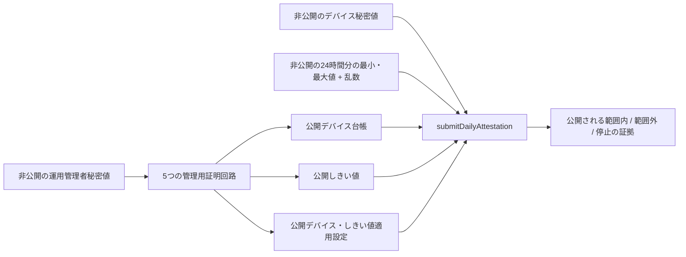
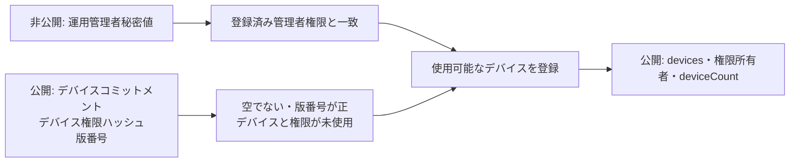
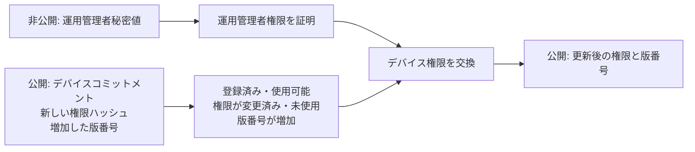
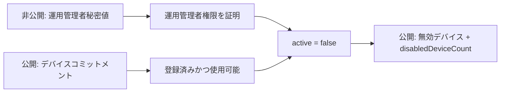
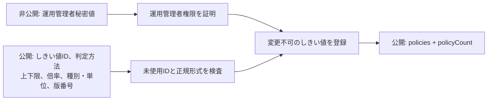
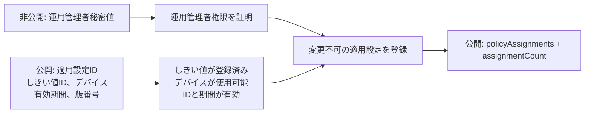
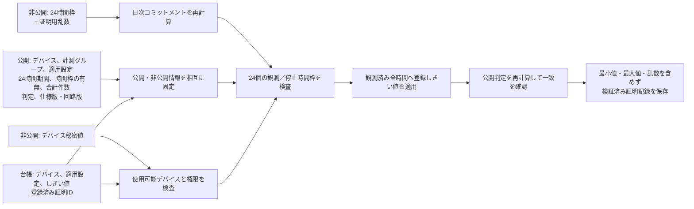
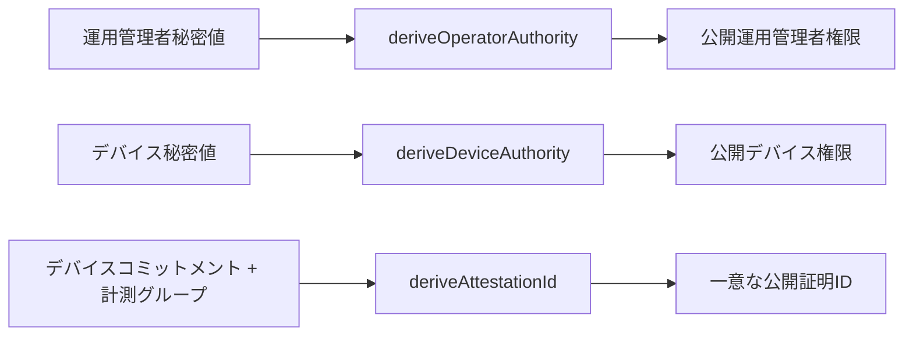

# 運用ZK回路仕様

[English](../../implementation/zk_circuit_spec.md)

状態：2026-08-30 JST時点の実装準拠仕様
対象コントラクト：`contracts/sensor-registry/src/sensor-registry.compact`

## 1. 目的と対象範囲

BACCHIRI!━━Verifiable Measurement Layerが顧客へ提供する証明価値は1つです。**提出された時間別の
センサー最小値・最大値を開示せず、登録済みしきい値を満たすか証明します**。

運用コントラクト`sensor-registry`には、証明を生成する公開回路が6つあります。

1. `registerDevice`
2. `rotateDeviceAuthority`
3. `disableDevice`
4. `registerThresholdPolicy`
5. `registerPolicyAssignment`
6. `submitDailyAttestation`

最初の5回路は、誰が、どのデバイスとしきい値を使えるかを管理します。6番目が、非公開の日次しきい値
判定を行う回路です。コンパイラ生成情報でも、この6回路が`proof: true`となり、それぞれに証明鍵と
検証鍵が1組ずつ生成されています。

`deriveDeviceAuthority`、`deriveOperatorAuthority`、`deriveAttestationId`は、決定的なハッシュを計算する
公開純粋回路です。証明や台帳トランザクションは生成しません。固定24／96／1,440件の
`daily-attestation`は開発専用の費用実験であり、[13章](#13-開発専用回路プロファイル)へ分離します。

## 2. 6回路の関係



管理用回路は運用管理者の秘密値を隠したまま、意図的に公開する設定を台帳へ書きます。日次回路は、
デバイス秘密値、時間別の最小値・最大値、時間別件数、証明用乱数を隠し、適用したしきい値と検証済みの
判定結果だけを公開します。

## 3. 共通するデータ境界

| 分類 | データ | 公開範囲 |
| --- | --- | --- |
| 運用管理者の非公開入力 | `privateOperatorSecret()` | 非公開。5つの管理用回路で使用 |
| デバイスの非公開入力 | `privateDeviceSecret()` | 非公開。`submitDailyAttestation`で使用 |
| 日次の非公開入力 | `privateDailyExtrema(commitment)`、`privateDailyNonce(commitment)` | 非公開。24時間枠と1つの証明用乱数 |
| 公開引数 | デバイス／しきい値／適用設定ID、期間、時間枠の有無、合計件数、判定、版番号 | 公開トランザクション入力 |
| 公開台帳 | デバイス状態と権限ハッシュ、しきい値、適用設定、日次証明記録、累計 | Midnightの公開状態 |
| 回路へ渡さないデータ | 生のセンサー時系列、校正記録、ファームウェア証拠 | 現行証明の対象外 |

コントラクトは符号なし整数へ変換した値を比較します。現行の温度準備処理は次の式です。

```text
変換後温度 = round(摂氏温度 × 100) + 10,000
```

`valueScale`、`sensorTypeCode`、`unitCode`は公開しきい値の付帯情報です。回路自身が物理単位を変換したり、
実在するセンサーが変換前の値を生成したことを証明したりするわけではありません。

## 4. 回路一覧

| 回路 | 非公開で証明すること | 主な公開結果 |
| --- | --- | --- |
| `registerDevice` | 運用管理者秘密値を知っている | 使用可能なデバイスと権限ハッシュを登録 |
| `rotateDeviceAuthority` | 運用管理者秘密値を知っている | デバイス権限ハッシュを新しい版へ変更 |
| `disableDevice` | 運用管理者秘密値を知っている | 登録済みデバイスを無効化 |
| `registerThresholdPolicy` | 運用管理者秘密値を知っている | 変更不可の公開しきい値を登録 |
| `registerPolicyAssignment` | 運用管理者秘密値を知っている | 1つのデバイスへしきい値と有効期間を設定 |
| `submitDailyAttestation` | デバイス秘密値と、コミットした日次入力・乱数を知っている | 最小値・最大値を保存せず、検証済みの範囲内／範囲外を記録 |

## 5. `registerDevice`

### 実現すること

呼び出し元が運用管理者秘密値を知っていることを証明し、新しい公開デバイスを登録します。運用管理者は
デバイス側のコントラクト権限秘密値を取得・証明しません。受け取るのは導出済みの公開権限だけです。



| 項目 | 仕様 |
| --- | --- |
| 非公開入力 | `privateOperatorSecret()` |
| 公開入力 | `deviceCommitment`、`deviceAuthority`、`version` |
| 必要な台帳状態 | コンストラクタで設定した`operatorAuthority` |
| 拒否条件 | 空のID、版番号`0`、登録済みデバイス、使用済みデバイス権限 |
| 台帳更新 | `{authority, active: true, version}`を登録し、権限所有者を予約して`deviceCount`を加算 |

## 6. `rotateDeviceAuthority`

### 実現すること

使用可能なデバイスのコントラクト権限を、運用管理者だけが交換できます。交換後は、古いデバイス秘密値で
新しい日次証明を作れません。



| 項目 | 仕様 |
| --- | --- |
| 非公開入力 | `privateOperatorSecret()` |
| 公開入力 | `deviceCommitment`、`newDeviceAuthority`、`newVersion` |
| 拒否条件 | 未登録／無効デバイス、空または同じ権限、権限の再利用、増加しない版番号 |
| 台帳更新 | デバイス情報を置換し、新しい権限所有者を予約 |

古い権限の所有者予約は削除しません。古い権限と新しい権限は、別デバイスへ再利用できません。

## 7. `disableDevice`

### 実現すること

登録済みデバイスが今後の日次証明を作れないよう、運用管理者だけが無効化できます。



| 項目 | 仕様 |
| --- | --- |
| 非公開入力 | `privateOperatorSecret()` |
| 公開入力 | `deviceCommitment` |
| 拒否条件 | 未登録または無効化済みのデバイス |
| 台帳更新 | 権限と版番号を維持して`active: false`にし、`disabledDeviceCount`を加算 |

現行コントラクトには再有効化回路がありません。この台帳版では無効化を取り消せません。

## 8. `registerThresholdPolicy`

### 実現すること

後続の日次証明が必ず使う公開しきい値を、運用管理者だけが登録できます。第三者が適用範囲を識別できるよう、
しきい値は意図的に公開します。



| 判定方法 | 正規形式 |
| --- | --- |
| `closedRange` | `minimum <= maximum` |
| `upperBound` | `minimum == 0` |
| `lowerBound` | `maximum == 4,294,967,295` |

しきい値IDが空でないこと、`valueScale`と版番号が正であること、IDが未使用であることも検査します。
更新回路はなく、しきい値を変更する場合は新しいIDを登録します。

## 9. `registerPolicyAssignment`

### 実現すること

登録済みのしきい値と有効期間を、計測証明より前に、1つの使用可能なデバイスへ結び付けます。



| 項目 | 仕様 |
| --- | --- |
| 非公開入力 | `privateOperatorSecret()` |
| 公開入力 | 適用設定ID、しきい値ID、デバイスコミットメント、`validFrom`、`validUntil`、版番号 |
| 拒否条件 | 空／使用済みID、未登録しきい値／デバイス、無効デバイス、不正な期間、版番号`0` |
| 台帳更新 | しきい値・デバイス・有効期間・版番号を変更不可で保存し、`assignmentCount`を加算 |

`validUntil == 0`は有効期限なしを表します。複数の適用設定が期間上重複することは、現行回路では禁止して
いません。重複管理は運用規則の対象です。

## 10. `submitDailyAttestation`

### 実現すること

顧客価値を直接実現する回路です。コミットした非公開の時間別最小値・最大値から、対象デバイスへ登録した
しきい値による公開判定を計算し、値を開示せずに範囲内または範囲外を証明します。



### 10.1 非公開入力

`attestationCommitment`で選択する非公開入力には、次を含みます。

- コミットメント領域`vsp:daily-extrema:v1`
- デバイスコミットメントと計測グループID
- しきい値IDと適用設定ID
- 開始・終了日時
- 24個の`{present, minimumCentiOffset, maximumCentiOffset, sampleCount}`
- 仕様版と回路版
- 32バイトの証明用乱数1つ

### 10.2 公開入力

トランザクションは、日次コミットメント、デバイスコミットメント、計測グループID、適用設定ID、期間、
24時間枠の観測有無、合計件数、真偽値の判定結果、版番号を公開します。時間別の最小値・最大値・件数と
証明用乱数は、公開引数にも公開台帳にも含めません。

### 10.3 1つの証明で行う検査

1. デバイスが登録済み・使用可能で、非公開のデバイス秘密値による権限が一致する。
2. `attestationId = H("vsp:daily-attestation-id:v1", deviceCommitment, measurementGroupId)`が未使用。
3. 適用設定が存在し、同じデバイスに属し、期間全体を有効範囲に含む。
4. 開始から終了までが正確に86,400秒。
5. `Commit(日次非公開入力, 乱数)`が公開コミットメントと一致する。
6. 領域、デバイス、計測グループ、しきい値、適用設定、期間、観測有無、版番号が、非公開入力・公開入力・
   台帳の間で一致する。
7. 仕様版が`5`、回路版が`3`。
8. 観測済み時間は`sampleCount > 0`かつ`minimum <= maximum`。
9. 停止時間は`{present: false, minimum: 0, maximum: 0, sampleCount: 0}`の正規形。
10. 非公開の時間別件数の合計が公開合計件数と一致する。
11. 再計算したしきい値判定が、公開`thresholdSatisfied`と一致する。

アプリケーションは日本時間の日次期間を準備しますが、回路自身が証明するのは正確な86,400秒です。
回路単体ではタイムゾーンやカレンダー日付を導出しません。

### 10.4 しきい値の判定式

観測済みの各時間`h`について、次を検査します。

```text
上下限: minimum[h] >= policy.minimum AND maximum[h] <= policy.maximum
上限のみ: maximum[h] <= policy.maximum
下限のみ: minimum[h] >= policy.minimum

thresholdSatisfied = 観測済み全時間の判定をANDで結合
```

停止時間はしきい値判定から除外します。全時間停止の日は計算上`thresholdSatisfied = true`ですが、回路が
再計算して公開する`observedHourCount = 0`を使い、アプリケーションでは「停止」と表示します。

次の両方が正しい証明結果です。

- `true`：観測済み全時間の非公開最小値・最大値が、設定済みしきい値の範囲内
- `false`：少なくとも1つの観測済み時間で、非公開最小値または最大値が範囲外

`false`でも、対象時刻、上下限のどちらを超えたか、実際の値は公開しません。

### 10.5 公開台帳への保存

成功時は、導出した証明IDをキーに`DailyAttestationPublicState`を1件保存します。コミットメント、計測
グループ、デバイス、しきい値、適用設定、期間、観測有無、観測時間数／合計件数、版番号、真偽値の判定、
`verified: true`を含みます。時間別の最小値・最大値と証明用乱数は保存しません。

## 11. 純粋回路と内部補助回路



| 補助回路 | 役割 | 個別の証明鍵 |
| --- | --- | --- |
| `deriveOperatorAuthority` | 領域分離した運用管理者秘密値のハッシュ | なし。純粋回路 |
| `deriveDeviceAuthority` | 領域分離したデバイス秘密値のハッシュ | なし。純粋回路 |
| `deriveAttestationId` | デバイス・計測グループ単位の台帳キー | なし。純粋回路 |
| `assertOperatorAuthorized` | 5つの管理回路が共用する内部の権限一致検査 | 呼び出し元の証明へ内包 |
| `assertDeviceAuthorized` | 日次提出が使う登録・有効・秘密値検査 | 日次証明へ内包 |

## 12. 証明範囲

日次回路が証明するのは次の内容です。

- 1つの登録済み・使用可能なデバイスがトランザクションを承認した。
- そのデバイスへ登録済みのしきい値適用設定を使った。
- コミットした24時間枠の非公開入力が内部的に正しい形式である。
- 公開した合計件数、観測有無、判定結果が非公開入力と一致する。
- 公開判定が、設定済みの公開しきい値から導かれる。

センサー校正、物理的な測定値の存在、連続測定、欠測がないこと、時刻の信頼性、デバイス側の最小値・
最大値集計の正しさ、ファームウェア完全性、未観測の変動がなかったことは証明しません。これらには別の
データ来歴・ハードウェア対策が必要です。

## 13. 開発専用回路プロファイル

`contracts/daily-attestation/src/generated/`には、固定24／96／1,440件のプロファイルがあります。固定した
日次構造でコンパイル時間、証明規模、費用を比較するために生成したものです。それぞれ独自の
`registerDevice`、`registerPolicy`、`submitDailyAttestation`、`appendOutlierReason`を含みます。

これらは運用`sensor-registry`経路ではなく、デバイス用ソフトウェアにも含めません。現行の運用検証として
説明してはいけません。運用回路へ渡すのは、生の測定件数が24、96、1,440件またはそれ以上であっても、
常に24個の時間別最小値・最大値です。

## 14. ソース、生成物、検証

現行の互換性は次のとおりです。

```text
Compactコンパイラ／ツールチェーン  0.31.1
Compact言語                      0.23
日次仕様版                       5
日次回路版                       3
運用証明回路                     6
```

ソースと生成物の対応は次のとおりです。

- ソース：`contracts/sensor-registry/src/sensor-registry.compact`
- 非公開入力の供給：`contracts/sensor-registry/src/witnesses.ts`
- コンパイラ回路一覧：`contracts/sensor-registry/src/managed/sensor-registry/compiler/contract-info.json`
- 6組のZKIR／BZKIR：`contracts/sensor-registry/src/managed/sensor-registry/zkir/`
- 6組の証明鍵／検証鍵：`contracts/sensor-registry/src/managed/sensor-registry/keys/`
- シミュレーターテスト：`contracts/sensor-registry/src/test/sensor-registry.test.ts`

生成物を直接編集せず、次のコマンドで再生成・検証します。

```bash
npm run contract:compile
npm test -w @midnight-demo/sensor-registry-contract
npm run typecheck -w @midnight-demo/sensor-registry-contract
```

テストは、範囲内、正しい範囲外、一部／全時間停止、虚偽判定の拒否、コミットメント／観測有無の改ざん、
同じ計測グループの再利用、不正なデバイス／運用管理者秘密値、別デバイスの適用設定、無効化、権限交換、
権限再利用の拒否を確認します。

現行ソース／シミュレーター検証と、過去に事前公開ネットワークへ配備したコントラクトは別の証拠です。
ローカルのコンパイルやシミュレーター成功だけでは、回路版`3`の配備・確定を証明できません。

運用管理者権限の交換と、デバイス所有者によるしきい値交換は、上記6回路に含まれない将来のコントラクト変更です。
対象範囲と完了条件は[将来機能バックログ](future_features.md)で管理します。
