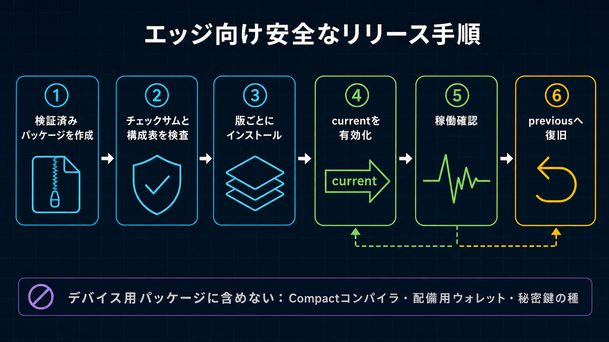

# Midnight Sensor Device Firmware

このpackageはEdge Device用のデバイス運用runtimeだけを含みます。開発PC上で`./edge-device/release/package_archive.sh`から生成し、開発Wallet、Compact source／compiler、proving key生成tool、Cloudflare deploy code、Browser applicationは含めません。



## 含まれる運用機能

- 温度collectorとloopback health endpoint
- デバイス専用ECDSA P-256 Identityと短命Cloudflare API Session
- deploy済みContractを使う、運用者が明示的に起動するDevice Transaction Identity CLI
- 開発PCで生成してintegrity manifestを付けたCompact runtime artifact
- `installer.sh`、systemd installer、永続障害解析log

開発／Deployer WalletとSponsor Walletはこのpackageへ含めません。導入済みRuntime、設定、Device Identity、
Transaction Identity、Compact Private StateはEdge Device上の
`~/.midnight/midnight-cloudflare-demo/`配下へ集約します。P-256秘密鍵は`device-auth/`、
Transaction Credentialは`device-wallet/`だけに生成し、どちらもEnvironment Fileへは絶対に置きません。
DeviceはNIGHT、DUST登録、同期済みDUST Stateを保持しません。

## Edge Deviceへの導入

```bash
tar -xzf midnight-sensor-device-fw-<version>.tar.gz
cd midnight-sensor-device-fw-<version>
cp .env.device.example .env.device
chmod 600 .env.device
```

Staging用`.env.device`へRemote Proof Server URL、Worker Ingestion URL、Device／Project ID、Sensor設定を記入し、`DEVICE_CONTRACT_ADDRESS`は空のままにします。公開鍵有効化後、`npm run device:configure`がWorkerへ認証し、現行Contract、Network、Policy、Assignment MetadataをAtomicに導入します。F/W ArchiveはDeployment非依存です。固定API Token、秘密鍵、Mnemonic、Seedは追加しません。検証後、InstallerはこのFileを`~/.midnight/midnight-cloudflare-demo/config/device.env`へ移し、Staging Copyを削除します。

Staging Fileを作るのは初回導入時だけです。Upgradeは導入済み`config/device.env`を再利用します。新しいArchiveに異なるStaging Fileがある場合、Installerはどちらを優先するか推測せず拒否します。

```bash
./installer.sh --no-start
```

InstallerはDevice設定、鍵、Release、Symlink、Serviceを変更する前に、選択した導入経路で必要な
Commandを一括検査します。通常経路ではFile Utility、systemd／Journal、Health Check、各特権Commandの
非対話sudo許可、Node.js `>= 22.15.0`、npm Runtimeを確認します。Debian系Hostで不足がある場合は、
そのCommandを提供するPackageだけを導入し、全検査を再実行します。`iw`、`vcgencmd`、Dockerのような
任意の診断情報は導入を妨げません。事前検査に失敗した場合、Project Stateを変更する前に不足Commandを
まとめて表示します。

InstallerはRelease ManifestとContract Artifact Manifestを検証し、Releaseを`releases/<version>-<manifest-hash>/`へCopyしてから、Device Auth、Collector、Device Wallet Workspaceのproduction dependencyだけを導入します。これらの検証とDevice Testが成功した場合だけ`current`を切り替え、旧Targetを`previous`にします。Device Identityの全Fileがない場合だけP-256鍵を生成し、完全な既存Identityは保持して検証し、一部だけ存在する場合は安全側に停止します。Systemd Serviceとして作成するのはCollectorだけで、Wallet利用は明示的CLIのままです。Compact compile、proving key生成、Docker、Contract deploy、Wallet初期化、開発tool導入は行いません。

Transaction Stateを変更するCommandは、`device-wallet/`配下のowner-only Process Lockを使用します。
2つ目のTransaction、Submission、Benchmark CommandはStateを開く前に失敗します。異常終了で残った
Lockは、記録されたPIDが動作していない場合だけ回収します。

導入後の構成:

```text
~/.midnight/midnight-cloudflare-demo/
├── config/device.env
├── current -> releases/<active-release>
├── previous -> releases/<previous-release>
├── releases/<version>-<manifest-hash>/
├── device-auth/
├── device-wallet/
└── data/（または設定済みEdge Data Directory）
```

Collector State、Local Raw Measurement、Delivery Outboxはowner-only Storageを使用します。State更新は
Temporary Fileへ書き、同期してからAtomic Renameします。異常な電源断で`collector-state.json`が破損した
場合、Collectorは`collector-state.json.corrupt-<timestamp>`として保持し、Raw／Outbox Fileを削除せず
新しいStateで開始し、復旧をPersistent Journalへ記録します。

Installerが初回導入時にP-256 Device Identityを生成します。`enrollment.json`だけを開発ホストへ転送して`npm run cloudflare:device:register -- --enrollment ...`で登録した後、Serviceを開始します。公開の登録Endpointはなく、開発ホスト上でDevice鍵を生成しません。

```bash
cd ~/.midnight/midnight-cloudflare-demo/current
# Device上でInstallerが生成した公開Enrollment情報を確認します。
npm run device:auth:show
sudo systemctl start measurement-edge-agent
```

導入後は展開元Archiveを削除できます。2つのSymlinkを入れ替えてRollbackするには次を実行します。

```bash
~/.midnight/midnight-cloudflare-demo/current/installer.sh --rollback
```

このTree外へ残るのはOS統合だけです。Systemd Unit、永続Journal設定／Report Helper、および適切なVersionがHostにない場合のInstaller管理Node.js Runtimeです。Project Source、Device設定、Wallet StateはこれらのOS Fileと一緒に保存しません。

導入後の確認:

```bash
sudo systemctl status measurement-edge-agent
curl http://127.0.0.1:8788/health
sudo journalctl -u measurement-edge-agent -f
```

Attestationが必要な場合だけ、Installerで選択した同じ非root Service Userとして、別系統のDevice
Transaction Identityを明示的に初期化します。Recovery Materialはowner-onlyのCredentials Fileへ保存し、
標準出力には表示しません。直後に`device-wallet/`全体をOffline Backupしてください。Deviceへの入金や
DUST同期手順はありません。

```bash
cd ~/.midnight/midnight-cloudflare-demo/current
npm run device:authority:generate -- --network preprod \
  --confirm-contract-authority-generation
npm run device:authority:show -- --network preprod
npm run device:wallet
npm run device:submit -- --input /path/to/prepared-real-dataset.json
npm run device:status
```

Development OperatorがContractをDeployする前にContract Authorityを一度だけ生成します。公開`enrollment.json`だけを転送し、Secretを含む`authority.json`はEdge Deviceから出しません。`device:submit`は実際の`SensorRecord[]`または`PreparedDailyExtremaAttestation`を受け取ります。配列Inputは認証済みAssignment境界から24個のObserved／計測なしSlotへ集計し、指定できるのは運用日と登録済みPolicy／Assignment IDだけです。Threshold Boundや別の境界は送信できません。Submitは日次Scheduled Proof Jobを1件作成または再利用します。Collectorは1時間AggregateとAnomaly TransitionだけをUploadし、Raw Readingは送りません。

PreprodのCost結合試験を明示的に行う場合、標準の1日分をDeviceのMemory内に生成します。1分ごとの
Private Raw値1,440件をDevice内で24時間分の時間別最小値・最大値Slotへ集約し、同じ運用Walletと
Remote Proof Server経路へ送信します。`--confirm-synthetic`が必須です。CLIは固定回路の同値性確認用に
24／96件も受け付けますが、別のCost Profileにはしません。

```bash
npm run device:benchmark -- --samples 1440 --period-date YYYY-MM-DD --run-id cost-1440-a --confirm-synthetic
# 固定24 Slot回路を変えず、指定した運用時間Slotを計測なしにする。
npm run device:benchmark -- --samples 1440 --missing-hours 2,3,11,19 \
  --period-date YYYY-MM-DD --run-id missing-hours-a --confirm-synthetic
# 運用日全体を停止として表す。
npm run device:benchmark -- --samples 1440 --missing-hours all \
  --period-date YYYY-MM-DD --run-id stopped-day-a --confirm-synthetic
```

`--missing-hours`には重複しない運用Slot番号`0`～`23`、または`all`を指定します。任意の
`--outlier-value`は欠損除外後の最初の観測値へ適用されるため、計測なしと正しいしきい値外判定を
同時に試験できます。

各Submissionは運用前に登録済みのPublic Policyを使い、実際の`submitDailyAttestation` Transactionを
Proof／Bindします。FeeなしのFinalized Transactionを認証済みSponsor Endpointへ送り、Sponsor Walletが
DUSTだけを追加してMidnightへ送信します。疑似値やPrivate Hourly ExtremaはD1へUploadしません。Timing、
Public Attestation Commitment、Observed／STOPPED Count、Sponsorship時間、Fee、Transaction Metadataだけを
含むRedacted Resultを`device-wallet/benchmarks/`配下へ保存し、Raw疑似Sampleは暗号化されたDevice Private
Stateだけに保持します。最初のSponsor Request前に、FeeなしSerialized Transactionをmode `0600`で
`device-wallet/pending-transactions/`へ原子的に保持します。同じProof JobのRetryはIntegrity確認済みの
同一Bytesを再Proofせず再利用し、同じJobに対する別Transactionは拒否します。新しいAttestationごとに
一意な`--run-id`を使用してください。

`config/device.env`、`device-auth/`、`device-wallet/`全体を、開発PCの`tools/midnight-operator/.env.development` Backupとは別に
保管してください。Device Credentialは混在させたり開発ホストへコピーしたりしません。Sponsor Walletの
Recovery Sourceは両Hostから分離管理します。Release DirectoryとSymlinkは、署名／Checksum検証済み
Firmware Archiveから再作成できます。
