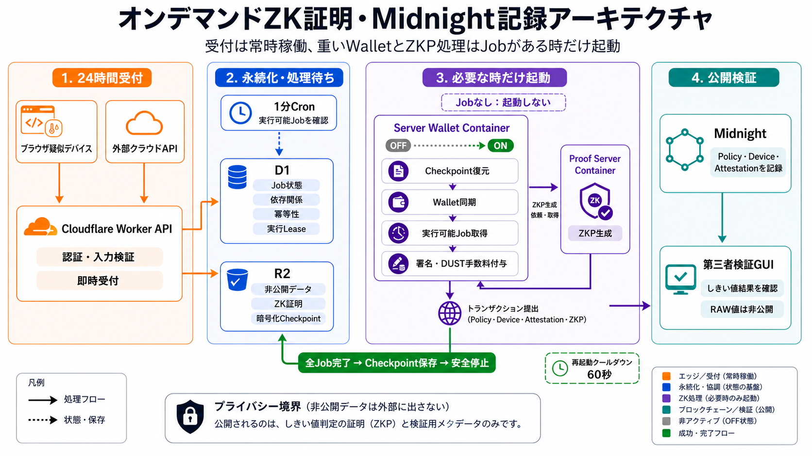

# Sponsor Walletの処理プロファイル



## 目的

Sponsor Walletは状態を持ち、認可済みトランザクションへDUSTを追加する前に同期が必要です。
`standard-4` Containerを1か月常時稼働するより、受付済みJobがあるときだけ起動する方が費用を
抑えられます。公開API、D1の状態、R2データ、連携元APIからの取得、Job受付は24時間稼働します。
1分CronはContainerを起こさずD1のJobを確認します。`on-demand`ではJob検知後の次回確認までに
Walletを起動し、`scheduled`では日次締切に含まれるJobだけを対象とします。どちらも対象Jobを
処理し終えると`SIGTERM`でR2へCheckpointを保存して停止します。停止後60秒は再起動せず、Worker内で
待機せずに次のCronで再試行します。

処理開始時刻はWorkerのビルド設定ではなく、D1の運用設定です。切替時にコードの再配備、Containerの
置換、Wallet鍵の変更は行いません。

## 運転プロファイル

| プロファイル | D1のmode | 処理開始 | 用途 |
| --- | --- | --- | --- |
| 審査 | `on-demand` | Job検知後、最大1分 | アイドルContainerを持たない対話操作 |
| 費用最適化 | `scheduled` | JST 02:00 | 日次バッチを処理後に停止 |
| 保守 | `always-on` | 24時間 | 初回同期と立会い診断 |

Migration `0037_sponsor_wallet_on_demand.sql`でオンデマンドモードと再起動クールダウン状態を追加します。

費用最適化プロファイルへ切り替えます。

```bash
npm run cloudflare:sponsor:scheduled
```

審査プロファイルへ切り替えます。

```bash
npm run cloudflare:sponsor:on-demand
```

保守のためWalletを常時起動します。

```bash
npm run cloudflare:sponsor:always-on
```

ソースを変更せず、別の正時を設定することもできます。

```bash
node tools/cloudflare-admin/set-sponsor-wallet-operating-mode.mjs scheduled \
  --starts-at-hour 1 --utc-offset-minutes 540
```

コマンドは全値を検査し、Git管理外のルート`.env`からCloudflare認証情報を画面へ表示せずに読み、
D1の単一行を更新して保存結果を再読込します。次の1分Cronから設定が反映されます。`scheduled`へ
切り替えた場合は実行中の要求を完了させます。対象JobがなくなるとCoordinatorが明示的に
Checkpoint保存と安全停止を開始します。
`always-on`へ戻すと、次のCronでWalletを起動またはCheckpointから復元します。

## 24時間受付と日次締切

- Browser WalletのProject Challengeと24時間のProject Sessionは常時利用できます。Workerが
  公式Wallet署名と相互運用できるSHA-256＋BIP-340検証を行うため、状態を持つServer Walletは起動しません。
  Projectのメタデータは直ちにD1へ保存します。
- Policy／Device登録Challengeも常時利用できます。署名済み登録要求は受付時に検証・
  消費し、冪等なD1 Operationとして保存してSponsor Queueへ投入します。APIは`202 Accepted`を
  返し、Midnight登録は受付日時が日次締切へ含まれるまで待機します。
- Browser Device画面には次回の処理開始日時を明示し、受付済み登録を停止中のSpinnerではなく
  依存関係付きの待機処理として表示します。審査員は登録完了前でもStep 3で非公開の1,440件を生成し、
  Step 4でZKP生成とMidnight記録をまとめて要求できます。この段階の非公開入力と継続要求は
  ブラウザ内に保存します。処理開始後にDevice／Assignment TXが確定すると、接続中の画面が時間別集計を
  Uploadし、登録受付時刻を引き継いだProof Jobを作成します。Device TXの準備完了時にWallet承認を求め、
  その後の手数料付与と送信はサーバー側で継続します。
- デバイスのトランザクションUploadと連携元データは、既存の永続Workflowで受け付けます。
- Managed SourceのHTTPS取得と時間別集計は、Walletを起動せず続行できます。
- 受付済みDevice／Policy登録、Managed Source登録、管理方式のZKP／TX、Sponsored TXはD1に残し、
  次の日次処理開始時にQueueへ再投入します。
- Challenge期限と署名時刻の許容範囲はWorkerの受付時に検証します。Queue待機時間によって受付済み
  Operationを期限切れにはしません。Server WalletはMidnight TX作成前に同じ署名済み認可を再検証します。
- 各回の締切は処理開始時刻です。締切後に受け付けたJobは翌日分とし、要求が継続してもContainerを
  起動し続けないようにします。
- 実行順はQueueの配送順ではなくD1の依存状態で決めます。Projectはオンチェーン資産ではなくD1へ
  保存する業務上の境界です。Policyのオンチェーン確定後にDevice登録と割当、割当確定後にZKP生成、
  ZKP完成後にSponsor TXを実行します。
- 1分CronのCoordinatorが、実行可能な対象タスクを`created_at`の古い順に1件選びます。
  D1の6分LeaseによりCronが重複起動してもServer Walletの状態変更は1件だけです。別の常駐Workerや
  新しいContainerは追加しません。
- `on-demand`ではD1に対象JobがなければContainerを呼びません。滞留Jobの処理完了後はWalletを停止し、
  D1へ60秒の再起動クールダウンを記録します。
- 運用ダッシュボードは最後に保存したWallet状態と`WAITING FOR NEXT RUN`を表示します。概要取得と
  Runtime診断はContainerを起動しません。
- 次回処理待ちをWallet利用不可、同期停滞、DUST不足、Sponsor滞留として通知しません。Jobによる
  起動直後の`starting`と進捗中の`syncing`も通知せず、適用済み同期進捗が5分間変化しない、明示的な
  Errorになる、または`ready`後に低DUSTとなった場合だけWallet Incidentを作ります。処理時間外または
  `on-demand`のIdle時は、既存Alertを次回起動へ持ち越さず解消として評価します。
- 同期状態は従来どおり暗号化してR2へ保存します。日次処理完了時と予備の非活動停止では
  `SIGTERM`を受けたSupervisorが最新Checkpointを保存してから終了します。

CronとQueueは重複実行され得ます。D1の状態遷移と既存のmeasurement group単位の冪等性を正とする
ため、処理開始やプロファイル切替によって同じ証明を二重にチェーンへ記録しません。

前日分が完了しないまま翌日の開始時刻になっても、別のWallet Runtimeや重複バッチは起動しません。
締切だけを翌日分まで進め、`created_at`が古い前日Jobを優先して続行し、その後に新規Jobを処理します。
再試行可能な失敗は滞留し、終端エラーは要対応／DLQへ移してContainerを永久に起動し続けません。

## 停止・再起動の受入試験

1. 対象タスクがない状態で、単一Containerが`inactive`であることを確認します。
2. 次回締切より前に固有IDのタスクを受け付け、D1では待機中、Containerは停止中であることを確認します。
3. 処理開始時刻を越えたCronがContainerを起動し、暗号化済みR2 Checkpointを復元してWallet同期を
   完了するまで、タスクを状態変更処理へ進めないことを確認します。
4. 同期後にPolicy、Device／Assignment、ZKP、Sponsor TXの依存順で処理し、対象Jobが`confirmed`、
   TX hashがMidnight Explorerで参照可能になることを確認します。
5. 同一IDを再投入してもD1とコントラクトの冪等性により二重記録されないことを確認します。
6. 最後の対象タスク後に明示的な`SIGTERM`、`source=graceful-shutdown`のR2 Checkpoint、
   Containerの`inactive`を確認します。次回開始時刻では前日残件を新規分より先に処理します。

### 2026-09-03 Preprod実測

| 観測点 | 実測結果 |
| --- | --- |
| 停止状態 | `midnight-server-wallet`の単一Instanceが`inactive` |
| 試験用締切 | 20:09:28 JSTに開始時刻を一時的に20:00へ変更 |
| 起動 | 20:10 Cron。暗号化Checkpoint 5,540,377 bytesをR2から復元 |
| 同期Gate | 起動直後は`starting`のためJobを進めず、20:10:06.807–20:10:36.301 JSTの29.494秒で`ready` |
| 追跡Job | `managed-run-17e37b161672d983990a7550d6fd39bed6b585ee3e10ed691fa6e5e1bd4f04ee` |
| ZKP | 20:11:09.410開始、20:12:06.912生成完了（57.502秒） |
| Midnight確定 | 20:12:32.313 JST、Block `2386890`、DUST fee `705120000000001` specks |
| 公開証跡 | [TX `f6a1b683…727aa`](https://preprod.midnightexplorer.com/transactions/f6a1b6837c21c9ec748bf1aa709eb745f025e2239f0785da480717ae570727aa)をHTTP 200、`Success`として確認 |
| Lease | 対象Jobだけを保持し、確定後20:12:32.910 JSTに解放 |
| 設定復元 | 20:13:36 JSTに通常の02:00開始へ復元 |

設定復元直前の20:13 Cronが既に取得していた次の1件は中断せず完了させ、それ以降の4件は翌日の
締切まで待機しました。これは「実行中は安全に完了し、新しいタスクは開始しない」という切替仕様どおりです。

### 明示停止の再試験

同日、明示的な処理完了停止をPreprodへ配備して再試験しました。

| 観測点 | 実測結果 |
| --- | --- |
| 開始状態 | 21:24:56 JSTに単一Containerが`inactive` |
| 1件限定の締切 | 18:34 JSTを指定し、18:34受付の1件だけを対象化。後続Jobは対象外のまま維持 |
| Cold Restore・同期 | 21:26:07.850–21:26:42.447 JSTの34.597秒で初期化し`ready`へ到達 |
| 追跡Job | `managed-run-a22986c35bde15ec7834e41393e009340169744334e5d7be1dca13b2def5607e` |
| ZKP | 21:27:09.728開始、21:28:13.209生成完了（63.481秒） |
| Midnight確定 | 21:28:38.024 JST、Block `2387651`、DUST fee `703470000000001` specks |
| 公開証跡 | [TX `ecbf87cc…5ea2`](https://preprod.midnightexplorer.com/transactions/ecbf87cc5f0e1dd0f7d9c162b8a0e8a5d86cc48fcb38fc10098421e082555ea2)をHTTP 200として確認 |
| Graceful Checkpoint | 21:28:39.975 JSTにR2を更新、5,544,219 bytes、`reason=SIGTERM`、`source=graceful-shutdown` |
| 明示停止 | 21:28:51 JSTまでにContainerが`inactive`。処理Leaseも解放済み |
| 設定復元 | 21:30:11 JSTに通常の02:00開始へ復元し、後続3件は待機を維持 |

## `standard-4`の計画用概算

Cloudflareは、ContainerのMemoryとDiskを起動時間、CPUを実際の使用時間で課金します。2026-09-03
時点の公開単価はMemoryが1 GiB秒あたりUSD 0.0000025、Diskが1 GB秒あたりUSD 0.00000007、
CPUが1 active vCPU秒あたりUSD 0.000020です。無料枠はCloudflare Account全体で共有されるため、
次のContainer単体比較から除外しています。

| 30日プロファイル | 概算起動時間 | Memory + Disk | 平均1.0 active coreのCPU例 | 使用料概算 |
| --- | ---: | ---: | ---: | ---: |
| 24時間 | 720 h | USD 81.39 | USD 51.84 | USD 133.23 |
| JST 02:00開始 + 1日4時間処理の例 | 120 h | USD 13.56 | USD 8.64 | USD 22.20 |

例示した日次負荷の起動時間は常時運転の約16.7%で、この計画用概算を約83.3%削減します。実費は
固定4時間ではなく、実際に全Jobを処理し終えるまでの時間に比例します。
毎日のCold RestoreにCPUと初回Jobの待ち時間が加わるため、代表的な1か月の請求と起動時間を実測
して確定します。Workers Paid基本料金、Worker／D1／Queue／R2、Network Egress、Proof Server
Containerは別です。

単価出典：[Cloudflare Workers／Containers料金](https://developers.cloudflare.com/workers/platform/pricing/)。
