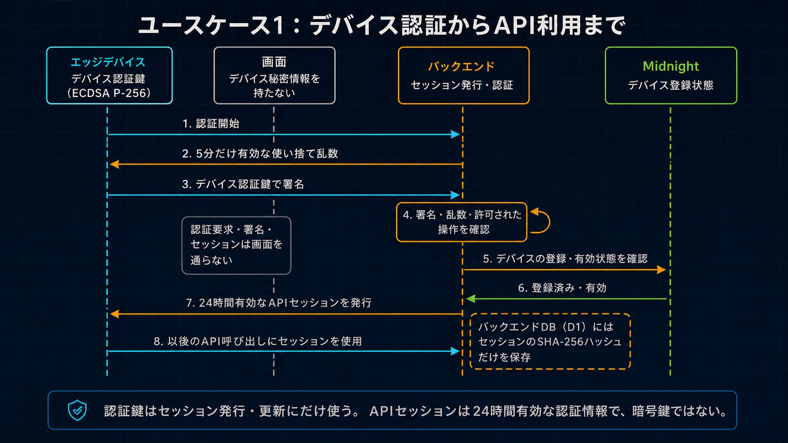
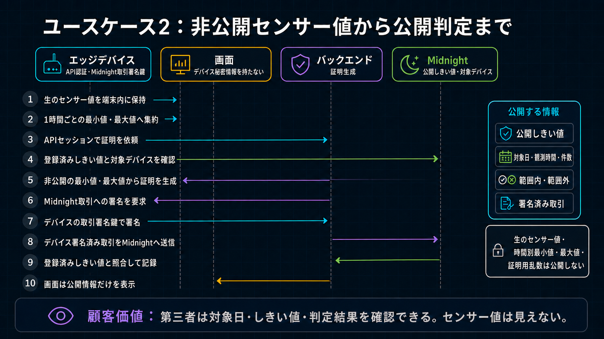

# デバイス認証

[English](../../security/device_authentication.md)

本書は実装済みのWave 1プロトコルを説明します。システム全体の正本仕様は[`wave1_spec.md`](../architecture/wave1_spec.md)です。



各Key Domainは用途を1つに限定し、独立してRotationします。認証ComponentとProof Serverが受け取るのは
Device公開鍵またはHashだけで、Edge DeviceやOperatorの代理署名はできません。統合Server Walletは同期済み
Wallet Runtimeを共有しますが、管理、Managed Attestor、DUSTだけを付与するSponsorの境界は、分離した認可
SecretとAdmission Policyで維持します。

顧客へ示す価値はシンプルです。第三者が見るのは、提出されたSensor値が登録済みThreshold以内かどうかであり、Sensor値そのものではありません。以下のSequenceは、その価値を支える各Use Caseで、どのCredentialを使うかを示す補足Security Evidenceです。現行Sessionは暗号鍵ではなくOpaque Bearer Credentialです。

## 境界と保存先

Device Identityは、Device Transaction Identity、Server Wallet Seed、Operator Authority、Managed Attestor Authority、Deployment Wallet
とは独立したECDSA P-256鍵Pairです。秘密PKCS#8鍵はowner-only権限でEdge Device内に保持し、Cloudflare
認証へは公開JWKだけを登録します。

| 情報または状態 | 保存先 | 用途 |
| --- | --- | --- |
| Device秘密鍵 | Edge Deviceの`device-auth/device-private-key.pk8`、mode `0600` | Session開始・更新時に5分Challengeへ署名 |
| 公開JWK、Device／Project割当、状態、Scope | D1 `device_auth_keys` | P-256 API Identity Registry。Midnight Mirror登録後だけ有効 |
| Public Midnight Device Status／Commitment／Authority／Version | D1 `devices` Mirror | Fail-closed API Gate。正本はMidnight |
| One-time nonce hashと使用済み状態 | D1 `device_auth_challenges` | AtomicなReplay防止 |
| Opaque Session Token hash、期限、失効、Scope | D1 `device_auth_sessions` | 24時間のAPI認可 |
| 平文Opaque Session Token | Edge Deviceの`device-auth/session.json`、mode `0600` | 通常API用Bearer Credential |
| 開発Midnight Wallet | 開発ホストのみ | Contract deployと管理 |
| Device Transaction Identity | Edge Deviceの`device-wallet/`のみ | 値移動を含まないProof済みTXをFeeなしでBind |
| Device Contract Authority | Edge Deviceの`device-wallet/<network>/contract-authority/`のみ | Compact Private認可。公開値だけをDeployに使用 |
| Server Wallet Seed | Server Wallet ContainerのDeploy Secretだけ | 1回の同期状態を共有し、管理／Managed Attestor／適格なDUST付与TXを直列送信 |
| Operator／Managed Attestor Secret | 分離したServer Wallet Secret Binding | 各Compact回路だけを認可し、Device Callは認可しない |
| Sponsor同期Checkpoint | Ephemeral Container Disk外の暗号化Object | Seedを開示せずSponsorのDUST履歴同期を再開 |
| 短命Operator Proof Lease Hash | D1の`operator_proof_leases` | Deploy／Contract管理用途限定。平文はProcess内だけ |

KVとApplication Durable ObjectsはSession正本に使いません。WorkerはrandomなOpaque TokenをSHA-256でhash化し、D1にはhashだけを保存します。D1 Snapshotが流出しても、Active Bearer Tokenそのものは直接得られません。通常の認可RequestはD1を読み取りますがSession rowを更新しないため、高頻度DeviceでもSampleごとのD1 writeは発生しません。

## インストールと登録

公開のDevice登録Endpointはありません。登録は認証済み開発ホストから実行するOperator操作です。

1. Operatorが対象D1 Project／Device recordを作成または確認します。
2. `installer.sh`がEdge DeviceのIdentity Directoryを確認します。完全な既存Identityは保持し、Identity Fileがすべてない場合だけP-256鍵を生成し、一部だけ存在する場合は停止します。
3. Edge DeviceからP-256 Device Identityと別系統のCompact Device Contract AuthorityのPublic Enrollmentだけを開発ホストへCopyします。
4. OperatorがCompact Device AuthorityとDevice-bound Policy AssignmentをMidnightへ登録し、Confirmed Public StateをD1へMirrorします。正本は[`device_registry.md`](device_registry.md)です。
5. 開発ホストでP-256 FingerprintとD1／Midnight Device割当を検証して公開鍵を登録します。

   ```bash
   npm run cloudflare:device:register -- --enrollment /secure/temp/enrollment.json
   ```

6. 別のActive Keyがある場合、Operatorが`--confirm-replace`でRotationを明示承認しない限りCommandは失敗します。Rotationでは旧Active KeyとSessionを1つのD1 Transactionで失効させます。
7. Deviceが認証し、`npm run device:configure`でWorkerから現行Public運用設定を導入します。
8. Operatorの記録保持方針に従い、一時Enrollment Copyを削除できます。

開発ホストはDevice Identity秘密鍵を生成・保存しません。将来のTPM実装ではTPM内にExport不能なP-256鍵を生成し、公開Enrollmentだけを同じOperator境界から登録できます。

Contract Deploy／Fleet管理には別のDevelopment Wallet、Operator Authority、Edge Deviceの公開Contract Authority値を使います。Remote Provingは自動Revokeする`contract_deploy`／`contract_admin` Leaseで認可します。Device IdentityまたはDevice Sessionを開発ホストへCopyしません。

## Runtime protocol

1. Deviceが`deviceId`と`keyId`を`POST /auth/challenge`へ送ります。
2. WorkerがD1のActive Keyを確認し、5分有効のChallengeを作成します。D1へ保存するのはnonce自体ではなくSHA-256 hashです。
3. Deviceは次のUTF-8文字列へECDSA P-256／SHA-256で署名します。

   ```text
   VSP-DEVICE-SESSION-V2
   POST
   /auth/session
   <deviceId>
   <keyId>
   <challengeId>
   <nonce>
   <ISO-8601 timestamp>
   <空白区切りでsort済みの要求Scope>
   ```

4. `POST /auth/session`はtimestampの±5分、Active公開鍵、署名、nonce hash、期限、許可Scope、未使用状態を検証します。条件付きD1 UpdateによりChallengeは1回だけ消費できます。
5. Workerは24時間有効のrandomなOpaque Bearer Tokenを返します。Token内に読取り可能なClaimはなく、Device、Project、Key、Scope、期限、失効の正本はD1です。Wave 1での有効期間延長により、断続接続するDeviceのP-256 Challenge回数を減らします。Key RotationまたはOperatorによる明示失効は期限前でもSessionを無効化します。
6. Deviceは期限直前までSessionを再利用します。Proof Providerは`/check`／`/prove`ごとに認可Headerを再評価しますが、owner-only Local Cacheが期限直前になった場合だけ新しいSessionを取得します。長期ECDSA署名はSample／Proof Requestごとではなく、Session開始・更新時だけ使用します。

## 日次AttestationのCredential Sequence



Bearer SessionはBackend API Callを認可します。Device Contract AuthorityはCompact Callを認可します。
現場Transaction IdentityまたはBrowser WalletはProof済みCallをFeeなしでBindします。その後Sponsor WalletがDUST
だけを追加し、すでにBind済みのTXを送信します。各Credentialは分離し、SponsorへDevice Identity、
Contract Authority、Private Extrema、Nonce、Compact Private Stateを渡しません。Trusted Proof Backendは
Transit中のPrivate Proving Bodyを扱いますが保存せず、Sponsor Endpointが受け取るのはFinalized Serialized
Transactionだけです。

実装Scopeは次の通りです。

```text
measurement:write
anomaly:write
proof:request
proof:read
proof:generate
transaction:submit
configuration:read
device:status
```

`configuration:read`が返すのはAuthenticated Device自身のPublic Contract、Network、Policy、Assignment、
Configuration Revision、Confirmed管理TX Evidenceだけです。Key、Session、Wallet、Raw Reading、Private
Extrema、Nonceは返しません。

本番Device URLはHTTPS必須です。Loopback HTTPはLocal開発だけで許可します。Measurement／Anomaly bodyのDeviceとProjectはSessionの識別情報に拘束されます。
