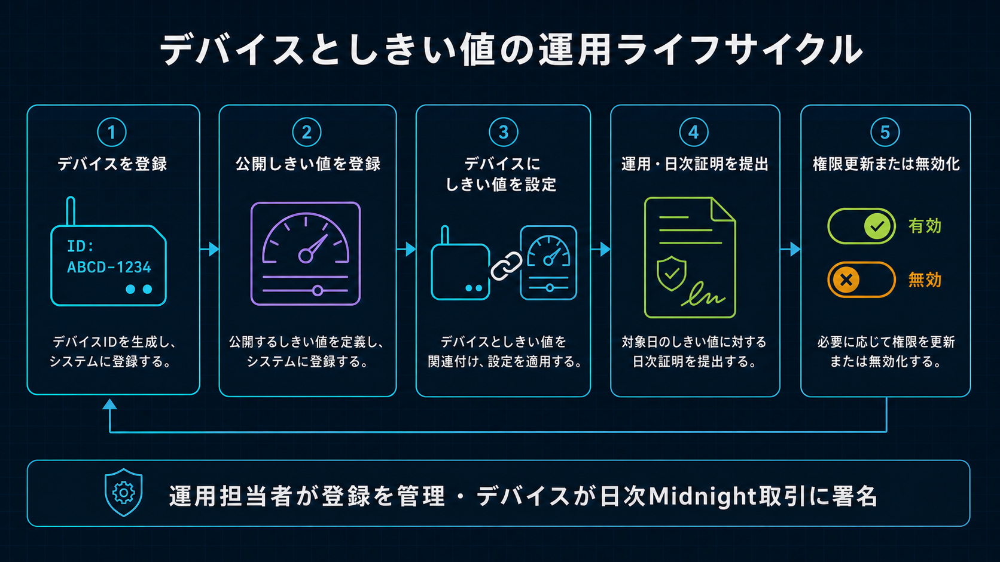

# Fleet Device Registry・登録仕様

[English](../../security/device_registry.md)

状態：Wave 1 正式仕様
最終更新：2026-08-30 JST

本書はDevice追加、鍵Rotation、無効化、利用のTrust Boundaryを定義します。
[`wave1_spec.md`](../architecture/wave1_spec.md)と合わせて正本とします。



## 1. Authority Model

1つの`sensor-registry` Contractで複数Deviceを扱います。Constructorに固定した単一のDevice
Authority／Device Commitmentは保持しません。

```text
operatorAuthority（Contractごとに1つ、sealed）
  ├ registerDevice
  ├ rotateDeviceAuthority
  ├ disableDevice
  ├ registerThresholdPolicy
  └ registerPolicyAssignment

devices[deviceCommitment]
  └ { authority, active, version }

deviceAuthorityOwners[authority]
  └ deviceCommitment

policyAssignments[assignmentKey]
  └ { policyKey, deviceCommitment, validFrom, validUntil, version }
```

Operator Authority秘密値は開発／運用ホストと、PrivateなSponsor Wallet ContainerのDeploy Secretとして
保持します。Development Walletは管理対象Edge Deviceを操作し、Sponsor WalletはLace署名済みBrowser Review
Flowに限り、同じ固定Device登録Circuitを実行します。Domain分離したOperator AuthorityがCompact回路内の
認可を証明します。Device Contract Authority秘密値は該当Deviceだけに置きます。Publicな
Self-enrollment Circuitは設けず、すべてOperator-only Circuitを実行します。
各Public Device Authorityは1回だけ登録できます。Rotation後も旧／新Authorityを予約済みとして保持し、
別Deviceへの再利用を拒否します。

`submitDailyAttestation`は同じ回路内で次をすべて検証した場合だけ成功します。

1. Public Device Commitmentが`devices`に存在しActiveである
2. Private Device Contract Authorityから導出した値がRegistryのPublic Authorityと一致する
3. 選択したImmutable Policy Assignmentが同じDevice Commitmentを含む
4. CommitmentされたPrivate Daily Inputが同じDevice／Policy／Assignment Keyを含む
5. Daily Schema `5`、Circuit `3`、24時間Period、Presence、Count、Policy検査がすべて通る

Daily Commitmentには明示的なDomain `vsp:daily-extrema:v1`を含め、回路内で固定値を検証します。

## 2. 登録順序

Edge登録は認証済みOperator／Factory操作です。

1. D1へ業務Inventory Rowを`midnight_registry_status=unregistered`でProvisionする。このRowだけでは
   Session発行もIngestionも許可しない
2. Edge Device上でP-256 Device Identityと別系統のCompact Device Contract Authorityを生成し、Public
   EnrollmentだけをOperatorへ渡す
3. OperatorがDevelopment WalletとOperator AuthorityでMidnightの`registerDevice`を実行する。
   同じDevice CommitmentまたはDevice Authorityの再登録は拒否する
4. 未登録ならImmutable Public Threshold Policyを登録する
5. 運用開始前にDevice Commitmentを含む`registerPolicyAssignment`を実行する
6. Midnight Call完了後、Public Device／Assignment StateをD1へMirrorして`registered`へ変える。
   暗号学的な正本はMidnightのままとする
7. Public P-256 KeyをD1へ登録する。Midnight Mirrorが`registered`でなければScriptが拒否する
8. Challenge／Session認証後に`npm run device:configure`を実行する。認証済みDeviceが現行Contract、
   Network、Policy、Assignment、管理TX EvidenceをWorkerから取得し、Owner-only `device.env`をAtomic更新する
9. 最初のIngestion／Proof Job試験を行う

Remote Cloudflare Proof Serverを使う運用Command：

```bash
npm run development:device:register:cloudflare -- \
  --device-id edge-temp-002 \
  --device-authority <public-compact-authority> \
  --policy-id temperature-v1

npm run cloudflare:device:register -- --enrollment /secure/device-identity-enrollment.json

# P-256有効化後、Device上で実行：
npm run device:configure
```

最初のCommandはProcess内だけの`contract_admin` Proof Leaseを使い、Midnight Call、Owner-only Local
Deployment Record更新、D1 Mirror同期、Lease失効まで行います。2つ目で独立したP-256 API Identityを
有効化します。

Browser Review Flowは同じContract認可を使い、従来のLoopback Bridge機能をWorker内へ移します。Enrollment前に
BrowserとWorkerはLace公開検証鍵の識別子から
`device-SHA256("VSP-BROWSER-DEVICE-ID-V1" || projectId || walletKeySha256)`を独立に計算します。
Device IDは読取専用で、任意ID指定や別WalletのBrowser StorageへのFallbackは拒否します。

このEnrollment Flowの前に、Laceは別のOne-time Project Session Challengeへ署名します。Workerはその
Wallet識別子に関連付けられたProjectだけを返し、24時間のOpaque Bearer Tokenを発行します。Wallet 1つに
関連付けられるProjectは最大10件で、API CheckとD1の`browser_wallet_projects_limit` Triggerが同じ上限を
強制します。新規ProjectはPolicy 0件から開始し、Project作成だけではOn-chain TXを作りません。Ownerは別操作で
Projectに関連付くPolicyを最大10件作れます。LaceがProject、Immutable Policy ID、Mode、Centi-degree Bound、
Nonce、Timestampへ署名し、WorkerがOperator限定`registerThresholdPolicy`をQueueへ投入し、Indexer確定後だけ
Policyを公開します。登録済みDevice Assignmentを無効にしないよう、既存の明示的Project／Policy関連は保持します。

1. BrowserがDevice IDを導出し、Non-exportable P-256 Device Identityを作り、登録済みPublic Policyを選択
2. Workerが5分間有効なOne-time Challengeを発行
3. LaceがDevice ID、P-256 Key ID、Device Authority、Policy、Challenge、Nonce、TimestampのCanonical
   Messageを`signData`で署名
4. WorkerがLace署名を検証してDevice IDを再計算し、Lace Verification Key／ProjectごとにReview Device 1台を強制
5. Private Sponsor Wallet Containerが`registerDevice`と`registerPolicyAssignment`だけを実行
6. IndexerでDevice、Authority、Policy、Assignment、Versionの完全一致を確認
7. 確認後に限り、D1のP-256 KeyとPublic Mirrorを1 Batchで有効化

Migration `0019_worker_browser_provisioning.sql`はOne-time Enrollment Challenge Hashを保存します。
Migration `0021_wallet_projects.sql`はHash化Project Session、10 Project上限、明示的Project／Policy関連、
Wallet／Project／Device Bindingを追加します。Migration `0022_project_policies.sql`はLace認可Policy Operation、
Projectごとの10 Policy上限、実際のProof生成日時、登録済みDeviceの初期現在状態を追加します。これらのEndpoint
では別Contract選択、Device Rotation／Disable、Token Transfer、Operator／Sponsor Secret取得はできません。
Concurrent登録はD1 Leaseで直列化し、DuplicateはFail Closeします。

## 3. Rotationと無効化

Device Contract Authority RotationはOperator限定で、現在値より大きいRegistration Versionが必要です。
Midnight TX成功後にD1 Mirrorを同期します。P-256 Rotationは別操作で、古いSessionを失効させます。

```bash
npm run development:device:rotate:cloudflare -- \
  --device-id edge-temp-002 \
  --device-authority <replacement-public-compact-authority> \
  --device-registration-version 2
```

Wave 1の無効化はFail Closeかつ不可逆です。OperatorがMidnightで`disableDevice`を実行した後、D1
Mirrorを`disabled`へ変え、AssignmentをRetireし、Active P-256 KeyをDisableしてSessionをRevokeします。

```bash
npm run development:device:disable:cloudflare -- --device-id edge-temp-002
```

D1の`registered`値だけを偽造／誤更新しても、ContractがLive Device RegistryとDevice-bound
Assignmentを独立検査するため、不正なMidnight Attestationは通りません。逆にOn-chainで有効でもD1へ
MirrorしていないDeviceはCloudflare Sessionを取得できません。この二重Gateは意図的にFail Closeします。

## 4. D1 Mirror

Migration `0011_multi_device_registry.sql`は`devices`へPublic Mirror Fieldと管理Transaction Evidence、
`policy_assignments`へ`device_commitment`、Operator Leaseへ`contract_admin` Purposeを追加します。
Migration `0012_device_operation_configuration.sql`は単調増加するPublic Configuration Revisionと
専用`configuration:read` Scopeを追加します。Migration `0013_daily_threshold_result.sql`は日次の冪等Proof JobへClaimしたPublic WITHIN／OUTSIDE ResultをBindingします。Migration `0019_worker_browser_provisioning.sql`はHash化したBrowser ChallengeとLace Verification Key Bindingを追加します。SecretはD1へ保存しません。

WorkerはSession発行／運用Input受理前に次を必須とします。

- D1 Device Statusが`registered`
- Public Device Commitment／Authority、Registration Version、Contract Address、確認済み管理TX IDが存在
- Authenticated Device IDから導出したCommitmentが同じ
- D1 Assignment Mirrorが同じDevice Commitmentを含む

管理GUIはMidnight Registry Status／Versionと短縮Public Device Commitmentを表示します。
Disabled／Unregistered Deviceを有効化済みとして表示してはいけません。

`GET /api/v1/device/configuration`は`configuration:read`を持つ認証済みDevice Sessionだけを受け付け、
SessionのDevice／ProjectへQueryを拘束します。Device、有効なDevice-bound Assignment、Policy、各Confirmed
TX Evidence、D1上のContract Address、Worker設定済みContract Addressがすべて一致する場合だけ返します。
Wallet CommandはContract依存操作前に設定を更新するため、再Deploy後もF/W Archiveを作り直さず新Addressへ
移行できます。Threshold BoundはMidnight上のPublic値を正本とし、DeviceがProof Requestで選択・送信しません。

## 5. 互換性とDeployment Gate

Fleet Registry LedgerとDomain付きDaily Commitmentは、旧Selected-leaf Deploy、途中のSingleton
Daily Attestation実装、WITHIN専用Fleet Registryと互換性がありません。Compact再Compile、新Contract Deploy、Migration `0020`
までの適用、全Device／Policy／Assignment再登録、Worker Contract Address更新、Deviceによる新しい運用設定の
取得、Schema `5`／Circuit
`3`でのPrivate Daily Commitment再生成が必要です。

HEAD、現在のWorking Tree、Deploy済みPreprod Contractは別の状態です。Local Compile／Simulator成功を
Preprod Deploy／Transaction成功として報告してはいけません。

次の自己負担Preprod E2E Gateは2026-08-28 JSTに通過し、TX IDをCost BenchmarkへEvidenceとして記録しました。

1. OperatorがDevice、Policy、Device-bound Assignmentを登録
2. D1 MirrorとP-256有効化を完了
3. Piが24時間Sessionを取得しHourly AggregateをUpload
4. PiがThreshold BoundなしでDaily Proof Jobを作成
5. Cloudflare Container Proof ServerがProofを生成
6. Edge Device Walletが自身のDUSTで`submitDailyAttestation`を署名／SubmitしPreprodでConfirmed
7. Local管理GUIとPublic Verifierが同一のConfirmed TXと正確なRedacted Claimを表示

Edge Deviceから自己負担の正しいWITHIN／OUTSIDE Attestationを完了しました。現行Schema-5のSponsor負担
WITHIN Attestationは2026-08-30 JSTに別途確定し、現在のSponsorship境界のEvidenceとします。

現行Sponsor負担Release GateではStep 6を次へ置き換えます。

1. DeviceまたはLaceがProof済みTransactionをFeeなしでBind
2. 認証済みSponsor Endpointが対応Proof Jobにつき1回だけ受理
3. 専用Sponsor WalletがDUSTだけを追加して送信
4. 重複、不一致、Size超過、不正State、改変Requestを拒否するか同じ冪等Resultを返す
5. GUI撮影前にConfirmed Preprod TXとSponsorship時間／Feeを記録

このGateは標準1,440件経路で通過しました。同一バイト列の再試行でもSponsor試行1回、利用枠予約1件、
追加Proof Server Request 0件を維持しました。

## 6. Costの扱い

Fleet対応で増えるのは、Deviceごとの一回限りの管理TX（`registerDevice`、必要時のPolicy登録、
Device-bound Assignment、Rotation、Disable）と、小さなPublic Ledger／D1 Stateです。Daily Proof量は
Active Device数×日数の線形であり、指数的には増えません。固定24 Slot ProofはLocal Raw Readingが
24／96／1,440件または高頻度でも同じ形状です。

Registry Lookup、Device／Assignment一致Constraint、明示Commitment Domain、固定Version Assertionにより
回路が変わります。過去のCompile Size、Proof時間、TX Size、DUST値は履歴値です。標準Cost Profileは1,440件を
固定24 Slotへ集約した1日です。Device BindのSize／時間とSponsor FinalのSize／時間／DUSTを分けて記録し、
24／96件は別価格ではなく同値性Testとします。
