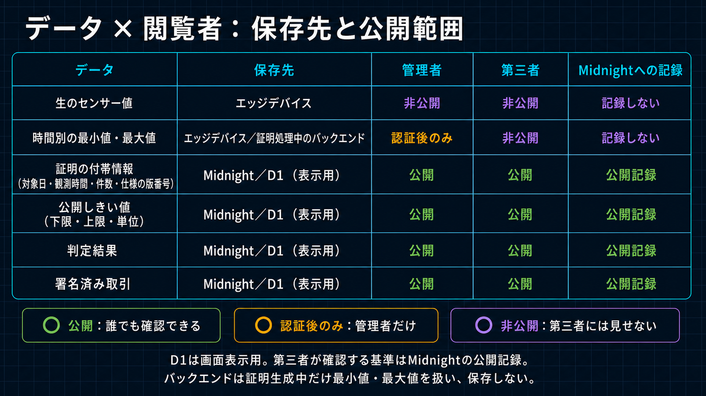

# Privacy・Public Claim境界

[English](../../security/private_spec.md)

正本は[`wave1_spec.md`](../architecture/wave1_spec.md)です。Wave 1の主要審査経路では、疑似Raw値とPrivate Daily Openingを
Browser Private Stateに保持します。認可済み時間別Summaryは運用者Workflow用にTrustedな管理Backendへ保存し、Admission済み
Private Proof RequestはProof ServiceへStreamします。補助的な現場経路では、Raw測定値を現場の計測元に保持し、通常運用時は
上限付き集計、Anomaly状態遷移、Commitment、Workflow Metadataだけを送ります。

審査上の中心は、緑・青・赤の3領域を混同しないことです。ゼロ知識証明は、**提出された非公開の時間別最小値・最大値が、登録済みしきい値の範囲内かどうか**を証明します。生のセンサー値や時間別の最小値・最大値は非公開ですが、それだけで物理センサーの真正性、校正、設置品質、連続測定を証明するものではありません。後者はデバイス、ファームウェア、設置および運用監査の責任です。

この図は「保存」と「通過」を分け、補助的な現場経路を示します。主要審査経路ではBrowser Private Captureが同じ
Private Source境界を担います。Raw値、Proof Opening、Witness、秘密鍵をBackend StorageまたはPublic Application Stateへ
入れません。認可済み時間別SummaryはD1の制限付き運用Dataで、第三者APIからは返しません。QueueはJob参照だけを持ち、
Private Proving RequestはAdmission後にProof Serviceを通過するだけです。Public Policyと
Attestation Evidenceの正本はMidnightです。

## 非公開Data

- Device Identity秘密鍵と平文Opaque Session Token
- Device／Development Midnight Wallet Secret
- Rawまたは疑似Sensor値とPrivate Daily Opening
- Commitment Nonce、Witness、Private State
- Transit中以外のProof Request Body

Raw値はTX ConfirmとRetention Policyが削除を許可するまでPrivate Source Storageに保持できます。Wave 1の疑似計測元では
Browser Private Storage、補助的な現場経路ではLocal Field Storageです。D1、R2、Queue Message、Worker Log、Public Browser Stateへ書きません。認可済み時間別Summaryだけは例外として運用者Workflow用にD1へ保存しますが、Public Evidenceにはしません。

Browser疑似Deviceは審査・デモ専用です。Reload後に復帰できるよう、非抽出P-256鍵、Compact Device Secret、
Private Opening、疑似Raw値をそのBrowserのIndexedDBへ保持できます。これは本番DeviceやAPI連携の保存方式では
ありません。現場Deviceは秘密情報をLocalに保持し、API連携は集約後にRaw応答を破棄して、一時R2 Proof
ArtifactをAES-256-GCMで認証暗号化します。

論理的な運用者Viewは、選択した証明対象の認可済みHourly Minimum／Maximum／Average／Count、Anomaly Transition、状態、Proof／TX処理状態だけを表示します。Wave 1では
第三者Viewと同じ審査Applicationに入っていますが、本番Role・Application分離はWave 2の目標です。Private Aggregate値を
第三者Public APIに含めません。

Public Proof画面は次の項目を表示します。

| 表示項目 | 公開内容 |
| --- | --- |
| 計測日 | `YYYY-MM-DD`。UTCの00:00～24:00に固定 |
| 時間帯別結果 | UTCの1時間ごと24件のしきい値以内／範囲外／計測なし |
| 適用しきい値 | 下限・上限・単位・スケール・Version・有効期間 |
| 証明対象 | `deviceCommitment` |

その他、Sample Count、Daily Attestation Commitment、仮名Proof Job ID、Assignment、日次総合結果、Attestation TX ID／Hash、Block Height、Network、Contract Addressを表示できます。

運用ContractはThreshold Mode、Minimum／Maximum、Scale、Sensor／Unit Code、Policy Assignment、UTC Measurement Day、24個の時間帯別結果、日次の`thresholdSatisfied`をPublic Ledger Stateへ保存します。そのため製品説明でもThreshold Policyと各時間帯のStatusは公開と明記します。ZKが隠すのは提出済みHourly ExtremaとCommitment Nonceであり、範囲外の時間帯は分かりますが、実値とどちらのBoundを超えたかは開示しません。

Cloudflare Worker／Proof Server ContainerはTransit中のPrivate Proving Requestを扱うTrusted Componentです。
Workerは転送前にAuthorization Headerを除去し、Request BodyをLogへ残さず、Queueには秘密値でなくIDだけを
入れます。Browser／現場Deviceは自身のTransaction Authorityを保持し、API連携は分離したManaged Attestor
Authorityを使います。

Sponsor、Fleet Authority、Managed AttestorのWalletは、別Seedを使う別々のContainer OS Processです。
SponsorにはDUST用Seedだけ、Fleet Authorityには専用SeedとOperator Authorityだけ、Managed Attestorには
専用SeedとRoot Authorityだけを渡します。権限WalletはDUSTなしでTXを確定し、Sponsorは許可済みのSensor
Registry呼出し1件を検査して、Midnight公式スポンサー手順でDUSTだけを追加・送信します。TXの束縛により、
Sponsorは認可済みコントラクト呼出しを別内容へ交換できません。

Container Secretは実行時入力であり、Container Imageの内容ではありません。本番WorkerがCloudflare
Secret Bindingから取得し、各Processへ担当値だけを渡します。Docker Build Contextと生成Imageには、
各Seed、Authority秘密値、`.env`、`.dev.vars`、Wallet
Checkpoint、Wallet Stateを含めてはいけません。Compile済みCompact Prover／Verifier ArtifactはBuild
Artifactであり、秘密鍵素材ではありません。Local開発ではGit Ignore済みの`.dev.vars`等でCloudflare
Secret Bindingを代替できますが、CommitまたはImageへのCopyは禁止します。

BrowserはZK Verifier自体を再実行しません。貼り付けたTX hashからPublic Midnight Indexerへ成功TX、Block、Contract Actionを問い合わせ、該当Blockと直前BlockのContract State差分をDecodeして、そのTXが追加したAttestationを特定します。そこから運用日／登録済み境界、24個の時間帯別結果、Policy／有効期間、Device Commitmentを表示します。このHash検証経路はD1を使いません。Local Proof Verifier実行と複数Indexer比較は将来拡張です。

API連携モードが証明するのは、サービスが受領した値とオンチェーンPolicyの関係です。上流APIや物理センサーが
正しく申告したことは保証しません。API Credential、厳格な応答検証、監査Eventは設定済みの取得元を識別・
追跡するためのものであり、測定元の真正性を証明するものではありません。
