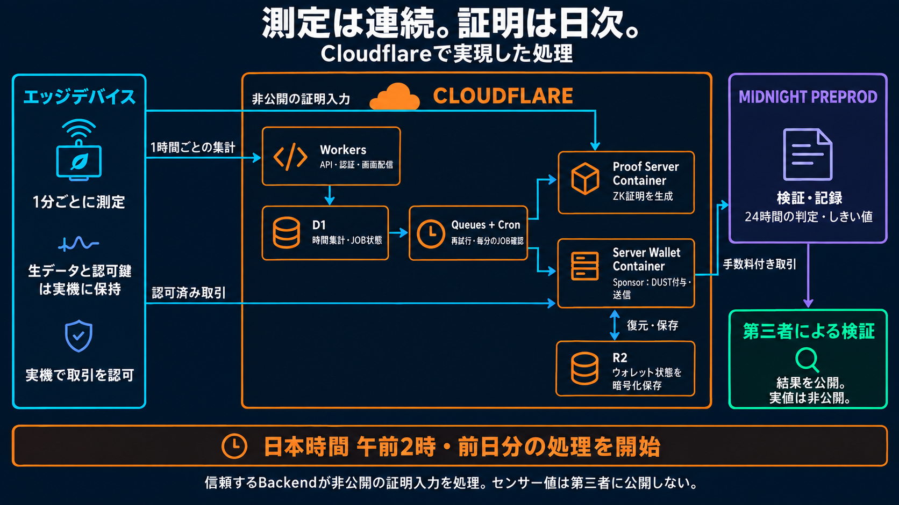
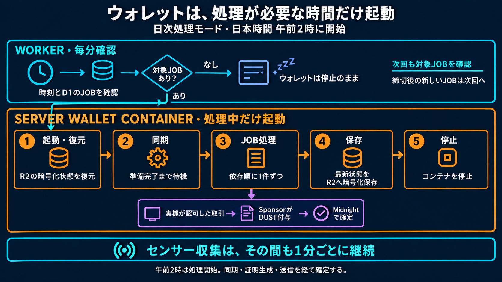

# Cloudflare運用説明のデック・動画追加版

[English](../../submission/cloudflare_operations_media.md)

2026年9月10日版として、Cloudflareの担当範囲とWalletの間欠運転を説明する図をimagegenで作成し、日英のスライドとナレーション付き動画へ追加しました。1分ごとの測定、1時間ごとの集計送信、毎日午前2時からの日次処理を区別しています。従来のデックと録画は元のファイル名で残しています。

## 成果物

| 成果物 | 日本語 | 英語 |
| --- | --- | --- |
| 追加版デック | [14枚のPPTX](deck/bacchiri-verifiable-measurement-layer-wave1-ja-cloudflare-operations.pptx)・[PDF](deck/bacchiri-verifiable-measurement-layer-wave1-ja-cloudflare-operations.pdf) | [11枚のPPTX](../../submission/deck/bacchiri-verifiable-measurement-layer-wave1-en-cloudflare-operations.pptx)・[PDF](../../submission/deck/bacchiri-verifiable-measurement-layer-wave1-en-cloudflare-operations.pdf) |
| 説明を追加した全編動画・ローカル | [日本語MP4](../../../.demo-output/cloudflare-operations-20260910/bacchiri-demo-pitch-ja-cloudflare-operations.mp4) | [英語MP4](../../../.demo-output/cloudflare-operations-20260910/bacchiri-demo-pitch-en-cloudflare-operations.mp4) |
| 追加説明だけの動画・ローカル | [日本語MP4](../../../.demo-output/cloudflare-operations-20260910/cloudflare-operations-ja.mp4) | [英語MP4](../../../.demo-output/cloudflare-operations-20260910/cloudflare-operations-en.mp4) |
| 追加説明の字幕・ローカル | [日本語SRT](../../../.demo-output/cloudflare-operations-20260910/cloudflare-operations-ja.srt) | [英語SRT](../../../.demo-output/cloudflare-operations-20260910/cloudflare-operations-en.srt) |

英語デックは8〜9枚目、日本語の技術参考デックは9〜10枚目に追加しました。元のスライド、画像、ノートは保持しています。追加図は画像で、話者ノートは編集できます。日本語版は既存の技術参考資料を拡張したもので、英語9枚のピッチをそのまま翻訳した構成ではありません。

全編動画では最後の証明範囲の説明前に追加シーンを挿入しています。既存映像には「2026年8月の録画」、追加図には「2026年9月の実機連携・構成説明図」と表示しました。元の音声を保持し、追加シーンには各言語の合成ナレーションを使用しています。動画と音声の中間ファイルはGit管理外の`.demo-output/`にあります。公開URLの発行は行っていません。

実測時間は、日本語全編が**4分16.465秒**、追加説明だけが**1分14.978秒**です。英語全編は**3分20.294秒**、追加説明だけは**1分2.157秒**です。挿入位置は日本語が2分35.933秒、英語が1分58.667秒です。従来の提出用動画の「2分18秒」とは別の追加版です。

## 図1：Cloudflareが担当する処理

Workersが認証付きAPIと画面配信、D1が時間集計とJOB状態の保持、QueuesとCronが処理の調整と再試行を担当します。証明を生成するProof Server Containerと、手数料を付けて送信するServer Wallet Containerは別のプロセスです。R2には、次回起動時に復元するWalletの状態を暗号化して保存します。Midnightが取引を検証し、公開結果を記録します。

矢印は担当と最終的な接続先を示しています。実際の実機リクエストは認証付きWorkerを通ります。非公開の証明入力はD1ではなくProof Serverへ、実機が認可した取引はSponsor Roleへ渡ります。SponsorがDUST手数料を付与してMidnightへ送信します。生の測定列と実機の認可鍵は実機に保持します。現在のBackendは信頼する構成で、非公開の証明入力を受け取りますが、第三者には実値を公開しません。

## 図2：Walletの間欠運転

毎分のWorkerが、Walletを起動する前に時刻とD1の対象JOBを確認します。対象があれば起動し、R2の暗号化状態を復元して同期します。準備が整ったJOBを依存順に1件ずつ処理し、対象がなくなれば最新状態を保存して停止します。日次締切後に受け付けた新しいJOBは次回へ回します。この間も、別プロセスのセンサー収集は続きます。

午前2時は処理の開始時刻であり、確定時刻の保証ではありません。実機側は別の5分タイマーで完了日と待機処理を確認・再試行します。測定精度、完全なサンプリング、実機での集計の正しさは証明の主張に含めず、欠測時間は欠測として示します。図は現在の実機連携を説明するもので、過去のWave 1録画を現在の実機運用のライブ映像として扱うものではありません。

## 台本と再生成

正確な日英ナレーションと話者ノートは[共通台本JSON](../../../tools/submission-media/cloudflare-operations-content.json)、画像の生成・修正・翻訳プロンプトは[imagegen制作記録](../../assets/review/cloudflare-operations-imagegen-prompts.md)に保存しています。最終図は1672 × 941のPNGで、すべてリポジトリ内へ保存済みです。

デックの再生成には開発用の`jszip@3.10.1`と`pdf-lib@1.17.1`を使用します。動画はFFmpeg、FFprobe、追加音声の生成には`edge-tts`を使用します。実行コマンド、音声の再利用方法、元動画を指定する方法は[英語版の再生成手順](../../submission/cloudflare_operations_media.md#narration-and-reproduction)を参照してください。

元のスライド構成の保持、PDFページ数、字幕と台本の一致、映像の全編デコードを検証します。検証結果は[実行記録](../../implementation/cloudflare_pitch_media_execplan.md)とローカルの言語別メディアマニフェストに記録しています。
