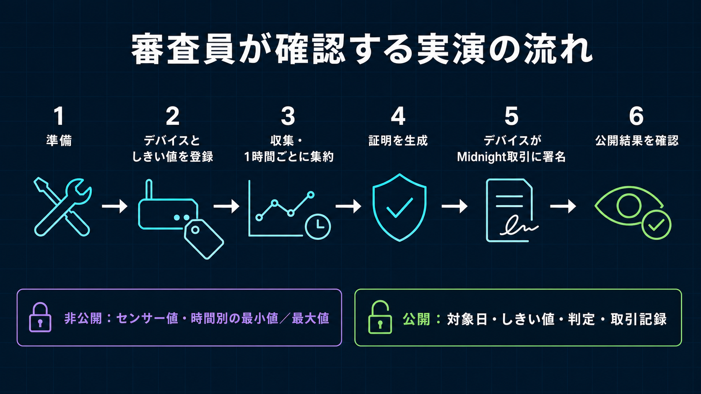

# 最終GUI Demo Script

[English](../../submission/demo_script.md)

状態: 最終GUIを使った英語デモ動画を作成済み
実時間: 2分18秒
出力: `bacchiri-demo-pitch-en.mp4`。必要な場合だけ日本語版を別途制作
目標時間: 3分30秒
Output: 英語版・日本語版を別制作し、Burn-in字幕を流用しない

## 録画時の不変条件

- Final Review Commitだけを録画する。
- 管理されたReview Deviceと完了日を使う。
- Mnemonic、Key、Session、Token、Private Extrema、Nonce、Proof Body、Environment Fileを表示しない。
- システムが都合のよいResultを強制しないことを示せるため、真のOUTSIDE Dayを優先する。
- OUTSIDE表示ではPublic Policyも同時に見せる。
- 記録済みPreprod Resultを使う場合は、その事実と日付を明示する。
- Browserを独立Midnight Verifierと説明しない。

## StoryboardとNarration

| 時間 | 画面 / 操作 | 日本語Narration |
| --- | --- | --- |
| 0:00–0:18 | 最終Verifier ResultからTitleへ | このシステムは、Sensor値を第三者へ開示せず、登録済みThreshold以内であることを示します。 |
| 0:18–0:40 | Value Proposition図 | 第三者が見るのはWITHIN、OUTSIDE、STOPPEDというThreshold Resultであり、Sensor値ではありません。 |
| 0:40–1:02 | 4領域Architecture | Edge DeviceはRaw Dataと署名鍵を保持します。FrontendはRedacted Evidenceを表示します。Trusted BackendがAdmissionとProvingを担い、MidnightがPolicy、Assignment、Confirmed ResultのPublic正本になります。 |
| 1:02–1:20 | Exact Claim / Non-claim | Proofは提出された全Observed HourのMinimum / Maximumを検査します。Sensor Integrity、Continuous Sampling、完全性、Local集計の正しさは証明しません。 |
| 1:20–1:30 | Device Workflowを開きWallet接続 | Workflowは明示的に認可されたWallet Connectionから開始します。 |
| 1:30–1:43 | Review Deviceを作成または復旧し登録Step表示 | API Identity、Compact Authority、Midnight Walletの責任を分離しています。 |
| 1:43–1:57 | 完了日を選択して最終Generation / Capture | Raw ReadingはLocalに保持され、Privateな固定24 Slot Daily Inputになります。Missing HourはSTOPPEDです。 |
| 1:57–2:12 | Proof ProcessingをRequestしJob ID表示 | D1-backedのIdempotent Proof JobがAdmissionを制御します。Deviceは別Threshold Boundを送れません。 |
| 2:12–2:35 | Proof生成とSubmit、Confirmedまで表示 | Trusted Proof ServerがProofを生成し、DeviceがMidnight Transaction 1件へ署名します。Proof ServerはDeviceの代理署名をできません。 |
| 2:35–2:55 | Verify daily ZKP / Third-Party Verification | Public ViewはAssigned Policy、WITHIN / OUTSIDE、Observed / STOPPED Count、Commitment、Transaction IDを表示します。Private ExtremaとNonceは表示しません。 |
| 2:55–3:15 | Engineering Evidence図 | Review TreeはCompact 6 CircuitをCompileし、288 Test、全Typecheck / Build、Wrangler dry-runに成功しています。Preprod記録には自己負担WITHIN／OUTSIDEとSponsor負担Schema-5があります。 |
| 3:15–3:30 | Roadmap図 | Wave 2はLocal／複数Source照合を強化し、署名付きProvenance Evidenceを追加します。Wave 3は建設現場PoCと導入に向けた校正Device Proofを計画します。 |

## 正確なGUI操作順序

1. Review用に準備したClean Browser Profileから開始する。
2. Language、Title、Network、Review Commit Markerを確認する。
3. Midnight Walletを接続をClickし、Review Accountだけを認可する。
4. Device Workflowを開く。
5. 準備済みDeviceをRestoreするか、管理されたReview Deviceを作成する。
6. Enrollment Secretを出さず、Device RegistrationとPolicy Assignmentを確認する。
7. 準備済みCompleted Dayを選択する。
8. Reading CountとPrivate Input Available表示を見せ、Private値は開かない。
9. 日次Proofを要求をClickする。
10. Proof Job IDとStatus TransitionをCaptureする。
11. ZKPを生成してTX送信をClickする。
12. Confirmedまで待ち、短縮TX IDとResultをCaptureする。
13. 日次ZKPを検証をClickする。
14. Policy Bound、Observed / STOPPED、Commitment、Confirmed State、TX IDを見せる。
15. Top Navigationから第三者検証を開き、Private Inputなしで同じPublic Resultを確認する。

## 必須Shot

| ID | Shot | 必須内容 |
| --- | --- | --- |
| GUI-01 | Product Overview | Final Title、Network、Warningなし |
| GUI-02 | Wallet Gate | 明示的接続、Wallet Secretなし |
| GUI-03 | Device Registered | Device / Policy / Assignment Status |
| GUI-04 | Completed Day | 1,440 Readingまたは最終Control Count、OUTSIDEならOutlier Count |
| GUI-05 | Proof Requested | Proof Job ID、Admitted / Ready |
| GUI-06 | Proof Generated | Proving / Proof-ready |
| GUI-07 | Transaction Confirmed | Result、短縮TX ID |
| GUI-08 | Public Verifier | Policy、Result、Observed / STOPPED、Commitment、TX |
| GUI-09 | Negative / Boundary | OUTSIDEまたは明示的Tamper Reject |
| EVD-01 | Compile | 6 Circuit、submitDailyAttestation Rows |
| EVD-02 | Test | 288成功 |

## Fallback Policy

録画時にPreprodが利用できない場合、Frozen Review Commitと文書化済みPublic Review State同期から作成したCaptureを使います。画面へ 記録済みPreprod Evidence · 2026-08-28 JST と表示します。Pending表示をConfirmedへ編集したり、新規確認のように演出しません。

## 最終Capture Gate

- GUI実装をFreezeしBuild済み。
- SecretなしのFinal Review Dataを準備済み。
- 編集なしで15 Stepを一度Rehearsal済み。
- Public Verifier Resultと選択Device Dayが一致。
- Transaction / Contract IDがEvidence Matrixと一致。
- 日英Narration、Caption、Slide Assetを分離。
- Video URLを日英Submission CopyとTop READMEへ追加。
