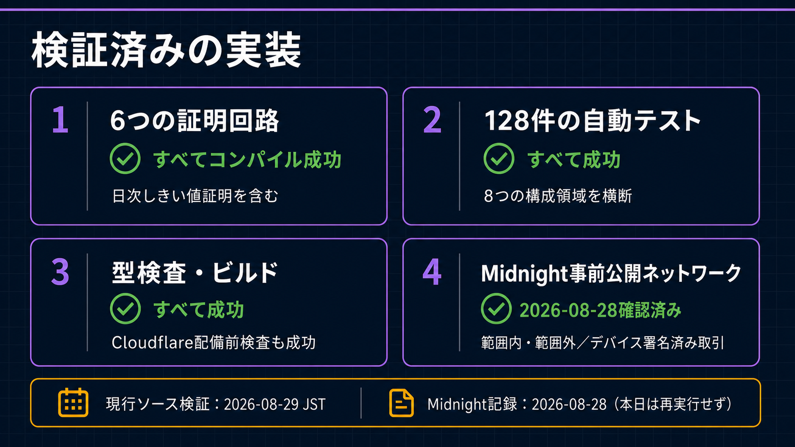

# Wave 1 Evidence Matrix

[English](../../submission/evidence_matrix.md)

検証日: 2026-08-29 JST
Local Baseline: b68a3b7ec662a7f00a6e7beebf3b66f8a68a8fc5を基点とする現行Working Tree
Preprod Evidence日: 2026-08-28 JST

本日のLocal Source検証と、記録済みPreprod Transactionは意図的に分けます。LocalのPASSは、現行Working Treeを本日Deployしたという意味ではありません。

| ID | 審査用Claim | Source / Design Evidence | 現行Local検証 | Runtime / Preprod Evidence | Boundary |
| --- | --- | --- | --- | --- | --- |
| CLAIM-01 | 標準FlowではRaw SampleをEdge Deviceに保持する | Shared、Edge集約、Privacy仕様 | Shared / Edge Test成功 | 記録済みRunで1,440 ReadingをLocal集約 | 別経路が存在しないことまでは証明しない |
| CLAIM-02 | PolicyとDevice AssignmentをProof前に登録する | Policy / Assignment Circuit、Fleet Registry仕様 | Contract Compile、Simulator 12 Test成功 | Schema-3 Policy / Device-bound AssignmentをPreprod記録 | 現行Sourceは本日再Deployしていない |
| CLAIM-03 | 24時間ExtremaとNonceはPrivate Witnessである | sensor-registry、Public Field Map | CompileとRedaction Test成功 | Public Verifier RecordにExtrema / Nonceなし | Trusted BackendはTransit中のProof Inputを見る |
| CLAIM-04 | 真のWITHIN / OUTSIDEを同一Daily Circuitで証明する | submitDailyAttestationとTest | 28,699 rows、k=15、成功 / Reject Test成功 | 両結果を2026-08-28に確認 | Sensorの真実性や完全性は証明しない |
| CLAIM-05 | Missing HourをSTOPPEDとして表す | Wave 1仕様、Daily Input Utility | Shared STOPPED Test成功 | Public ResultにObserved / Stopped Count | STOPPEDは不正検知ではない |
| CLAIM-06 | Device API IdentityとMidnight署名Authorityを分離する | device-auth、wallet-agent Boundary | Device Auth 5、Wallet 23 Test成功 | Device署名Preprod Transaction記録 | Secure Hardware Attestationは将来 |
| CLAIM-07 | Proof ServerはDeviceの代理署名をできない | Proof Flow、wallet-agent Source | Boundary / Execution Lock Test成功 | Proof生成後にDeviceが署名 | BackendはProof Inputに対してTrusted |
| CLAIM-08 | Browser APIはPublic / 認可済みRedacted Stateだけを返す | Gateway API Test、Frontend責任設計 | Gateway 32、Dashboard 26 Test成功 | Public VerifierにPolicy、Result、Commitment、TX | BrowserはIndexerを独立照会しない |
| CLAIM-09 | 標準1,440 Reading / Dayを固定24 Slot Proofで扱う | Aggregation、Cost Benchmark | 24 / 96 / 1,440 Fixed Shape Test成功 | 1,440 Reading OUTSIDE TX確認 | 1 Device / DayはFleet Load Testではない |
| CLAIM-10 | 必須の運用Compact ContractがCompileする | contracts/sensor-registry | 6 Circuit全てCompile成功 | 過去のSchema-3 Deploy確認 | 最終提出Commit SHAは未固定 |
| CLAIM-11 | Repository Verificationが成功する | Root verify、Workspace Script | 182 Test、Typecheck、Build、Wrangler dry-run成功 | 本日は外部Deployなし | 初回はWSL IPC生成だけで停止 |
| CLAIM-12 | GUIがDevice WorkflowとPublic Verificationを接続する | Dashboard Source、Route、Test | Dashboard Build、26 Test成功 | 過去Captureは6 Review Stepを表示 | 最終GUI CaptureとVideoは意図的に保留 |

## 現行検証Command

    TMPDIR=/tmp npm run verify

このWSL環境では、tsxのIPC SocketをWindows Temp Mountではなく/tmpへ生成するためTMPDIRを明示します。初回RunはCompact Compile成功後、IPC生成のENOTSUPで停止しました。上記の再実行は最後まで成功しています。

## Test内訳

| Workspace | 成功数 |
| --- | ---: |
| Shared | 13 |
| sensor-registry Contract | 12 |
| Dashboard | 26 |
| Development CLI | 4 |
| Device Auth | 5 |
| Edge Agent | 13 |
| Device Wallet Agent | 23 |
| Proof Gateway | 32 |
| 合計 | 182 |

## 記録済みPreprod Reference

- Contract: 8338d5588fe5662fce86ce3c221f0bd5260a14cdbf372c1dddd58be41e5b3c68
- Transaction: 00e12efda5f33b4804f3659a811d2f5e86c9ce838255a63028d41df85cb0762da9
- Block Height: 2,302,213
- Result: OUTSIDE、verified=true、thresholdSatisfied=false
- Public Policy: 10–35 °C
- Raw Reading、時間別Extrema、Nonce: 非開示

最終Release監査ではLocal Baselineを固定Commit SHAへ置き換え、同じCommandを再実行します。
