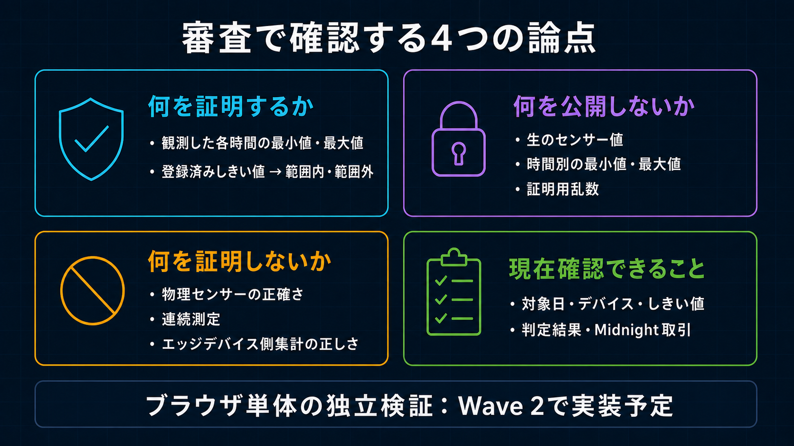

# 審査員向けQ&A

[English](../../submission/judge_qa.md)

## 一言で、何を証明するシステムですか

センサー値を第三者に見せず、対象日の時間別最小値・最大値が、登録済みしきい値の範囲内かどうかを証明します。

## 第三者は何を確認できますか

TX hashを貼り付け、運用日／登録済み境界、24個の時間帯別のしきい値以内／範囲外／計測なし、適用しきい値の下限／上限／単位／スケール／Version／有効期間、`deviceCommitment`、Midnight取引／Blockを確認できます。生のセンサー値や時間別の最小値・最大値は表示しません。

## 何を証明しないのですか

物理センサーが正しい値を出したこと、連続して測定したこと、未提出データがないこと、計測元側の集計が正しいことは証明しません。データがない時間は「計測なし」として公開し、自動的にしきい値以内や不正とは判定しません。

## なぜMidnightを使うのですか

「隠す情報」と「誰でも確認できる判定記録」を分けるためです。Midnightには公開しきい値、対象デバイスとの紐付け、判定結果、取引記録を残します。センサー値や時間別の最小値・最大値は記録しません。

## Cloudflare D1とMidnightの違いは何ですか

Cloudflare D1は画面表示と処理進捗の管理に使うデータベースです。第三者が判定の根拠として確認する基準は、Midnightの公開記録です。

## 非公開の最小値・最大値は誰が扱いますか

Wave 1審査経路では、Browser上の疑似計測元が生成し、Raw CaptureとPrivate OpeningをBrowser Private Stateに保持します。上限付き時間別Summaryは信頼対象の管理Backendへ制限付きOperator Dataとして保存し、BackendはPrivate Proof Requestも扱います。第三者APIからは返さず、Midnightにも保存しません。Backendからも隠すEnd-to-end Encryptionは現行機能ではありません。

## バックエンドはユーザーの代わりに取引を認可できますか

できません。管理Backendは証明を生成しますが、UserのTransaction Authorityを持ちません。User管理Accountが正確なCallを認可し、分離されたServiceは送信手数料だけを負担します。

## なぜ1日を24個の時間枠にするのですか

測定間隔が1時間でも1分で1秒でも、証明回路の入力形式を変えないためです。生の測定値を1時間ごとの最小値・最大値にまとめ、24時間分を固定形式で証明します。ただし、これは集計自体の正しさを証明するものではありません。

## 測定していない時間はどう表示しますか

運用日の各時間枠を「しきい値以内」「範囲外」「計測なし」のいずれかとして公開します。時間別の最小値・最大値は非公開です。

## 現時点でどこまで検証済みですか

2026-09-02の現行ソースで、6つの証明回路のコンパイル、355件の自動テスト、型検査、ビルド、Cloudflare配備前検査に成功しています。Midnight事前公開ネットワークには、2026-08-28の自己負担WITHIN／OUTSIDE、2026-08-30のSponsor負担Schema-5、2026-09-02の欠損時間・全停止日・OUTSIDE適合記録があります。ソース検証と日付付きネットワーク記録は別のEvidenceです。

## 第三者画面だけで独立検証できますか

Public Chain Evidenceは独立に照合できます。Wallet、Private Input、D1検索を使わず、BrowserがTX hashでPublic Midnight Indexerへ問い合わせ、成功TX／Block、呼び出したContract、該当Blockと直前BlockのState差分を確認します。新しく追加されたAttestation、運用日／登録済み境界、24個の時間帯判定、Policy／有効期間、Presence／Count、Device Commitment、Device-bound AssignmentをDecodeします。Browser内でProof Verifierを再実行したりWitnessを開示したりはしません。Proof自体はTX受理時にMidnightが検証しています。

## 誰がどの鍵を持ちますか

User Transaction Authority、現場API Identity、管理Authority、Service Fee Authority、Deploy Authorityを分離しています。証明を生成する管理BackendはUserのTransaction Authorityを持ちません。

## 多数デバイスに拡大できますか

各1日の証明入力は24時間枠で固定ですが、必要な証明数は「稼働デバイス数 × 日数」に比例して増えます。10,000デバイスは計画上の試算値であり、完了済みの負荷テスト結果ではありません。

## 導入計画は何ですか

Wave 2では、実際の現場計測システムを既存業務へ接続し、既存事業者との有償運用Pilotを目指します。Wave 3では、継続売上、契約更新、利用拡大、持続可能なUnit Economicsを通じてPMFを検証します。特定業界への展開は事業仮説であり、完了済みの現場検証とは区別します。
