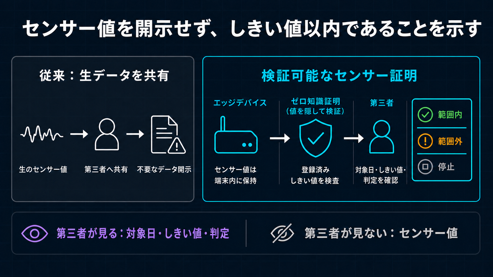

# BACCHIRI!━━Verifiable Measurement Layer

## 顧客に提供する価値

**センサー値を第三者に見せず、登録済みしきい値の範囲内かどうかを証明します。**

建設現場の計測結果は、機器提供会社、レンタル会社、施工会社、発注者、監査者など複数の組織で使われます。しかし、確認のために生の測定値を渡すと、必要以上の情報開示になります。

BACCHIRI!━━Verifiable Measurement Layerは既存の計測機器や管理システムを置き換えず、値を隠したまま判定を確認できる証明層を追加します。

## 公開する情報と公開しない情報

| 公開しない | 公開する |
| --- | --- |
| 生のセンサー値 | 運用日／登録済み境界と`deviceCommitment` |
| 時間別の最小値・最大値 | しきい値の上下限・単位・スケール・Version・有効期間 |
| 証明用乱数 | 24個のしきい値以内／範囲外／計測なしと件数 |
| デバイスの署名鍵とウォレット情報 | Midnight取引・Block記録 |

## 動き方

1. ユーザーが認可したブラウザクライアントを疑似計測元として使い、疑似の日次計測データを作ります。
2. Raw値とPrivate OpeningをBrowser Private Stateに保持し、24個の時間枠へまとめ、上限付きSummaryを認可済み運用者Workflowへ送ります。
3. 信頼対象の管理されたバックエンドが制限付きSummaryを保存して証明依頼を受け付け、第三者へ値を公開せずに証明を生成します。
4. ユーザーが取引を認可し、サービス側が手数料を負担します。
5. Midnightが24個の時間帯判定、Policy／有効期間、Device Commitment、TX Evidenceを記録し、第三者が確認します。

## Wave 1で検証済みの内容

- 6つの証明回路がすべてコンパイル成功。
- 9つの構成領域と疑似対向Serviceにまたがる448件の自動テストがすべて成功。
- 型検査、ビルド、Cloudflare配備前検査が成功。
- 2026-08-28のMidnight事前公開ネットワーク記録で、範囲内と範囲外の両方を確認。
- 1日1,440件の測定値を、24個の時間枠を使う1件の日次証明へ集約。

## この証明だけでは分からないこと

物理センサーが正しい値を出したか、24時間連続して測定したか、計測元側の集計が正しいかは証明しません。また、現行構成では信頼対象の管理されたバックエンドが、証明生成中の最小値・最大値を処理します。

第三者画面はPublic Midnight IndexerのTX／Block／Contract Stateを直接照合します。Browser内でCompact Proof Verifierを再実行する機能と複数Indexerの比較はWave 2の計画です。

## 導入への道筋

Wave 1は、審査用PoCとして中核の証明価値を検証します。Wave 2では、実際の現場計測システムを接続して日次運用を自律化し、Role・画面分離と本番運用機能を加え、既存事業者との有償パートナー実証を目指します。Wave 3では、Hardware保護Identityと来歴により計測元への信頼を減らし、継続売上、契約更新、利用拡大、持続可能なUnit Economicsを通じてPMFを検証します。正本は[3 Waveロードマップ](../architecture/three_wave_roadmap.md)です。

リポジトリ、スライド、動画の公開URLは、最終公開後に追加します。
