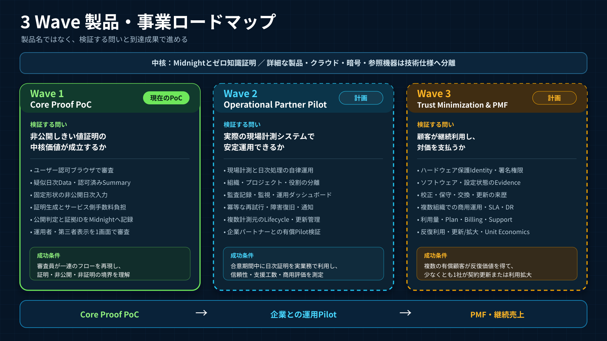

# Wave 1 進捗記録

[English](../../submission/wave1_progress.md)

対象期間: 2026-08-27〜2026-08-29 JST
状態: 最終英語デモ動画を作成済み。提出用公開URL待ち。

## この記録の読み方

リポジトリの履歴はWave 1開始日に始まっているため、それ以前の公開版との差分は断定しません。ここでは、Wave 1期間中のコミットと、2026-08-29に現在の作業中ソースで実行した検証結果だけを示します。

また、現在のソース検証と、2026-08-28にMidnight事前公開ネットワークへ記録した取引は別の証拠です。現在のソースを同日に再配備したという意味ではありません。

## Wave 1で構築した内容

| 領域 | 構築した内容 | 確認したこと |
| --- | --- | --- |
| ゼロ知識証明 | 公開しきい値との照合、範囲内／範囲外の判定、24個の時間枠を使う固定形式 | 6つの証明回路がすべてコンパイル成功。コントラクトの自動テスト12件が成功 |
| エッジデバイス | センサー収集、1時間ごとの集計、API認証、取引署名、更新・復旧 | 収集13件、認証5件、ウォレット23件の自動テストが成功 |
| バックエンド | デバイス認証、証明依頼の受付、処理状態の保存、証明生成、公開情報だけを返すAPI | バックエンドAPIの自動テスト111件とCloudflare配備前検査が成功 |
| 画面 | 管理者の操作画面、第三者の公開確認画面、日本語・英語表示 | 画面の自動テスト52件と本番用ビルドが成功 |
| Midnight連携 | 公開しきい値、対象デバイス、デバイス署名付き日次取引 | シミュレーター試験と、2026-08-28の事前公開ネットワーク取引を確認 |
| 安全性 | 改ざん拒否、重複処理の防止、同時実行の排他、設定の巻き戻し拒否、破損状態の隔離 | これらの失敗ケースを含む合計288件の自動テストが成功 |
| 審査資料 | 構成、非公開情報の境界、実演手順、費用実測、日英図版、提出物 | 文書を目的別に分類し、相互リンクを確認 |

詳細なコミットと検証箇所は[主張と証拠の対応表](evidence_matrix.md)に記録しています。

## Wave 1で改善した重要点

1. 個々の測定値の件数に応じて証明回路が大きくならないよう、1日分を24個の時間枠へまとめる固定形式にしました。
2. 1台・範囲内だけの経路から、複数デバイスの登録と、範囲内／範囲外の両結果を扱う経路へ広げました。
3. API認証鍵、コントラクト上のデバイス権限、Midnight取引署名鍵の用途を分離しました。
4. 証明を直接送る方式から、重複実行を防ぎ、同時処理数を制限できる証明依頼方式へ変更しました。
5. 静的な確認画面から、管理者の操作と第三者の確認を分けた日本語・英語の画面へ広げました。
6. エッジデバイス向け配布物に、内容検証、版管理、更新失敗時の復旧、認証情報の保護を追加しました。

## 2026-08-29に確認した結果

- リポジトリが特定の開発環境に依存していないことを検査。
- `sensor-registry`の6つの証明回路がすべてコンパイル成功。
- 9つの構成領域にまたがる288件の自動テストがすべて成功。
- 全構成領域の型検査と、画面・TypeScriptのビルドが成功。
- Cloudflareへの配備前検査が成功。

2026-08-28のMidnight事前公開ネットワーク記録には、範囲内と範囲外の両方があります。1日1,440件の測定値を使う範囲外の例は、エッジデバイス内で24個の時間枠へまとめ、1件の証明と1件のデバイス署名付き取引として確定しました。

## 現在の制約

- 現行Worker／GUIは2026-08-31 JSTにDeploy済みで、この文書では既存の日付付きAttestationをChain Evidenceとして使います。
- バックエンドと証明生成サーバーは、証明生成中の非公開入力を信頼して処理します。
- 第三者画面はPublic Midnight Indexerへ直接問い合わせてTX／Contract Stateを照合しますが、Browser内でZK Verifierを再実行しません。
- 日次提出には運用担当者の明示的な操作が必要で、デバイス用ウォレットが常時自動送信する仕組みではありません。
- 物理センサーの正確さ、連続測定、未提出データがないこと、エッジデバイス側の集計の正しさは、この証明だけでは保証しません。
- Deploy済み英語第三者画面のCaptureは作成済みで、Narrationと最終日本語編集は制作作業として残ります。

## 次のWave

- Wave 2では、Local／複数Source照合の強化、署名付きのデータ来歴、運用自動化、障害復旧、複数デバイスの監視を計画しています。
- Wave 3では、校正情報付きデバイス証明、ファームウェア識別情報、セキュアハードウェア連携、監査用出力、組織をまたぐ確認を計画しています。
- 導入経路は、建設現場での実証実験から、既存の販売・レンタル商流への組み込みです。

Wave 2とWave 3は現行機能ではなく計画です。
コントラクトを先に変更する項目を含む実装優先順位は、
[将来機能バックログ](../implementation/future_features.md)で管理します。
