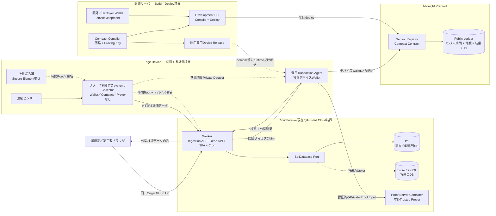
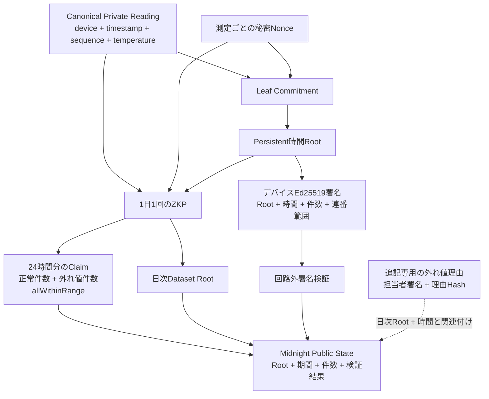

# システム構成

[English](../system_architecture.md)

この文書は本番日次Attestation経路と、残るStorage移行を示します。実線は実装済みの連携、破線は任意の将来置換です。

## デプロイ構成

Cloudflare ContainerはPrivate Proof Inputを受け取るため、本番のTrusted Boundaryに含めます。Gatewayはアクセスを認証し、Proof Inputをログまたは永続化してはいけません。Operator管理Proverへの置換は将来Optionです。

## 日次真贋性証明

回路は全CommitmentとRootを再計算し、sequence完全性、Private Policyとの結合、時間別分類の完全性を証明します。Ed25519デバイス署名は回路外で検証し、Bundle HashをMidnight Attestationへ保存します。第三者検証では両方を必須とします。

## 信頼境界とデータ

| 境界 | Private／Publicデータ | 責務 |
| --- | --- | --- |
| Edge Device | Sensor値、ingestion token、デバイス運用Wallet、暗号化運用Private State | 計測、認証付き送信、remote prover経由の継続Tx、永続診断。Compiler／Deploy／local proverなし |
| 開発サーバ | Compact source／artifact、proving key、`.env.development`のWallet backup | Build、test、benchmark、Contract deploy、運用専用配布物生成 |
| D1／将来Turso | 運用Raw値、受信時刻、処理状態、外れ値理由 | 時系列運用と運用者監査 |
| Cloudflare Worker | API認証、日次起票、Attestation状態、公開レスポンス | オーケストレーション。ブラウザへ秘密を公開しない |
| Midnight | Dataset Root、Device Commitment／公開鍵登録、期間、件数、証明結果、Tx情報 | 改ざん検知可能な第三者検証 |

## 実装状況

- **実装済み:** Development／Device Collector／Device Walletのworkspace分離、Wallet保管先分離、運用専用release builder、リソース制限と永続診断付きsystemd Collector、Worker配信SPA／API、D1 Adapter、Cloudflare Trusted Proof Gateway、固定Profileの日次全件回路source、署名付き時間Root、分類完全性、追記型Reason Hash。
- **残る連携:** 本番Contract/ProfileのDeploy、Preprod実Tx測定、GUIへの全Evidence表示、Turso Adapter。
