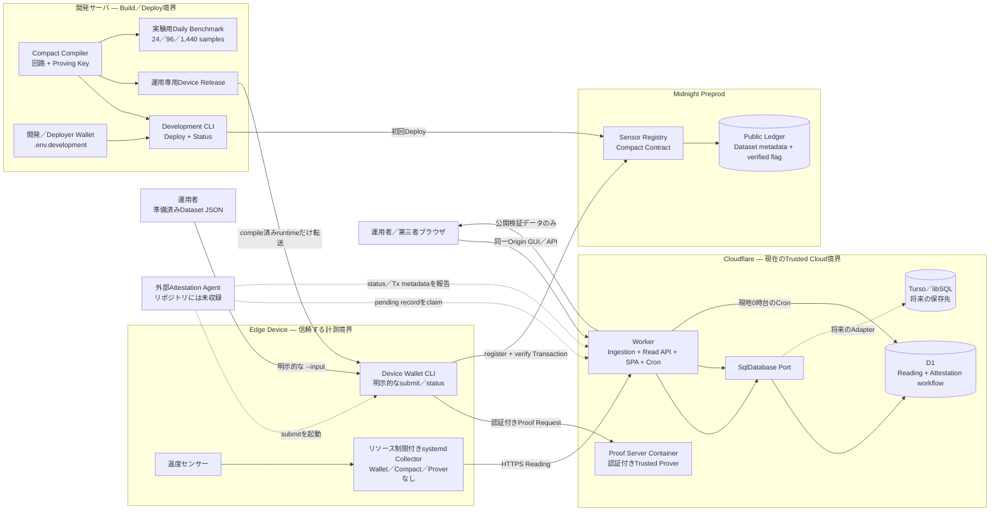
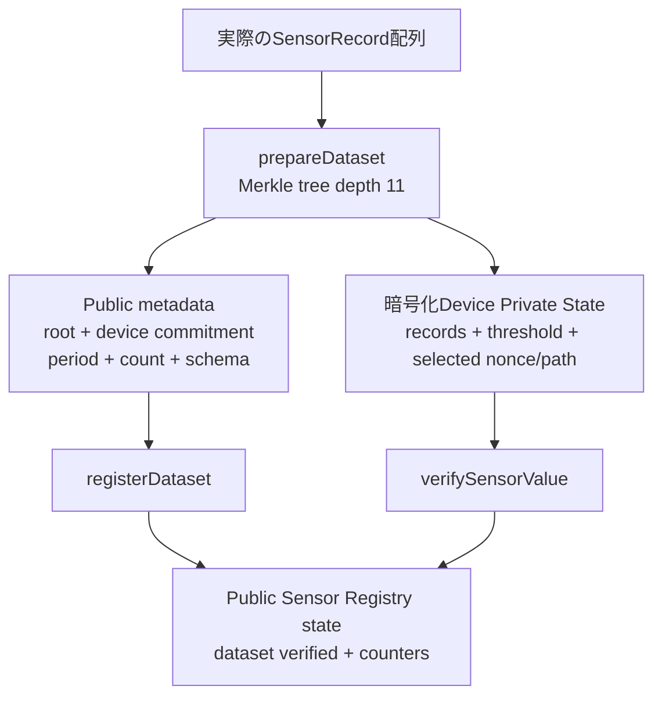

# システム構成

[English](../system_architecture.md)

この文書は、現在のリポジトリに存在する連携を示します。実線は実装済みの経路、破線は外部コンポーネントが必要な経路または将来の作業です。

## デプロイ構成

Cloudflare ContainerはPrivate Proof Inputを受け取るため、Trusted Boundaryに含めます。Gatewayはリクエストを認証し、binary bodyを意図的にログまたは永続化せず転送します。BrowserはProof Routeを呼びません。Operator管理Proverへの置換は将来の選択肢です。

## 現在のSensor Registry Proof

`registerDataset`はRoot、Device Commitment、期間、Sample Count、Schema Versionを公開します。`verifySensorValue`は選択した1つのLeafをPrivateに開き、そのPersistent CommitmentとMerkle Pathを再計算し、温度がPrivateな最小値と最大値の間にあることを確認します。その後、登録済みDatasetを検証済みにします。運用Contractは全日分の完全性、時間別署名、外れ値件数を証明しません。

## Daily Benchmark設計

`contracts/daily-attestation/`は24、96、1,440 sampleの固定Profileを生成します。開発専用Benchmarkは、全日分のRoot、24時間分のClaim、回路外のEd25519 Evidence、追記型Reason Hashを試験します。これらのProfileはDevice Firmwareへ収録されず、WorkerのAttestation lifecycleにも接続されていません。

## 信頼境界とデータ

| 境界 | Private／Publicデータ | 責務 |
| --- | --- | --- |
| Edge Device | Sensor Reading、ingestion token、デバイス運用Wallet、暗号化済みPrepared Dataset | 計測、認証付き送信、Remote Proverを使う明示的なTransaction送信、永続診断。Compiler／Deploy／Local Proverなし |
| 開発サーバ | Compact source／artifact、proving key、`.env.development`のWallet backup | Build、test、benchmark、Contract deploy、運用専用Device Release生成 |
| D1／将来Turso | 運用Raw値、受信時刻、Private Normal Range、Workflow状態、Agent報告のTx metadata | 時系列運用と運用者監査 |
| Cloudflare Worker | API認証、pending record作成、Attestation状態、公開レスポンス | Workflow状態の管理。現在はMidnightへsubmitせず、独立した照会もしない |
| Midnight | Dataset Root、Device Commitment、期間、Sample Count、Verified Flag、Schema、Global Counter | 運用`Sensor Registry` ContractのPublic State |

## 実装状況

- **実装済みの運用経路:** 開発用WalletとDevice Walletの分離、Device専用Firmware、リソース制限付きCollectorと診断、認証付きIngestion、D1 Read／Workflow API、日英SPA、Remote Proof Gateway、`sensor-registry` Deploy、Device Walletによる明示的なDataset登録と選択値検証。
- **実装済みの開発実験:** 固定Profileの日次回路Generator／Test、Proof Cost Benchmark、署名付き時間Evidence Helper、追記型Reason Hash Logic。
- **未実装:** 常駐Attestation Agent、D1 ReadingからPrepared Private Inputへの自動変換、自動Submit／Result報告、Browserによる独立したMidnight検証、Turso Adapter。
