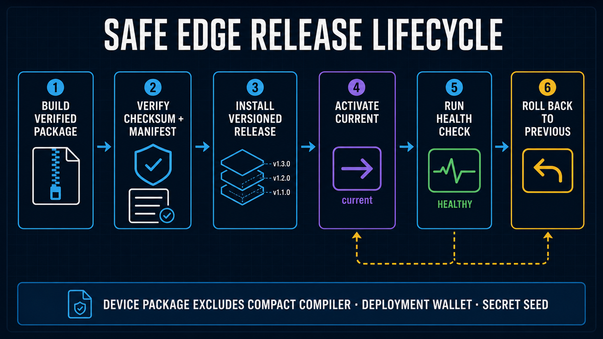

# Midnight Sensor Device Firmware

This package contains only the Edge Device device runtime. It is produced on a development PC by `edge-device/release/package_archive.sh` and contains no development wallet, Compact source, compiler, proving-key generator, Cloudflare deployment code, or browser application.



## Included runtime

- temperature collector and loopback health endpoint;
- device-only ECDSA P-256 identity and short-lived Cloudflare API sessions;
- operator-invoked transaction-identity CLI for an already-deployed `sensor-registry` contract;
- development-built Compact runtime artifacts with integrity manifests;
- `installer.sh`, the systemd installer, and persistent diagnostic logging.

The development/deployer and Sponsor Wallets are not part of this package. Installed runtime,
configuration, Device Identity, transaction identity, and Compact private state are consolidated
below `~/.midnight/midnight-cloudflare-demo/`. The P-256 private key is created only in
`device-auth/`; transaction credentials are created only in `device-wallet/`. Neither belongs in
an environment file. The Device stores no NIGHT, DUST registration, or synchronized DUST state.

## Install on Edge Device

```bash
tar -xzf midnight-sensor-device-fw-<version>.tar.gz
cd midnight-sensor-device-fw-<version>
cp .env.device.example .env.device
chmod 600 .env.device
```

Configure the remote Proof Server URL, Worker ingestion URL, Device/Project IDs, and sensor settings in the staged `.env.device`. Leave `DEVICE_CONTRACT_ADDRESS` empty. After public-key activation, `npm run device:configure` authenticates to the Worker and atomically installs the current contract, network, Policy, and Assignment metadata. The firmware archive remains deployment-neutral. Do not add a fixed API token, private key, mnemonic, or seed. After validation, the installer moves the file to `~/.midnight/midnight-cloudflare-demo/config/device.env` and removes the staged copy.

Create the staged file only for the first installation. Upgrades reuse the installed `config/device.env`; if a new archive contains a staged file that differs, the installer refuses to guess which configuration should win.

```bash
./installer.sh --no-start
```

Before it changes Device configuration, keys, releases, symlinks, or services, the installer checks
the complete command set required by the selected installation path. The normal path verifies file
utilities, systemd and journal tools, health-check commands, non-interactive authorization for each
privileged command, Node.js `>= 22.15.0`, and a valid npm runtime. On a Debian-family host it installs
only packages that provide commands that are actually missing, then repeats the complete check.
Optional diagnostic inputs such as `iw`, `vcgencmd`, and Docker do not block installation. A failed
preflight reports all missing commands before project state is changed.

The installer verifies the release and contract-artifact manifests, copies the release to `releases/<version>-<manifest-hash>/`, and installs only production dependencies for the device-auth, collector, and device-wallet workspaces. It changes `current` only after those checks and device tests pass; the former target becomes `previous`. It creates a P-256 Device Identity only when all identity files are absent, preserves and validates a complete existing identity, and fails closed on a partial identity. It creates a systemd service only for the collector; wallet use remains an explicit CLI. It does not compile Compact, generate proving keys, run Docker, deploy a contract, initialize a wallet, or install development tooling.

Transaction-state commands use an owner-only process lock below `device-wallet/`. A second
transaction, submission, or benchmark command fails before opening state. A stale lock left by an
unclean process exit is reclaimed only when its recorded PID is no longer active.

Installed layout:

```text
~/.midnight/midnight-cloudflare-demo/
├── config/device.env
├── current -> releases/<active-release>
├── previous -> releases/<previous-release>
├── releases/<version>-<manifest-hash>/
├── device-auth/
├── device-wallet/
└── data/ (or the configured Edge data directory)
```

Collector state, local raw measurements, and the delivery outbox use owner-only storage. State
updates are written to a temporary file, synchronized, and atomically renamed. If an unclean power
loss leaves `collector-state.json` malformed, the Collector preserves it as
`collector-state.json.corrupt-<timestamp>`, starts a new state without deleting raw/outbox files, and
records the recovery in the persistent journal.

The installer generates the P-256 Device Identity on first installation. Transfer only `enrollment.json` to the development host and register it with `npm run cloudflare:device:register -- --enrollment ...`. On the Device, run `npm run device:configure`, then start the service. The registration endpoint is not public, and the key is not generated on the development host.

```bash
cd ~/.midnight/midnight-cloudflare-demo/current
# On the device, inspect the installer-generated public enrollment metadata.
npm run device:auth:show
sudo systemctl start measurement-edge-agent
```

The extracted archive can be removed after installation. To roll back and swap the two symlinks:

```bash
~/.midnight/midnight-cloudflare-demo/current/installer.sh --rollback
```

Only operating-system integration remains outside this tree: the systemd units, persistent-journal configuration/report helpers, and an installer-managed Node.js runtime when the host lacks a suitable version. No project source, device configuration, or wallet state is stored with those OS files.

After installation:

```bash
sudo systemctl status measurement-edge-agent
curl http://127.0.0.1:8788/health
sudo journalctl -u measurement-edge-agent -f
```

Initialize the separate Device transaction identity explicitly as the same non-root service user
selected by the installer when attestation is required. Recovery material is written to an owner-only
credentials file and is never printed; back up the entire `device-wallet/` directory offline
immediately. No Device funding or DUST synchronization step is required:

```bash
cd ~/.midnight/midnight-cloudflare-demo/current
npm run device:authority:generate -- --network preprod \
  --confirm-contract-authority-generation
npm run device:authority:show -- --network preprod
npm run device:wallet
npm run device:submit -- --input /path/to/prepared-real-dataset.json
npm run device:status
```

Generate Contract Authority once before the development operator deploys the contract. Transfer only its public `enrollment.json`; its `authority.json` secret remains on the Edge Device. `device:submit` accepts either real `SensorRecord[]` or a `PreparedDailyExtremaAttestation`. Array input is grouped into 24 UTC observed/no-data slots and may select only the UTC date and already registered policy/assignment IDs. It cannot submit threshold bounds. Submission creates or reuses one scheduled daily Proof Job. The collector uploads only hourly aggregate windows and anomaly transitions, never raw readings.

For an explicit Preprod cost integration test, the Device generates the standard full day in memory:
one reading per minute, 1,440 private Raw values, reduced locally to 24 hourly minimum/maximum slots.
It sends the resulting Daily Attestation through the same operational Wallet and Remote Proof Server
path. `--confirm-synthetic` is mandatory. The CLI still accepts 24 and 96 only for fixed-circuit
equivalence checks; they are not separate Cost profiles.

```bash
npm run device:benchmark -- --samples 1440 --period-date YYYY-MM-DD --run-id cost-1440-a --confirm-synthetic
```

Each submission proves and binds one real `submitDailyAttestation` transaction using the public
policy registered before operation. It sends the finalized fee-free transaction to the authenticated
Sponsor endpoint; the Sponsor Wallet adds only DUST and submits it. It does not upload synthetic
values or private hourly extrema to D1. A redacted result containing timings, the public attestation
commitment, observed/STOPPED counts, sponsorship timing, fee, and transaction metadata is stored
below `device-wallet/benchmarks/`; raw synthetic samples remain only in encrypted device private
state. Before the first Sponsor request, the fee-free serialized transaction is atomically retained
with mode `0600` below `device-wallet/pending-transactions/`. A retry of the same Proof Job reuses
those exact integrity-checked bytes without regenerating its proof; a different transaction for the
same Job is rejected. Use a new `--run-id` for every new attestation.

Back up `config/device.env`, `device-auth/`, and the entire `device-wallet/` directory separately
from the development PC's `tools/midnight-operator/.env.development` backup. Device credentials must not be merged with or
copied to the development host. The Sponsor Wallet recovery source is managed separately from both
hosts. Release directories and symlinks can be recreated from signed/checksummed firmware archives.
