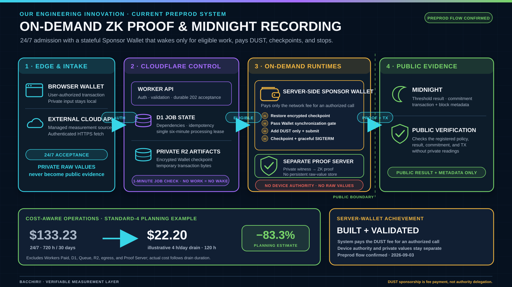

# Sponsor Wallet processing profiles



## Purpose

The Sponsor Wallet is stateful and must synchronize before it can add DUST to an authorized
transaction. Keeping its `standard-4` Container active for an entire month is materially more
expensive than starting it only for accepted work. Public APIs, D1 state, R2 artifacts, source
fetches, and Job admission remain available for 24 hours. A one-minute Cron checks durable D1 state
without waking the Container. In `on-demand` mode, pending work starts the Wallet no later than the
next check. In `scheduled` mode, the same check admits only work included by the daily cutoff. Both
modes drain eligible work, checkpoint state to R2, and explicitly send `SIGTERM` after the final
operation. A stopped Wallet has a 60-second restart cooldown; the Worker never sleeps while holding
a request and simply retries on a later Cron event.

The schedule is an operational D1 setting, not a Worker build setting. Switching profiles does not
deploy code, replace the Container, or alter Wallet keys.

## Profiles

| Profile | D1 mode | Processing start | Intended use |
| --- | --- | --- | --- |
| Judging | `on-demand` | At most one minute after Job detection | Interactive evaluation without an idle Container |
| Cost optimized | `scheduled` | 02:00 at UTC+09:00 | Daily production batch processing; stop after drain |
| Maintenance | `always-on` | 24 hours | Initial synchronization and supervised diagnostics |

Migration `0037_sponsor_wallet_on_demand.sql` adds the on-demand profile and restart-cooldown state.

Switch to the retained cost-optimized profile:

```bash
npm run cloudflare:sponsor:scheduled
```

Use the judging profile:

```bash
npm run cloudflare:sponsor:on-demand
```

Keep the Wallet active for maintenance:

```bash
npm run cloudflare:sponsor:always-on
```

Set another whole-hour processing start without changing source:

```bash
node tools/cloudflare-admin/set-sponsor-wallet-operating-mode.mjs scheduled \
  --starts-at-hour 1 --utc-offset-minutes 540
```

The command validates every value, loads Cloudflare credentials from the ignored root `.env`
without printing them, updates the singleton D1 row, and reads the stored result back. The next
minute Cron observes the change. A transition to `scheduled` lets the current request finish. Once
no eligible work remains, the coordinator explicitly initiates a graceful checkpoint and stop. A
transition to `always-on` starts or restores the Wallet on the next Cron cycle.

## Admission and daily cutoff

- Browser Wallet Project challenges and 24-hour Project sessions remain available. The Worker verifies
  the Wallet signature with a SHA-256 plus BIP-340 verifier interoperable with the official Wallet,
  without starting the stateful Server Wallet. Project metadata is stored in D1 immediately.
- Policy and Device registration challenges remain available. A signed registration request is
  validated and consumed at admission time, persisted as an idempotent D1 operation, and submitted to
  the Sponsor Queue. The API returns `202 Accepted`; Midnight registration waits until its admission
  timestamp is included by a processing cutoff.
- The Browser Device screen shows the exact next processing start and treats accepted registration
  as a queued dependency rather than a blocking spinner. A judge may generate the private 1,440-value
  day and request ZKP generation plus Midnight recording through Step 4 before registration completes.
  These private inputs and the continuation intent stay in the browser. After the scheduled Device and
  Assignment transactions are confirmed, the open authenticated page uploads the hourly summaries,
  creates the deferred Proof Job using the original registration cutoff, and asks for Wallet approval
  when the Device transaction is ready. Sponsor fee processing then continues server-side.
- Device transaction uploads and source data are accepted into their existing durable workflow.
- Managed Source HTTPS fetch and hourly aggregation can continue without starting the Wallet.
- Accepted Device/Policy registration, Managed Source registration, managed ZKP/TX work, and
  sponsored TX work stay in D1 and are re-enqueued when the next daily start includes them.
- Challenge expiry and signed timestamp tolerance are checked when the Worker accepts the request.
  Queue delay does not invalidate an accepted operation. The private Server Wallet verifies the same
  signed authorization again before constructing the Midnight transaction.
- Each scheduled run has an immutable cutoff equal to its start time. Work admitted after that cutoff
  waits for the following day, preventing continuous arrivals from keeping the Container alive.
- Dependencies, not Queue delivery order, control execution. A Project is a D1 business boundary,
  not an on-chain object. A Policy must be confirmed on Midnight before Device registration and
  assignment; the assignment must be confirmed before proving; and a proof must be ready before
  sponsorship and submission.
- The minute Cron coordinator selects one runnable eligible operation in oldest-accepted-first
  order. A six-minute D1 lease permits exactly one state-changing Server Wallet operation even when
  Cron events overlap. This does not add another persistent Worker or Container.
- In `on-demand` mode, an empty D1 queue causes no Container call. After the backlog drains, the
  coordinator stops the Wallet and records a 60-second restart cooldown in D1.
- The operations dashboard reads the last persisted Wallet state and reports `WAITING FOR NEXT RUN`.
  Its overview and runtime-diagnostics endpoints do not wake the Container.
- Waiting time does not open Wallet-unavailable, synchronization-stalled, low-DUST, or
  Sponsor-backlog alerts. During a job-driven start, normal `starting` and progressing `syncing`
  states stay silent; only five minutes without applied synchronization progress, an explicit error,
  or a post-readiness low-DUST condition can create a Wallet incident. Existing alerts are resolved
  while the schedule is waiting or `on-demand` is idle instead of carrying into the next startup.
- R2 remains the encrypted synchronization checkpoint. Scheduled drain and fallback inactivity
  shutdown send `SIGTERM`; the Supervisor persists its latest checkpoint before exit.

Cron and Queue delivery are at-least-once. D1 status transitions and existing measurement-group
idempotency remain the authority, so opening a window or switching profiles cannot create a second
on-chain attestation.

If the prior day's batch is still incomplete at the next processing start, no second Wallet runtime
or overlapping batch is created. The cutoff advances, previously accepted work remains first by
`created_at`, and newly eligible work follows it. Retryable failures remain queued; terminal failures
move to the existing action-required/dead-letter path and do not keep the Container alive forever.

## Stop and restart acceptance test

1. With no eligible work, verify that the singleton Container is inactive.
2. Admit a uniquely identified task before the next cutoff; verify that D1 retains it while the
   Container remains stopped.
3. After the processing start, verify that Cron starts the Container, restores the encrypted R2
   checkpoint, and does not execute the task until Wallet synchronization is complete.
4. Verify dependency-ordered Policy, Device/Assignment, ZKP, and Sponsor TX work; the selected Job
   must reach `confirmed` and its transaction hash must resolve in Midnight Explorer.
5. Re-submit the same identifier and verify that D1 and contract idempotency prevent a second record.
6. After the last eligible operation, verify explicit `SIGTERM`, an R2 checkpoint whose metadata is
   `source=graceful-shutdown`, and an inactive Container. At the following start, unfinished
   prior-day work remains ahead of newly eligible work.

### 2026-09-03 Preprod measurement

| Observation | Measured result |
| --- | --- |
| Stopped state | The single `midnight-server-wallet` instance was `inactive` |
| Test cutoff | Processing start temporarily changed to 20:00 at 20:09:28 JST |
| Start | 20:10 Cron; restored a 5,540,377-byte encrypted checkpoint from R2 |
| Synchronization gate | Work stayed unchanged while `starting`; initialization reached `ready` in 29.494 seconds from 20:10:06.807 to 20:10:36.301 JST |
| Traced Job | `managed-run-17e37b161672d983990a7550d6fd39bed6b585ee3e10ed691fa6e5e1bd4f04ee` |
| ZKP | Started 20:11:09.410 and completed 20:12:06.912 JST (57.502 seconds) |
| Midnight confirmation | 20:12:32.313 JST; block `2386890`; DUST fee `705120000000001` specks |
| Public evidence | [TX `f6a1b683…727aa`](https://preprod.midnightexplorer.com/transactions/f6a1b6837c21c9ec748bf1aa709eb745f025e2239f0785da480717ae570727aa) returned HTTP 200 and `Success` |
| Lease | Held only the traced Job and released at 20:12:32.910 JST |
| Configuration restored | Normal 02:00 processing start restored at 20:13:36 JST |

The 20:13 Cron had already leased one following operation before the configuration restoration. It
was allowed to complete safely; the remaining four operations stayed queued until the following
daily cutoff. This is the intended “finish active work, start no new work” switch behavior.

### Explicit-stop retest

The explicit drain stop was deployed and retested against Preprod on the same date.

| Observation | Measured result |
| --- | --- |
| Initial state | Singleton Container `inactive` at 21:24:56 JST |
| Isolated cutoff | 18:34 JST selected exactly one Job accepted at 18:34; later Jobs remained ineligible |
| Cold restore and synchronization | Wallet initialization ran from 21:26:07.850 to 21:26:42.447 JST (34.597 seconds) and reached `ready` |
| Traced Job | `managed-run-a22986c35bde15ec7834e41393e009340169744334e5d7be1dca13b2def5607e` |
| ZKP | Started 21:27:09.728 and completed 21:28:13.209 JST (63.481 seconds) |
| Midnight confirmation | 21:28:38.024 JST; block `2387651`; DUST fee `703470000000001` specks |
| Public evidence | [TX `ecbf87cc…5ea2`](https://preprod.midnightexplorer.com/transactions/ecbf87cc5f0e1dd0f7d9c162b8a0e8a5d86cc48fcb38fc10098421e082555ea2) returned HTTP 200 |
| Graceful checkpoint | R2 object updated at 21:28:39.975 JST; 5,544,219 bytes; `reason=SIGTERM`, `source=graceful-shutdown` |
| Explicit stop | Container observed `inactive` by 21:28:51 JST; processing lease was released |
| Restoration | Normal 02:00 JST start restored at 21:30:11; three later Jobs remained queued |

## Planning estimate for `standard-4`

Cloudflare charges Container memory and disk for provisioned active time and CPU for actual active
CPU usage. As of 2026-09-03, the published rates are USD 0.0000025 per GiB-second of memory,
USD 0.00000007 per GB-second of disk, and USD 0.000020 per active vCPU-second. Included usage is
shared across the Cloudflare account, so it is excluded from this per-Container comparison.

| 30-day profile | Approx. active time | Memory + disk | CPU example at 1.0 active core average | Total usage estimate |
| --- | ---: | ---: | ---: | ---: |
| 24 hours | 720 h | USD 81.39 | USD 51.84 | USD 133.23 |
| 02:00 start + illustrative 4 h/day drain | 120 h | USD 13.56 | USD 8.64 | USD 22.20 |

The illustrative daily workload uses about 16.7% of the active time and reduces this planning
estimate by about 83.3%. Actual cost follows drain duration rather than a reserved four-hour window.
Daily cold restore adds CPU and delays the first Job, so billing and startup latency
must be measured after a representative month. The Workers Paid subscription, Worker/D1/Queue/R2
usage, network egress, and Proof Server Container are separate.

Pricing source: [Cloudflare Workers and Containers pricing](https://developers.cloudflare.com/workers/platform/pricing/).
