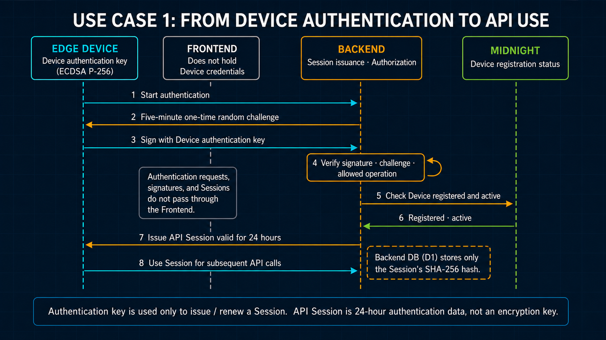
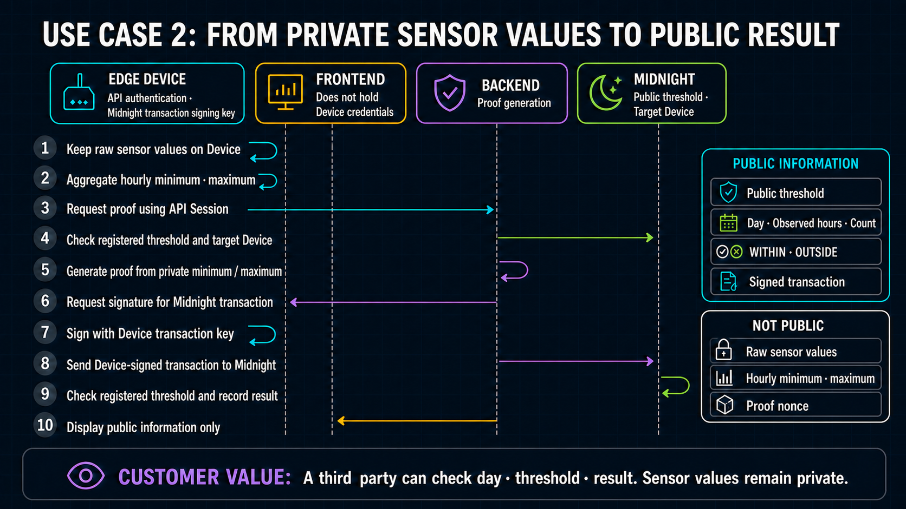

# Device Authentication

[日本語版](../ja/security/device_authentication.md)

This document describes the implemented Wave 1 protocol. The complete normative system specification is [`wave1_spec.md`](../architecture/wave1_spec.md).



Each key domain has one narrow purpose and is rotated independently. The authentication and Proof
Server components receive public Device keys or hashes only and cannot sign on behalf of the Edge
Device or Operator. The separate Sponsor Wallet component holds only its own fee key.

The customer value remains simple: a third party sees whether the submitted sensor values are within the registered threshold, not the sensor values themselves. The sequences below are supporting security evidence showing which credential is used for each use case. The current Session is an opaque Bearer credential, not an encryption key.

## Boundaries and storage

The Device Identity is an ECDSA P-256 key pair independent of the Device transaction identity,
Sponsor Wallet, Operator Authority, and deployment wallet. The private PKCS#8 key remains on the
Edge Device with owner-only permissions. Cloudflare authentication receives only the public JWK.

| Material or state | Location | Purpose |
| --- | --- | --- |
| Device private key | Edge Device `device-auth/device-private-key.pk8`, mode `0600` | Sign a five-minute challenge when opening or renewing a Session |
| Public JWK, device/project assignment, status, scopes | D1 `device_auth_keys` | P-256 API identity registry; active only after Midnight mirror registration |
| Public Midnight Device status/commitment/authority/version | D1 `devices` mirror | Fail-closed API gate; Midnight remains authoritative |
| One-time nonce hash and used state | D1 `device_auth_challenges` | Atomic replay prevention |
| Opaque Session token hash, expiry, revocation, scopes | D1 `device_auth_sessions` | 24-hour API authorization |
| Plaintext opaque Session token | Edge Device `device-auth/session.json`, mode `0600` | Bearer credential for normal API requests |
| Development Midnight wallet | Development host only | Contract deployment and administration |
| Device transaction identity | Edge Device `device-wallet/` only | Bind a value-neutral proved transaction without paying fees |
| Device Contract Authority | Edge Device `device-wallet/<network>/contract-authority/` only | Compact private authorization; public value is used at deployment |
| Sponsor Wallet seed | Sponsor Container deployment secret only | Add DUST to an eligible Device-bound transaction and submit it |
| Sponsor synchronization checkpoint | Encrypted object outside ephemeral Container disk | Resume Sponsor DUST history without exposing the seed |
| Ephemeral Operator Proof Lease hash | D1 `operator_proof_leases` | Purpose-limited deployment/contract administration; plaintext exists only in the process |

KV and application Durable Objects are not used as authoritative Session stores. The Worker hashes a randomly generated opaque token with SHA-256 and stores only that hash in D1. A stolen D1 snapshot therefore does not directly reveal an active Bearer token. Normal authorized requests read D1 but do not update the Session row, so a high-frequency device does not create one write per sample.

## Installation and enrollment

There is no public device-registration endpoint. Registration is an operator action from the authenticated development host.

1. The operator creates or confirms the intended D1 Project and Device records.
2. `installer.sh` checks the Edge Device identity directory. It preserves a complete identity, creates a P-256 identity only when all identity files are absent, and stops if the identity is partial.
3. The operator copies only both public enrollment files from the Edge Device: the P-256 Device Identity and the separate Compact Device Contract Authority.
4. The Operator registers the Compact Device Authority and Device-bound Policy Assignment on Midnight, then mirrors confirmed public state to D1. See [`device_registry.md`](device_registry.md).
5. The development host verifies the P-256 fingerprint and the D1/Midnight device assignment and registers the public key:

   ```bash
   npm run cloudflare:device:register -- --enrollment /secure/temp/enrollment.json
   ```

6. If another active key exists, the command fails unless the operator explicitly approves rotation with `--confirm-replace`. Rotation revokes old active keys and Sessions in one D1 transaction.
7. The Device authenticates and runs `npm run device:configure` to install the current public
   operation configuration from the Worker.
8. The temporary enrollment copies may then be removed according to the operator's record-retention policy.

The development host never generates or stores the Device Identity private key. A future TPM implementation can generate a non-exportable P-256 key in the TPM and send only the public enrollment through the same operator boundary.

Contract deployment and fleet administration use the separate development wallet, Operator Authority, and the Edge Device's public Contract Authority value. Remote proving uses automatically revoked `contract_deploy` or `contract_admin` leases. It does not copy a Device Identity or Device Session to the development host.

## Runtime protocol

1. The device sends `deviceId` and `keyId` to `POST /auth/challenge`.
2. The Worker verifies the active D1 key and creates a five-minute challenge. D1 stores the SHA-256 nonce hash, not the nonce.
3. The device signs this exact UTF-8 message with ECDSA P-256/SHA-256:

   ```text
   VSP-DEVICE-SESSION-V2
   POST
   /auth/session
   <deviceId>
   <keyId>
   <challengeId>
   <nonce>
   <ISO-8601 timestamp>
   <space-separated sorted requested scopes>
   ```

4. `POST /auth/session` verifies the timestamp within ±5 minutes, active public key, signature, nonce hash, expiry, allowed scopes, and unused state. A conditional D1 update consumes the challenge exactly once.
5. The Worker returns a 24-hour random opaque Bearer token. The token carries no readable claims; D1 is the source of truth for device, project, key, scopes, expiry, and revocation. The longer Wave 1 lifetime reduces P-256 challenge exchanges for intermittently connected devices; key rotation or explicit operator revocation invalidates it before expiry.
6. The device reuses that Session until shortly before expiry. The Proof Provider refreshes its authorization headers before each `/check` and `/prove` operation, but obtains a new Session only when the owner-only local cache is near expiry. Long-term ECDSA signing is therefore used for Session creation and renewal, not for each measurement or proof request.

## Daily attestation credential sequence



The Bearer Session authorizes Backend API calls. The Device Contract Authority authorizes the Compact
call. The field transaction identity or Browser Wallet binds the proved call with no fee. The Sponsor Wallet
then adds only DUST and submits the already-bound transaction. These credentials are separate: the
Sponsor receives no Device Identity, Contract Authority, private extrema, nonce, or Compact private
state. The trusted Proof Backend sees the private proving body in transit but stores no body; the
Sponsor endpoint receives only the finalized serialized transaction.

Implemented scopes are:

```text
measurement:write
anomaly:write
proof:request
proof:read
proof:generate
transaction:submit
configuration:read
device:status
```

`configuration:read` exposes only the authenticated Device's public contract, network, Policy,
Assignment, configuration revision, and confirmed administration evidence. It returns no key,
Session, wallet, raw reading, private extrema, or nonce.

Production device URLs require HTTPS. Loopback HTTP is accepted only for local development. Measurement and anomaly bodies are constrained to the device and project identified by the Session.
