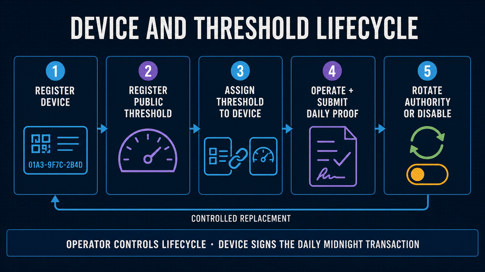

# Fleet Device Registry and Enrollment Specification

[Japanese](../ja/security/device_registry.md)

Status: Wave 1 normative design
Last updated: 2026-08-30 JST

This document defines the trust boundary for adding, rotating, disabling, and using devices. It is
normative together with [`wave1_spec.md`](../architecture/wave1_spec.md).



## 1. Authority model

One `sensor-registry` contract serves multiple devices. It does not contain a constructor-bound
singleton Device Authority or Device Commitment.

```text
operatorAuthority (sealed, one per contract)
  ├ registerDevice
  ├ rotateDeviceAuthority
  ├ disableDevice
  ├ registerThresholdPolicy
  └ registerPolicyAssignment

devices[deviceCommitment]
  └ { authority, active, version }

deviceAuthorityOwners[authority]
  └ deviceCommitment

policyAssignments[assignmentKey]
  └ { policyKey, deviceCommitment, validFrom, validUntil, version }
```

The Operator Authority secret is held on the development/operations host and as a deployment secret
inside the private Sponsor Wallet Container. The development wallet performs controlled Edge Device
administration; the Sponsor Wallet performs the same fixed Device-registration circuits for the
Lace-signed browser review flow. The domain-separated Operator Authority proves authorization inside
the Compact circuit. A Device Contract Authority secret is held only by its Device. A public
self-enrollment circuit is forbidden: every registration still executes the Operator-only circuit.
Each public Device Authority can be registered only once. Rotation permanently reserves both the
old and new authorities, so neither can be reused by another Device.

`submitDailyAttestation` succeeds only when all of the following are proven in the same circuit:

1. the public Device Commitment exists in `devices` and is active;
2. the private Device Contract Authority derives to that registry entry's public authority;
3. the selected immutable Policy Assignment contains the same Device Commitment;
4. the private committed daily input contains the same Device, Policy, and Assignment keys; and
5. daily schema `5`, circuit `3`, the exact 24-hour period, presence bitmap, counts, and policy checks pass.

The daily commitment contains and constrains the explicit domain `vsp:daily-extrema:v1`.

## 2. Enrollment order

Edge enrollment is an authenticated operator/factory workflow:

1. Provision the business inventory row in D1 with `midnight_registry_status=unregistered`. This row
   alone grants no Session or ingestion access.
2. On the Edge Device, generate the P-256 Device Identity and the separate Compact Device Contract Authority.
   Transfer only their public enrollment files to the operator.
3. The operator uses the development wallet and Operator Authority to submit `registerDevice` on
   Midnight. A reused Device Commitment or Device Authority is rejected.
4. Register an immutable public Threshold Policy if it does not already exist.
5. Submit `registerPolicyAssignment` with the Device Commitment embedded in the assignment before
   operation begins.
6. After the Midnight calls complete, mirror the public Device/Assignment state to D1. D1 changes to
   `registered`; it never becomes the cryptographic source of truth.
7. Register the public P-256 key in D1. The script refuses this step unless the Midnight mirror is
   already `registered`.
8. Run Challenge/Session authentication and `npm run device:configure`. The authenticated Device
   pulls the current public contract, network, Policy, Assignment, and administration evidence from
   the Worker; the owner-only `device.env` update is atomic.
9. Run the first ingestion/Proof Job test.

Operational commands for the remote Cloudflare Proof Server are:

```bash
npm run development:device:register:cloudflare -- \
  --device-id edge-temp-002 \
  --device-authority <public-compact-authority> \
  --policy-id temperature-v1

npm run cloudflare:device:register -- --enrollment /secure/device-identity-enrollment.json

# On the Device after P-256 activation:
npm run device:configure
```

The first command uses a process-only `contract_admin` Proof Lease, completes the Midnight calls,
updates the owner-only local deployment record, mirrors the confirmed public state to D1, and revokes
the lease. The second activates the independent P-256 API identity.

The browser review flow uses the same contract authorization but moves the former loopback bridge
behind the Worker. Before enrollment, both browser and Worker independently derive the Device ID as
`device-SHA256("VSP-BROWSER-DEVICE-ID-V1" || projectId || walletKeySha256)` from the Lace public
verification-key identifier. The field is read-only; arbitrary IDs and cross-Wallet browser-storage
fallbacks are rejected.

Before this enrollment flow, Lace signs a separate one-time Project-session challenge. The Worker
returns only the Projects associated with that Wallet identifier and issues a 24-hour opaque bearer
token. A Wallet may be associated with at most ten Projects; the API check and
`browser_wallet_projects_limit` D1 trigger enforce the same limit. A new Project starts without a
Policy and does not create an on-chain transaction by itself. The owner may separately create up to
ten Project-associated Policies. Lace signs the exact Project, immutable Policy ID, mode, centi-degree
bounds, nonce, and timestamp; the Worker queues Operator-only `registerThresholdPolicy`, and exposes
the Policy only after Indexer confirmation. Explicit pre-existing Project/Policy associations remain
readable so already registered Device assignments are not invalidated.

1. the browser derives its Device ID, creates a non-exported P-256 Device Identity, and selects a registered public Policy;
2. the Worker issues a five-minute one-time challenge;
3. Lace signs the canonical Device ID, P-256 key ID, Device Authority, Policy, challenge, nonce, and
   timestamp with `signData`;
4. the Worker verifies the Lace signature, recomputes the Device ID, and enforces one review Device per Lace verification key and Project;
5. the private Sponsor Wallet Container executes only `registerDevice` and
   `registerPolicyAssignment` with the configured Operator Authority;
6. the Indexer must show the exact Device, Authority, Policy, Assignment, and versions; and
7. only then does one D1 batch activate the P-256 key and public mirrors.

Migration `0019_worker_browser_provisioning.sql` stores one-time enrollment challenge hashes.
Migration `0021_wallet_projects.sql` adds hashed Project Sessions, the ten-Project limit, explicit
Project/Policy associations, and the Wallet/Project/Device binding. Migration
`0022_project_policies.sql` adds Lace-authorized Policy operations, the ten-Policy-per-Project limit,
actual proof-generation timestamps, and initial current state for registered Devices. Neither Lace
signing data nor these endpoints can select another contract, rotate/disable a Device, transfer
tokens, or retrieve an Operator/Sponsor secret. Concurrent registration is leased in D1 and
duplicate calls fail closed.

## 3. Rotation and disabling

Device Contract Authority rotation is Operator-only and requires a strictly higher registration
version. After the Midnight transaction succeeds, sync the D1 mirror. P-256 key rotation remains a
separate operation and revokes old Sessions.

```bash
npm run development:device:rotate:cloudflare -- \
  --device-id edge-temp-002 \
  --device-authority <replacement-public-compact-authority> \
  --device-registration-version 2
```

Disabling is fail-closed and not reversible in Wave 1. The Operator first calls `disableDevice` on
Midnight, then the D1 mirror is changed to `disabled`, policy assignments are retired, active P-256
keys are disabled, and Sessions are revoked.

```bash
npm run development:device:disable:cloudflare -- --device-id edge-temp-002
```

A forged or stale D1 `registered` value cannot make an invalid Midnight attestation pass because the
contract independently checks the live Device Registry and Device-bound Assignment. Conversely, a
valid on-chain Device that has not been mirrored remains unable to obtain a Cloudflare Session. This
intentional two-sided gate fails closed.

## 4. D1 mirror fields

Migration `0011_multi_device_registry.sql` adds public mirror fields and administration transaction
evidence to `devices`, adds
`device_commitment` to `policy_assignments`, and permits purpose-limited `contract_admin` Proof
Leases. Migration `0012_device_operation_configuration.sql` adds the monotonically increasing public
configuration revision and the dedicated `configuration:read` scope. Migration
`0013_daily_threshold_result.sql` binds the claimed public WITHIN/OUTSIDE result to each idempotent
daily Proof Job. Migration `0019_worker_browser_provisioning.sql` adds hashed one-time browser
challenges and hashed Lace verification-key bindings. Secrets are never stored in D1.

The Worker requires all of these before issuing a Session or accepting operational input:

- D1 Device status is `registered`;
- public Device Commitment, public Device Authority, registration version, contract address, and
  confirmed administration transaction IDs are present;
- the authenticated Device ID hashes to the same Device Commitment; and
- the D1 Assignment mirror contains that same Device Commitment.

The administrator GUI shows Midnight registry status/version and the shortened public Device
Commitment. Disabled and unregistered devices must not appear as activated.

`GET /api/v1/device/configuration` accepts only an authenticated Device Session with
`configuration:read`. Its query is bound to the Session's Device and Project. It returns a value only
when the Device, active Device-bound Assignment, Policy, their confirmed transaction evidence, D1
contract addresses, and the Worker's configured contract address agree. Wallet commands refresh this
configuration before contract-sensitive operations, so a confirmed redeployment can move Devices to
the new address without rebuilding the firmware archive. Threshold bounds remain public on Midnight;
the Device does not choose or send bounds in a Proof request.

## 5. Compatibility and deployment gate

This Fleet Registry ledger and the domain-tagged daily commitment are incompatible with the
selected-leaf deployment, the intermediate singleton daily-attestation implementation, and the
WITHIN-only Fleet Registry. Adoption requires Compact recompilation, a new contract deployment,
migrations through `0020`, re-registering
every Device/Policy/Assignment, updating the Worker contract address, allowing Devices to pull the
new operation configuration, and regenerating private
daily commitments under schema `5` / circuit `3`.

HEAD, the current working tree, and any deployed Preprod contract are separate states. A local
compile or simulator pass must never be reported as a Preprod deployment or transaction.

The following self-funded Preprod E2E gate passed on 2026-08-28 JST, with transaction IDs retained in
the cost benchmark:

1. operator registers one Device, Policy, and Device-bound Assignment;
2. D1 mirror and P-256 activation complete;
3. the Edge Device obtains a 24-hour Session and uploads an hourly aggregate;
4. the Edge Device creates a Daily Proof Job without threshold bounds;
5. the Cloudflare Container Proof Server generates the proof;
6. the Edge Device wallet signs/submits `submitDailyAttestation` with its own DUST and it is
   confirmed on Preprod; and
7. the local administrator GUI and public verifier show the same confirmed transaction and exact
   redacted claim.

The Edge Device completed both truthful WITHIN and OUTSIDE self-funded attestations. The current
schema-5 Sponsor-funded WITHIN attestation was separately confirmed on 2026-08-30 JST and is the
operational sponsorship-boundary evidence.

The current Sponsor-funded release gate replaces step 6 with:

1. the Device or Lace binds the proved transaction with no fee;
2. the authenticated Sponsor endpoint accepts it once for the matching Proof Job;
3. the dedicated Sponsor Wallet adds only DUST and submits it;
4. duplicate, mismatched, oversized, wrong-state, or altered requests are rejected or return the
   same idempotent result; and
5. the confirmed Preprod transaction and sponsorship timing/fee are recorded before GUI capture.

This gate passed for the standard 1,440-reading path. The same-byte retry kept one Sponsor attempt,
one quota reservation, and zero additional Proof Server requests.

## 6. Cost treatment

Fleet support adds one-time administration transactions (`registerDevice`, optional policy
registration, Device-bound assignment, rotation, and disabling) plus small linear public ledger/D1
state per Device. Daily proof volume remains linear in active Devices and days; there is no
exponential factor. The fixed 24-slot proof remains independent of whether the local day contained
24, 96, 1,440, or denser raw readings.

The Registry lookup, Device/Assignment equality constraints, explicit commitment domain, and fixed
version assertions change the circuit. Therefore all older compile size, proving time, transaction
size, and DUST figures are historical only. The standard Cost profile is one 1,440-reading day
reduced to the fixed 24-slot circuit. Record Device-bind size/time and Sponsor final size/time/DUST
separately; 24/96 are equivalence tests rather than separate prices.
