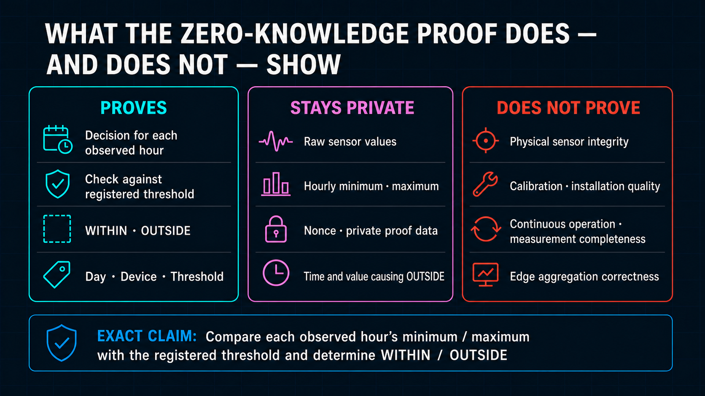
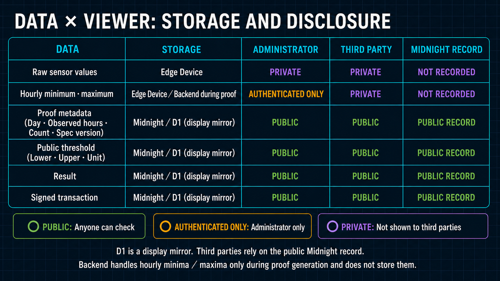

# Privacy and Public Claim Boundary

[日本語版](../ja/security/private_spec.md)

The normative requirements are in [`wave1_spec.md`](../architecture/wave1_spec.md). In the primary
Wave 1 review path, synthetic raw values and their private daily opening remain in browser-private
state. Authorized hourly summaries are stored by the trusted managed backend for the operator
workflow, and the admitted private proof request is streamed to the proof service. The supporting
field path retains raw measurements at the field source and sends only bounded aggregates, anomaly
state transitions, commitments, and workflow metadata during normal operation.

The three columns must not be conflated. The ZK proof establishes the relationship between submitted private extrema and the registered public policy. Keeping raw values and hourly extrema private does not establish physical sensor truth, calibration, installation quality, or continuous sampling; those remain responsibilities of the device, firmware, installation, and operational audit.

The location map distinguishes storage from transit and illustrates the supporting field path. In the
primary review path, the browser-private capture occupies the same private-source boundary. Raw
values, proof openings, witnesses, and keys do not enter Backend storage or public application state.
Authorized hourly summaries are restricted operational data in D1 and are never returned by the
third-party API. Queue messages contain references only, while private proving requests transit the
proof service only after admission. Midnight remains authoritative for public policy and attestation
evidence.

## Private data

- Device Identity private key and plaintext opaque Session token;
- device and development Midnight wallet secrets;
- raw or synthetic sensor values and the private daily opening;
- commitment nonce, witnesses, and private state;
- proof request bodies while not in transit.

Raw values may be retained in private source storage until transaction confirmation and the configured
retention policy permit deletion. For the Wave 1 simulated source, this is browser-private storage;
for the supporting field path, it is local field storage. They are not written to D1, R2, Queue
messages, Worker logs, or public browser state. Authorized hourly summaries are the bounded exception:
they are stored in D1 for the operator workflow but are not public evidence.

## Administrator data

The logical operator view can display only the selected proof subject's authorized hourly minimum,
maximum, average, count, anomaly transitions, status,
and Proof/TX processing state. In Wave 1 it shares a review application with the third-party view;
production role and application separation is a Wave 2 objective. Private aggregate values are not
included in the public third-party API.

## Public evidence

The public Proof view may expose:

- UTC measurement date (`YYYY-MM-DD`, exactly 00:00–24:00) and sample count;
- daily attestation commitment and pseudonymous Proof Job ID;
- `deviceCommitment` as the pseudonymous proof subject;
- threshold-policy mode, lower/upper bounds, unit, scale, version, and assignment validity interval;
- observed/STOPPED hour count and presence bitmap;
- 24 proven hourly WITHIN/OUTSIDE/NO DATA results, a daily summary, and confirmation status;
- attestation transaction ID or hash, block height, network, and contract address.

The operational contract stores threshold mode, minimum/maximum, scale, sensor/unit codes, policy
assignment, UTC measurement day, hourly result vector, and `thresholdSatisfied` daily summary in
public ledger state. The product must therefore describe the threshold policy and each hour's status
as public. The zero-knowledge property protects the submitted hourly extrema and commitment nonce;
an OUTSIDE result reveals the hour but not the value or which bound was exceeded.

## Trusted Wave 1 components

The Cloudflare Worker and Proof Server Container are trusted with an in-transit private proving
request. TLS protects that hop. The Worker removes authorization headers before forwarding, does not
log request bodies, and streams the body without storing it in D1, R2, or Queue messages. The Device
transaction agent or user-controlled browser account retains the transaction authority and explicitly
approves the fee-free transaction. The
private Sponsor Wallet Container holds a separate Sponsor seed for DUST balancing/submission and an
Operator Authority secret for the fixed browser-registration circuits; neither secret is exposed by
a public route or returned to the browser.

The two Container secrets are runtime inputs, not image contents. The production Worker obtains them
from Cloudflare Secret bindings and passes them to the Sponsor Wallet Container as startup environment
variables. The Docker build context and resulting image must remain free of the seed, Operator
Authority secret, `.env`, `.dev.vars`, wallet checkpoints, and wallet state. Compiled Compact
prover/verifier artifacts are build artifacts rather than secret key material. For local development,
ignored `.dev.vars` values may replace Cloudflare Secret bindings, but they must not be committed or
copied into the image.

The browser does not independently execute the ZK verifier. From a pasted transaction hash, it asks
the public Midnight Indexer for the successful transaction, block, and Contract actions. It decodes
the Contract state at that block and the preceding block, identifies the attestation added by that
transaction, and renders its operational date/boundary, hourly results, policy/validity, and Device Commitment. D1 is
not used in this hash-verification path. Local proof-verifier execution and multi-source Indexer
hardening remain later extensions.
