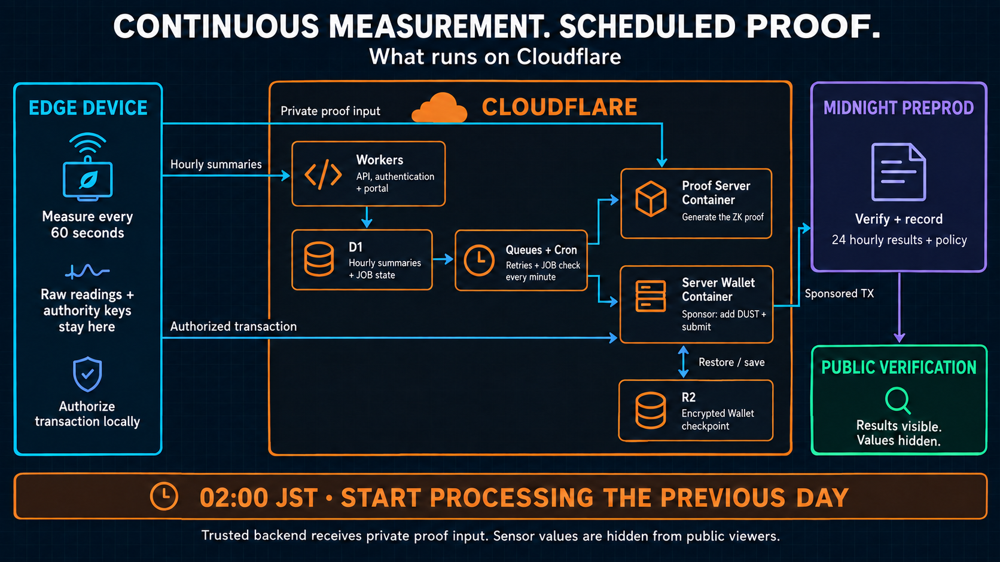
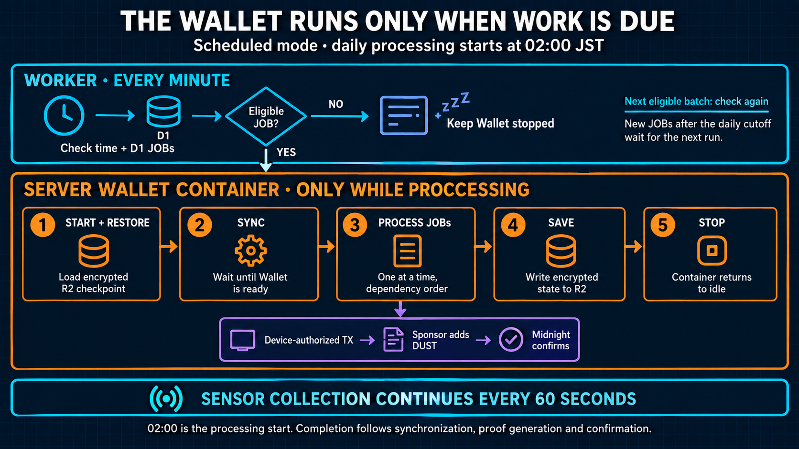

# Cloudflare operations: pitch and video addition

[日本語版](../ja/submission/cloudflare_operations_media.md)

The September 10, 2026 edition adds two imagegen diagrams and narrated scenes explaining the deployed field path: minute-by-minute collection, hourly uploads, and daily 02:00 JST processing. The original nine-slide English pitch, twelve-slide Japanese technical reference, and historical recordings remain available under their original names.

## Deliverables

| Deliverable | English | Japanese |
| --- | --- | --- |
| Extended deck | [11-slide PPTX](deck/bacchiri-verifiable-measurement-layer-wave1-en-cloudflare-operations.pptx) · [PDF](deck/bacchiri-verifiable-measurement-layer-wave1-en-cloudflare-operations.pdf) | [14-slide PPTX](../ja/submission/deck/bacchiri-verifiable-measurement-layer-wave1-ja-cloudflare-operations.pptx) · [PDF](../ja/submission/deck/bacchiri-verifiable-measurement-layer-wave1-ja-cloudflare-operations.pdf) |
| Full demo with added scenes, local file | [English MP4](../../.demo-output/cloudflare-operations-20260910/bacchiri-demo-pitch-en-cloudflare-operations.mp4) | [Japanese MP4](../../.demo-output/cloudflare-operations-20260910/bacchiri-demo-pitch-ja-cloudflare-operations.mp4) |
| Standalone explanation, local file | [English MP4](../../.demo-output/cloudflare-operations-20260910/cloudflare-operations-en.mp4) | [Japanese MP4](../../.demo-output/cloudflare-operations-20260910/cloudflare-operations-ja.mp4) |
| Standalone captions, local file | [English SRT](../../.demo-output/cloudflare-operations-20260910/cloudflare-operations-en.srt) | [Japanese SRT](../../.demo-output/cloudflare-operations-20260910/cloudflare-operations-ja.srt) |

The English deck inserts the figures at slides 8–9, after the existing Wallet explanation. The Japanese reference inserts them at slides 9–10. Original slide content, media, and notes are preserved; the two new figures are raster images with editable speaker notes. The Japanese edition remains an extended technical reference rather than a translation of the nine-slide English pitch.

The full videos insert the new scenes before their final claim-boundary scene. Existing footage carries an August 2026 recording label; new figures carry a September 2026 field-integration illustration label. Original narration is retained, and the additions use synthetic narration in the selected language. The local videos and intermediate audio are under ignored `.demo-output/`; a fresh checkout must supply the original recording to rebuild them. No new public video URL is claimed.

Measured durations: the English full video is **3:20.294**, with a **1:02.157** standalone explanation; the Japanese full video is **4:16.465**, with a **1:14.978** standalone explanation. The additions begin at 1:58.667 in English and 2:35.933 in Japanese. These are longer sibling editions, so the baseline 2:18 submission runtime does not describe them.

## Figure 1: Cloudflare responsibilities

Workers provides the authenticated API and portal. D1 retains hourly summaries and workflow state. Queues and Cron coordinate work and retries. A Proof Server Container generates proofs; a separate Server Wallet Container provides sponsorship. R2 stores the encrypted Wallet checkpoint, a saved synchronization state restored on the next start. Midnight verifies and records public results.

Arrows identify responsibility and destination; actual Device requests pass through the authenticated Worker. The private-proof-input arrow reaches the Proof Server, not D1. The authorized-transaction arrow reaches the Sponsor role, which contributes DUST fees and submits to Midnight. Raw measurement streams and Device authority keys remain on the Device. The current trusted backend receives private proof inputs; public viewers do not receive the sensor values.

## Figure 2: scheduled Wallet lifecycle

The one-minute Worker check reads the time and eligible D1 work before waking the Container. With an eligible JOB, the Wallet starts, restores its encrypted R2 checkpoint, and synchronizes. Ready work runs one item at a time in dependency order. After eligible work drains, the latest state is saved and the Container stops. New JOBs accepted after the daily cutoff wait for the next eligible run. The separate Device collector continues sampling throughout.

02:00 JST is the processing start, not a promised confirmation time. The Device separately checks completed days every five minutes and retries pending work. The diagrams do not claim perfect sensor accuracy, complete sampling, or correctness of local aggregation; no-data hours remain explicit. They describe current field integration without redefining the historical Wave 1 GUI recording as a live demonstration of it.

## Narration and reproduction

The exact bilingual narration and notes are in [cloudflare-operations-content.json](../../tools/submission-media/cloudflare-operations-content.json). The [imagegen prompt record](../assets/review/cloudflare-operations-imagegen-prompts.md) includes all prompts, localization specifications, and rejected-draft corrections. The original generated images are 1672 × 941 PNGs; no generated figure is left only in the image tool's default storage.

Install development-only deck tooling in an ignored directory, then build from the repository root:

    npm install --prefix .demo-output/media-deps --no-audit --no-fund jszip@3.10.1 pdf-lib@1.17.1
    NODE_PATH="$PWD/.demo-output/media-deps/node_modules" node tools/submission-media/build-cloudflare-operations-decks.cjs

The video builder uses FFmpeg and FFprobe. Supply a Python interpreter with `edge-tts` to create new narration:

    python3 tools/submission-media/build-cloudflare-operations-video.py en --tts-python <python-with-edge-tts>
    python3 tools/submission-media/build-cloudflare-operations-video.py ja --tts-python <python-with-edge-tts>

Use `--reuse-audio` when the existing MP3, caption file, and exact text file already exist. The builder checks caption text against narration, clamps overlapping TTS sentence boundaries, and uses a 1080p caption canvas with a separate lower caption area. With an externally supplied original recording, use `--source-video` and `--insert-at`. Final MP4s use H.264/AAC, 1920 × 1080, 30 fps, with full-decode checks, source-preservation hashes, and per-language JSON manifests.

## Validation record

Both diagrams were visually inspected for service ownership, arrow destinations, readable labels, and correct timing. All four accepted images have opaque backgrounds. Both presentation archives are parsed as XML and checked for internal relationship targets. The deck builder asserts byte-for-byte preservation of original slides, notes, and images; PDF page counts match the new deck counts. Final video duration, rendered-frame review, and checksums are retained in `.demo-output/cloudflare-operations-20260910/` and summarized in the [execution record](../implementation/cloudflare_pitch_media_execplan.md).
