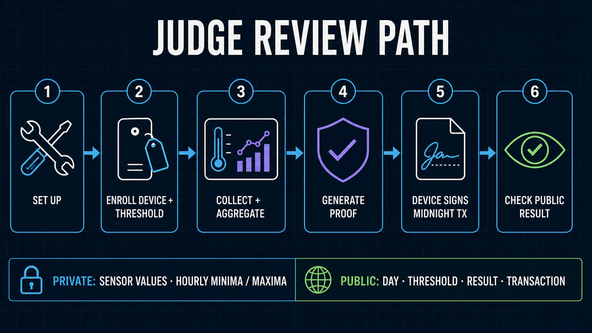

# Wave 1 Judging Deliverables Plan

[日本語版](../ja/submission/deliverables_plan.md)

This is the production brief for the Wave 1 submission. The central message is:

> Show a third party that submitted sensor values are within the registered threshold without disclosing the sensor values.

## Requirements and gates

| Requirement | Deliverable | Completion gate |
| --- | --- | --- |
| Public GitHub repository | Repository, top README, license, topic | Publicly accessible with the midnightntwrk topic |
| Clear README | Top README and detailed guides | Covers project, setup, architecture, Midnight integration, and evaluation |
| Slide deck | English 16:9 nine-slide pitch synchronized with the final video; Japanese version only if required | Claims, screenshots, and evidence boundaries match the final video |
| Demo / video pitch | English 2:18 version complete; Japanese version only if required | Concept slides and GUI footage are matched one-to-one with narration |
| Wave progress | Dated progress record | Distinguishes pre-existing work from Wave 1 additions |
| Compiling Compact contract | Technical-gate evidence | sensor-registry compiles with the pinned toolchain |
| Apache 2.0 Midnight code | License audit | Scope and attribution are explicit |
| Tests and simulations | Evidence matrix | Core success and rejection cases are reproducible |

Recheck the exact submission time, field limits, upload constraints, and Official Rules on AKINDO immediately before submission.

## Rubric strategy

| Category | Weight | Primary evidence |
| --- | ---: | --- |
| Engineering & Implementation | 40% | Proof-circuit compilation, private-input boundary, four-domain architecture, and Midnight preproduction-network transaction |
| QA & Reliability | 15% | Tests, tamper rejection, fixed 24-slot input, reproducible runbook |
| Product & Vision | 15% | Privacy problem, target users, realistic roadmap |
| UX & Design | 15% | Operator UI, public verifier, clear state and evidence |
| Communication | 10% | Focused deck, concise demo, consistent technical diagrams |
| Business Viability | 5% | Target sectors, adoption path, measured cost model |

## P0 artifact set

1. Submission copy with title, value, problem, solution, why Midnight, progress, and links.
2. Judge-ready README with 30-second, three-minute, and ten-minute reading paths.
3. English nine-slide pitch deck synchronized with the final 2:18 video; keep deeper technical diagrams in the documentation package.
4. English 2:18 demo video; produce a separate Japanese version only if the review audience requires it.
5. Scene-level demo script and capture list.
6. Evidence matrix connecting each claim to source, tests, runtime proof, and validation boundary.
7. Dated Wave 1 progress record.
8. Technical-gate checklist for compile, tests, license, repository visibility, and topic.

Supporting artifacts should include a screenshot pack, judge Q&A, one-page brief, and a release snapshot tied to a commit and checksums.

## Final nine-slide deck

| # | Slide | Core message |
| ---: | --- | --- |
| 1 | Title / Value | Threshold evidence without publishing private readings |
| 2 | Minimum Evidence | Why cross-organization review should disclose only the required result |
| 3 | Use Case | Register → measure → reduce → prove → authorize → verify |
| 4 | Live Product: Register | User-controlled account, proof subject, public policy, and validity |
| 5 | Private Evidence | Raw readings, fixed 24-slot private input, and STOPPED hours |
| 6 | Live Product: Prove | Generate the proof against the policy registered before measurement |
| 7 | Engineering Innovation: Sponsor | On-demand server-side Sponsor Wallet pays DUST only, preserves Device authority, and reduces idle Container time |
| 8 | Live Product: Verify | Show public policy, result, commitment, and transaction evidence |
| 9 | Exact Claim Boundary | State what is proved, kept private, and not established |

The nine-slide story is synchronized with the final 2:18 English video. It minimizes cognitive load by moving from customer value to the controlled proof path, then showing the live review flow and ending with the exact claim boundary. Deeper architecture, test, cost, and roadmap evidence remains linked documentation rather than extra pitch slides.

## Demo storyboard

| Time | Scene | Evidence shown |
| --- | --- | --- |
| 0:00–0:12 | Hook | Product value and privacy question |
| 0:12–0:32 | Minimum evidence | Cross-organization problem and selective disclosure |
| 0:32–0:49 | Register | User-controlled account, proof subject, and pre-registered policy |
| 0:49–1:06 | Private input | Raw readings, fixed 24 slots, and STOPPED hours |
| 1:06–1:22 | Prove | Proof against the already registered policy |
| 1:22–1:40 | Authorize | User authorization separated from service-funded submission |
| 1:40–1:59 | Public verification | Policy, result, commitment, and transaction evidence |
| 1:59–2:18 | Claim boundary | What is proved and explicitly not established |

Include one OUTSIDE or tamper-rejection path. Prerecorded fallback captures must be tied to the same commit and labeled honestly.

## Evidence and README

The initial evidence set covers private synthetic inputs, the threshold registered before the selected day, private hourly minimum / maximum values, WITHIN / OUTSIDE, STOPPED hours, authority separation, a proof service that cannot authorize for the user, public-only verification responses, 1,440 readings/day, and proof-circuit compilation. Supporting field-runtime behavior is identified separately from the primary Wave 1 review path. Each row must include date, command, commit SHA, publishable evidence, and validation boundary.

The top README should cover value, problem, exact claim, four-domain architecture, Midnight integration, demo, quick verification, evidence and limitations, repository map, detailed guides, Wave 1 progress, roadmap, license, attribution, and topic.

## Production and completion

Use the canonical [three-wave product and business roadmap](../architecture/three_wave_roadmap.md). It defines Wave 1 as the Core Proof PoC, Wave 2 as an operational partner pilot with real field measurement systems and production controls, and Wave 3 as trust minimization plus PMF through recurring commercial use.

Freeze the evidence inventory and technical gates first. Then finalize submission copy and README, generate language-specific diagrams and screenshots, build the decks, capture the demo, and audit terminology, links, numbers, commits, and language separation.

Completion requires public links, reproducible sensor-registry compilation, one-to-one claim evidence, language-specific assets when both languages are published, consistent capability vocabulary, explicit planned-work labels, and confirmed Apache 2.0 / public repository / midnightntwrk gates.
