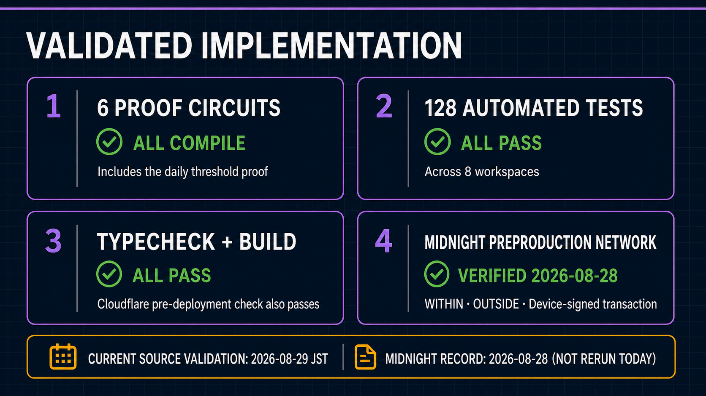

# Wave 1 Evidence Matrix

[日本語版](../ja/submission/evidence_matrix.md)

Validation date: 2026-08-31 JST
Local baseline: current working tree based on b68a3b7ec662a7f00a6e7beebf3b66f8a68a8fc5
Preprod evidence date: 2026-08-28 JST

Local source validation and recorded Preprod transactions are intentionally separate. The 2026-08-31 JST Worker/GUI deployment does not claim that a new dated attestation was generated merely for this documentation update.

| ID | Review claim | Source / design evidence | Current local validation | Runtime / Preprod evidence | Boundary |
| --- | --- | --- | --- | --- | --- |
| CLAIM-01 | Raw readings and the private opening remain at the private source; bounded hourly summaries are restricted operator data, not third-party evidence | browser-private simulated capture, summary APIs, supporting field aggregation, privacy specification | Frontend, Gateway, Shared, and field-runtime boundary tests passed | 1,440 synthetic readings reduced and uploaded as bounded summaries in the recorded run | The trusted Backend stores authorized summaries; Wave 1 does not claim autonomous field operation or prove that no alternate collection path exists |
| CLAIM-02 | The operational policy and Device assignment are registered before proof | sensor-registry policy and assignment circuits; Fleet Registry specification | Contract compile and 13 simulator tests passed | Schema-5 policy and Device-bound assignment recorded on Preprod | Contract unchanged; Worker/GUI revision deployed 2026-08-31 JST |
| CLAIM-03 | The 24 hourly extrema and nonce are private witness data | sensor-registry source; public-field map | Compile succeeded; redaction tests passed | Public verifier record omits extrema and nonce | Trusted Backend sees the private proof request in transit |
| CLAIM-04 | Truthful WITHIN and OUTSIDE results use the same daily circuit | submitDailyAttestation circuit and tests | 28,699 rows, k=15; success and rejection tests passed | Both results confirmed on 2026-08-28 | Does not prove sensor truth or completeness |
| CLAIM-05 | Missing hours are represented as STOPPED | Wave 1 specification and daily input utilities | Shared STOPPED test passed | Public result exposes observed / stopped counts | STOPPED is not fraud detection |
| CLAIM-06 | User transaction authority, field API identity, and service fee authority are separate | browser authorization and supporting field-agent boundaries | Frontend, identity-agent, and transaction-agent tests passed | Authorized Preprod transaction recorded | Hardware-protected attestation is future work |
| CLAIM-07 | The proof service cannot authorize as the user | proof flow and transaction-authorization source | Boundary and execution-lock tests passed | Recorded flow authorizes the call after proof generation | Backend remains trusted for proof input |
| CLAIM-08 | Browser APIs expose only public or authorized redacted state | Gateway API tests and frontend responsibility design | 111 Gateway and 52 Dashboard tests passed | Public verifier showed policy, result, commitment, and TX | Browser directly compares public Indexer transaction and Contract state but does not rerun the ZK verifier locally |
| CLAIM-09 | The PoC handles 1,440 readings/day with one fixed 24-slot proof | aggregation utilities and cost benchmark | 24 / 96 / 1,440 fixed-shape tests passed | 1,440-reading OUTSIDE TX confirmed | One simulated source/day is not a fleet load test |
| CLAIM-10 | The required operational Compact contract compiles | midnight/contracts/sensor-registry | All 6 circuits compiled on 2026-08-31 | Previous deployed schema-3 contract confirmed | Final submission commit SHA remains to be frozen |
| CLAIM-11 | Repository verification passes | root verify script and workspace scripts | 333 tests, typecheck, build, Wrangler dry-run passed | Worker version `486db124-ae9f-4bbc-9303-329999538c13` deployed on 2026-09-01 JST | Initial restricted Docker dry-run could not update buildx state; the host-access dry-run passed |
| CLAIM-12 | The GUI connects the simulated measurement workflow to public verification | dashboard source, routes, and tests | Dashboard build and 52 tests passed | Dated capture record shows the review flow | Combined review UI is not production role separation; English demo pitch produced, public URL pending |

## Current validation command

    TMPDIR=/tmp npm run verify

The explicit TMPDIR is required in this WSL environment so tsx creates its IPC socket below /tmp rather than a Windows Temp mount. The first run compiled Compact successfully and then stopped with ENOTSUP during IPC creation; the rerun above completed successfully.

## Test distribution

| Workspace | Passed |
| --- | ---: |
| Shared | 18 |
| sensor-registry Contract | 13 |
| Dashboard | 63 |
| Development CLI | 4 |
| Device Auth | 6 |
| Edge Agent | 13 |
| Device Wallet Agent | 29 |
| Proof Gateway | 145 |
| Sponsor Wallet | 42 |
| Total | 333 |

## Recorded Preprod reference

- Contract: 8338d5588fe5662fce86ce3c221f0bd5260a14cdbf372c1dddd58be41e5b3c68
- Transaction: 00e12efda5f33b4804f3659a811d2f5e86c9ce838255a63028d41df85cb0762da9
- Block height: 2,302,213
- Result: OUTSIDE, verified=true, thresholdSatisfied=false
- Public policy: 10–35 °C
- Raw readings, hourly extrema, and nonce: not disclosed

The final release audit must replace the local baseline description with a frozen commit SHA and rerun the same command.
