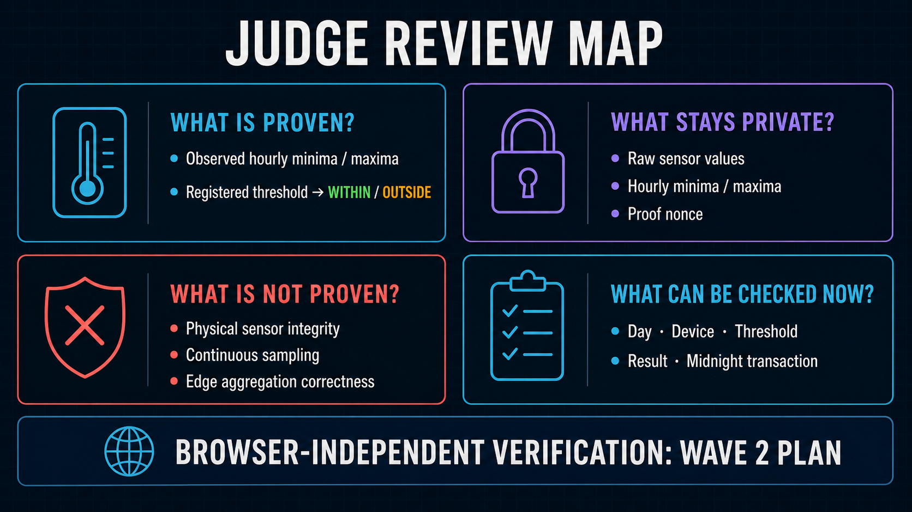

# Judge Q&A

For the current artifact inventory, September 11 validation, and remaining work, see the [final delivery summary](final_delivery.md). References to `af90ad8` and 496 tests describe the baseline recorded through September 5.

[日本語版](../ja/submission/judge_qa.md)

## In one sentence, what does the system prove?

It proves whether the private hourly minimum and maximum values for an observed day are within the registered threshold, without showing those sensor values to a third party.

## What can a third party check?

A third party can paste a transaction hash and check the UTC measurement date, 24 hourly
WITHIN/OUTSIDE/NO DATA results, applied lower/upper bounds, unit, scale, version, validity interval,
`deviceCommitment`, and the Midnight transaction/block. Raw sensor values and hourly minimum/maximum
values are not displayed.

## What does it not prove?

It does not prove that a physical sensor produced correct values, that sampling was continuous, that no readings were withheld, or that the measurement source aggregated the readings correctly. An hour with no readings is published as NO DATA; it is not automatically classified as WITHIN or fraudulent.

## Why use Midnight?

Midnight separates the information that must remain private from the result record that anyone may check. It records the public threshold, its target Device, the result, and the transaction record. It does not record sensor values or hourly minimum / maximum values.

## What is the difference between Cloudflare D1 and Midnight?

Cloudflare D1 is the database used for screen display and workflow progress. The public Midnight record is what a third party uses as the reference for the result.

## Who handles the private hourly minima and maxima?

In the Wave 1 review path, the browser-based simulated measurement source creates them and keeps the raw capture and private opening in browser-private state. Bounded hourly summaries are stored as restricted operator data in the trusted managed backend, which also handles the private proof request. They are not returned by the third-party API or stored on Midnight. End-to-end encryption that also hides them from the backend is not a current feature.

## Can the Backend authorize the transaction for the user?

No. The managed backend generates the proof but does not hold the user's transaction authority. The user-controlled account authorizes the exact call, while a separate service pays only the submission fee.

Managed API mode is a different trust model: the customer registers a cloud source, and the service
uses a separate managed-attestor authority for that source. It never impersonates a user or Device,
and the proof states only what follows from values received by the trusted service.

## Why normalize one day into 24 hourly slots?

It keeps the proof input format unchanged whether readings arrive hourly, every minute, or every second. Raw readings are reduced to the minimum and maximum for each hour, and the 24 hourly slots are proved in one fixed format. This does not prove that the aggregation itself was correct.

## How are hours without readings shown?

Each hour of the registered operational day is published as WITHIN, OUTSIDE, or NO DATA. The hourly extrema remain private.

## What has been verified so far?

Implementation baseline `af90ad8` compiled all 8 circuits, passed 496 automated tests, all type checks/builds, API SCT, the 22-checkpoint GUI SCT, Wrangler dry-runs, and portability checks. The current eight-circuit Contract was deployed on 2026-09-03. A 1,440-record Managed API day confirmed OUTSIDE in block 2,385,826 and an authenticated 1,440-reading Device day confirmed WITHIN in block 2,385,898. On 2026-09-05, the public Verification MCP resolved both hashes from the Midnight Indexer and completed all five current ledger checks without D1 or private input.

## Can the third-party view verify independently?

Yes for the public chain evidence. Without a Wallet, private input, or D1 lookup, the browser queries the public Midnight Indexer by transaction hash, confirms the successful transaction and block, derives the called Contract, and compares its state at that block with the preceding block. It decodes the newly added Attestation, operational date/boundary, 24 hourly results, Policy/validity, presence/counts, Device Commitment, and Device-bound Assignment. The browser does not rerun the proof verifier locally or expose the witness; Midnight performed proof verification as part of accepting the transaction.

## Who holds which keys?

User transaction authority, field API identity, Operator and managed-attestor Compact authorities,
Wallet fee authority, and deployment authority are logically separated. One consolidated Server
Wallet runtime serializes Backend Wallet mutations to avoid repeated synchronization cost, but its
Compact authorization secrets remain independent. The proving service does not hold a user's or
Device's transaction authority.

## How can support inspect the system without exposing operations publicly?

An Access-protected Support MCP Worker exposes six read-only tools over redacted D1 observations.
The public Verification MCP is a different Worker with no operational storage/runtime bindings and
only one transaction-hash verification tool. Public access therefore cannot discover Wallet status,
jobs, audit events, source configuration, or support tools.

## Can it scale to many Devices?

Each daily proof input remains fixed at 24 hourly slots, but the number of proofs grows with the number of active Devices multiplied by the number of days. The 10,000-Device figure is a planning estimate, not a completed load-test result.

## What is the adoption plan?

Wave 2 targets a paid operational pilot with an established company, using real field measurement systems in an existing business workflow. Wave 3 targets product-market fit through recurring revenue, renewal, expansion, and sustainable unit economics. Sector-specific opportunities are commercial hypotheses rather than completed field validation.
