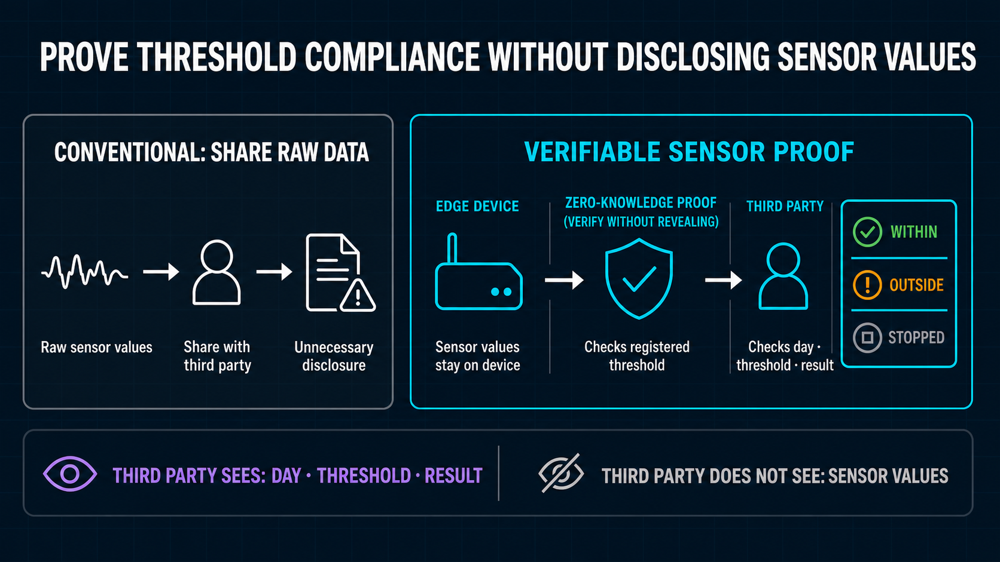

# BACCHIRI!━━Verifiable Measurement Layer

## Customer value

**Prove whether sensor values are within a registered threshold without showing those values to a third party.**

Construction measurement results are used by equipment providers, rental companies, contractors, project owners, auditors, and other organizations. Sharing raw measurements for review can disclose more information than the reviewer needs.

BACCHIRI!━━Verifiable Measurement Layer adds a verification layer that lets them check the result while keeping the values private. It does not replace existing measurement equipment or management systems.

## What remains private and what is public

| Not public | Public |
| --- | --- |
| Raw sensor values | Day and target Device |
| Hourly minimum / maximum values | Threshold: lower bound, upper bound, and unit |
| Proof nonce | Observed hours and counts |
| Device signing key and wallet information | WITHIN / OUTSIDE / STOPPED result and Midnight transaction record |

## How it works

1. The Edge Device collects raw sensor values and keeps them on the Device.
2. It reduces the readings to an hourly minimum and maximum and normalizes the day into 24 hourly slots.
3. The Backend accepts the proof request and generates the proof without publishing the sensor values.
4. The Edge Device signs the Midnight transaction.
5. A third party checks the day, public threshold, result, and transaction record.

## Verified in Wave 1

- All 6 proof circuits compile.
- All 287 automated tests pass across 9 workspaces.
- Type checks, builds, and the Cloudflare pre-deployment check pass.
- Midnight preproduction-network records from 2026-08-28 include both WITHIN and OUTSIDE.
- A day with 1,440 readings is reduced to one daily proof with 24 hourly slots.

## What this proof alone cannot establish

It does not prove that the physical sensor produced correct values, that sampling continued for 24 hours, or that the Edge Device aggregated the readings correctly. In the current architecture, the trusted Backend handles hourly minimum / maximum values while generating the proof.

The third-party view directly compares public Midnight transaction and Contract state. Browser-local proof-verifier execution and multi-source Indexer comparison remain planned for Wave 2.

## Adoption path

The plan is to begin with a construction-site temperature-measurement field trial and add verification to existing equipment and sales or rental channels. Wave 2 plans local/multi-source verification hardening and operational automation. Wave 3 plans calibrated-device proof and secure-hardware integration.

Repository, deck, and video URLs will be added after the final public release.
