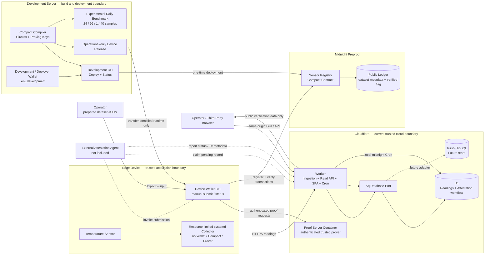
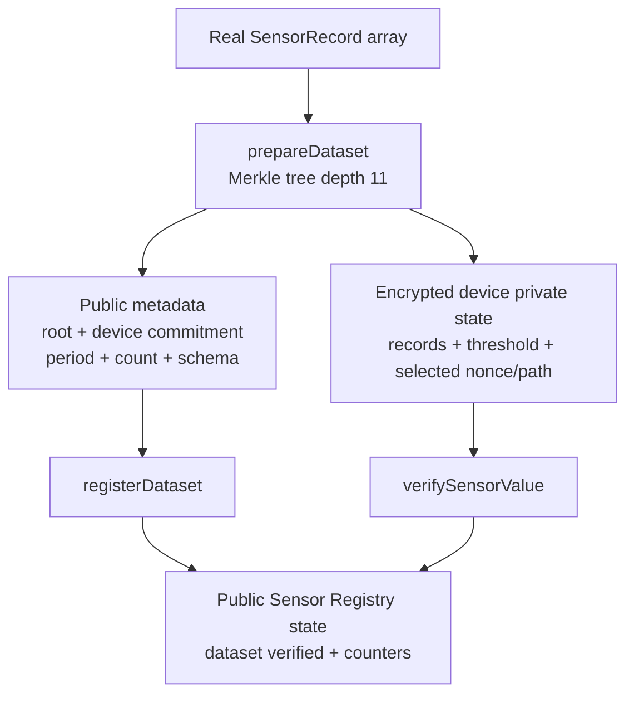

# System Architecture

[日本語版](ja/system_architecture.md)

This document describes the integration that exists in the repository today. Solid arrows are implemented paths; dashed arrows require an external component or are future work.

## Deployment View

The Cloudflare Container receives private proof inputs and is therefore part of the trusted boundary. The gateway authenticates requests and forwards their binary bodies without intentionally logging or persisting them. The browser never calls the proof route. An operator-controlled prover remains a possible replacement.

## Current Sensor Registry Proof

`registerDataset` publishes the root, device commitment, period, sample count, and schema version. `verifySensorValue` opens one selected leaf privately, recomputes its persistent commitment and Merkle path, and checks that its temperature is between private minimum and maximum bounds. It then marks the registered dataset as verified. The operational contract does not prove full-day completeness, hourly signatures, or anomaly counts.

## Daily Benchmark Design

`contracts/daily-attestation/` generates fixed 24, 96, and 1,440-sample profiles. The development-only benchmark exercises full-day roots, 24 hourly claims, Ed25519 evidence outside the circuit, and append-only reason hashes. These profiles are not exported in the device firmware and are not connected to the Worker Attestation lifecycle.

## Trust and Data Boundaries

| Boundary | Private or public data | Responsibility |
| --- | --- | --- |
| Edge Device | Sensor readings, ingestion token, device operational wallet and encrypted prepared datasets | Acquisition, authenticated upload, explicit transaction submission through the remote prover, persistent diagnostics; no compiler/deployment/local prover |
| Development server | Compact sources/artifacts, proving keys, `.env.development` wallet backup | Build, test, benchmark, contract deployment, and operational-only device release generation |
| D1 / future Turso | Raw operational readings, receive time, private normal range, workflow state, agent-reported Tx metadata | Time-series operations and operator audit |
| Cloudflare Worker | API authorization, pending-record scheduling, Attestation status, public responses | Workflow state; it does not currently submit or independently query Midnight |
| Midnight | Dataset root, device commitment, period, sample count, verified flag, schema, global counters | Public state for the operational `sensor-registry` contract |

## Delivery Status

- **Implemented operational path:** separate development and device wallets; device-only firmware; resource-limited collector and diagnostics; authenticated ingestion; D1 read/workflow API; bilingual SPA; remote proof gateway; `sensor-registry` deployment; and explicit device-wallet dataset registration/selected-value verification.
- **Implemented development experiments:** fixed-profile daily circuit generator/tests, proof-cost benchmark, signed hourly evidence helpers, and append-only reason-hash logic.
- **Not implemented:** the always-on Attestation Agent, automatic conversion of D1 readings to prepared private input, automatic submission/result reporting, browser-side independent Midnight verification, and the Turso adapter.
