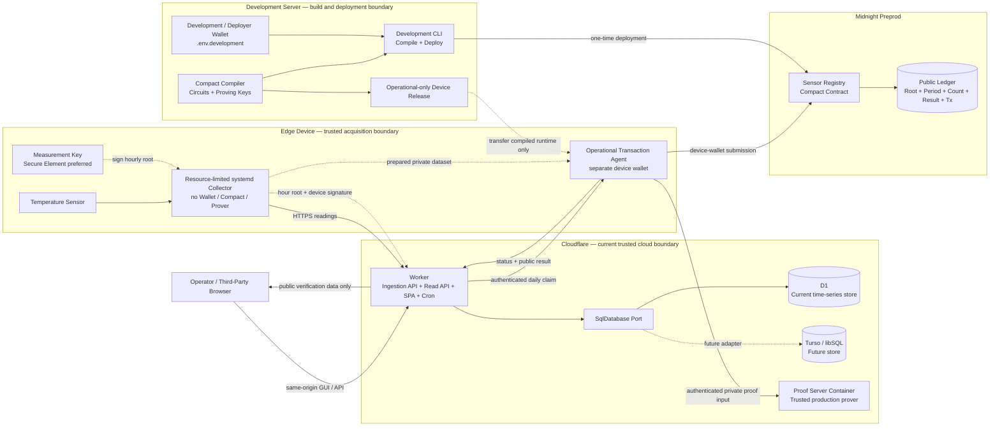
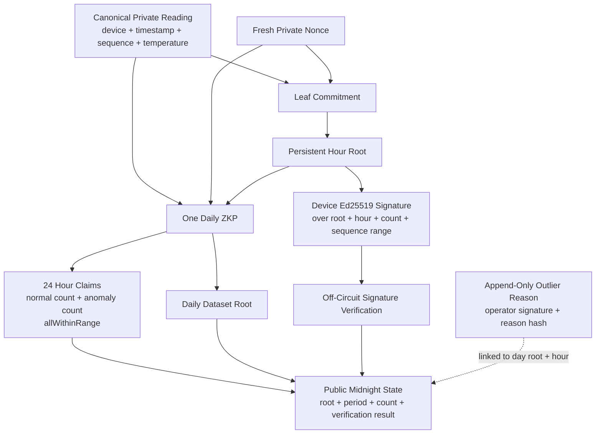

# System Architecture

[日本語版](ja/system_architecture.md)

This document describes the production daily-attestation path and the remaining storage migration. Solid arrows are implemented integration paths; dashed arrows are optional replacements.

## Deployment View

The Cloudflare Container receives private proof inputs and is therefore part of the trusted production boundary. The gateway must authenticate access and must not log or persist proof inputs. An operator-controlled prover remains an optional future replacement.

## Daily Authenticity Proof

The circuit recomputes every commitment and root, checks sequence completeness, binds the private policy, and proves complete hourly classification. Ed25519 device signatures are verified outside the circuit; the bundle hash is stored with the Midnight attestation. Third-party verification requires both checks.

## Trust and Data Boundaries

| Boundary | Private or public data | Responsibility |
| --- | --- | --- |
| Edge Device | Sensor readings, ingestion token, device operational wallet and encrypted operational private state | Acquisition, authenticated upload, recurring transaction submission through the remote prover, persistent diagnostics; no compiler/deployment/local prover |
| Development server | Compact sources/artifacts, proving keys, `.env.development` wallet backup | Build, test, benchmark, contract deployment, and operational-only device release generation |
| D1 / future Turso | Raw operational readings, receive time, workflow state, outlier reasons | Time-series operations and operator audit |
| Cloudflare Worker | API authorization, scheduling, Attestation status, public responses | Orchestration; never expose proof secrets to browsers |
| Midnight | Dataset root, device commitment/public-key registration, period, counts, proof result, Tx metadata | Tamper-evident third-party verification |

## Delivery Status

- **Implemented:** separate development, device collector, and device-wallet workspaces; separate wallet stores; an operational-only release builder; a resource-limited systemd collector with persistent diagnostics; Worker-hosted SPA/API; D1 adapter; Cloudflare trusted proof gateway; fixed-profile full-day circuit sources; signed hourly roots; complete hourly classification; and append-only reason hashes.
- **Remaining integration:** deploy the production contract/profile, submit measured Preprod transactions, expose all evidence in the GUI, and add the Turso adapter.
